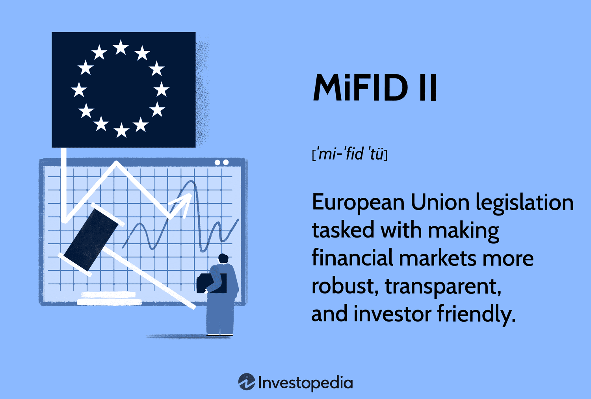

## Table of Contents

## What is MiFID II?

MiFID II, or the Markets in Financial Instruments Directive II, is a set of rules made by the European Union to make financial markets safer and more transparent. It was introduced in 2018 and applies to banks, investment firms, and other financial companies. The main goal of MiFID II is to protect investors and make sure they get clear and fair information about the financial products they are buying.

The rules cover many areas, like how financial products are sold, how trading happens, and how much companies can charge for their services. MiFID II also requires more reporting and record-keeping to help regulators keep an eye on the market and stop any bad behavior. Overall, MiFID II aims to create a more open and trustworthy financial system for everyone involved.

## When was MiFID II implemented?

MiFID II was implemented on January 3, 2018. This was when the new rules started to apply to financial companies across the European Union.

The goal of MiFID II is to make financial markets safer and more transparent. It helps protect people who invest money by making sure they get clear and fair information about the financial products they buy.

## What are the main objectives of MiFID II?

The main goal of MiFID II is to make financial markets safer and more open for everyone. It wants to protect people who invest their money by making sure they get clear and honest information about the financial products they are buying. This means that banks and other financial companies have to be more open about what they are selling and how much they are charging.

Another important aim of MiFID II is to stop bad behavior in the financial markets. It does this by making rules about how trading happens and by requiring more reporting and record-keeping. This helps the people who watch over the markets to see what is going on and stop any wrongdoing. Overall, MiFID II wants to create a financial system that everyone can trust.

## How does MiFID II affect retail investors?

MiFID II helps retail investors by making financial markets safer and more transparent. It requires banks and investment firms to give clear and honest information about the products they are selling. This means that retail investors can make better choices because they know exactly what they are buying and how much it will cost. For example, if you want to buy a stock or a fund, the company has to tell you all about it, including any fees or risks involved.

Another way MiFID II helps retail investors is by trying to stop bad behavior in the markets. It does this by making strict rules about how trading happens and by requiring more reporting and record-keeping. This means that if someone is trying to cheat or do something wrong, it is easier for the people watching over the markets to catch them. So, retail investors can feel more secure knowing that the system is designed to protect them and keep the markets fair.

## What are the key differences between MiFID and MiFID II?

MiFID, or the Markets in Financial Instruments Directive, was first introduced in 2007. It aimed to create a single market for investment services and activities across the European Union. MiFID set rules for how financial products were sold and traded, but it had some gaps that needed to be filled. For example, it didn't cover all types of trading, like high-frequency trading, and it didn't have strong enough rules to stop bad behavior in the markets.

MiFID II, which came into effect in 2018, was made to fix these problems and make the rules even stronger. It covers more types of trading, including high-frequency trading, and it has stricter rules to stop bad behavior. MiFID II also requires more reporting and record-keeping, which helps regulators keep a closer eye on the markets. This means that MiFID II offers more protection for investors and makes the financial markets more transparent and fair than MiFID did.

## How does MiFID II impact the transparency of financial markets?

MiFID II makes financial markets more open by making rules that force banks and investment firms to tell people more about what they are selling. This means that when you want to buy a stock or a fund, the company has to give you clear information about it, including any fees or risks. This helps you understand exactly what you are buying, so you can make better choices with your money.

Another way MiFID II helps with transparency is by requiring more reporting and record-keeping. This means that companies have to keep detailed records of their trades and report them to the people who watch over the markets. This makes it easier for regulators to see what is happening in the markets and stop any bad behavior. So, MiFID II helps create a financial system that is more open and easier to trust.

## What are the reporting requirements under MiFID II?

MiFID II makes banks and investment firms keep detailed records of their trades and report them to the people who watch over the markets. This means they have to write down everything about their trades, like who they traded with, what they traded, and when it happened. They also have to report this information regularly, so the regulators can see what is going on in the markets and make sure everything is fair.

These reporting rules help stop bad behavior in the markets. By making companies tell everything about their trades, it is easier for the people in charge to catch anyone trying to cheat or do something wrong. This makes the financial markets safer and more open for everyone, because it helps make sure that all trading is done honestly and fairly.

## How does MiFID II regulate algorithmic and high-frequency trading?

MiFID II makes special rules for algorithmic and high-frequency trading to make sure they are done safely and fairly. It says that companies using these types of trading have to register with the regulators and follow strict rules. They need to have good systems in place to stop their trading from causing problems in the market, like big price changes or crashes. This helps keep the market stable and protects everyone who is trading.

Also, MiFID II makes these companies report a lot of information about their trading. They have to tell the regulators about their trading strategies and how often they trade. This way, the people watching over the markets can see what is happening and make sure no one is doing anything wrong. By having these rules, MiFID II helps make the financial markets more open and trustworthy for everyone.

## What are the implications of MiFID II for investment firms and banks?

MiFID II makes life more complicated for investment firms and banks because they have to follow a lot of new rules. They need to give clear and honest information about the financial products they sell, so people know exactly what they are buying and how much it will cost. This means they have to change how they do business and make sure all their information is easy to understand. They also have to keep detailed records of their trades and report them to the people who watch over the markets. This takes a lot of work and can be expensive, but it helps stop bad behavior and makes the markets safer and more fair.

Another big change for investment firms and banks is how they handle algorithmic and high-frequency trading. MiFID II says they have to register with the regulators and follow strict rules to make sure their trading doesn't cause problems in the market. They need good systems to stop their trading from causing big price changes or crashes. They also have to tell the regulators a lot about their trading strategies and how often they trade. This means they have to spend time and money to make sure they are following all the rules, but it helps keep the market stable and protects everyone who is trading.

## How does MiFID II address the issue of inducements and conflicts of interest?

MiFID II helps stop banks and investment firms from getting paid in ways that could make them do things that are not good for their customers. This is called stopping 'inducements'. Before MiFID II, these companies could get money or other rewards for selling certain products, even if those products were not the best for the people buying them. Now, MiFID II says they can only get paid in ways that help their customers. This means they have to be clear about any payments they get and make sure these payments do not affect the advice they give.

MiFID II also makes rules to stop 'conflicts of interest'. This happens when a bank or investment firm might do something that is good for them but bad for their customers. MiFID II says these companies have to find any conflicts of interest and tell their customers about them. They also have to have plans in place to stop these conflicts from hurting their customers. By doing this, MiFID II helps make sure that banks and investment firms always put their customers first and act in a fair way.

## What are the challenges and criticisms faced by MiFID II?

MiFID II has faced some challenges and criticisms since it was put into place. One big challenge is that it can be hard and expensive for banks and investment firms to follow all the new rules. They have to spend a lot of time and money to make sure they are doing everything right, like keeping detailed records and reporting their trades. This can be tough for smaller companies that do not have as much money to spend on these things. Another challenge is that the rules can make it harder for people to trade, because they have to wait longer for their trades to be checked and reported.

There are also some criticisms of MiFID II. Some people say that it has not done enough to stop bad behavior in the markets. They think the rules are too complicated and hard to understand, which can make it easier for people to find ways around them. Others say that MiFID II has made it harder for people to get good advice about their investments. Because banks and investment firms cannot get paid in certain ways anymore, they might not want to give as much advice, which can make it harder for people to make good choices with their money. Overall, while MiFID II aims to make the markets safer and more open, it has faced some challenges and criticisms along the way.

## How is MiFID II enforced and what are the penalties for non-compliance?

MiFID II is enforced by the regulators in each country of the European Union. These regulators make sure that banks and investment firms follow all the rules. If a company does not follow the rules, the regulators can check their records and see if they are doing something wrong. They can also talk to the company and ask them to explain what they are doing. This helps make sure that everyone is playing by the same rules and that the markets are fair and safe.

If a bank or investment firm does not follow MiFID II, they can get in big trouble. The penalties can be very strict, like big fines or even being banned from doing business. The exact penalty depends on how serious the problem is and how much it hurt people or the market. The goal of these penalties is to make sure that companies take the rules seriously and do everything they can to follow them. This helps protect everyone who invests their money and keeps the financial markets honest and fair.

## References & Further Reading

[1]: Chlistalla, M. (2011). ["The Future of Trading: Market and Technology Trends."](https://c.mql5.com/forextsd/forum/168/high-frequency_trading_-_better_than_its_reputation.pdf) Deutsche Bank Research.

[2]: European Securities and Markets Authority. (2017). ["MiFID II - Markets in Financial Instruments Directive."](https://www.esma.europa.eu/publications-and-data/interactive-single-rulebook/mifid-ii) ESMA.

[3]: Macrae, C., & Cooper, B. (2018). ["MiFID II: Issues and Implications for Asset Managers."](https://www.paulweiss.com/practices/transactional/capital-markets/publications/mifid-ii-unbundling-rules-implications-for-asset-managers-and-broker-dealers-in-the-united-states?id=25472) Deloitte.

[4]: Moloney, N. (2016). ["The Age of ESMA – Governing EU Financial Markets."](https://www.amazon.com/Age-ESMA-Governing-Financial-Markets/dp/150992177X) Bloomsbury Publishing.

[5]: Sumner, D. (2018). ["MiFID II: Tackling Algorithmic Trading Risks."](https://www.esma.europa.eu/publications-and-data/interactive-single-rulebook/mifid-ii/article-17-algorithmic-trading) Central Penn Business Journal.

[6]: ["Algorithmic and High-Frequency Trading"](https://assets.cambridge.org/97811070/91146/frontmatter/9781107091146_frontmatter.pdf) by Álvaro Cartea, Sebastian Jaimungal, and José Penalva

[7]: Gomber, P., Arndt, B., Lutat, M., & Uhle, T. (2011). ["High-Frequency Trading."](https://papers.ssrn.com/sol3/papers.cfm?abstract_id=1858626) SpringerLink.

[8]: Alexeeva, I., Heni, C., & Lesne, F. (2017). ["The Impact of MiFID II on investment research."](https://op.europa.eu/en/publication-detail/-/publication/39810a8e-0c35-11eb-bc07-01aa75ed71a1/language-en/format-PDF/source-165575916) Mondaq.