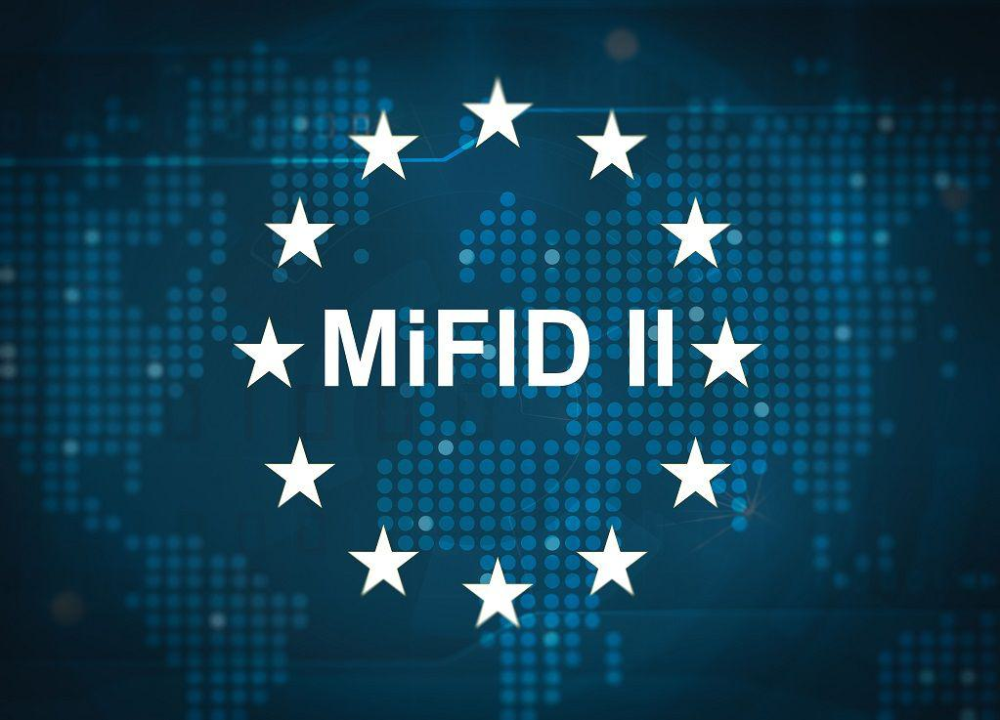

The Markets in Financial Instruments Directive II (MiFID II) is a comprehensive regulatory framework designed to enhance the functioning and transparency of financial markets within the European Union. Central to this directive is the governance of algorithmic trading, where automated computer systems execute trades based on pre-established parameters. MiFID II aims to safeguard market integrity and avert disorderly trading scenarios through rigorous oversight of algorithmic activities.

This article aims to analyze the implications of MiFID II on algorithmic trading, examining the specific requirements that investment firms must meet and the broader consequences for the financial industry. A robust understanding of these regulations empowers firms to adapt their trading strategies, ensuring compliance and sustaining competitiveness in an increasingly regulated landscape. The insights offered here will clarify how investment firms can strategically navigate the demands of MiFID II to optimize their operations and maintain market stability.

An overview of MiFID II requirements for algorithmic trading reveals the emphasis placed on preventing erroneous orders and other activities that may disrupt market equilibrium. These regulations, by establishing stringent controls and record-keeping mandates, aspire to create a transparent and orderly trading environment. By grasping the intricacies of this regulatory framework, firms position themselves to respond effectively to compliance obligations while contributing positively to market performance. The following sections will elaborate on these requirements and assess their impact on the practices and preparedness of investment firms.

## Table of Contents

## Understanding Algorithmic Trading under MiFID II

Algorithmic trading is a sophisticated method of executing a large number of financial transactions using computer algorithms. These algorithms analyze various market variables and execute trades at speeds and volumes that surpass human capabilities. MiFID II, the Markets in Financial Instruments Directive II, imposes rigorous requirements on firms undertaking algorithmic trading to safeguard market integrity and preempt systemic risks.

To comply with MiFID II, investment firms are obligated to institute robust risk controls and systems. These measures ensure their trading algorithms are both resilient and possess adequate capacity to handle high-frequency operations. The directive mandates that firms establish mechanisms to prevent the transmission of incorrect orders, thereby averting potential market disturbances.

Furthermore, the regulation stipulates that trading systems must not facilitate activities contravening financial laws. This includes ensuring that the algorithmic operations adhere strictly to financial regulations and ethical standards. Compliance with these stringent requirements is essential to maintain orderly and transparent market conditions, thereby reducing the likelihood of market manipulation or abuse.

Firms must also establish and maintain comprehensive operational and risk management frameworks. These systems should be capable of detecting and mitigating errors before they manifest in the trading environment. Adherence to these guidelines not only fulfills regulatory obligations but also bolsters the firm's credibility and stability in the fast-paced trading landscape.

## Key MiFID II Requirements for Algorithmic Trading

Investment firms operating under the Markets in Financial Instruments Directive II (MiFID II) must adhere to a comprehensive set of requirements for [algorithmic trading](/wiki/algorithmic-trading). One of the fundamental obligations is for firms to notify regulatory authorities about their utilization of algorithmic trading strategies. This notification ensures that regulatory bodies are aware of the methods employed by firms, allowing for effective oversight and management of market activities.

Firms are also mandated to maintain detailed records of their trading activities. This includes information on order placements, executions, and cancellations, which must be accurately documented. Having comprehensive records allows for accountability and transparency, ensuring that all trading activities can be reviewed and audited if necessary.

For firms employing high-frequency trading techniques, MiFID II imposes additional obligations. These firms are required to store time-sequenced records in an approved form, which facilitates precise tracking and analysis of trading activities. This requirement is crucial for preventing and detecting market manipulation or other forms of market abuse.

Firms engaged in market-making strategies must also adhere to specific guidelines under MiFID II. They are obligated to provide [liquidity](/wiki/liquidity-risk-premium) consistently and reliably, which often involves entering into binding agreements with trading venues. These agreements ensure that market makers fulfill their role in stabilizing markets and maintaining efficient trading conditions.

Moreover, firms that offer direct electronic access to trading venues must implement robust systems and controls to effectively manage associated risks. This includes ensuring that clients who access trading platforms electronically are subject to appropriate controls, safeguarding the integrity and orderly function of financial markets.

By implementing these key requirements, MiFID II aims to enhance the stability, transparency, and integrity of financial markets, minimizing systemic risks and maintaining investor confidence.

## Impact on Investment Firms

MiFID II's regulation of algorithmic trading plays a crucial role in ensuring that investment firms uphold high standards of market conduct and risk management. By imposing strict requirements, the directive mandates that firms implement robust systems and controls to manage the intricacies of algorithmic trading effectively. One immediate impact of these regulations is the potential increase in compliance costs for investment firms. The directive necessitates additional reporting and record-keeping requirements, making it essential for firms to allocate resources towards maintaining detailed and systematic records of their trading activities, including order placements, executions, and cancellations.

Despite the increase in compliance costs, the regulations under MiFID II foster enhanced market transparency and integrity. These rules act as safeguards against activities that may harm market stability, ensuring that investment practices are conducted under fair and orderly conditions. By monitoring trading activities more closely, MiFID II helps to prevent market abuse, manipulation, and systemic risks, thereby contributing to a more transparent financial ecosystem.

To comply with MiFID II, investment firms must regularly test and monitor their trading systems. This ongoing assessment allows firms to ensure their systems are resilient to market fluctuations and align with existing and evolving regulatory standards. Continuous system evaluations are vital for detecting malfunctions or potential violations before they disrupt market operations. Moreover, it enables firms to adapt their algorithms and strategies proactively, supporting compliance while facilitating innovation.

Adhering to MiFID II requirements not only helps mitigate risks associated with algorithmic trading but also allows firms to maintain their competitive edge in the market. By committing to these regulatory standards, firms can assure stakeholders of their dedication to ethical trading practices, enhancing their reputation and credibility within the financial industry. This compliance can potentially open up new opportunities within the market, as firms that demonstrate robust risk management and transparency may attract more clients and investment. Thus, understanding and aligning with MiFID II's provisions is essential for investment firms aiming to thrive in the ever-evolving landscape of financial markets.

## Conclusion

MiFID II represents a significant regulatory advancement in the oversight of algorithmic trading within the European Union. By imposing strict guidelines, the directive aims to enhance market efficiency, transparency, and overall investor protection. The comprehensive framework established by MiFID II necessitates that investment firms comply with detailed requirements to prevent market abuse and ensure orderly trading conditions. Adherence to these guidelines is crucial for fostering a secure and transparent trading environment, thus maintaining the integrity of financial markets.

Investment firms engaged in algorithmic trading must implement robust risk controls and maintain thorough documentation of their trading activities. This meticulous approach not only mitigates systemic risks but also promotes accountability and contributes to a fair trading landscape. As the financial landscape continues to evolve with technological advancements, firms face the challenge of continuously adapting their strategies and systems to meet regulatory demands. 

Ensuring compliance with MiFID II requires continuous monitoring and adaptation, which, while potentially increasing operational costs, provides long-term benefits by safeguarding against market distortion and enhancing investor trust. The directive's rigorous standards create a more transparent and efficient market environment, ultimately benefiting both market participants and investors.

By understanding and adhering to MiFID II, firms can position themselves to thrive in a regulated yet dynamic trading environment. This ensures that they remain competitive while upholding essential market standards, thus contributing positively to the health and stability of the EU financial markets.

## References & Further Reading

[1]: Chlistalla, M. (2011). ["The Future of Trading: Market and Technology Trends."](https://c.mql5.com/forextsd/forum/168/high-frequency_trading_-_better_than_its_reputation.pdf) Deutsche Bank Research.

[2]: European Securities and Markets Authority. (2017). ["MiFID II - Markets in Financial Instruments Directive."](https://www.esma.europa.eu/publications-and-data/interactive-single-rulebook/mifid-ii) ESMA.

[3]: Macrae, C., & Cooper, B. (2018). ["MiFID II: Issues and Implications for Asset Managers."](https://www.paulweiss.com/practices/transactional/capital-markets/publications/mifid-ii-unbundling-rules-implications-for-asset-managers-and-broker-dealers-in-the-united-states?id=25472) Deloitte.

[4]: Moloney, N. (2016). ["The Age of ESMA – Governing EU Financial Markets."](https://www.amazon.com/Age-ESMA-Governing-Financial-Markets/dp/150992177X) Bloomsbury Publishing.

[5]: Sumner, D. (2018). ["MiFID II: Tackling Algorithmic Trading Risks."](https://www.esma.europa.eu/publications-and-data/interactive-single-rulebook/mifid-ii/article-17-algorithmic-trading) Central Penn Business Journal.

[6]: ["Algorithmic and High-Frequency Trading"](https://assets.cambridge.org/97811070/91146/frontmatter/9781107091146_frontmatter.pdf) by Álvaro Cartea, Sebastian Jaimungal, and José Penalva

[7]: Gomber, P., Arndt, B., Lutat, M., & Uhle, T. (2011). ["High-Frequency Trading."](https://papers.ssrn.com/sol3/papers.cfm?abstract_id=1858626) SpringerLink.

[8]: Alexeeva, I., Heni, C., & Lesne, F. (2017). ["The Impact of MiFID II on investment research."](https://op.europa.eu/en/publication-detail/-/publication/39810a8e-0c35-11eb-bc07-01aa75ed71a1/language-en/format-PDF/source-165575916) Mondaq.