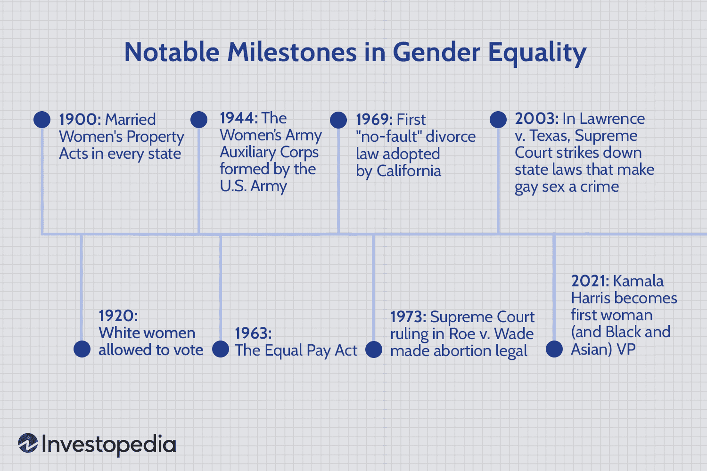

Algorithmic trading, often referred to as algo trading, represents a transformative shift in the financial sector, leveraging technology to enhance the speed, efficiency, and accuracy of trading operations. This sophisticated practice employs computer algorithms to execute trades based on pre-set criteria, often analyzing vast datasets and executing trades at speeds beyond human capability. As the financial markets have evolved, so has the need for innovative solutions, propelling algorithmic trading to the forefront of modern finance.

American women have played a crucial role in this transformation, breaking barriers and making significant contributions to the development and advancement of algorithmic trading. Traditionally, finance has been a male-dominated field; however, the landscape is gradually changing as more women enter the industry, bringing fresh perspectives and expertise. Their involvement has not only enriched the field but also paved the way for future generations to follow suit.



This article aims to highlight the achievements and milestones of American women in algorithmic trading. It underscores their pioneering roles and the impact they have made in shaping the industry. From leading algorithmic trading firms to innovating new trading strategies, these women have demonstrated that gender does not confine one's ability to excel in complex technical domains. By examining their contributions, this article seeks to inspire a new wave of women to pursue careers in finance and to continue to contribute to the dynamic evolution of algorithmic trading.

## Table of Contents

## The Rise of Algorithmic Trading

Algorithmic trading, often referred to as algo trading, has become an integral part of the financial industry. It involves the use of computer algorithms to execute trading orders at speeds and frequencies that human traders cannot match. The adoption of algorithmic trading surged exponentially in the 21st century, driven by advances in technology and the increasing complexity of financial markets. This shift has revolutionized traditional trading processes by enabling traders to execute orders more efficiently and with greater precision.

Algorithmic trading systems are designed to follow predefined rules, which can include conditions such as timing, price, quantity, or any other mathematical model. These programs minimize human intervention, thereby reducing the potential for human error and emotional decision-making that can lead to suboptimal trading outcomes. For example, a program might be configured to place a buy order when a stock's 50-day moving average crosses above its 200-day moving average, a common trend-following strategy.

The rise of algorithmic trading has been accompanied by a significant increase in market [liquidity](/wiki/liquidity-risk-premium) and lower transaction costs. However, it also introduces challenges, such as the risk of market manipulation and flash crashes, which occur when algorithmic trades are executed in rapid succession, leading to extreme price fluctuations in a short period.

Despite the historical dominance of men in finance and technology, women have become increasingly prominent in the field of [algorithmic trading](/wiki/algorithmic-trading). They bring diverse perspectives and approaches, contributing innovative solutions and essential expertise. This growing participation results from purposeful efforts to promote gender diversity and inclusion, highlighting women who have broken through barriers to establish themselves as leaders in this male-dominated industry. Their involvement is crucial in fostering a more balanced and innovative financial environment.

Overall, the rise of algorithmic trading marks a pivotal shift in how trades are conducted, ushering in a new era of efficiency and sophistication in financial markets. As the industry continues to evolve, the contributions of individuals from diverse backgrounds, including the increasing number of women entering the field, will be essential to the ongoing transformation and improvement of these trading systems.

## Pioneering Women in Algo Trading

Various women have emerged as leaders in algorithmic trading, breaking barriers in a traditionally male-dominated industry. Among these figures, Dr. Terri Duhon and Christine Lagarde have made significant strides in both finance and technology sectors.

Dr. Terri Duhon, a prominent figure in the finance world, has contributed extensively to risk management and quantitative finance. With a background in mathematics from MIT, she embarked on a career that included significant roles at J.P. Morgan. She has leveraged her expertise in derivative products to influence risk management practices. Her leadership extends to educational initiatives, where she emphasizes the importance of diversity and inclusion within financial institutions.

Christine Lagarde, although not primarily focused on algorithmic trading, has exerted a profound impact on global finance. Serving as the President of the European Central Bank (ECB) and as former Managing Director of the International Monetary Fund (IMF), Lagarde has consistently advocated for innovation in financial technology. Her strategic insights into global economic dynamics have implicitly supported the growth of algorithmic trading by promoting stable and technology-friendly financial environments.

These pioneering women have set precedents for future generations by demonstrating that gender does not limit one’s ability to excel in complex financial fields. Their achievements underscore the increasing recognition of women's roles in shaping financial technologies and strategies that drive modern markets. As leaders and advocates, Dr. Terri Duhon and Christine Lagarde contribute to a more inclusive and innovative financial landscape.

## Achievements and Milestones

Women have significantly advanced the field of algorithmic trading by achieving numerous milestones, which include founding pioneering companies and devising innovative algorithms that have reshaped market dynamics. A notable figure is Dr. Terri Duhon, a financial expert renowned for her role in managing risk for derivatives trading. Her leadership and expertise have been acknowledged by prestigious financial institutions, exemplifying the impact women have in leading complex financial strategies.

In corporate leadership, women have secured significant roles in major financial corporations, an achievement that highlights their influence in the industry. For instance, Blythe Masters, a trailblazer in the financial sector, served as the CEO of Digital Asset Holdings. Her work focused on leveraging blockchain technology to optimize financial systems, showcasing how women are at the forefront of technological advancements in finance.

Women have also played a pivotal role in shaping market regulations, ensuring that algorithmic trading practices are ethically and technically sound. This involvement underscores their ability to influence policy and regulatory frameworks, which is crucial for maintaining market integrity.

Moreover, their achievements have been recognized through awards and honors from illustrious institutions, reinforcing the crucial role women play in the evolution of finance. These recognitions not only validate their technical and leadership skills but also encourage other women to pursue careers in finance and technology. As more women enter this field, their contributions continually underscore their growing importance in shaping the future of finance and pushing the boundaries of innovation in algorithmic trading.

## Challenges in the Field

Despite significant advancements, women in algorithmic trading continue to encounter several enduring challenges, primarily gender bias and lack of representation. The financial sector has traditionally been male-dominated, and algorithmic trading is no exception. This gender disparity is often rooted in longstanding societal norms and stereotypes that underestimate the technical and analytical capabilities of women. Such biases can manifest in various ways, including skewed hiring practices, wage gaps, and limited access to critical networking opportunities, all of which hinder women's progression in the field.

Efforts to combat these challenges are increasingly focusing on promoting diversity and inclusion within the financial technology sector. Organizations and institutions are recognizing that diverse teams drive innovation and enhance decision-making processes. To address gender bias, many firms are instituting diversity policies aimed at recruiting, retaining, and promoting more women in analytical and leadership roles. By creating an inclusive work environment, these organizations work towards dismantling the systemic barriers that women face.

Supportive networks and mentorship programs are especially vital in helping women negotiate a career in algorithmic trading. Mentorship provides guidance, support, and advocacy, helping women navigate the complexities of the financial industry. Programs that connect experienced practitioners with emerging talent can also cultivate a culture of encouragement and empowerment. Networks like Women in Technology and Finance and other initiatives strive to provide platforms for women to share experiences, challenges, and success stories, building a stronger community that fosters collective growth.

Ultimately, increasing the representation and influence of women in algorithmic trading not only serves the interests of equality but also enhances the sector's capacity for innovation and comprehensive market understanding.

## The Future of Women in Algo Trading

The future for women in algorithmic trading appears promising, largely driven by initiatives aimed at fostering gender equity. Numerous educational programs and workshops are being developed to equip women with crucial skills and knowledge required in this domain. These initiatives are designed to enhance technical proficiency in programming languages, statistical analysis, and financial modeling, which are essential skills in algorithmic trading.

As financial technology, often referred to as fintech, continues to evolve, women are poised to play an increasingly influential role in advancing trading strategies and pioneering innovations. The integration of [artificial intelligence](/wiki/ai-artificial-intelligence) and [machine learning](/wiki/machine-learning) in trading applications offers new opportunities for women in tech to contribute their expertise. Machine learning models, for example, are being used to predict market movements and optimize trading algorithms, showcasing the need for skills in data analysis and computational finance. Here's a basic example of a Python snippet that uses a simple moving average crossover strategy, a foundation often extended by more intricate models:

```python
import pandas as pd

# Assume 'data' is a DataFrame with a 'Price' column representing stock prices
data['SMA_10'] = data['Price'].rolling(window=10).mean()
data['SMA_50'] = data['Price'].rolling(window=50).mean()

# Generate trading signals
data['Signal'] = 0
data['Signal'][10:] = np.where(data['SMA_10'][10:] > data['SMA_50'][10:], 1, 0)

# Define positions (buy/sell) based on signals
data['Position'] = data['Signal'].diff()
```

This snippet highlights how algorithmic strategies can be developed using basic statistical techniques. Women who are proficient in programming and [statistics](/wiki/bayesian-statistics) can leverage such foundational knowledge to create more complex trading algorithms.

The increased visibility and recognition of women's contributions to fintech are encouraging more women to enter this field. Organizations dedicated to the empowerment of women in tech, such as Girls Who Code and Women Who Code, offer support networks that foster mentorship and collaboration. These communities are pivotal in breaking down barriers that have historically hindered women's advancement in finance and technology.

Additionally, leadership roles held by women in major financial institutions and tech firms are setting new precedents and challenging traditional stereotypes. This shift is gradually paving the way for a more inclusive environment in trading floors and decision-making boards. By championing diversity and inclusion, the financial sector is not only addressing historical biases but also enriching the industry with varied perspectives and innovative ideas.

As algorithmic trading becomes more sophisticated, the contribution of women is set to drive significant advancements. With educational support, mentorship, and an evolving fintech landscape, women are likely to continue shaping the future of algorithmic trading, contributing both technical acumen and unique insights to the field.

## Conclusion

American women have undeniably made significant contributions to the field of algorithmic trading, achieving remarkable successes despite existing challenges. Their expertise spans various aspects of finance and technology, from developing sophisticated trading algorithms to leading major financial institutions. The achievements of these women not only reflect their profound competence but also serve as a powerful source of inspiration for future generations. As role models, they encourage more women to pursue careers in finance and technology, fostering an increasingly diversified workforce that benefits the entire industry.

The continued advancement of women in algorithmic trading is crucial for the growth and evolution of the financial sector. Their presence brings diverse perspectives and innovative solutions, which are essential in navigating the complex and rapidly changing financial landscape. Moreover, promoting gender diversity within algo trading can lead to more balanced decision-making processes, ultimately driving better outcomes for organizations and markets alike.

As the financial industry continues to embrace automation and advanced technologies, it is imperative to support and empower women who are entering this field. Initiatives focused on gender equity, educational programs, and mentorship opportunities play a vital role in equipping women with the skills needed to excel. As these efforts gain [momentum](/wiki/momentum), women are poised to play increasingly critical roles in shaping strategies and innovations within algorithmic trading, ensuring a robust and dynamic future for the financial sector.

## References & Further Reading

[1]: Bergstra, J., Bardenet, R., Bengio, Y., & Kégl, B. (2011). ["Algorithms for Hyper-Parameter Optimization."](https://papers.nips.cc/paper/4443-algorithms-for-hyper-parameter-optimization) Advances in Neural Information Processing Systems 24.

[2]: ["Advances in Financial Machine Learning"](https://www.amazon.com/Advances-Financial-Machine-Learning-Marcos/dp/1119482089) by Marcos Lopez de Prado

[3]: ["Evidence-Based Technical Analysis: Applying the Scientific Method and Statistical Inference to Trading Signals"](https://www.amazon.com/Evidence-Based-Technical-Analysis-Scientific-Statistical/dp/0470008741) by David Aronson

[4]: ["Machine Learning for Algorithmic Trading"](https://github.com/stefan-jansen/machine-learning-for-trading) by Stefan Jansen

[5]: ["Quantitative Trading: How to Build Your Own Algorithmic Trading Business"](https://www.amazon.com/Quantitative-Trading-Build-Algorithmic-Business/dp/1119800064) by Ernest P. Chan