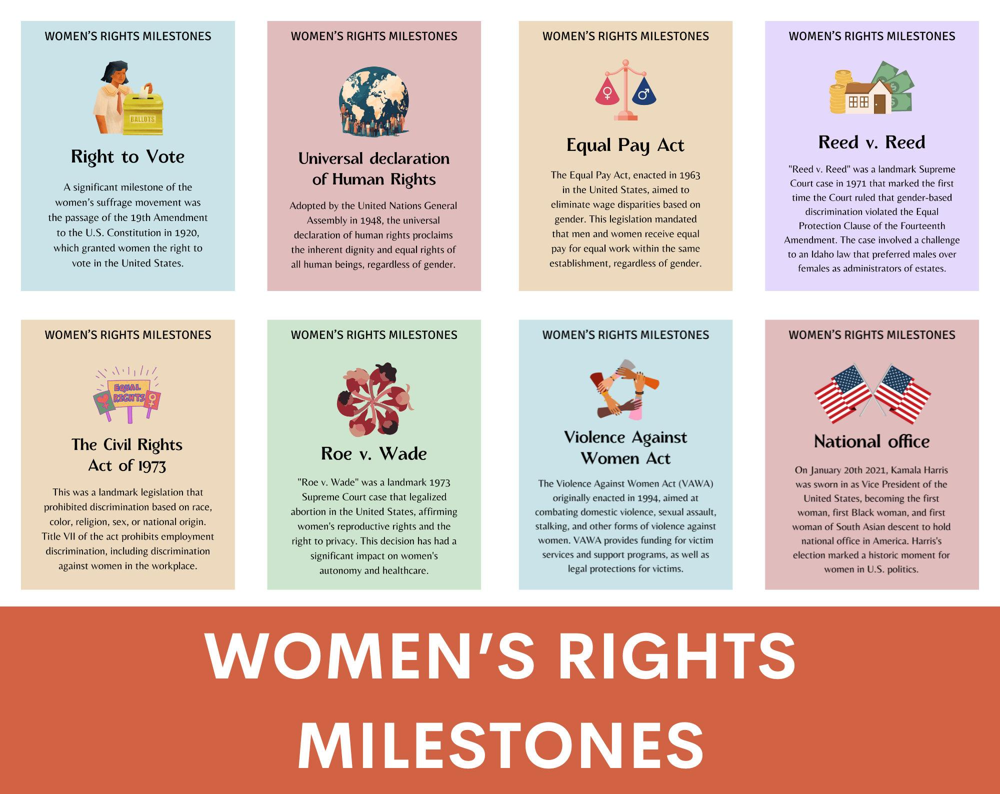

## Table of Contents

## What was the first significant milestone for American women's rights?

The first significant milestone for American women's rights was the Seneca Falls Convention in 1848. This event happened in Seneca Falls, New York. It was the first time women gathered together to talk about their rights. They wanted to be treated the same as men. They talked about many things, but the most important was the right to vote.

At the convention, they wrote the Declaration of Sentiments. This was like the Declaration of Independence, but for women. It said that all men and women are equal. They listed many ways women were treated unfairly. The convention started a big movement for women's rights. It took many years, but it helped women get the right to vote in 1920.

## Who were the key figures in the early women's suffrage movement?

The early women's suffrage movement had many important people who helped a lot. Elizabeth Cady Stanton and Lucretia Mott were two of the most important ones. They organized the Seneca Falls Convention in 1848. This was the first big meeting about women's rights. Stanton wrote the Declaration of Sentiments, which said that women should have the same rights as men. Mott was a strong speaker who helped spread the message about women's rights.

Another key figure was Susan B. Anthony. She worked closely with Stanton and helped lead the movement for many years. Anthony was very good at organizing and getting people to join the cause. She traveled all over the country to talk about women's rights. She also helped start the National American Woman Suffrage Association, which worked hard to get women the right to vote. Anthony never got to vote herself, but her work helped women win that right in 1920.

Other important people in the early movement were Lucy Stone and Frederick Douglass. Lucy Stone was a great speaker who helped start the American Woman Suffrage Association. She believed in working state by state to get the vote for women. Frederick Douglass was a former slave and a leader in the fight for African American rights. He supported women's rights too and spoke at the Seneca Falls Convention. He believed that all people should have equal rights.

## When did American women first gain the right to vote?

American women first gained the right to vote on August 18, 1920. This happened when the 19th Amendment to the United States Constitution was passed. The 19th Amendment said that no one could be stopped from voting because of their sex. This was a big win for women after many years of hard work and fighting for their rights.

The fight for women's right to vote started long before 1920. It began with the Seneca Falls Convention in 1848, where women first talked about wanting to vote. Leaders like Elizabeth Cady Stanton, Susan B. Anthony, and Lucretia Mott worked hard for many years. They organized, spoke, and wrote to convince people that women should have the right to vote. Finally, after more than 70 years of effort, their dream came true with the 19th Amendment.

## What was the impact of World War II on women's roles in the workforce?

World War II had a big impact on women's roles in the workforce. Before the war, many women stayed at home or worked in jobs that were thought of as "women's work," like teaching or nursing. But when the war started, many men had to go fight, so there were not enough workers left in the factories and other important jobs. Women stepped in to fill these jobs. They worked in factories making things like planes, tanks, and weapons. They also worked in offices and did other jobs that men used to do. This showed that women could do these jobs just as well as men.

The war changed how people thought about women working. After the war, many women had to leave their jobs to make room for the returning soldiers. But the experience of working during the war made people see that women could do many different kinds of jobs. This helped more women get jobs outside the home in the years after the war. It also helped the women's rights movement, because women had shown they could work and help the country in important ways. So, World War II was a big step forward for women in the workforce.

## How did the civil rights movement influence women's rights?

The civil rights movement in the 1950s and 1960s helped the women's rights movement a lot. Both movements were fighting for fairness and equal rights. When African Americans were fighting for their rights, women saw that they could also fight for their own rights. Many women who worked in the civil rights movement learned how to organize and protest. They used these skills to start their own groups to fight for women's rights. The civil rights movement showed women that change was possible if they worked together.

One big way the civil rights movement helped women's rights was by showing that laws could be changed. The Civil Rights Act of 1964 was a big law that helped African Americans. It also had a part that said it was illegal to treat women unfairly at work. This part, called Title VII, helped women fight for equal pay and better jobs. The success of the civil rights movement gave women hope and showed them how to use the law to make things better for themselves. So, the civil rights movement was very important for the women's rights movement.

## What was the significance of Title IX in 1972 for women's rights?

Title IX was a very important law passed in 1972. It said that schools and colleges could not treat people differently because of their sex. This meant that girls and women had to be given the same chances as boys and men in sports, classes, and other school activities. Before Title IX, many schools did not let girls play sports or take certain classes. This law changed that and helped girls and women have more opportunities in education.

The impact of Title IX was huge. It opened up many doors for women in sports and education. More women started playing sports in high school and college. They also got better chances to study things like science and math, which used to be mostly for boys. Title IX helped make things fairer for women and showed that they could do just as well as men in school and sports. This law was a big step forward for women's rights.

## Who was the first woman to serve on the U.S. Supreme Court?

The first woman to serve on the U.S. Supreme Court was Sandra Day O'Connor. She was appointed by President Ronald Reagan in 1981. Before joining the Supreme Court, O'Connor had a successful career as a lawyer and judge. She worked hard and showed that women could be just as good as men in important jobs.

O'Connor's appointment was a big step forward for women's rights. It showed that women could hold the highest positions in the country. During her time on the Supreme Court, O'Connor made many important decisions. She often tried to find a middle ground between different opinions. Her work helped shape the law and made a big difference for women and everyone in the United States.

## How has the representation of women in U.S. politics evolved since the 1980s?

Since the 1980s, the number of women in U.S. politics has grown a lot. In the 1980s, there were not many women in Congress or as governors. But over the years, more and more women started running for office and winning. By the 1990s, people started to see more women in the House of Representatives and the Senate. This trend kept going, and by the 2010s, the number of women in Congress had grown even more. In 2018, a record number of women were elected to Congress, showing that women were becoming a bigger part of U.S. politics.

The increase in women's representation has also been seen at the state level. More women have become governors and state legislators. This has helped make laws and policies that are more fair for everyone. Women in politics have worked on issues like equal pay, healthcare, and education. Having more women in politics has made a big difference because they bring different ideas and experiences to the table. This has helped make the government more representative of all people in the United States.

## What role did the #MeToo movement play in advancing women's rights?

The #MeToo movement, which started in 2017, has played a big role in advancing women's rights. It began when many women started sharing stories about being treated badly or harassed, often at work. The movement showed that this was a big problem that many women faced. By sharing their stories, women helped others feel less alone and more brave to speak up. The #MeToo movement made people pay more attention to how women are treated and pushed for changes in laws and company rules to protect women better.

Because of the #MeToo movement, many people who did bad things lost their jobs or faced other punishments. It also led to new laws and rules to stop harassment and make workplaces safer. The movement helped start important talks about respect and equality. It showed that women's voices matter and that they can make a big difference when they stand together. The #MeToo movement has been a big step forward in the fight for women's rights.

## How have recent legislative changes affected women's reproductive rights?

In recent years, there have been many changes in laws about women's reproductive rights. Some states have made it harder for women to get abortions. They passed laws that limit when and how women can have an abortion. These laws often say that women can only get an abortion up to a certain time in their pregnancy. Some laws also make it harder for clinics to stay open, which means women have fewer places to go for help. These changes have made it more difficult for women to make choices about their own bodies.

On the other hand, some states have tried to protect women's reproductive rights. They have passed laws to make sure women can still get safe abortions. These laws help keep clinics open and make sure women can get the care they need. There are also efforts to make birth control easier to get. This helps women plan their families and stay healthy. The different laws in different states show that the fight for women's reproductive rights is still going on.

## What are the current challenges facing gender equality in the United States?

One big challenge facing gender equality in the United States is the pay gap. Women often get paid less than men for doing the same job. This means women have less money to take care of themselves and their families. It's hard to fix because it's not just one thing causing it. It can be because of old ideas about what jobs women should do, or because women sometimes have to take time off work to have babies or take care of family. Many people are working to change laws and company rules to make pay fairer, but it's still a big problem.

Another challenge is violence against women. Many women face harassment, abuse, or even assault. This can happen at home, at work, or in public places. The #MeToo movement helped more people talk about this problem, but it's still happening a lot. Laws and rules are trying to stop this, but it's hard because it's not just about laws. It's also about changing how people think and act. Women need to feel safe and respected everywhere they go.

A third challenge is that women are still not as represented in top jobs and politics as men. While more women are in important positions than before, there are still fewer women than men in roles like CEOs, judges, and elected officials. This means women's voices and ideas are not heard as much when big decisions are made. Efforts are being made to get more women into these roles, but it takes time and a lot of work to change things.

## What are some predictions for future milestones in American women's rights?

In the future, one big milestone for women's rights in America could be closing the pay gap. Right now, women often get paid less than men for the same work. Many people are working hard to change laws and company rules to make pay fairer. If this happens, it would be a huge step forward. Women would have more money to take care of themselves and their families. It would show that women's work is just as valuable as men's work.

Another future milestone might be more women in top jobs and politics. Right now, there are fewer women than men in roles like CEOs, judges, and elected officials. If more women get into these positions, it would mean women's voices and ideas are heard more when big decisions are made. This could lead to laws and policies that are fairer for everyone. It would show that women can lead just as well as men.

A third possible milestone could be stronger laws to stop violence against women. Right now, many women face harassment, abuse, or assault. The #MeToo movement helped people talk about this problem more, but it's still happening a lot. If new laws and rules can make women feel safer and more respected, it would be a big win for women's rights. It would show that society is working to protect women and treat them fairly.

## References & Further Reading

[1]: Bergstra, J., Bardenet, R., Bengio, Y., & Kégl, B. (2011). ["Algorithms for Hyper-Parameter Optimization."](https://papers.nips.cc/paper/4443-algorithms-for-hyper-parameter-optimization) Advances in Neural Information Processing Systems 24.

[2]: ["Advances in Financial Machine Learning"](https://www.amazon.com/Advances-Financial-Machine-Learning-Marcos/dp/1119482089) by Marcos Lopez de Prado

[3]: ["Evidence-Based Technical Analysis: Applying the Scientific Method and Statistical Inference to Trading Signals"](https://www.amazon.com/Evidence-Based-Technical-Analysis-Scientific-Statistical/dp/0470008741) by David Aronson

[4]: ["Machine Learning for Algorithmic Trading"](https://github.com/stefan-jansen/machine-learning-for-trading) by Stefan Jansen

[5]: ["Quantitative Trading: How to Build Your Own Algorithmic Trading Business"](https://www.amazon.com/Quantitative-Trading-Build-Algorithmic-Business/dp/1119800064) by Ernest P. Chan