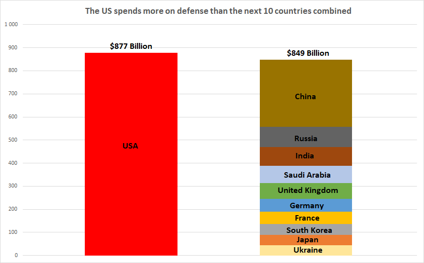

## Table of Contents

## What is military expenditure and how is it measured?

Military expenditure refers to the money a country spends on its military. This includes costs for things like soldiers' salaries, weapons, equipment, and military bases. It also covers money spent on research and development for new military technology. Countries spend this money to keep their military strong and ready to protect the country if needed.

To measure military expenditure, experts look at a country's budget and financial records. They add up all the money spent on military-related things over a certain period, usually a year. This total amount is then compared with other countries or with the same country's spending in past years. This helps to understand how much a country values its military and how it is changing over time.

## How do military expenditures impact national economies?

Military expenditures can have a big impact on a country's economy. When a country spends a lot of money on its military, it means that money is not being used for other things like schools, hospitals, or roads. This can affect the quality of life for people in the country. Also, if a country spends too much on its military, it might have to borrow money, which can lead to debt. This debt can make it harder for the country to grow its economy because it has to pay back the money it borrowed.

On the other hand, military spending can also help the economy in some ways. When a country buys weapons and equipment, it creates jobs for the people who make those things. This can help to lower unemployment and boost the economy. Also, spending on the military can lead to new technology being developed, which can sometimes be used in other areas of the economy. So, while military spending can take money away from other important areas, it can also have some positive effects on the economy.

## What is the relationship between military spending and stock market performance?

Military spending can affect the stock market in different ways. When a country spends more on its military, companies that make weapons and equipment might see their stock prices go up. This is because the government is buying more from these companies, which can make them more profitable. Investors might then buy more of these companies' stocks, hoping to make money as the companies grow. So, higher military spending can sometimes lead to better performance for certain stocks in the market.

However, increased military spending can also have negative effects on the stock market. If the government spends a lot on the military, it might have to raise taxes or borrow money. This can make people and businesses feel less confident about the economy. When people are worried, they might sell their stocks, which can cause the stock market to go down. Also, if military spending takes money away from other important areas like education or health care, it might slow down the overall economy, which can hurt the stock market too.

## Can military spending influence investor confidence and stock market volatility?

Military spending can affect how confident investors feel. When a country spends more on its military, it might make investors think the government is preparing for trouble. This can make them worried about the future, and they might sell their stocks. If many investors do this, it can make the stock market go down. On the other hand, if the military spending leads to more jobs and growth in certain industries, like defense companies, investors might feel more confident and buy more stocks, which can help the market.

Military spending can also make the stock market more unpredictable. When the government announces big changes in military spending, it can surprise investors. This can cause them to quickly buy or sell stocks, which can make the market go up and down a lot. If the spending leads to more borrowing or higher taxes, it might make investors even more nervous, leading to more ups and downs in the market. So, military spending can play a big role in how stable or unstable the stock market is.

## How do different countries' military spending levels affect global stock markets?

When countries spend a lot on their military, it can affect stock markets all over the world. If a big country like the United States or China spends more on its military, it can make people in other countries worried. They might think there could be more conflict or war, which can make them sell their stocks. This can cause stock markets to go down, not just in the country spending more, but in other countries too. Also, if a country spends a lot on its military, it might buy more weapons and equipment from companies in other countries. This can make the stocks of those companies go up, which can help stock markets in those other countries.

Different levels of military spending can also make global stock markets more unpredictable. If one country suddenly spends a lot more on its military, it can surprise investors around the world. This can make them quickly buy or sell stocks, which can make stock markets go up and down a lot. If many countries start spending more on their military at the same time, it might make people think there could be bigger problems, like a global conflict. This can make investors very nervous and lead to even more ups and downs in stock markets everywhere. So, the way countries spend on their military can have a big impact on how stable or unstable global stock markets are.

## What historical data exists on military expenditures and stock market trends?

Over the years, there have been many times when military spending and stock market trends have been connected. For example, during World War II, countries like the United States spent a lot more on their military. This led to more jobs and more money being spent in the economy, which helped the stock market grow. But after the war, when military spending went down, the stock market also went down for a while. Another time was during the Cold War, when the United States and the Soviet Union spent a lot on their military. This made some defense companies' stocks go up, but it also made investors worried about a possible war, which could make the stock market go down.

In more recent times, we can see similar patterns. After the September 11 attacks in 2001, the United States increased its military spending a lot. This helped some defense companies' stocks to go up, but it also made the stock market more unpredictable because people were worried about more attacks or a war. During the global financial crisis in 2008, some countries cut back on military spending to save money, which made the stock market go down even more. But when countries like China started spending more on their military in the 2010s, it helped some of their companies' stocks go up, which had a positive effect on their stock market. So, military spending can affect the stock market in different ways, depending on what is happening in the world.

## How do economic theories explain the link between military spending and stock market performance?

Economic theories often talk about how military spending can affect the stock market. One way is through something called the "multiplier effect." This means that when a government spends money on the military, it can create jobs and boost the economy. More jobs mean more people have money to spend, which can make companies do better and their stock prices go up. This is good for the stock market. But, if the government spends too much on the military, it might have to borrow money or raise taxes. This can make people and businesses feel less confident, and they might sell their stocks, making the stock market go down.

Another theory is about how military spending can make the stock market more unpredictable. This is called "uncertainty." When a government spends a lot on its military, it can make investors think there might be trouble or war. This can make them nervous, and they might quickly buy or sell stocks, which can cause the stock market to go up and down a lot. Also, if military spending takes money away from other important things like schools or hospitals, it might slow down the economy. This can make the stock market less stable and more likely to have big changes. So, military spending can have both good and bad effects on the stock market, depending on how it is used and what is happening in the world.

## What are the short-term versus long-term effects of military spending on stock markets?

In the short term, military spending can have both good and bad effects on stock markets. When a government spends more on the military, it can create jobs and help companies that make weapons and equipment. This can make their stock prices go up, which is good for the stock market. But, if the spending makes people worry about war or conflict, they might sell their stocks, which can make the stock market go down. Also, if the government has to borrow money or raise taxes to pay for the military, it can make people feel less confident about the economy, leading to more ups and downs in the stock market.

In the long term, the effects of military spending on stock markets can be different. If a country keeps spending a lot on its military, it might lead to new technology and stronger industries, which can help the economy grow over time. This can make the stock market more stable and help it go up. But, if the spending takes money away from important things like schools or hospitals, it might slow down the economy in the long run. This can make the stock market less stable and more likely to have big changes. So, the long-term effects depend on how the military spending is used and what happens in the economy over time.

## How do defense industry stocks react to changes in military budgets?

When a government decides to spend more on the military, defense industry stocks usually go up. This is because the companies that make weapons and equipment get more orders and make more money. Investors see this and think the stocks of these companies will do well, so they buy more of them. This makes the stock prices go up. For example, if the United States announces a big increase in military spending, companies like Lockheed Martin or Boeing might see their stock prices rise because they will sell more products to the government.

On the other hand, if a government decides to cut military spending, defense industry stocks can go down. When there are fewer orders for weapons and equipment, these companies make less money. Investors might then sell their stocks because they think the companies will not do as well. This can make the stock prices go down. For instance, if a country like the UK decides to reduce its military budget, companies that supply the military might see their stock prices fall because they will have fewer sales.

## What role do geopolitical tensions play in the correlation between military spending and stock markets?

Geopolitical tensions can make military spending go up and affect stock markets. When countries are worried about conflict or war, they might spend more on their military to be ready. This can make people feel nervous about the future, and they might sell their stocks. When many people do this, it can make the stock market go down. But, if the military spending helps companies that make weapons and equipment, their stock prices might go up. This can be good for the stock market, at least for those companies.

Sometimes, geopolitical tensions can make the stock market more unpredictable. If there is a sudden problem between countries, like a new conflict or threat, it can surprise investors. They might quickly buy or sell stocks because they are worried, which can make the stock market go up and down a lot. If many countries are spending more on their military at the same time because of these tensions, it can make investors even more nervous. This can lead to more ups and downs in stock markets all over the world.

## How can investors use military expenditure data to make informed investment decisions?

Investors can use military expenditure data to make smart choices about where to put their money. When a country spends more on its military, it often means more money for companies that make weapons and equipment. Investors can look at this data to see which companies might do well and buy their stocks. For example, if the United States decides to spend more on defense, investors might want to buy stocks in companies like Lockheed Martin or Boeing. But, investors also need to think about how this spending might affect the whole economy. If it makes people worried about war or conflict, they might sell their stocks, which can make the stock market go down.

It's also important for investors to keep an eye on how military spending changes over time. If a country keeps spending a lot on its military, it might help certain industries grow and make the economy stronger in the long run. This can make the stock market more stable and help it go up. But, if the spending takes money away from other important things like schools or hospitals, it might slow down the economy. This can make the stock market less stable and more likely to have big changes. So, investors need to look at the big picture and think about both the good and bad effects of military spending on the stock market.

## What advanced statistical models can be used to predict stock market movements based on military spending data?

One advanced statistical model that can be used to predict stock market movements based on military spending data is the Vector Autoregression (VAR) model. This model looks at how different things, like military spending and stock prices, affect each other over time. It can help investors see how a change in military spending might make stock prices go up or down. For example, if a country decides to spend more on its military, the VAR model can show how this might help companies that make weapons and equipment, and how their stock prices might go up as a result.

Another model that can be used is the Granger Causality Test. This test helps to see if one thing, like military spending, can help predict another thing, like stock market movements. It can tell investors if changes in military spending are a good sign of what might happen to the stock market. For example, if the test shows that military spending can help predict stock prices, investors might want to pay more attention to military budget announcements. Both of these models can help investors make better guesses about how military spending might affect the stock market, but they need to be used carefully because many other things can also affect stock prices.

## What are the results?

The analysis of military expenditure's effect on stock market performance reveals a nuanced relationship. When military expenditure is measured in total US dollars, its positive association with stock market performance is primarily driven by the inclusion of the United States in the dataset. The results indicate that military spending in the US correlates with robust stock market gains, potentially due to the country's significant defense budget and its global economic influence. The mathematical representation of this relationship can be expressed as:

$$
\text{SMI} = \alpha + \beta \cdot \text{ME} + \epsilon
$$

Where:
- $\text{SMI}$ represents the Stock Market Index performance.
- $\alpha$ is a constant.
- $\beta$ represents the coefficient for military expenditure (ME) in US dollars.
- $\epsilon$ is the error term.

The model demonstrates statistical significance predominantly when US data are included, confirming the outsized effect of American military spending.

In contrast, when US data is excluded, military expenditure does not significantly impact stock market performance. This suggests that the military spending-stock market link is not as pronounced in other nations, potentially due to varying economic contexts or less pronounced defense budgets relative to economic size.

Moreover, analyzing military expenditure as a percentage of GDP offers slightly different insights. This metric attempts to normalize defense spending relative to economic size, providing a more equitable comparison across countries. The analysis, shown in the following formulation:

$$
\text{SMI} = \alpha + \beta \cdot \left(\frac{\text{ME}}{\text{GDP}}\right) + \epsilon
$$

presents inconclusive results. Without US data, the factor shows a barely discernible, albeit slightly positive, influence on stock market performance. This implies that while the proportion of GDP dedicated to military expenses might marginally influence market outcomes, it lacks the consistency and strength required to generalize a valid conclusion across diverse national contexts.

In summary, military spending's total value strongly correlates with stock market gains primarily within the United States. In contrast, the influence of military expenditure relative to GDP remains ambiguous and weak across other global markets.

## References & Further Reading

[1]: Solarin, S. A., & Sahu, P. K. (2015). ["The effect of military expenditure on stock market development: Evidence from panel analysis."](https://www.semanticscholar.org/paper/The-effect-of-research-intensity-on-total-factor-in-Solarin-Sahu/d9f788570fea93025531a4745fd55b25f83a2d89) Economic Modelling, 51, 315-321.

[2]: DiPietro, W. R., & Anoruo, E. (2008). ["Government size, economic freedom, and the stability of U.S. macroeconomic performance."](https://www.emerald.com/insight/content/doi/10.1108/03068290610689732/full/html) The Journal of American Academy of Business, 13(2), 16-21.

[3]: ["Stock volatility and the paper-bill spread"](https://www.sciencedirect.com/science/article/pii/S0378426615000795) by Campbell R. Harvey

[4]: SIPRI (Stockholm International Peace Research Institute). ["SIPRI Military Expenditure Database"](https://www.sipri.org/databases/milex). 

[5]: Farrell, M. (2015). ["War and Stock Market Reaction: Evidence from Stock Market Averages Electrically Utilizing Political Financial Econometrics."](https://www.jstor.org/stable/24548130) 

[6]: Yahoo Finance. ["Stock Market Data"](https://finance.yahoo.com/) for ETF performance metrics.