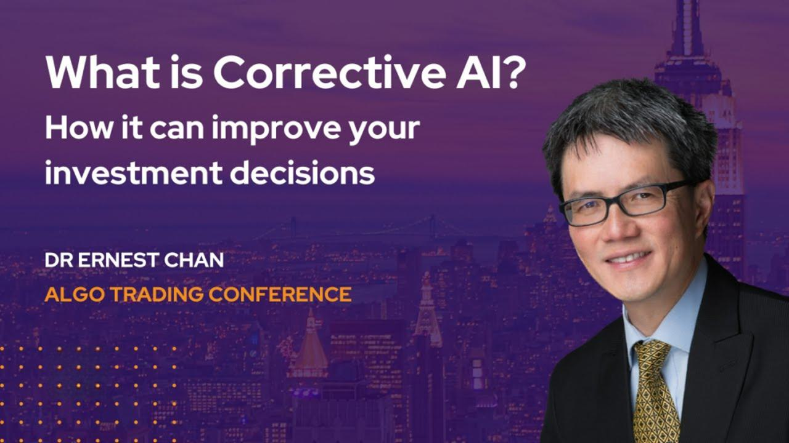

In the fast-evolving world of finance, algorithmic trading stands at the forefront of technological innovation. Among the leaders in this space is Millennium Partners, renowned for their strategic application of algorithmic trading methodologies. This article explores Millennium Partners' role and strategies in algorithmic trading, particularly in the context of the broader financial industry. Founded in 1989, Millennium Partners has consistently adapted to technological advancements, becoming a pivotal player in automating and enhancing trading strategies. This transformation highlights not only the firm's dynamic nature but also the increasing significance of technology-driven solutions across global financial markets. Algorithmic trading leverages complex computer algorithms to execute trades with speed and precision, revolutionizing the way firms operate within financial markets. Millennium Partners' commitment to integrating these technologies demonstrates their dedication to maintaining a competitive edge. This has led to substantial investments in data-driven decision-making processes, further solidifying their position as innovators in the field. As we progress, understanding Millennium Partners' strategic implementations and their implications on the financial sector will provide valuable insights into the future of trading and investment.

## Table of Contents



## Millennium Partners: An Overview

Millennium Partners, established in 1989 by Israel Englander, has evolved into a leading global hedge fund characterized by significant financial prowess. The firm manages assets worth billions of dollars, emphasizing a diversified and multifaceted investment strategy. This approach is implemented by approximately 330 investment teams spread across the globe, each contributing to the firm’s robust performance and reputation in the financial sector.

The foundation of Millennium Partners' success lies in its commitment to innovation and rigorous analysis. The investment teams are empowered to pursue a range of strategies, which are largely independent yet contribute to the firm's overall objectives. This diverse and decentralized approach allows Millennium Partners to adapt swiftly to changing market conditions and leverage opportunities across various asset classes and geographies.

At the core of Millennium's mission is the aim to deliver high-quality returns. This objective is supported by an organizational structure that values the entrepreneurial spirit of its investment professionals. Millennium Partners fosters an environment that encourages innovation and the application of cutting-edge technologies, enabling teams to develop and implement sophisticated trading strategies.

By cultivating a culture that merges analytical rigor with technological innovation, Millennium Partners not only achieves superior returns but also maintains its status as a formidable entity in the competitive landscape of global finance. The firm's dedication to empowering its investment teams with the resources and autonomy necessary to succeed is central to its sustained growth and leadership in the [hedge fund](/wiki/hedge-fund-trading-strategies) industry.

## Algorithmic Trading: A Key Component

Algorithmic trading fundamentally transforms the landscape of financial markets by utilizing computer algorithms to automate and refine trading strategies. These algorithms analyze vast data sets at speeds unattainable by human traders, enabling precise and timely decision-making. Millennium Partners, a leader in this domain, employs [algorithmic trading](/wiki/algorithmic-trading) to craft data-driven strategies that provide a competitive edge. By leveraging sophisticated algorithms, the firm enhances its ability to predict market movements and optimize execution processes, thus gaining an advantage over traditional trading techniques.

The integration of algorithmic trading within Millennium is a reflection of a broader movement within Wall Street, where financial firms are increasingly employing [artificial intelligence](/wiki/ai-artificial-intelligence) (AI) and [machine learning](/wiki/machine-learning) to bolster trading effectiveness. These technologies allow for the development of models that adapt to quickly changing market conditions and can identify complex patterns that humans might overlook. This adoption is propelled by the promise of enhancing returns while mitigating risks, as algorithms can operate continually and emotionlessly, eliminating human bias from trading decisions.

Algorithmic systems used by Millennium are typically built to handle a variety of tasks, from [market making](/wiki/market-making) and statistical [arbitrage](/wiki/arbitrage) to [trend following](/wiki/trend-following) and mean reversion strategies. For example, a simple algorithmic strategy might involve calculating the moving averages of stock prices and executing trades when certain thresholds are crossed. Python, a widely used programming language in algorithmic trading, provides various libraries such as NumPy and pandas that allow for efficient data manipulation and analysis, aiding in the creation of these algorithms.

```python
import pandas as pd

# Example of calculating a simple moving average (SMA) strategy
def sma_strategy(prices, short_window, long_window):
    signals = pd.DataFrame(index=prices.index)
    signals['price'] = prices
    signals['short_mavg'] = prices.rolling(window=short_window, min_periods=1).mean()
    signals['long_mavg'] = prices.rolling(window=long_window, min_periods=1).mean()

    # Generate buy/sell signals based on crosses
    signals['signal'] = 0.0
    signals['signal'][short_window:] = np.where(signals['short_mavg'][short_window:] 
                                                > signals['long_mavg'][short_window:], 1.0, 0.0)   

    signals['positions'] = signals['signal'].diff()

    return signals
```

Millennium’s commitment to algorithmic trading is indicative of the significant shift towards technological innovations in financial services. The firm continuously invests in its technological infrastructure to maintain its position at the forefront of trading innovation. This alignment with cutting-edge technologies serves not just to improve trading performance but also to ensure that the firm remains agile and responsive to the rapidly evolving financial environment. As these technologies become more ingrained in trading practices, firms like Millennium are likely to further explore complex AI-driven strategies, unlocking new dimensions of market insights and trading efficiency.

## Strategic Implementations of AI at Millennium

Millennium's strategic emphasis on AI is demonstrated through its proactive recruitment of leading experts and the formation of specialized teams. This approach aims to strengthen the firm’s capabilities in artificial intelligence and enhance its trading strategies. A significant move in this direction is the appointment of Gideon Mann as the global head of AI. Mann's role includes building out Millennium's AI initiatives and facilitating collaboration with technologists across the firm. This appointment signifies Millennium's commitment to integrating AI into their operations, thereby aiming to boost productivity and performance.

Under Mann's leadership, Millennium is focusing on harnessing the power of AI to analyze large datasets, optimize trading algorithms, and improve decision-making processes. The firm is investing in state-of-the-art technology and infrastructure to support these initiatives, ensuring that they remain competitive in the fast-paced financial markets. By implementing AI, Millennium seeks to identify patterns and trends that may not be immediately apparent through traditional analytical methods. This can potentially lead to more informed and timely investment decisions.

Moreover, the firm acknowledges that the rapid evolution of AI technologies necessitates ongoing learning and adaptation. To this end, Millennium's strategy encompasses continuous training and development of its personnel, ensuring that they are well-equipped to leverage AI's capabilities. The integration of AI is also expected to streamline operations and reduce costs, offering a dual benefit of enhanced efficiency and better financial performance.

Overall, Millennium's strategic implementations of AI underscore its firm-wide commitment to innovation in financial strategies. By focusing on AI, Millennium Partners positions itself at the forefront of technological advancement within the hedge fund industry, striving for excellence in investment outcomes.

## Impact on Financial Markets and Competition

Millennium Partners' proficiency in algorithmic trading serves as a model for how technological advancements are reshaping the financial markets. This success spotlights a significant trend within the industry towards increased automation and the adoption of cutting-edge technologies. As a result, there is a notable cascade effect where numerous financial institutions are compelled to integrate similar algorithmic strategies to remain competitive.

The ability of Millennium Partners to effectively leverage algo trading has prompted a competitive scramble among rival hedge funds and financial firms to secure talent skilled in algorithm development and deployment. This trend is most evident in the aggressive recruitment and retention strategies for professionals specializing in quantitative analysis, data science, and artificial intelligence. The demand for experts who can innovate and implement sophisticated trading algorithms has become fierce, resulting in a marked increase in compensation packages and career opportunities within these fields.

As hedge funds and financial institutions continue to recognize the lucrative potential of algorithmic trading, investment in technologists and AI capabilities has intensified. This competitive landscape is characterized by evolving strategies aimed at optimizing trading efficiencies, minimizing risks, and enhancing profitability through the use of technologies like machine learning and big data analytics.

This burgeoning competition and focus on tech-driven trading strategies underscore the high stakes involved in algorithmic trading. Firms that succeed in harnessing these technologies stand to gain significant advantages in market positioning and financial returns. However, as algorithmic trading strategies become more widespread, the industry faces increased scrutiny from regulatory bodies aimed at ensuring fair practices and preventing systemic risks.

In conclusion, the impact of Millennium Partners on financial markets exemplifies a broader movement toward technological sophistication in trading operations, fostering a competitive environment that emphasizes the value of technological expertise and innovation in modern finance.

## Challenges and Future Prospects

Algorithmic trading, while transformative, presents significant challenges, primarily due to regulatory and technological complexities. Regulatory bodies worldwide have implemented strict guidelines to ensure market integrity and protect investors, necessitating that firms like Millennium Partners remain compliant amidst rapidly evolving regulations. This regulatory landscape is complicated by the fact that different jurisdictions may have varying rules, presenting an additional layer of complexity for global operations. 

Moreover, the technological aspect of algorithmic trading presents its own set of challenges. The reliance on high-frequency data and complex algorithms means that firms must maintain cutting-edge infrastructure to process and analyze information swiftly and accurately. This requirement demands substantial ongoing investments in both technology and skilled personnel, underscoring Millennium Partners’ commitment to staying at the forefront by hiring top talent and enhancing their technological capabilities.

The future of algorithmic trading at Millennium is poised to embrace further integration of advanced artificial intelligence techniques. These advancements could enhance predictive analytics and provide more nuanced insights into market behaviors, thus potentially reshaping their investment strategies. Machine learning algorithms, capable of improving through self-learning from historical data, can be crucial in developing models that anticipate market trends with increased precision. 

This strategic integration could lead to more sophisticated models that capture subtle market signals, enhancing trading efficacy and capitalizing on new market opportunities. As such, while challenges persist, Millennium Partners remains strategically positioned to synthesize these advancements into their trading frameworks, ensuring sustained competitiveness and innovation in the financial markets.

## Conclusion

Millennium Partners continues to be a leader in algorithmic trading, consistently showcasing innovation and a strong commitment to technological advancement. Their strategic focus on artificial intelligence (AI) and machine learning has played a substantial role in shaping their success, cementing their influence within the broader hedge fund industry. By harnessing these technologies, Millennium has developed sophisticated trading strategies that allow for enhanced precision and speed in decision-making processes.

As financial markets undergo rapid transformation, the ability to adapt and integrate new technologies becomes increasingly crucial. Millennium Partners is strategically positioned to maintain its leadership in algorithmic trading, thanks to its emphasis on AI-driven methodologies and continuous investment in technology. The firm's proactive approach ensures that it remains competitive and ready to leverage emerging opportunities in the dynamic landscape of finance.

The ongoing evolution of AI and machine learning technologies suggests that Millennium Partners will not only keep pace with market changes but potentially drive new paradigms in trading strategies. This forward-thinking outlook places the firm at an advantageous position to capitalize on future developments within the financial sector, ensuring sustained growth and influence.

## References & Further Reading

[1]: ["Advances in Financial Machine Learning"](https://www.amazon.com/Advances-Financial-Machine-Learning-Marcos/dp/1119482089) by Marcos Lopez de Prado

[2]: Bergstra, J., Bardenet, R., Bengio, Y., & Kégl, B. (2011). ["Algorithms for Hyper-Parameter Optimization."](https://dl.acm.org/doi/10.5555/2986459.2986743) Advances in Neural Information Processing Systems 24.

[3]: ["Evidence-Based Technical Analysis: Applying the Scientific Method and Statistical Inference to Trading Signals"](https://www.amazon.com/Evidence-Based-Technical-Analysis-Scientific-Statistical/dp/0470008741) by David Aronson

[4]: ["Machine Learning for Algorithmic Trading"](https://github.com/stefan-jansen/machine-learning-for-trading) by Stefan Jansen

[5]: ["Quantitative Trading: How to Build Your Own Algorithmic Trading Business"](https://books.google.com/books/about/Quantitative_Trading.html?id=j70yEAAAQBAJ) by Ernest P. Chan