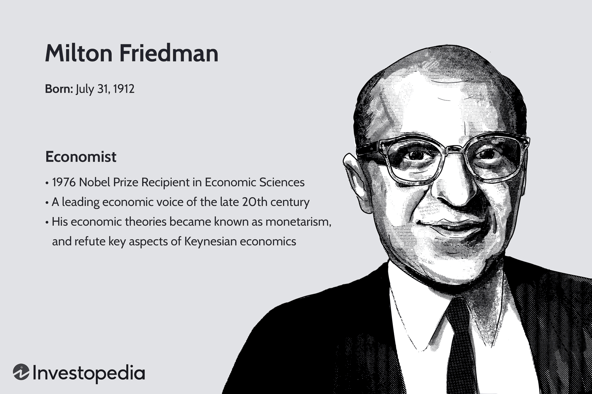

## Table of Contents

## Who was Milton Friedman?

Milton Friedman was an important economist who lived from 1912 to 2006. He was born in the United States and became famous for his ideas about how economies should work. Friedman believed that people should be free to make their own choices and that governments should not control the economy too much. He thought that if people were free to buy and sell things, the economy would do well on its own.

One of Friedman's big ideas was something called monetarism. This idea says that the amount of money in an economy is very important. If there is too much money, prices go up, which is called inflation. If there is too little money, the economy can slow down. Friedman thought that the government should control the amount of money carefully to keep the economy stable. His ideas influenced many other economists and even some governments around the world.

## What is monetarism?

Monetarism is an economic idea that says the amount of money in an economy is very important. It was made popular by Milton Friedman. According to monetarism, if there is too much money, prices go up, which is called inflation. If there is too little money, the economy can slow down. So, monetarists believe that controlling the amount of money is key to keeping the economy stable.

Monetarists think that the government should control the money supply carefully. They believe that if the government does this right, it can help avoid big problems like inflation or a slow economy. This idea is different from other economic theories that focus more on government spending or taxes. Monetarism became very influential in the late 20th century and affected how many countries managed their economies.

## How did Milton Friedman contribute to the development of monetarism?

Milton Friedman played a big role in developing monetarism. He believed that the amount of money in an economy was very important for how well the economy did. Friedman thought that if there was too much money, prices would go up, which is called inflation. If there was too little money, the economy could slow down. He said that the government should control the amount of money carefully to keep the economy stable. His ideas were different from other economists who focused more on government spending or taxes.

Friedman's work helped make monetarism popular. He wrote a lot of [books](/wiki/algo-trading-books) and articles about it. One of his most famous books is called "A Monetary History of the United States, 1867-1960," which he wrote with Anna Schwartz. In this book, they showed how changes in the money supply affected the economy over many years. Friedman's ideas influenced many other economists and even some governments. Because of his work, many people started to think more about how the money supply affects the economy.

## What are the key principles of monetarism?

Monetarism is an economic idea that says the amount of money in an economy is very important. Milton Friedman, who helped develop this idea, believed that if there is too much money, prices go up, which is called inflation. If there is too little money, the economy can slow down. So, monetarists think that the government should control the amount of money carefully to keep the economy stable. This is different from other ideas that focus more on government spending or taxes.

Friedman and other monetarists believe that the money supply should grow at a steady rate. They think that if the government can keep the money supply growing at a steady pace, it can help avoid big problems like inflation or a slow economy. Monetarism became very popular in the late 20th century, and it influenced how many countries managed their economies. Friedman's work, especially his book "A Monetary History of the United States, 1867-1960," helped spread these ideas and showed how changes in the money supply affected the economy over many years.

## How does monetarism differ from Keynesian economics?

Monetarism and Keynesian economics are two different ways of thinking about how to make an economy work well. Monetarism, which was made popular by Milton Friedman, focuses a lot on the amount of money in the economy. Monetarists believe that if there is too much money, prices go up, which is called inflation. If there is too little money, the economy can slow down. They think the government should control the money supply carefully to keep things stable. Monetarists want the money supply to grow at a steady rate to avoid big problems.

Keynesian economics, named after John Maynard Keynes, looks at the economy in a different way. Keynesians believe that the government should spend more money and cut taxes when the economy is slow. They think this can help get the economy moving again. Keynesians focus more on government spending and taxes than on the money supply. They believe that the government can help fix problems in the economy by changing how much it spends and taxes. So, while monetarists focus on the money supply, Keynesians focus on government spending and taxes.

## What role does the money supply play in monetarist theory?

In monetarist theory, the money supply is really important for how well the economy does. Monetarists believe that if there is too much money, prices go up, which is called inflation. If there is too little money, the economy can slow down. So, they think the government should control the amount of money carefully to keep the economy stable. Monetarists want the money supply to grow at a steady rate to avoid big problems.

Milton Friedman, who helped develop monetarism, said that the money supply should be the main focus for keeping the economy in good shape. He thought that if the government could keep the money supply growing at a steady pace, it would help avoid problems like inflation or a slow economy. His ideas were different from other economists who focused more on government spending or taxes. Friedman's work showed how changes in the money supply affected the economy over many years, and it influenced how many countries managed their economies.

## Can you explain the concept of the 'natural rate of unemployment' as per Friedman's views?

Milton Friedman talked about something called the 'natural rate of unemployment.' He believed that there is a certain level of unemployment that is normal for an economy. This level happens even when the economy is doing well. Friedman said that this natural rate is caused by things like people changing jobs, new people looking for work, or some jobs not matching with the skills people have. He thought that trying to push unemployment below this natural rate would just cause problems like higher inflation, without really helping the economy in the long run.

Friedman's idea was different from what some other economists thought. They believed that the government could lower unemployment a lot by spending more money. But Friedman said that if the government tries to keep unemployment too low, it would just make prices go up. He thought it was better to let the economy find its own natural rate of unemployment, and focus on keeping inflation under control instead. His ideas about the natural rate of unemployment became very important in how people think about economic policy.

## What was the impact of Friedman's monetary framework on economic policy during his time?

Milton Friedman's ideas about money and the economy had a big impact on how governments made economic policies during his time. He believed that the amount of money in an economy was very important. Friedman thought that if there was too much money, prices would go up, which is called inflation. If there was too little money, the economy could slow down. So, he said that the government should control the money supply carefully to keep the economy stable. His ideas influenced many countries to focus more on controlling the money supply instead of just spending more money or changing taxes.

Friedman's work helped change how people thought about economic problems. His book "A Monetary History of the United States, 1867-1960," which he wrote with Anna Schwartz, showed how changes in the money supply affected the economy over many years. This helped convince many economists and policymakers to take his ideas seriously. As a result, some countries started to use policies that tried to keep the money supply growing at a steady rate. This was different from what they did before, and it helped shape economic policy in the late 20th century.

## How did Milton Friedman's work influence central banking practices?

Milton Friedman's ideas about money and the economy changed how central banks worked. He believed that the amount of money in an economy was very important. If there was too much money, prices would go up, which is called inflation. If there was too little money, the economy could slow down. Friedman thought that central banks should control the money supply carefully to keep the economy stable. His ideas made central banks focus more on controlling the money supply instead of just changing interest rates or government spending.

Friedman's work, especially his book "A Monetary History of the United States, 1867-1960," showed how changes in the money supply affected the economy over many years. This helped convince many central bankers to take his ideas seriously. As a result, some central banks started to use policies that tried to keep the money supply growing at a steady rate. This was different from what they did before, and it helped shape how central banks managed the economy in the late 20th century.

## What criticisms have been leveled against monetarism and Friedman's theories?

Some people did not agree with Milton Friedman's ideas about monetarism. They said that focusing too much on the money supply was not the best way to manage an economy. Critics argued that the money supply was hard to measure and control accurately. They also said that other things, like government spending and taxes, were just as important for keeping the economy stable. Some economists believed that trying to keep the money supply growing at a steady rate could lead to problems, like making the economy grow too slowly or causing inflation if not done right.

Another criticism was about Friedman's idea of the natural rate of unemployment. Some people thought that the government could do more to lower unemployment without causing too much inflation. They argued that Friedman's view did not consider how the government could help people find jobs or create new jobs. Critics also said that Friedman's focus on keeping inflation low might hurt people who were already struggling to find work. Overall, while Friedman's ideas influenced many economic policies, they were not accepted by everyone, and many economists continued to debate the best ways to manage the economy.

## How have Friedman's ideas evolved or been reinterpreted in modern economic thought?

Milton Friedman's ideas have continued to shape economic thinking, but they have also been updated and reinterpreted over time. Many economists still believe in the importance of the money supply, but they also look at other factors like interest rates and government spending. Central banks today use a mix of Friedman's ideas and other economic theories to manage the economy. For example, they might focus on keeping inflation low, but they also use interest rates to control how fast the economy grows. This shows that while Friedman's ideas are still important, they are now part of a bigger picture in modern economics.

Friedman's concept of the natural rate of unemployment has also been revisited. Some economists agree that there is a natural level of unemployment, but they think the government can do more to help people find jobs without causing too much inflation. New ideas about how to create jobs and help workers have been added to Friedman's original thoughts. Overall, Friedman's ideas have not been completely replaced, but they have been mixed with other theories to create a more complete way of understanding and managing the economy today.

## What are some of the empirical studies that support or challenge monetarism?

Some studies have supported Milton Friedman's ideas about monetarism. One famous study is the one he did with Anna Schwartz in their book "A Monetary History of the United States, 1867-1960." They looked at how changes in the money supply affected the economy over many years. They found that when the money supply grew too fast, prices went up, and when it grew too slow, the economy slowed down. This helped show that controlling the money supply could help keep the economy stable. Other studies have also found that changes in the money supply can affect inflation and economic growth, which supports Friedman's ideas.

But there are also studies that challenge monetarism. Some economists have found that the money supply is hard to measure and control accurately. They say that other things, like government spending and interest rates, can be just as important for managing the economy. For example, some studies have shown that changes in interest rates can affect the economy more than changes in the money supply. These studies suggest that focusing only on the money supply might not be the best way to keep the economy stable. So, while Friedman's ideas have been supported by some research, they have also been questioned by other studies.

## What is Understanding Monetarism?

Monetarism is an economic theory emphasizing the critical role of government policy in regulating the money supply within an economy. It posits that changes in the money supply are the most significant factors affecting national output and inflation levels. This perspective was notably advocated by Milton Friedman, an influential economist and a leading figure behind the monetarist school of thought.

Central to monetarism is the Quantity Theory of Money, which articulates a direct relationship between the money supply and price levels. The theory fundamentally relies on the equation of exchange:

$$
MV = PQ
$$

Here, $M$ represents the total money supply, $V$ the velocity of money, $P$ the price level, and $Q$ the output of goods and services. Monetarism suggests that for a given velocity of money, any change in $M$ will proportionally affect $P$ or $Q$, illustrating how the supply of money influences economic stability.

Friedman's contributions include advocating for a controlled and predictable growth of the money supply, aligning closely with the economy's long-term growth rate. He proposed this would curb excessive inflation or deflation and maintain economic stability. He famously contested the effectiveness of discretionary fiscal policy interventions, arguing instead for a consistent, rule-based monetary policy to manage economic fluctuations effectively.

By focusing on the predictable effects of monetary policy, monetarism shifted the economic discourse, challenging previously dominant Keynesian views which emphasized fiscal policy interventions. Friedman's monetarism thereby influenced central banking practices and policy frameworks aimed at controlling inflation and stabilizing economies globally.

## What is the influence of monetarism on algorithmic trading?

Monetarism's fundamental premise—centered on the regulation of the money supply—bears a significant resemblance to the principles that underpin [algorithmic trading](/wiki/algorithmic-trading). Both fields emphasize precision and rely on robust, data-driven models to predict and influence outcomes.

Algorithmic trading systems are designed to assimilate vast arrays of economic indicators, one of the most pivotal being money supply trends. A key concept within monetarism is the Quantity Theory of Money, which can be expressed as:

$$
MV = PQ
$$

where $M$ represents the money supply, $V$ is the velocity of money, $P$ is the price level, and $Q$ is the quantity of goods and services produced. Algorithmic traders can integrate this formula to evaluate the possible impact of fluctuations in the money supply on inflation and economic productivity. By doing so, trading algorithms can anticipate potential market movements, enhancing the precision of trading strategies.

Milton Friedman's advocacy for the predictability of economic outcomes is particularly influential in the development of systematic trading models. These models often incorporate Friedman's insights, assuming that monetary policy interventions, if predictable, will be absorbed by market participants in a manner that neutralizes their intended effects. This expectation aligns with algorithmic trading's objective to construct predictive models that [factor](/wiki/factor-investing) in expected policy outcomes and rational market behavior.

The methodological parallels between economic policy management and trading strategies underscore the intricate interplay between economics and finance. For instance, algorithmic trading strategies frequently incorporate rational expectations theory, which posits that individuals base decisions on forecasts adapted from all available information. This approach reflects Friedman's stance on monetary neutrality in the long run, encouraging traders to model their strategies on the anticipation of rational economic responses.

Furthermore, the digitization of finance has amplified the capacity for algorithmic systems to adapt monetarist principles in real-time, showcasing the potential for algorithms to mimic monetary policy applications. This evolution reflects an ongoing dialogue between economic theory and the implements of modern trade, reinforcing the assertion that integrating monetarist elements can refine algorithmic trading methodologies.

## References & Further Reading

[1]: Milton Friedman. (1968). ["The Role of Monetary Policy."](https://www.aeaweb.org/aer/top20/58.1.1-17.pdf) The American Economic Review, 58(1), 1-17.

[2]: Benninga, S. (2014). ["Financial Modeling."](https://www.amazon.com/Financial-Modeling-Press-Simon-Benninga/dp/0262027283) MIT Press.

[3]: Fama, E. F. (1970). ["Efficient Capital Markets: A Review of Theory and Empirical Work."](https://onlinelibrary.wiley.com/doi/abs/10.1111/j.1540-6261.1970.tb00518.x) The Journal of Finance, 25(2), 383-417.

[4]: Friedman, M., & Schwartz, A. J. (1963). ["A Monetary History of the United States, 1867-1960."](https://www.jstor.org/stable/j.ctt7s1vp) Princeton University Press.

[5]: Markowitz, H. (1952). ["Portfolio Selection."](https://onlinelibrary.wiley.com/doi/abs/10.1111/j.1540-6261.1952.tb01525.x) The Journal of Finance, 7(1), 77-91.

[6]: Chan, E. (2009). ["Quantitative Trading: How to Build Your Own Algorithmic Trading Business."](https://github.com/ftvision/quant_trading_echan_book) Wiley.

[7]: Lopez de Prado, M. (2018). ["Advances in Financial Machine Learning."](https://www.amazon.com/Advances-Financial-Machine-Learning-Marcos/dp/1119482089) Wiley.

[8]: Aronson, D. R. (2007). ["Evidence-Based Technical Analysis: Applying the Scientific Method and Statistical Inference to Trading Signals."](https://onlinelibrary.wiley.com/doi/book/10.1002/9781118268315) Wiley.