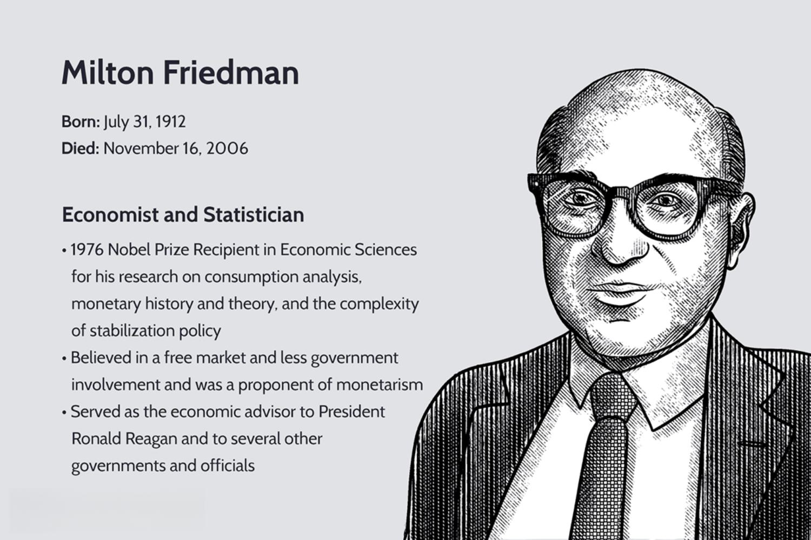

The interplay between monetarism, economics, and algorithmic trading exemplifies the integration of traditional economic principles with modern technology. Monetarism, a school of thought prominently associated with the work of economist Milton Friedman, focuses on the role of governments in controlling the amount of money in circulation. Its central tenet is that variations in the money supply have major influences on national output in the short run and the price level over longer periods. Friedman's contributions, particularly his advocacy for a steady, small expansion of the money supply, have significantly influenced economic policies worldwide. 

In the landscape of financial trading, these monetarist principles continue to exert considerable influence, especially with the rise of algorithmic trading. Algorithmic trading employs computer algorithms to execute trades at speeds and frequencies that are impossible for human traders. By utilizing historical pricing, statistical patterns, and economic indicators—including those derived from monetarist theories—algorithms can optimize trading strategies and improve decision-making in fast-paced markets. 

Understanding the connection between monetarism, Friedman's economic theories, and the development of algorithmic trading offers a lens through which the evolution of financial markets can be understood. As algorithmic trading utilizes principles from monetarism, such as the importance of money supply and inflation control, it bridges the gap between historical economic theories and cutting-edge financial technologies. This article aims to illuminate how these areas converge, providing insights into their individual and collective impacts on modern economies, and highlighting the ongoing relevance of monetarist principles in the dynamic contexts of today's trading environments.

## Table of Contents

## The Origins of Monetarism: Milton Friedman’s Legacy

Milton Friedman emerged as a pivotal figure in the field of economics, most notably through his development and advocacy of monetarism, a theory that gained prominence in the latter half of the 20th century. As a distinguished member of the Chicago School of Economics, Friedman articulated the crucial role that money supply plays in influencing economic activity, hence departing from the prevailing Keynesian models which emphasized fiscal policy and demand management.

Friedman's approach was largely centered on the Quantity Theory of Money, a concept suggesting that changes in the money supply have direct and proportional effects on price levels. The theory can be concisely represented by the equation of exchange: 

$$
MV = PQ
$$

where $M$ is the money supply, $V$ is the velocity of money, $P$ is the price level, and $Q$ is the output. Monetarism primarily contends that $M$, the money supply, is the most controllable of these variables, and thus central banks should focus on its regulation to influence economic stability and control inflation.

Friedman underscored the significance of a stable monetary environment, proposing that erratic changes in the money supply could lead to economic instability, such as inflation or recession. His critique of Keynesian economics, which often advocated for active fiscal policies and government interventions to manage economic cycles, was predicated on the basis that such interventions frequently led to undesirable side effects like inflationary pressures and economic inefficiencies.

In stark contrast, Friedman's monetarism advocated for minimal government interference in economies, suggesting that markets are inherently self-regulating when left to their devices. His policy prescriptions typically urged for a steady, predetermined increase in the money supply, which he argued, would provide a stable macroeconomic backdrop conducive to growth.

Friedman's contributions to economic thought were recognized internationally, particularly after receiving the Nobel Memorial Prize in Economic Sciences in 1976. His legacy is ingrained not only in academic circles but also in practical policy-making, influencing monetary policies in various industrialized nations throughout the 1980s. His advocacy for free-market principles and skepticism of government intervention remain influential, underpinning many contemporary economic policies and theories.

## Monetarism’s Influence on Economic Policy

Monetarism, as spearheaded by Milton Friedman, fundamentally reshaped economic policies in the late 20th century, most notably through its influence on Reaganomics in the United States and Thatcherism in the United Kingdom. These economic strategies emphasized controlling the money supply to manage inflation, an approach that diverged from the Keynesian focus on fiscal policy and government intervention. The core principle of monetarism, as articulated by Friedman, is encapsulated in the Quantity Theory of Money, often expressed by the equation $MV = PQ$, where $M$ stands for the money supply, $V$ represents the velocity of money, $P$ denotes the price level, and $Q$ indicates the output level. Monetarists argue that changes in the money supply have a direct, proportional effect on the price level.

Central banks worldwide incorporated monetarist principles to address the economic challenges of stagflation experienced in the 1970s and 1980s. This period was marked by simultaneous high inflation and high unemployment, a situation that traditional Keynesian policies struggled to address. Monetarism's approach provided a framework that emphasized the regulation of money supply as a tool to stabilize economies. By focusing on controlling the growth of money supply rather than adjusting fiscal policies, central banks aimed to maintain price stability and encourage economic predictability.

One of the significant contributions of monetarism to economic policy is its advocacy for steady and predictable policy frameworks over temporary measures. This perspective fostered the development and adoption of monetary rules and inflation targeting, which became central to the operational strategies of major central banks. Inflation targeting, in particular, involves setting explicit inflation rate goals and using monetary policy tools to achieve them, thereby fostering transparency and reducing uncertainty in markets.

Monetarism’s influence on economic policy underlines a shift towards autonomous central bank operations, minimizing political interference in monetary matters. The emphasis on maintaining a low and stable inflation rate has led many central banks, including the Federal Reserve and the European Central Bank, to adopt frameworks that are informed by monetarist thought. This has facilitated long-term economic planning and reduced the [volatility](/wiki/volatility-trading-strategies) associated with erratic inflation and economic policies.

In summary, monetarism's impact on economic policy is profound, providing a basis for adopting structured and disciplined approaches to money supply management. The integration of monetarist principles in central banking has played a crucial role in shaping modern economic environments and remains critical in navigating economic stability.

## Algorithmic Trading: The Modern Frontier

Algorithmic trading employs sophisticated computer algorithms to automate and enhance the efficiency of trading activities in financial markets. By leveraging these algorithms, traders can execute orders at high volumes and speeds, surpassing human capabilities in processing and responding to market data. The core of [algorithmic trading](/wiki/algorithmic-trading) lies in its use of complex mathematical models, which are designed to analyze and interpret extensive datasets in real time. These models can incorporate various factors, such as price, timing, and [volume](/wiki/volume-trading-strategy), to predict market movements and optimize trading strategies.

One of the key components of algorithmic trading is its reliance on high-speed networks and advanced computational power. This technological infrastructure allows for the rapid execution of trades, significantly reducing latency and minimizing the potential for human error. The ability to execute trades within microseconds is crucial in highly volatile markets, where price fluctuations can occur in fractions of a second.

Algorithmic trading is inherently data-driven, utilizing large volumes of historical and real-time data to inform its decisions. This data includes not only market prices but also economic indicators, news events, and other relevant signals that can impact asset prices. By processing and analyzing these datasets, algorithms can identify market trends and patterns that might not be immediately apparent to human traders.

The expanding influence of algorithmic trading is evident in its growing contribution to the total trading volume in global markets. It is estimated that a significant proportion of equity trading, for example, is conducted through algorithmic strategies. This prevalence underscores the efficiency and effectiveness of algorithms in modern trading environments, where large-scale operations and precision are paramount.

Python's role in this field is noteworthy due to its extensive libraries and frameworks that facilitate the development of algorithmic trading systems. Libraries such as NumPy, pandas, and Scikit-learn provide robust tools for data analysis and [machine learning](/wiki/machine-learning), which are integral to creating predictive models and enhancing trading strategies. Python's simplicity and versatility make it a popular choice for both individual traders and institutional investors looking to implement algorithmic trading solutions.

Overall, algorithmic trading represents a transformative advancement in the financial sector, offering enhanced speed, accuracy, and scalability in trading operations. As technology continues to evolve, the techniques and strategies employed by algorithmic trading will likely become even more sophisticated, further solidifying its position as a dominant force in financial markets.

## Integration of Monetarism Principles in Algorithmic Trading

Monetarist principles have significantly contributed to the development of algorithmic trading strategies by highlighting crucial aspects of market behavior and macroeconomic trends. One of the fundamental insights provided by monetarism is the importance of macroeconomic indicators, such as inflation and money supply, which serve as pivotal inputs for creating predictive models in algorithmic trading. Understanding these indicators aids in recognizing the potential effects of monetary policy changes and economic cycles on market dynamics.

Algorithmic trading systems frequently incorporate monetarist economic theories to anticipate how markets might react to variations in monetary policy. For instance, changes in interest rates or central bank interventions can lead to immediate market shifts. By embedding these theoretical insights into algorithms, traders can preemptively adjust their positions based on expected policy outcomes. This anticipatory strategy aligns with the monetarist perspective, which holds that fluctuations in the money supply directly influence economic activity and market conditions.

Moreover, the application of monetarist principles allows for the refinement of algorithmic models to better manage economic cycles. During periods of economic expansion or contraction, models that [factor](/wiki/factor-investing) in money supply changes can optimize performance by adjusting algorithms to respond efficiently to market conditions. These adjustments are crucial for maintaining the stability and profitability of trading strategies in fluctuating economic environments.

As technology and the financial markets continue to evolve, monetarist principles maintain their relevance by informing the development and implementation of sophisticated algorithmic trading strategies. The integration of these economic theories ensures that trading algorithms remain responsive to the ever-changing landscape of global finance, providing traders with a robust framework for navigating the complexities of modern markets. In essence, the combination of monetarist insights with algorithmic precision creates opportunities to capitalize on market trends while managing risks associated with economic fluctuations.

## Challenges and Criticisms

Despite its profound influence, monetarism has drawn criticism for its potential oversimplification of the complexities inherent in economic dynamics. The primary critique lies in its heavy emphasis on the money supply as the central determinant of economic activity. Critics argue that such a viewpoint tends to overlook other crucial variables, such as fiscal policy, consumer behavior, and global economic interdependencies, which can significantly influence economic outcomes [1].

Monetarist theory primarily hinges on the Quantity Theory of Money, represented by the equation:

$$
MV = PY
$$

where $M$ is the money supply, $V$ stands for velocity of money, $P$ denotes the price level, and $Y$ represents the real output. Critics contend that an over-reliance on $M$ neglects the complexities of $V$, which is not constant and is affected by a variety of factors not addressed in monetarist theory.

Algorithmic trading, likewise, encounters its unique set of challenges and criticisms. One of the main issues is market [liquidity](/wiki/liquidity-risk-premium). The [high frequency](/wiki/high-frequency-trading) and volume of trades executed by algorithms can exacerbate market volatility, sometimes resulting in "flash crashes," where prices plummet and recover within minutes, causing significant disruptions. For example, the Flash Crash of May 6, 2010, saw the Dow Jones Industrial Average plunge almost 1,000 points in mere minutes before rebounding [2].

Moreover, algorithmic trading's capacity for manipulation raises ethical and regulatory concerns. The potential exists for unscrupulous behavior, such as using algorithms to manipulate market prices temporarily. Regulatory bodies continually strive to adapt their frameworks to ensure fair and stable markets, but the speed at which technology evolves often outpaces legal improvements, leading to gaps in oversight.

Both monetarism and algorithmic trading necessitate ongoing adaptation in response to criticisms and changes in economic landscapes. Monetarism must expand its framework to incorporate a broader range of economic factors beyond the money supply. Similarly, algorithmic trading requires robust ethical guidelines and regulatory measures to safeguard market stability and integrity.

Overall, while monetarism and algorithmic trading have significantly influenced economic policy and financial markets, acknowledging and addressing their limitations is crucial for their future development and effectiveness in dynamic economic conditions.

**References**:
- [1] Friedman, M. (1968). The Role of Monetary Policy. *The American Economic Review, 58*(1), 1-17.
- [2] "Findings Regarding the Market Events of May 6, 2010." U.S. Commodity Futures Trading Commission and Securities & Exchange Commission, 2010.

## Conclusion

The fusion of monetarism with algorithmic trading signifies a profound integration of traditional economic doctrines and cutting-edge technology within financial markets. Monetarism, a school of thought spearheaded by Milton Friedman, emphasizes the critical role of the money supply in influencing economic activity and price levels. By incorporating these historical economic insights, algorithmic trading systems refine their strategies and decision-making processes, enabling more adaptive and precise responses in today's volatile market environments.

Algorithmic trading benefits from an understanding of monetarist principles, such as the Quantity Theory of Money, which posits that MV = PT, where $M$ is the money supply, $V$ is velocity, $P$ is the price level, and $T$ is the volume of transactions. These concepts inform models that anticipate how changes in monetary policy might affect asset prices and market sentiment. Consequently, trading algorithms can adjust their operations based on predicted economic cycles, providing robust and informed trading methodologies.

As financial markets grow more complex, the foundational principles of monetarism, when combined with the algorithmic precision offered by modern technology, create significant opportunities and challenges. For example, algorithms can be designed to react instantaneously to central bank announcements, adjusting portfolios to align with anticipated economic shifts. This blend of tradition and innovation aids in managing risk while maximizing returns in a rapidly changing economic landscape.

Ultimately, the continuous integration of monetarism and algorithmic trading is vital for understanding and navigating the complexities of today's global economy. By bridging the gap between established economic theories and emerging technologies, traders and financial institutions can develop more effective strategies, ensuring a harmonious and efficient market operation. The ongoing synthesis of these fields not only reflects a dynamic relationship between economics and technology but also underscores their critical role in shaping future financial systems.

## References & Further Reading

[1]: Friedman, M. (1968). ["The Role of Monetary Policy."](https://www.aeaweb.org/aer/top20/58.1.1-17.pdf) *The American Economic Review, 58*(1), 1-17.

[2]: "Findings Regarding the Market Events of May 6, 2010." U.S. Commodity Futures Trading Commission and Securities & Exchange Commission, 2010. [Available here](https://www.sec.gov/news/studies/2010/marketevents-report.pdf).

[3]: ["Capitalism and Freedom"](https://en.wikipedia.org/wiki/Capitalism_and_Freedom) by Milton Friedman

[4]: ["Free to Choose: A Personal Statement"](https://www.amazon.com/Free-Choose-Statement-Milton-Friedman/dp/0156334607) by Milton and Rose Friedman

[5]: ["Algorithmic Trading: Winning Strategies and Their Rationale"](https://www.amazon.com/Algorithmic-Trading-Winning-Strategies-Rationale-ebook/dp/B00CY5HC0U) by Ernie Chan

[6]: ["Monetary History of the United States, 1867-1960"](https://www.jstor.org/stable/j.ctt7s1vp) by Milton Friedman and Anna J. Schwartz