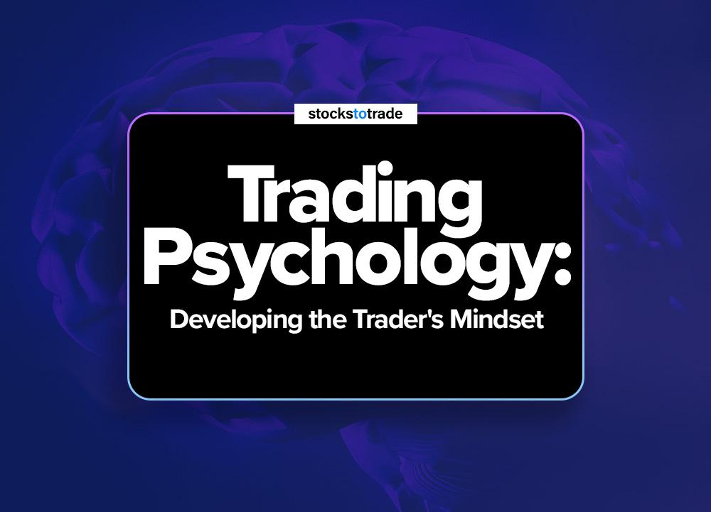

## Table of Contents

## What is mindset in the context of algo trading?

In the context of algo trading, mindset refers to the way a trader thinks and approaches their trading activities using automated systems. It's about having the right attitude and mental framework to handle the ups and downs of trading with algorithms. A good mindset in algo trading involves being disciplined, patient, and willing to learn from both successes and failures. It's important for traders to trust their systems and not let emotions like fear or greed interfere with their strategies.

Having the right mindset also means being adaptable and open to making changes when necessary. Algo trading involves a lot of data analysis and strategy tweaking, so traders need to be ready to adjust their approaches based on new information or market conditions. A positive and resilient mindset helps traders stay focused on their long-term goals, even when facing short-term setbacks. By maintaining a strong and balanced mindset, algo traders can improve their chances of success in the fast-paced world of automated trading.

## Why is understanding psychology important for algo traders?

Understanding psychology is important for algo traders because it helps them manage their emotions. Algo trading can be stressful, and traders might feel scared or greedy. If they let these feelings take over, they might make bad choices, like changing their trading plan too much or stopping their system when it's not doing well. By knowing about psychology, traders can learn to stay calm and stick to their plans, even when the market is up and down.

Also, psychology helps algo traders understand how other people might act in the market. Even though algo trading uses computers, the market is still influenced by people's decisions. If traders know how people usually react to certain situations, they can make better guesses about what might happen next. This can help them set up their trading systems to take advantage of these patterns. So, understanding psychology can make their algo trading strategies work better.

## How can beginners develop a disciplined trading mindset?

Beginners can develop a disciplined trading mindset by starting with a clear plan. They should write down their trading goals and rules, and stick to them no matter what. It's important to decide how much money they are willing to risk and to never trade more than that. They should also set times for when they will trade and when they will review their trades. By following a set routine, beginners can train themselves to be disciplined and avoid making quick, emotional decisions.

Another way to build discipline is by keeping a trading journal. In this journal, beginners should write down every trade they make, why they made it, and what happened. This helps them see their mistakes and learn from them. Over time, they will start to see patterns in their behavior and can work on fixing bad habits. It's also helpful to review the journal regularly to remind themselves of their progress and the importance of sticking to their plan. By doing these things consistently, beginners can develop the discipline needed for successful trading.

## What are common psychological challenges faced by algo traders?

Algo traders often face the challenge of overconfidence. When their trading system works well, they might start to think they can't lose. This can make them take bigger risks or change their system too much, which can lead to big losses. It's important for algo traders to stay humble and remember that the market can change in ways they don't expect.

Another common challenge is dealing with fear and doubt. When the market goes down or their system loses money, algo traders might feel scared and want to stop their system or change it a lot. This can make things worse because they might miss out on good trades when the market turns around. It's important for them to trust their system and not let fear make them do things they shouldn't.

Lastly, algo traders can struggle with impatience. They might want to see quick results and get frustrated if their system doesn't make money right away. This can lead them to make changes too soon or trade too often. It's important for them to be patient and give their system time to work, even if it takes longer than they hoped.

## How does fear and greed affect algorithmic trading decisions?

Fear and greed can really mess up [algorithmic trading](/wiki/algorithmic-trading) decisions. When traders are scared, they might stop their trading system or change it a lot because they're worried about losing money. This can make them miss out on good trades when the market gets better. Fear can make them doubt their system and not trust it, even if it's a good one. This can lead to bad choices and big losses.

On the other hand, greed can make traders take too many risks. When their system is doing well, they might start to think they can't lose and want to make more money fast. This can make them change their system to take bigger risks or trade more often than they should. Greed can make them forget their trading plan and do things that can hurt them in the long run. It's important for algo traders to keep their emotions in check and stick to their plan, no matter what the market is doing.

## What strategies can be used to manage emotions while trading?

One good way to manage emotions while trading is to stick to a clear trading plan. This means writing down what you want to achieve, how much you're willing to risk, and what rules you'll follow. When you feel scared or greedy, look at your plan and remember why you made it. This can help you stay calm and make better choices, instead of letting your feelings take over.

Another helpful strategy is to take breaks and practice self-care. Trading can be stressful, so it's important to step away from the screen sometimes. Go for a walk, do something you enjoy, or just relax. When you come back, you'll be in a better mood and can think more clearly. Also, talking to other traders or a mentor can help. They can give you advice and remind you that everyone feels scared or greedy sometimes, and it's okay.

Lastly, keeping a trading journal can really help manage emotions. Write down every trade, why you made it, and how you felt. This way, you can see when your emotions are affecting your decisions. Over time, you'll learn to spot these feelings and handle them better. It's like having a friend who helps you stay on track and reminds you to keep your emotions in check.

## How can an algo trader cultivate patience and long-term thinking?

An algo trader can cultivate patience and long-term thinking by setting clear, long-term goals and sticking to them. Instead of focusing on quick wins, they should think about where they want to be in a year or more. This helps them see the bigger picture and not get too upset about short-term losses. By writing down these goals and looking at them often, they can remind themselves to be patient and keep working towards their long-term success.

Another way to build patience is by trusting their trading system and not changing it too much. Algo traders should test their system well before using it and then give it time to work. If they keep changing things because they're impatient, they might mess up a good system. By staying calm and letting their system do its job, they can learn to be more patient and think about the long term. This also helps them avoid making quick, emotional decisions that can hurt their trading in the long run.

## What role does confidence play in the success of an algo trader?

Confidence is really important for algo traders because it helps them trust their trading system and stick to their plan. When algo traders are confident, they don't get too scared or greedy when the market goes up and down. They believe in their system and know that it's been tested and works well over time. This helps them stay calm and make good choices, even when things don't go their way right away. Confidence also stops them from changing their system too much or stopping it when it's not doing well, which can lead to big losses.

But, it's important for algo traders to have the right kind of confidence. They need to be confident but not too confident. If they think they can't lose, they might take too many risks and make bad choices. So, they should stay humble and keep learning. By being confident in their system but also ready to learn and make changes when needed, algo traders can do better in the long run. Confidence helps them stay focused on their goals and keep going, even when trading gets tough.

## How can experienced traders overcome overconfidence and complacency?

Experienced traders can overcome overconfidence and complacency by always staying humble and learning. They should remember that the market can change in ways they don't expect. Even if they've been successful, they need to keep testing their system and looking for ways to make it better. By staying curious and open to new ideas, they can avoid thinking they know everything. This helps them keep improving and not get too comfortable with how things are going.

Another way to fight overconfidence and complacency is by setting clear rules and sticking to them. Experienced traders should write down their trading plan and follow it, no matter what. This means not taking too many risks just because they feel confident. They should also keep a trading journal to track their trades and see if they're making decisions based on emotions. By being honest with themselves and sticking to their plan, they can stay disciplined and avoid the traps of overconfidence and complacency.

## What psychological techniques can enhance focus and decision-making in algo trading?

One psychological technique that can help algo traders stay focused and make better decisions is mindfulness. Mindfulness means paying attention to what's happening right now without judging it. When algo traders practice mindfulness, they can stay calm and not let their emotions like fear or greed take over. They can focus on their trading plan and stick to it, even when the market is going up and down. By being mindful, they can make clearer decisions and not get distracted by what's happening around them.

Another technique is setting clear goals and breaking them into smaller steps. When algo traders know exactly what they want to achieve, they can stay focused on those goals. They can break their big goals into smaller, easier tasks and work on them one at a time. This helps them feel like they're making progress and keeps them motivated. By focusing on these smaller steps, they can make better decisions and not get overwhelmed by the big picture. This way, they can keep their trading on track and make choices that help them reach their long-term goals.

## How do expert algo traders handle stress and maintain mental health?

Expert algo traders handle stress by taking breaks and practicing self-care. They know that trading can be hard on the mind, so they step away from the screen sometimes. They might go for a walk, spend time with family, or do something they enjoy. This helps them feel better and think more clearly when they come back to trading. They also talk to other traders or a mentor about their feelings. Sharing their worries and getting advice can make them feel less alone and help them deal with stress better.

To maintain mental health, expert algo traders also use mindfulness and meditation. These techniques help them stay calm and focused, even when the market is going crazy. By being mindful, they can notice when they're feeling stressed and take steps to relax. They also set clear goals and stick to a routine. Having a plan and following it can make them feel more in control and less worried. By taking care of their mental health, they can keep trading well and feel good about their work.

## What advanced psychological models or theories are applicable to algo trading?

One advanced psychological model that can help algo traders is the theory of cognitive biases. This theory says that people often make mistakes in thinking because of how their brains work. For example, algo traders might fall into the trap of confirmation bias, where they only pay attention to information that supports what they already believe. This can make them ignore important signs that their trading system isn't working well. By learning about these biases, algo traders can watch out for them and make better decisions. They can set up their systems to check for these biases and make sure they're not missing out on important information.

Another useful theory is the concept of emotional intelligence. This means being good at understanding and managing your own feelings, as well as understanding how other people feel. For algo traders, emotional intelligence can help them stay calm and not let fear or greed mess up their trading. It can also help them understand how other people in the market might act, which can make their trading strategies better. By working on their emotional intelligence, algo traders can handle stress better and make smarter choices, even when the market is going crazy.

## References & Further Reading

[1]: Livermore, Jesse L. "[Reminiscences of a Stock Operator](https://www.amazon.com/Reminiscences-Stock-Operator-Edwin-Lef%C3%A8vre/dp/0471770884)". 1923.

[2]: Soros, George. "[The Alchemy of Finance](https://www.amazon.com/Alchemy-Finance-George-Soros/dp/0471445495)." 1987.

[3]: Schwager, Jack D. "[Market Wizards: Interviews with Top Traders](https://www.amazon.com/Market-Wizards-Interviews-Top-Traders-ebook/dp/B006X50OPW)." 1989.

[4]: Kahneman, D., & Tversky, A. (1979). [Prospect Theory: An Analysis of Decision under Risk](https://www.jstor.org/stable/1914185). *Econometrica*, 47(2), 263-291.

[5]: Nickerson, R. S. (1998). [Confirmation bias: A ubiquitous phenomenon in many guises](https://journals.sagepub.com/doi/10.1037/1089-2680.2.2.175). *Review of General Psychology*, 2(2), 175-220.

[6]: Barber, B. M., & Odean, T. (2001). [Boys will be boys: Gender, overconfidence, and common stock investment](https://faculty.haas.berkeley.edu/odean/papers%20current%20versions/boyswillbeboys.pdf). *The Quarterly Journal of Economics*, 116(1), 261-292.

[7]: Tversky, A., & Kahneman, D. (1974). [Judgment under Uncertainty: Heuristics and Biases](https://www.science.org/doi/10.1126/science.185.4157.1124). *Science*, 185(4157), 1124-1131.

[8]: Bikhchandani, S., & Sharma, S. (2001). [Herd behavior in financial markets](https://www.imf.org/external/pubs/ft/staffp/2001/01/pdf/bikhchan.pdf). *IMF Staff Papers*, 47(3), 279-310.

[9]: Kahneman, D., & Riepe, M. W. (1998). [Aspects of investor psychology](https://obj.portfolioconstructionforum.edu.au/articles_perspectives/Portfolio-Construction-Forum_Kahneman_Aspects-of-investor-psychology.pdf). *Journal of Portfolio Management*, 24(4), 52-65.

[10]: Odean, T. (1999). [Do investors trade too much?](https://faculty.haas.berkeley.edu/odean/papers%20current%20versions/doinvestors.pdf) *The American Economic Review*, 89(5), 1279-1298.

[11]: Nofsinger, J. R. (2005). [The psychology of investing](https://www.amazon.com/Psychology-Investing-John-R-Nofsinger/dp/041539757X). Upper Saddle River, NJ: Pearson Prentice Hall.

[12]: Tharp, V. K. (2013). [Definitive Guide to Position Sizing](https://www.amazon.com/Definitive-Guide-Position-Sizing-Objectives/dp/0935219099). McGraw Hill Professional.

[13]: Schwager, J. D. (1993). [Market Wizards: Interviews with Top Traders](https://www.amazon.com/Market-Wizards-Interviews-Top-Traders-ebook/dp/B006X50OPW). HarperCollins.

[14]: Douglas, M. (1990). [The Disciplined Trader: Developing Winning Attitudes](https://www.amazon.com/Disciplined-Trader-Developing-Winning-Attitudes/dp/0132157578). Prentice Hall Press.

[15]: Elder, A. (2014). [The New Trading for a Living: Psychology, Discipline, Trading Tools and Systems, Risk Control, Trade Management](https://www.amazon.com/New-Trading-Living-Psychology-Discipline/dp/1118443926). Wiley.

[16]: Douglas, M. (2000). [Trading in the Zone: Master the Market with Confidence, Discipline, and a Winning Attitude](https://www.amazon.com/Trading-Zone-Confidence-Discipline-Attitude/dp/0735201447). Prentice Hall Press.

[17]: Tharp, V. K. (2015). [Trade Your Way to Financial Freedom](https://www.amazon.com/Trade-Your-Way-Financial-Freedom/dp/007147871X). McGraw-Hill.

[18]: Niederhoffer, V. (1997). [The Education of a Speculator](https://www.amazon.com/Education-Speculator-Victor-Niederhoffer/dp/0471137472). John Wiley & Sons.

[19]: Steenbarger, B. N. (2015). [Trading Psychology 2.0: From Best Practices to Best Processes](https://onlinelibrary.wiley.com/doi/book/10.1002/9781118936849). Wiley.

[20]: Elder, A. (2002). [Come Into My Trading Room: A Complete Guide to Trading](https://www.amazon.com/Come-Into-My-Trading-Room/dp/0471225347). John Wiley & Sons.

[21]: Malkiel, B. G. (2015). [A Random Walk Down Wall Street: The Time-tested Strategy for Successful Investing](https://www.amazon.com/Random-Walk-Down-Wall-Street/dp/0393330338). W. W. Norton & Company.

[22]: Shull, D. M. (2012). [Market Mind Games: A Radical Psychology of Investing, Trading, and Risk](https://www.amazon.com/Market-Mind-Games-Psychology-Investing/dp/0071756221). McGraw Hill Professional.

[23]: Tharp, V. K. (2015). [Trading Beyond the Matrix: The Red Pill for Traders and Investors](https://www.amazon.com/Trading-Beyond-Matrix-Traders-Investors/dp/1118525663). Wiley.

[24]: Kiyosaki, R. T. (2017). [Rich Dad Poor Dad: What the Rich Teach Their Kids About Money That the Poor and Middle Class Do Not!](https://www.amazon.com/Rich-Dad-Poor-Teach-Middle/dp/1612680194). Plata Publishing.