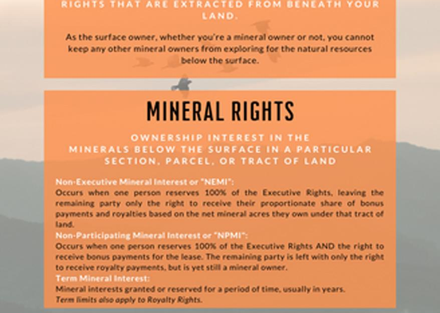

## Table of Contents

## What are mineral rights?

Mineral rights are the ownership rights to the natural resources like oil, gas, coal, and metals that are found underground. When someone owns mineral rights, they have the legal permission to explore, extract, and sell these resources. These rights can be separate from the ownership of the land above them. This means that one person can own the surface of the land, while another person or company owns the minerals beneath it.

In many places, mineral rights can be bought, sold, or leased, just like any other property. If you own mineral rights, you might lease them to a mining or drilling company. In return, you would get payments or royalties from the resources that are extracted. This can be a good source of income, but it can also lead to conflicts between the surface landowners and the mineral rights owners, especially if the extraction process harms the land or environment.

## How do mineral rights differ from surface rights?

Mineral rights and surface rights are two different kinds of property rights. Mineral rights give you the right to use the natural resources like oil, gas, and minerals that are underground. If you own mineral rights, you can explore for these resources, take them out of the ground, and sell them. Surface rights, on the other hand, give you the right to use the land on the surface. This means you can build on it, farm it, or use it for other activities.

These two rights can be owned by different people. For example, you might own the land on the surface, but someone else might own the minerals underneath. This can sometimes cause problems. If the person with the mineral rights wants to drill or mine, it might affect the land on the surface. They usually have to follow rules to minimize damage, but it can still be a source of conflict between the surface owner and the mineral rights owner.

## Who can own mineral rights?

Anyone can own mineral rights. This includes people, companies, and even the government. If you own a piece of land, you might also own the mineral rights that go with it. But sometimes, the mineral rights and the land rights are owned by different people. This can happen if the mineral rights were sold or leased to someone else.

When mineral rights are separate from the land, the person or company that owns the mineral rights can explore and take out the minerals. They usually have to follow rules to make sure they don't harm the land too much. If you own the land but not the mineral rights, you might not have a say in what happens underground. This can sometimes cause problems between the land owner and the mineral rights owner.

## How are mineral rights acquired?

Mineral rights can be acquired in several ways. One common way is through buying land that comes with mineral rights. When you buy a piece of property, you might also get the rights to the minerals underneath it. Another way is by buying or leasing the mineral rights separately from the land. This can happen if the person who owns the land decides to sell or lease the mineral rights to someone else, like a mining or drilling company.

Sometimes, mineral rights are inherited. If someone in your family owned mineral rights and passed away, you might inherit those rights. Governments can also own mineral rights, especially in places where the law says that all minerals belong to the state. In these cases, the government might lease the rights to companies that want to explore and extract the minerals.

## What minerals are typically included in mineral rights?

Mineral rights usually cover a wide range of natural resources found underground. This includes common minerals like oil, natural gas, coal, and metals such as gold, silver, copper, and iron. These are the things that companies often look for when they explore and mine. But mineral rights can also include other resources like uranium, salt, and even water in some cases.

The exact minerals covered by mineral rights can depend on the laws of the area and the specific agreement made when the rights were bought or leased. For example, in some places, mineral rights might only include certain types of minerals, while in others, they might cover everything underground. This is why it's important to read the details of any mineral rights agreement carefully.

## How do mineral rights affect property value?

Mineral rights can make a big difference in how much a property is worth. If a property has valuable minerals like oil or gold underneath it, the mineral rights can add a lot of value. People or companies might be willing to pay more for the land because they want to use the minerals. This can make the property worth more money than it would be if it just had the land on top.

But, mineral rights can also make things complicated. If someone else owns the mineral rights and wants to drill or mine, it can mess up the land on the surface. This might make the property less valuable to someone who wants to live there or use it for farming. So, while mineral rights can increase the value of a property, they can also cause problems that might lower its value if the land gets damaged or if there are conflicts with the mineral rights owner.

## What are the legal implications of owning mineral rights?

Owning mineral rights gives you the legal power to use the resources like oil, gas, and minerals that are underground. You can explore for these resources, take them out of the ground, and sell them. But, you have to follow the rules and laws about how to do this. These rules can be different depending on where you are. They might say things like how deep you can drill, how you have to clean up after you're done, and how you have to share the money you make with the person who owns the land on top.

Sometimes, owning mineral rights can cause problems with the person who owns the land on the surface. If you want to drill or mine, it might mess up their land. They might not be happy about this, even if you are following the rules. This can lead to disagreements or even lawsuits. It's important to talk to the surface owner and try to work things out. Also, if you own mineral rights, you might have to pay taxes on the money you make from selling the minerals.

## How can mineral rights be leased or sold?

Mineral rights can be leased or sold just like any other kind of property. If you own mineral rights, you can lease them to a company that wants to explore and take out the minerals. This means you let them use the rights for a certain amount of time, and they pay you money for it. The company might pay you a one-time fee when they start, and then they might also give you a part of the money they make from selling the minerals. This is called a royalty. Leasing can be a good way to make money without having to do the work of mining or drilling yourself.

You can also sell your mineral rights completely. When you sell them, you give up all your rights to the minerals, and the new owner can do whatever they want with them. Selling can be a good choice if you need money right away or if you don't want to deal with the hassle of leasing. But once you sell, you won't get any more money from the minerals, even if they turn out to be very valuable. Both leasing and selling have their own pros and cons, so it's important to think carefully about what you want to do.

## What is the process of mineral extraction and how does it relate to mineral rights?

Mineral extraction is the process of taking minerals out of the ground. It starts with exploring the land to find out if there are any valuable minerals like oil, gas, or metals underneath. If the exploration shows that there are minerals, the next step is to get permission to start drilling or mining. This can involve setting up equipment and digging into the earth to reach the minerals. Once the minerals are taken out, they are usually cleaned and processed so they can be sold or used.

The process of mineral extraction is closely related to mineral rights. If you own mineral rights, you have the legal power to explore and take out the minerals. This means you can decide to do the extraction yourself or lease the rights to a company that will do it for you. But, you have to follow the rules and laws about how to extract the minerals safely and without causing too much harm to the land. If someone else owns the mineral rights, they can do the extraction even if you own the land on top. This can sometimes cause problems between the mineral rights owner and the surface land owner.

## How do regulations and environmental concerns impact mineral rights?

Regulations and environmental concerns can have a big impact on mineral rights. Governments make rules about how minerals can be taken out of the ground. These rules are meant to keep people safe and protect the environment. For example, there might be laws about how deep you can drill, how you have to clean up after you're done, and what you have to do to make sure the land isn't harmed too much. If you own mineral rights, you have to follow these rules. If you don't, you could get in trouble and have to pay fines.

Environmental concerns also play a big role. People worry about how drilling and mining can hurt the land, water, and air. Because of this, there are often strict rules about how to do things in a way that is less harmful to the environment. For example, you might have to use special equipment to reduce pollution or restore the land after you're done. These rules can make it more expensive and harder to use your mineral rights. But they are important for keeping the environment safe for everyone.

## What are the tax implications of owning and exploiting mineral rights?

Owning and using mineral rights can affect your taxes. If you own mineral rights and get money from selling the minerals, you usually have to pay taxes on that money. This can be a lot of money, especially if the minerals are very valuable. The exact amount of taxes you have to pay can depend on where you live and how you get the money. For example, if you lease your mineral rights to a company and they pay you royalties, those royalties are usually taxed as income.

There are also other taxes you might have to pay. Some places have special taxes just for taking minerals out of the ground. These are called severance taxes. They are meant to help pay for the costs of letting companies drill or mine. If you sell your mineral rights completely, you might have to pay capital gains tax on the money you make from the sale. It's a good idea to talk to a tax expert to understand all the taxes you might have to pay and how to handle them the right way.

## How do international laws and treaties affect mineral rights ownership and exploitation?

International laws and treaties can have a big impact on who owns mineral rights and how they can be used. Different countries have different rules about who can own minerals and how they can be taken out of the ground. Some countries say that all minerals belong to the government, while others let people or companies own them. Treaties between countries can also set rules about how minerals in shared areas, like the ocean floor, can be used. These treaties help make sure that everyone follows the same rules and that the environment is protected.

For example, the United Nations Convention on the Law of the Sea (UNCLOS) sets rules about who can explore and take minerals from the ocean floor. Countries that agree to this treaty have to follow its rules, which can affect how they use their mineral rights. Also, international environmental agreements can limit how minerals are taken out of the ground to protect the planet. These laws and treaties can make it more complicated to own and use mineral rights, but they are important for making sure that everyone plays fair and takes care of the environment.

## References & Further Reading

[1]: Otto, J. M. (1997). ["A Global Survey of Mineral Rights."](https://www.sciencedirect.com/science/article/pii/S0301420798000117) The World Bank.

[2]: Hein, J. R., Mizell, K., Koschinsky, A., & Conrad, T. A. (2013). ["Deep-Ocean Mineral Deposits as a Source of Critical Metals for High- and Green-Technology Applications: Comparison with Land-Based Resources."](https://www.sciencedirect.com/science/article/abs/pii/S016913681200234X) Economic Geology.

[3]: Singer, D. A. (2010). ["World-class Base and Precious Metal Deposits—A Quantitative Analysis."](https://pubs.geoscienceworld.org/segweb/economicgeology/article-abstract/90/1/88/21485/World-class-base-and-precious-metal-deposits-a) U.S. Geological Survey, Open-File Report 2010-1224.

[4]: Lozada-Heller, A., & Peters, S. M. (2020). ["Algorithmic Trading and Market Dynamics."](https://scholar.google.com/citations?user=luo0_jIAAAAJ&hl=en) Journal of Asset Management.

[5]: Cuddington, J. T., & Nühle, M. (2017). ["Commodity Trade and the Carry Trade: A Tale of Emerging Currencies."](https://www.jstor.org/stable/26653294) The Quarterly Review of Economics and Finance.