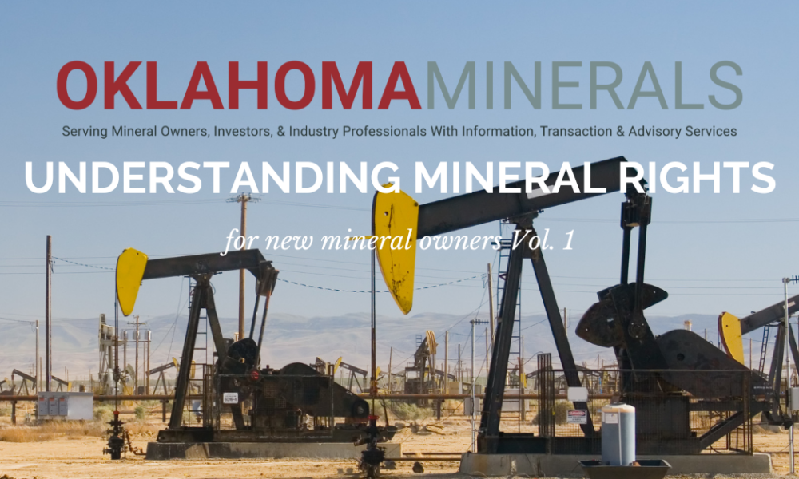

Mineral rights, resource ownership, mining regulations, and algorithmic trading form a complex web that increasingly influences today's global economy. As industries worldwide shift toward more sustainable practices, the need for critical minerals such as lithium, cobalt, and rare earth elements has surged. These minerals are essential for powering electric vehicles, renewable energy technologies, and advanced electronics, underscoring a growing demand that impacts a wide range of stakeholders, from landowners to large-scale investors.

Understanding mineral rights is fundamental because it determines who can exploit underground resources and under what terms those resources can be developed or transferred. In countries like the United States, mineral rights can often be severed from surface rights, leading to intricate scenarios during property transactions and resource extraction processes. For instance, in states like Texas and Colorado, where such separations are prevalent, they introduce additional layers of negotiation and regulation for property owners and potential developers.



Mining regulations play a pivotal role in resource development by setting the standards for exploration and extraction while safeguarding environmental integrity. The regulatory framework, especially in countries with significant mining activities, must harmonize interests across different governmental layers, encompassing federal, state, and local jurisdictions. In the U.S., for example, the regulations governing federal lands are notably complex and are subject to political shifts, such as potential amendments to foundational legislations like the General Mining Law. These changes can directly influence the scale and speed at which mineral resources are explored and utilized.

Moreover, the commodities market, particularly in metals and minerals, is increasingly shaped by algorithmic trading. This modern trading approach utilizes automation and complex algorithms to navigate the financial markets efficiently, offering advantages in terms of speed and precision over traditional trading methods. As a result, various market participants, including investors and resource companies, are leveraging these technologies to optimize their portfolios and streamline risk management strategies.

In a rapidly evolving context where economic, environmental, and technological factors intertwine, the interaction between mineral rights, mining regulations, and algorithmic trading mechanisms becomes a critical area of focus. As global demand for essential minerals intensifies, stakeholders must remain informed and adaptive to capitalize on opportunities while effectively managing associated risks. This article aims to shed light on these interconnected domains, providing insights essential for achieving sustainable and strategic engagement in the mineral resources sector.

## Table of Contents

## Understanding Mineral Rights and Resource Ownership

Mineral rights pertain to the ownership claims or entitlements to subterranean resources, distinct from the ownership of surface land rights. These rights have significant implications for resource extraction, legal transactions, and economic benefits associated with land ownership.

In the United States, mineral rights can be privately owned, granting landowners the power to lease or sell these rights independently of the surface rights. This separation between surface and mineral rights is particularly prevalent in certain states such as Texas and Colorado, where historical legal frameworks have allowed for these rights to be distinctly owned and transferred. As a result, when property is bought or sold, it is critical for parties involved in real estate transactions to clearly understand whether mineral rights are included in the deal or have been previously severed from surface land rights. This division necessitates thorough due diligence and often necessitates the expertise of legal professionals to navigate the complexities of mineral ownership.

Texas and Colorado, with their extensive histories of oil and natural gas production, serve as exemplary cases where the separation of mineral and surface rights is commonplace. In Texas, the principle of the "dominant estate" applies, where mineral rights hold precedence over surface rights. This legal doctrine means that holders of mineral rights have the authority to access the surface land as necessary for resource exploration and extraction, potentially leading to conflicts between surface owners and mineral rights holders. Colorado follows similar practices, further complicating property transactions as buyers must ascertain the status of any underlying mineral claims before proceeding.

Private ownership of mineral rights can offer significant economic opportunities for landowners. By leasing mineral rights, owners can receive rental payments or royalty payments based on a percentage of the resource extraction profits. This financial arrangement incentivizes landowners to lease rather than sell their mineral rights, maintaining long-term income potential while retaining ownership.

The intricacies of mineral rights also emphasize the necessity for clear and detailed property records. Documentation that traces the history of mineral rights ownership is critical in preventing disputes, ensuring rightful ownership, and facilitating transparent transactions. As demand for minerals continues to rise, understanding the division and ownership of mineral rights becomes increasingly important for stakeholders involved in resource extraction and land management. This understanding enables better resource management and aligns with economic goals while considering environmental and community impacts.

## How Mining Regulations Impact Resource Development

Mining regulations play a pivotal role in balancing the need for resource development with environmental protection mandates. They provide a structured framework ensuring that exploration and extraction activities are conducted responsibly, sustainably, and safely.

In the United States, the mining regulatory landscape is notably intricate due to the presence of multiple jurisdictional layers—federal, state, and local—that govern different aspects of mining. This complexity is particularly pronounced when it comes to operations on federal lands. The Federal Land Policy and Management Act (FLPMA), for example, empowers the Bureau of Land Management (BLM) to oversee mining activities, ensuring that they align with land-use plans and environmental standards. Additionally, the Mining Law of 1872, though longstanding, grants individuals and corporations rights to mine on federal lands, a provision that has sparked debates over its modern applicability and environmental ramifications.

State laws further complicate the U.S. regulatory framework. While federal agencies oversee the approval and general regulation of mining projects, states implement and enforce their own environmental laws, permits, and reclamation requirements. For instance, states like Arizona have specific regulations catering to the nuances of local mineral compositions and environmental concerns. These state laws can often update or add layers to federal regulations, thereby adapting to emerging local environmental and economic challenges.

Recent political developments have brought attention to the General Mining Law, particularly calls for its modernization to include environmental protection fees and increased royalties. Changes to this law could profoundly affect how mineral resources are accessed and utilized, potentially increasing costs for mining operations but also ensuring that environmental safeguards and fair economic compensation are in place. These potential amendments reflect broader shifts towards sustainable and community-focused resource development policies.

In summary, mining regulations are essential in navigating the delicate equilibrium between resource exploitation and environmental stewardship. They constrain mining activities within legal and ethical boundaries, emphasizing the necessity of preserving ecological integrity while enabling economic benefits from mineral resources. The ongoing refinement of these regulations, driven by political influences and societal expectations, ensures that resource development aligns with contemporary standards and needs.

## The Role of Critical Minerals in the Energy Transition

The global transition towards renewable energy technologies is markedly increasing the demand for critical minerals, particularly lithium and cobalt. These minerals are pivotal in the manufacture of batteries used in electric vehicles (EVs) and energy storage systems, which are essential components of the decarbonization strategy. Lithium-ion batteries, for instance, rely heavily on these materials due to their high energy density and efficiency.

Mining regulations worldwide are evolving to address the heightened need for a secure and stable supply of critical minerals. Regulatory frameworks must balance the facilitation of exploration and extraction with environmental protection mandates. This dynamic is particularly pronounced in jurisdictions that hold significant mineral reserves. For example, policies are being adapted to streamline the permitting process for new mining projects while ensuring that these operations meet stringent environmental standards. Agencies are also increasingly incorporating sustainability metrics into their assessments, aiming to minimize ecological footprints while maximizing resource recovery.

Governments are actively forming new partnerships and implementing interventions to fortify the supply chains of critical minerals. These efforts include bilateral agreements between mineral-rich and technologically advanced nations to secure long-term supply commitments. There is a growing emphasis on 'ethical sourcing', which focuses on transparency and adherence to environmental and social governance ([ESG](/wiki/esg-investing)) criteria. Public and private sectors are collaborating to invest in research and development aimed at improving mineral extraction and processing technologies. This includes finding alternatives to traditional mining practices through recycling and the development of unconventional resources such as deep-sea nodules.

Moreover, international bodies are playing a crucial role in identifying and mitigating supply chain risks associated with critical minerals. Initiatives like the European Union's Action Plan on Critical Raw Materials and the U.S. Department of Energy’s Critical Materials Strategy are indicative of strategic approaches aimed at reducing dependency on external sources while promoting recycling and stockpiling.

In summary, the role of critical minerals in the energy transition is becoming increasingly prominent. The confluence of evolving mining regulations, government interventions, and strategic partnerships is shaping a responsive supply chain model that seeks to meet the burgeoning demand for minerals like lithium and cobalt. This model is crucial for enabling the global shift towards sustainable energy solutions and achieving climate change targets.

## Algorithmic Trading in Commodities Markets

Algorithmic trading has become a pivotal force in the commodities markets, including the sectors dealing with metals and mineral resources. The advent of sophisticated algorithms has transformed how traders operate, allowing them to swiftly respond to market fluctuations. This transformation is driven by the ability of algorithms to process vast datasets, analyze market trends, and execute trades at speeds far surpassing human capability.

Automation in trading minimizes the latency that typically accompanies decision-making processes. Algorithms can execute pre-programmed trading instructions based on a multitude of variables such as price, timing, and [volume](/wiki/volume-trading-strategy). The primary advantage here is the elimination of human errors and emotional bias, leading to more consistent trading outcomes. Furthermore, algorithmic systems can operate continuously, monitoring markets around the clock and executing trades at optimal times without requiring human intervention.

For stakeholders interested in hedging risks or investing in mineral resources, understanding [algorithmic trading](/wiki/algorithmic-trading) systems is crucial. These systems enable traders to employ strategies such as statistical [arbitrage](/wiki/arbitrage), [trend following](/wiki/trend-following), and market-making more effectively. For example, an algorithm may be designed to capitalize on price discrepancies across different markets, buying a commodity in one market where the price is lower and simultaneously selling it in another market where the price is higher. This process, known as arbitrage, can be automated to occur instantaneously, ensuring maximum profit from fleeting opportunities.

The integration of [machine learning](/wiki/machine-learning) elements into trading algorithms also allows for more adaptive systems that can refine their strategies based on historical data. Such systems can identify patterns and predictive signals that may not be immediately apparent through traditional analysis, providing traders with a competitive edge.

In sum, the role of algorithmic trading in the commodities markets is increasingly indispensable. By leveraging technology to enhance decision-making and execution speed, traders and investors in mineral resources are better equipped to navigate the complexities of global markets, optimize their investment strategies, and manage risks in an ever-evolving economic landscape.

## Implications for Investors and Stakeholders

The evolving landscape of mineral rights and mining regulations presents a multifaceted environment for investors and stakeholders. With the separation of mineral and surface rights, and varying regulations across jurisdictions, stakeholders must navigate intricate legal and environmental frameworks to optimize their investments. For instance, in the United States, the ownership of mineral rights is distinct from surface rights, meaning that purchasing land does not automatically give the owner rights to the minerals beneath it. This separation, common in states such as Texas and Colorado, can lead to complex property transactions and necessitates a thorough understanding of the local regulatory environment.

Legal complexities are compounded by environmental considerations and the economic dynamics of resource extraction. Investors must assess the potential environmental impact of mining operations, which can affect the sustainability and reputational standing of the investment. Regulatory bodies impose stringent guidelines to protect ecosystems and ensure safe mining practices, adding another layer of complexity. Economic factors such as fluctuating commodity prices, demand for critical minerals driven by technological advancements, and geopolitical considerations further influence investment decisions.

Algorithmic trading introduces additional complexity and opportunity in the commodities market. The integration of advanced algorithms and automated trading systems allows investors to swiftly analyze market trends and execute trades with precision. These tools can process large volumes of data at high speeds, identifying patterns and opportunities that may not be apparent through traditional analysis. Algorithmic trading can enhance market efficiency but also requires a deep understanding of the underlying algorithms and market conditions.

### Example of a Basic Algorithmic Trading Strategy in Python

```python
import numpy as np
import pandas as pd
import matplotlib.pyplot as plt
from sklearn.linear_model import LinearRegression

# Load historical commodity price data
data = pd.read_csv('commodity_prices.csv')
prices = data['Close'].values
dates = np.arange(len(prices)).reshape(-1, 1)

# Implement a simple trend-following strategy using linear regression
model = LinearRegression()
model.fit(dates, prices)

# Predict future prices and determine trading signals
future_dates = np.arange(len(prices), len(prices) + 30).reshape(-1, 1)
predictions = model.predict(future_dates)

# Plot the results
plt.plot(prices, label='Historical Prices')
plt.plot(np.arange(len(prices), len(prices) + 30), predictions, label='Predicted Prices')
plt.xlabel('Days')
plt.ylabel('Price')
plt.legend()
plt.show()
```

This Python code demonstrates a straightforward method for predicting trends in commodity prices using linear regression, reflecting how algorithmic tools can assist investors in making data-driven decisions.

Overall, investors and stakeholders must adeptly manage the legal, environmental, and economic aspects of their investments while leveraging the advantages provided by algorithmic trading. By doing so, they can navigate the complexities of the mineral rights landscape and position themselves strategically in the evolving market.

## Conclusion

The complex relationship between mineral rights, mining regulations, and modern trading techniques highlights the dynamic nature of the resource sector. The intensification of global demand for minerals necessitates that stakeholders such as governments, investors, and landowners remain informed and adaptable. This ability to pivot and strategize effectively allows these entities to leverage opportunities while simultaneously mitigating potential risks associated with mineral exploitation and trading.

As the resource sector becomes increasingly competitive, the importance of having a deep understanding of the legal, environmental, and economic implications associated with mineral rights and regulations cannot be overstated. Additionally, algorithmic trading technologies present both challenges and opportunities by altering traditional market dynamics and necessitating sophisticated trading strategies. For stakeholders, the integration of these modern techniques can optimize investment outcomes and offer significant competitive advantages.

Sustainable development of mineral resources also hinges on effective dialogue and collaboration among governments, investors, and local communities. By fostering transparent communication and partnership, these groups can ensure that the exploitation of mineral resources is conducted responsibly and benefits are distributed equitably. This collaborative approach is essential to addressing environmental concerns, respecting local land rights, and enhancing economic growth.

Ultimately, the future of the mineral resource sector will be shaped by those who remain agile and informed, and who are proactive in fostering collaborative relationships between diverse stakeholders. This approach will ensure not only the efficient and sustainable exploitation of mineral resources but also the establishment of a robust and fair economic model that serves both current and future generations.

## References & Further Reading

[1]: Otto, J. M. (1997). ["A Global Survey of Mineral Rights."](https://www.sciencedirect.com/science/article/pii/S0301420798000117) The World Bank.

[2]: Hein, J. R., Mizell, K., Koschinsky, A., & Conrad, T. A. (2013). ["Deep-Ocean Mineral Deposits as a Source of Critical Metals for High- and Green-Technology Applications: Comparison with Land-Based Resources."](https://www.sciencedirect.com/science/article/abs/pii/S016913681200234X) Economic Geology.

[3]: Singer, D. A. (2010). ["World-class Base and Precious Metal Deposits—A Quantitative Analysis."](https://pubs.geoscienceworld.org/segweb/economicgeology/article-abstract/90/1/88/21485/World-class-base-and-precious-metal-deposits-a) U.S. Geological Survey, Open-File Report 2010-1224.

[4]: Lozada-Heller, A., & Peters, S. M. (2020). ["Algorithmic Trading and Market Dynamics."](https://scholar.google.com/citations?user=luo0_jIAAAAJ&hl=en) Journal of Asset Management.

[5]: Cuddington, J. T., & Nühle, M. (2017). ["Commodity Trade and the Carry Trade: A Tale of Emerging Currencies."](https://www.jstor.org/stable/26653294) The Quarterly Review of Economics and Finance.