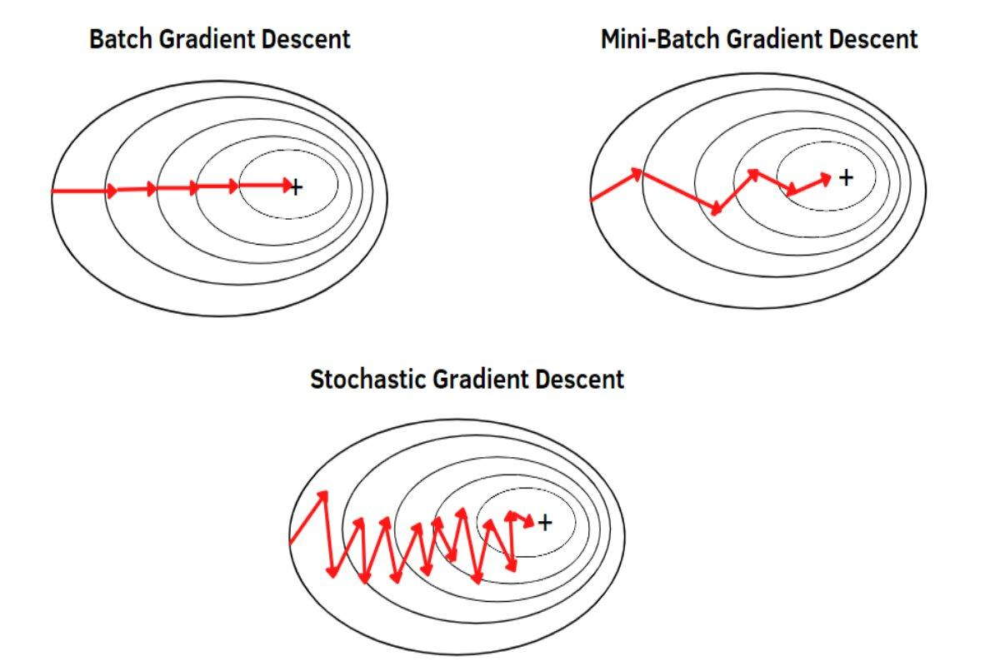

## Table of Contents

## What is Mini-Batch Stochastic Gradient Descent (SGD)?

Mini-Batch Stochastic Gradient Descent (SGD) is a method used to train machine learning models, especially when dealing with large datasets. Instead of using the entire dataset to update the model's parameters in each iteration, mini-batch SGD uses a small, randomly selected subset of the data, called a mini-batch. This approach strikes a balance between the efficiency of using the full dataset (which can be slow) and the randomness of using just one data point at a time (which can be noisy). By processing mini-batches, the model can learn more quickly and with less memory usage, making it practical for large-scale applications.

In mini-batch SGD, the model's parameters are updated after processing each mini-batch. The update is based on the average gradient calculated from the mini-batch. Mathematically, if we denote the loss function by $$L$$, the parameters by $$\theta$$, and the mini-batch by $$B$$, the update rule can be expressed as $$\theta = \theta - \eta \cdot \frac{1}{|B|} \sum_{x \in B} \nabla L(x; \theta)$$, where $$\eta$$ is the learning rate and $$\nabla L(x; \theta)$$ is the gradient of the loss with respect to the parameters for a given data point $$x$$. This process is repeated for many iterations until the model converges to a satisfactory level of performance. The size of the mini-batch is a hyperparameter that can be tuned to optimize the training process, typically ranging from 10 to 1000 data points depending on the specific problem and computational resources available.

## How does Mini-Batch SGD differ from traditional SGD and batch gradient descent?

Mini-Batch SGD is different from traditional SGD and batch gradient descent in how they use data to update the model's parameters. Traditional SGD, also known as online SGD, updates the model after looking at just one data point at a time. This can make the training process noisy because the model might get swayed by individual data points. On the other hand, batch gradient descent uses the entire dataset to update the model in each iteration. This can be very slow and memory-intensive, especially with large datasets, but it gives a more stable update because it considers all the data at once.

Mini-Batch SGD sits in the middle of these two methods. It uses a small group of data points, called a mini-batch, to update the model. This approach is faster than batch gradient descent because it doesn't need to look at all the data at once, and it's less noisy than traditional SGD because it averages the gradients over several data points. The update rule for Mini-Batch SGD can be written as $$\theta = \theta - \eta \cdot \frac{1}{|B|} \sum_{x \in B} \nabla L(x; \theta)$$, where $$\theta$$ are the model parameters, $$\eta$$ is the learning rate, $$B$$ is the mini-batch, and $$\nabla L(x; \theta)$$ is the gradient of the loss function for a data point $$x$$. This method allows for a good balance between speed and stability, making it a popular choice for training large-scale machine learning models.

## What are the advantages of using Mini-Batch SGD in machine learning?

Mini-Batch SGD offers several advantages in [machine learning](/wiki/machine-learning). One key benefit is its efficiency. By using a small subset of the data, called a mini-batch, to update the model's parameters, Mini-Batch SGD can process data much faster than batch gradient descent, which uses the entire dataset. This makes it particularly useful for large datasets where processing all the data at once would be too slow or memory-intensive. Additionally, Mini-Batch SGD can take advantage of hardware like GPUs, which are designed to process data in parallel, further speeding up the training process.

Another advantage is the balance Mini-Batch SGD strikes between the noise of traditional SGD and the stability of batch gradient descent. Traditional SGD updates the model after looking at just one data point, which can lead to noisy updates and slower convergence. In contrast, Mini-Batch SGD averages the gradients over several data points, reducing the noise and leading to more stable and faster convergence. The update rule for Mini-Batch SGD is given by $$\theta = \theta - \eta \cdot \frac{1}{|B|} \sum_{x \in B} \nabla L(x; \theta)$$, where $$\theta$$ are the model parameters, $$\eta$$ is the learning rate, $$B$$ is the mini-batch, and $$\nabla L(x; \theta)$$ is the gradient of the loss function for a data point $$x$$. This balance makes Mini-Batch SGD a versatile and effective method for training machine learning models.

## Can you explain the process of implementing Mini-Batch SGD in a model?

To implement Mini-Batch SGD in a model, you start by dividing your dataset into smaller groups called mini-batches. Each mini-batch contains a few data points, usually between 10 to 1000. You then go through your data in a loop, taking one mini-batch at a time. For each mini-batch, you calculate the average gradient of your loss function across all the data points in that mini-batch. The model's parameters are then updated based on this average gradient. The update rule is given by $$\theta = \theta - \eta \cdot \frac{1}{|B|} \sum_{x \in B} \nabla L(x; \theta)$$, where $$\theta$$ are the model's parameters, $$\eta$$ is the learning rate, $$B$$ is the mini-batch, and $$\nabla L(x; \theta)$$ is the gradient of the loss function for a data point $$x$$. You keep repeating this process for many iterations until the model's performance is good enough.

Here's a simple example of how you might code this in Python using a library like PyTorch:

```python
import torch
import torch.nn as nn
import torch.optim as optim

# Define your model
model = nn.Sequential(
    nn.Linear(input_size, hidden_size),
    nn.ReLU(),
    nn.Linear(hidden_size, output_size)
)

# Define loss function and optimizer
criterion = nn.MSELoss()
optimizer = optim.SGD(model.parameters(), lr=learning_rate)

# Training loop
for epoch in range(num_epochs):
    for batch in dataloader:  # Assume dataloader yields mini-batches
        inputs, targets = batch
        optimizer.zero_grad()
        outputs = model(inputs)
        loss = criterion(outputs, targets)
        loss.backward()
        optimizer.step()
```

This code shows how you can set up a model, define a loss function and an optimizer, and then train the model using Mini-Batch SGD. In each iteration of the training loop, the model processes a mini-batch, calculates the loss, computes the gradients, and updates the parameters. This process continues until the model performs well or reaches a set number of epochs.

## How do you choose the appropriate batch size for Mini-Batch SGD?

Choosing the right batch size for Mini-Batch SGD involves finding a balance between speed and performance. A smaller batch size can lead to faster updates and quicker convergence because the model is updated more frequently. However, very small batch sizes can make the training process noisier, which might slow down convergence in the long run. On the other hand, a larger batch size can provide more stable updates and a smoother loss landscape, which can help the model converge more reliably. But larger batch sizes require more memory and can slow down the training process because it takes longer to process each batch.

In practice, the optimal batch size often depends on the specific problem, the size of the dataset, and the available computational resources. A common starting point is to try batch sizes like 32, 64, or 128, as these are often effective and work well with hardware like GPUs. You can then experiment with different sizes to see what works best for your model. The update rule for Mini-Batch SGD is given by $$\theta = \theta - \eta \cdot \frac{1}{|B|} \sum_{x \in B} \nabla L(x; \theta)$$, where $$\theta$$ are the model's parameters, $$\eta$$ is the learning rate, $$B$$ is the mini-batch, and $$\nabla L(x; \theta)$$ is the gradient of the loss function for a data point $$x$$. By adjusting the batch size, you can find the right balance that leads to the best training performance for your model.

## What impact does the learning rate have on Mini-Batch SGD, and how should it be adjusted?

The learning rate in Mini-Batch SGD decides how big each step is when the model is learning from the data. If the learning rate is too big, the model might jump around a lot and miss the best solution. If it's too small, the model might take too long to learn anything useful. The learning rate affects how quickly and smoothly the model can find the best solution. The update rule for Mini-Batch SGD is $$ \theta = \theta - \eta \cdot \frac{1}{|B|} \sum_{x \in B} \nabla L(x; \theta) $$, where $$\theta$$ are the model's parameters, $$\eta$$ is the learning rate, $$B$$ is the mini-batch, and $$\nabla L(x; \theta)$$ is the gradient of the loss function for a data point $$x$$.

To adjust the learning rate, you can start with a common value like 0.01 or 0.1 and then see how the model performs. If the model's performance is not improving, you might need to lower the learning rate to make smaller steps. Sometimes, it helps to start with a larger learning rate and then slowly lower it over time. This method is called learning rate scheduling. You can use different schedules like reducing the learning rate by half after a certain number of steps or using a more complex formula to change it. By carefully adjusting the learning rate, you can help the model learn better and faster.

## How does Mini-Batch SGD handle large datasets compared to other gradient descent methods?

Mini-Batch SGD is really good for handling large datasets because it doesn't need to look at all the data at once like batch gradient descent does. Instead, it uses small groups of data called mini-batches to update the model. This makes it faster and uses less memory, which is important when you have a lot of data. The update rule for Mini-Batch SGD is $$ \theta = \theta - \eta \cdot \frac{1}{|B|} \sum_{x \in B} \nabla L(x; \theta) $$, where $$\theta$$ are the model's parameters, $$\eta$$ is the learning rate, $$B$$ is the mini-batch, and $$\nabla L(x; \theta)$$ is the gradient of the loss function for a data point $$x$$. This way, Mini-Batch SGD can process huge amounts of data quickly and still learn well.

Compared to traditional SGD, which looks at one data point at a time, Mini-Batch SGD is less noisy because it averages the gradients over several data points. This makes the training process more stable and can lead to faster convergence. Batch gradient descent, on the other hand, uses the whole dataset for each update, which can be slow and memory-intensive with large datasets. Mini-Batch SGD strikes a good balance, making it a popular choice for training models on big data. By using mini-batches, it can take advantage of hardware like GPUs, which are designed to process data in parallel, speeding up the training even more.

## What are some common challenges or pitfalls when using Mini-Batch SGD?

One common challenge with Mini-Batch SGD is choosing the right batch size. If the batch size is too small, the training process can be very noisy, and the model might jump around a lot instead of smoothly finding the best solution. On the other hand, if the batch size is too large, it can slow down the training and use a lot of memory. Finding the right balance is important for making sure the model learns well and quickly. The update rule for Mini-Batch SGD is $$ \theta = \theta - \eta \cdot \frac{1}{|B|} \sum_{x \in B} \nabla L(x; \theta) $$, where $$\theta$$ are the model's parameters, $$\eta$$ is the learning rate, $$B$$ is the mini-batch, and $$\nabla L(x; \theta)$$ is the gradient of the loss function for a data point $$x$$.

Another pitfall is getting the learning rate right. If the learning rate is too high, the model might overshoot the best solution and never find it. If it's too low, the model might take forever to learn anything useful. It's important to start with a good learning rate and maybe even change it over time to help the model learn better. This process is called learning rate scheduling. By carefully adjusting the learning rate, you can help the model find the best solution faster and more reliably.

## How can Mini-Batch SGD be optimized for better performance in deep learning models?

To optimize Mini-Batch SGD for better performance in [deep learning](/wiki/deep-learning) models, one important thing to do is to choose the right batch size. A good batch size helps the model learn quickly without using too much memory. You might start with common sizes like 32, 64, or 128 and then try different sizes to see what works best for your model. The update rule for Mini-Batch SGD is $$ \theta = \theta - \eta \cdot \frac{1}{|B|} \sum_{x \in B} \nabla L(x; \theta) $$, where $$\theta$$ are the model's parameters, $$\eta$$ is the learning rate, $$B$$ is the mini-batch, and $$\nabla L(x; \theta)$$ is the gradient of the loss function for a data point $$x$$. By finding the right batch size, you can make sure the model learns well and uses the available computational resources effectively.

Another way to optimize Mini-Batch SGD is by carefully adjusting the learning rate. The learning rate decides how big each step is when the model is learning from the data. If the learning rate is too high, the model might jump around and miss the best solution. If it's too low, the model might take too long to learn anything useful. One good way to adjust the learning rate is to use a learning rate schedule, where you start with a higher learning rate and then slowly lower it over time. This helps the model learn quickly at first and then fine-tune its performance later on. By finding the right balance with the learning rate, you can help the model find the best solution faster and more reliably.

## What are the effects of Mini-Batch SGD on model convergence and generalization?

Mini-Batch SGD helps the model converge faster than using the whole dataset at once because it updates the model more often. When you use Mini-Batch SGD, you divide the data into small groups called mini-batches. Each time the model looks at a mini-batch, it calculates the average gradient and updates its parameters. This frequent updating can help the model find the best solution quicker. The update rule for Mini-Batch SGD is $$ \theta = \theta - \eta \cdot \frac{1}{|B|} \sum_{x \in B} \nabla L(x; \theta) $$, where $$\theta$$ are the model's parameters, $$\eta$$ is the learning rate, $$B$$ is the mini-batch, and $$\nabla L(x; \theta)$$ is the gradient of the loss function for a data point $$x$$. However, if the mini-batches are too small, the model might jump around a lot and take longer to find the best solution. So, finding the right size for the mini-batch is important for making the model converge well.

Mini-Batch SGD also affects how well the model generalizes to new data. When the model is trained on different mini-batches, it sees a variety of data points in each update. This variety can help the model learn to work well with different kinds of data, which is good for generalization. However, if the mini-batches are not chosen carefully, the model might see the same data too often and not learn to handle new data well. So, it's important to shuffle the data and make sure the mini-batches are diverse. By doing this, Mini-Batch SGD can help the model perform better on new data it hasn't seen before.

## Can you discuss any advanced techniques or variations of Mini-Batch SGD used in current research?

One advanced technique used in current research is called adaptive learning rate methods, like Adam or RMSprop. These methods change the learning rate during training to make it work better. For example, Adam adjusts the learning rate for each parameter based on how much it's changed in the past. This helps the model learn faster and more smoothly. The update rule for Adam is more complex than the basic Mini-Batch SGD, but it helps the model find the best solution more reliably. By using these adaptive methods, researchers can make Mini-Batch SGD even better at training deep learning models.

Another variation is called learning rate scheduling, where the learning rate is changed over time in a planned way. For example, you might start with a high learning rate to help the model learn quickly at first, and then slowly lower it to fine-tune the model's performance. This can help the model converge faster and find a better solution. The update rule for Mini-Batch SGD with a learning rate schedule might look like $$ \theta = \theta - \eta(t) \cdot \frac{1}{|B|} \sum_{x \in B} \nabla L(x; \theta) $$, where $$\eta(t)$$ is the learning rate at time step $$t$$. By carefully planning how the learning rate changes, researchers can improve how well Mini-Batch SGD works for their models.

## How does Mini-Batch SGD integrate with other optimization algorithms in machine learning?

Mini-Batch SGD can be combined with other optimization algorithms to make it work even better. One common way is to use it with adaptive learning rate methods like Adam or RMSprop. These methods change the learning rate during training to help the model learn faster and more smoothly. For example, Adam adjusts the learning rate for each parameter based on how much it's changed in the past. This helps the model find the best solution more reliably. The update rule for Adam is more complex than the basic Mini-Batch SGD, but it helps the model learn better. By using these adaptive methods with Mini-Batch SGD, researchers can make the training process more efficient and effective.

Another way to integrate Mini-Batch SGD with other algorithms is through learning rate scheduling. This means changing the learning rate over time in a planned way. For example, you might start with a high learning rate to help the model learn quickly at first, and then slowly lower it to fine-tune the model's performance. This can help the model converge faster and find a better solution. The update rule for Mini-Batch SGD with a learning rate schedule might look like $$ \theta = \theta - \eta(t) \cdot \frac{1}{|B|} \sum_{x \in B} \nabla L(x; \theta) $$, where $$\eta(t)$$ is the learning rate at time step $$t$$. By carefully planning how the learning rate changes, researchers can improve how well Mini-Batch SGD works for their models.

## References & Further Reading

[1]: Bottou, L. (2010). ["Large-Scale Machine Learning with Stochastic Gradient Descent."](http://leon.bottou.org/publications/pdf/compstat-2010.pdf) In Proceedings of COMPSTAT'2010.

[2]: Bousquet, O., & Bottou, L. (2008). ["The Tradeoffs of Large Scale Learning."](https://proceedings.neurips.cc/paper/2007/file/0d3180d672e08b4c5312dcdafdf6ef36-Paper.pdf) Proceedings of the 21st Annual Conference on Computational Learning Theory.

[3]: Bengio, Y. (2012). ["Practical Recommendations for Gradient-Based Training of Deep Architectures."](https://arxiv.org/abs/1206.5533) arXiv preprint arXiv:1206.5533.

[4]: Ruder, S. (2016). ["An Overview of Gradient Descent Optimization Algorithms."](https://arxiv.org/abs/1609.04747) arXiv preprint arXiv:1609.04747.

[5]: Kingma, D. P., & Ba, J. (2014). ["Adam: A Method for Stochastic Optimization."](https://arxiv.org/abs/1412.6980) arXiv preprint arXiv:1412.6980.

[6]: LeCun, Y., Bottou, L., Orr, G. B., & Müller, K. R. (2012). ["Efficient BackProp."](https://link.springer.com/chapter/10.1007/978-3-642-35289-8_3) In Neural Networks: Tricks of the Trade.