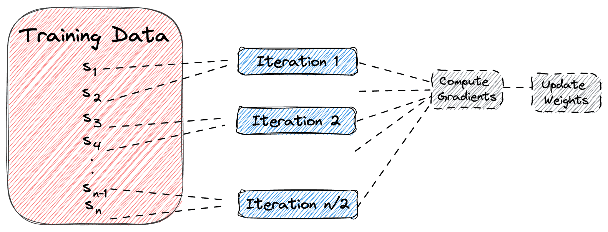

## Table of Contents

## What is Mini-Batch in the context of machine learning?

In machine learning, a mini-batch is a small subset of the entire training dataset that is used to train a model during each iteration of the learning process. Instead of using the whole dataset at once, which is known as batch learning, or using just one example at a time, known as stochastic learning, mini-batch learning strikes a balance between the two. By processing mini-batches, the model can learn more efficiently and effectively, as it can take advantage of the computational benefits of working with multiple examples while still allowing for frequent updates to the model's parameters.

The size of a mini-batch is an important hyperparameter that can affect the training speed and the model's performance. Typically, a mini-batch size can range from 10 to 1000 examples, depending on the total size of the dataset and the available computational resources. Using mini-batches helps in achieving a smoother convergence of the learning algorithm, as the model updates are based on a more representative sample of the data. This approach can also lead to better generalization, as the model is exposed to different subsets of the data throughout the training process.

## How does Mini-Batch differ from batch and stochastic gradient descent?

Mini-batch gradient descent is a middle ground between batch gradient descent and stochastic gradient descent. In batch gradient descent, you use the entire dataset to calculate the gradient and update the model's parameters in each iteration. This can be computationally expensive and slow, especially with large datasets, but it gives you a very accurate estimate of the gradient. On the other hand, stochastic gradient descent uses just one example at a time to update the model. This makes it much faster and can help the model escape local minima, but the updates can be noisy and less stable because they're based on just one example.

Mini-batch gradient descent takes a subset of the data, called a mini-batch, to calculate the gradient and update the model. This approach is faster than batch gradient descent because it doesn't use the whole dataset at once, but it's more stable than stochastic gradient descent because it uses more than one example. By choosing an appropriate mini-batch size, you can balance the speed of training with the stability of the updates. This method often leads to better performance and faster convergence compared to the other two methods.

In practice, the choice between these methods depends on the specific problem and the available computational resources. Batch gradient descent might be preferred for smaller datasets where computational resources are not a concern. Stochastic gradient descent can be useful for very large datasets where speed is crucial. Mini-batch gradient descent is often the go-to choice because it offers a good compromise, allowing for efficient use of computational resources while still providing stable and effective updates to the model.

## Why is Mini-Batch often preferred in training neural networks?

Mini-batch is often preferred in training neural networks because it balances speed and accuracy well. When you use mini-batch, you're not using the whole dataset like in batch gradient descent, so it's faster. But you're also not using just one example like in stochastic gradient descent, which can make the training process noisy. Mini-batch uses a small group of examples, which makes the updates to the [neural network](/wiki/neural-network) more stable and helps it learn better. This method can use the power of modern hardware like GPUs, which can process many examples at once, making training even faster.

Another reason mini-batch is preferred is because it helps the neural network generalize better. When you train with mini-batches, the network sees different parts of the data in each iteration. This variety helps the network learn patterns that apply to the whole dataset, not just specific examples. By adjusting the size of the mini-batch, you can find a good balance between how fast the network learns and how well it performs on new data. This flexibility makes mini-batch a popular choice for training neural networks.

## What is the typical size of a Mini-Batch and how is it chosen?

The typical size of a mini-batch can range from 10 to 1000 examples, but it often falls between 32 and 256 examples. This range works well for many types of neural networks and datasets. The choice of mini-batch size depends on several factors, like the size of the dataset, the type of model you're training, and the computational resources you have available. For example, if you're working with a small dataset, you might use smaller mini-batches to make sure the network sees different examples often. On the other hand, if you have a large dataset and powerful hardware like GPUs, you might use larger mini-batches to speed up training.

Choosing the right mini-batch size can be a bit of trial and error. You might start with a common size like 32 or 64 and then adjust it based on how your model performs. If the training is too slow, you might increase the mini-batch size to speed things up. If the model's performance is not good, you might try smaller mini-batches to help it learn better. The goal is to find a size that lets your model train quickly and still learn effectively.

## How does the choice of Mini-Batch size affect the training process and model performance?

The choice of mini-batch size can have a big impact on how fast your model trains and how well it performs. A larger mini-batch size can make training faster because it uses more examples at once, which can be good if you have a lot of data and powerful hardware. But, if the mini-batch size is too big, it might make the model's updates less frequent and less varied, which can slow down learning and make it harder for the model to find the best solution. On the other hand, a smaller mini-batch size can help the model learn more quickly and escape local minima because it sees different parts of the data more often. However, smaller mini-batches can make the training process noisier and might not use your hardware as efficiently.

Finding the right mini-batch size is important for getting the best out of your model. If you choose a size that's too small, the model might take longer to train and could have trouble generalizing to new data. If the size is too big, the model might not learn as well because it's not getting enough variety in the data it sees. A good starting point is often between 32 and 256 examples, but you might need to try different sizes to see what works best for your specific problem. By experimenting with different mini-batch sizes, you can find a balance that helps your model train quickly and perform well on new data.

## Can you explain the concept of Mini-Batch gradient descent?

Mini-batch gradient descent is a way to train [machine learning](/wiki/machine-learning) models, like neural networks, by using small groups of data called mini-batches. Instead of using the whole dataset at once, which can be slow, or just one example at a time, which can be noisy, mini-batch gradient descent uses a small group of examples. This helps the model learn faster and more smoothly. The size of the mini-batch is important and can be adjusted to find the best balance between speed and how well the model learns.

When you use mini-batch gradient descent, you take a small group of examples from your dataset and use them to calculate the gradient, which tells you how to update the model's parameters. The formula for updating the parameters using mini-batch gradient descent is $$ \theta = \theta - \eta \cdot \nabla J(\theta; \text{mini-batch}) $$, where $$ \theta $$ are the model's parameters, $$ \eta $$ is the learning rate, and $$ \nabla J(\theta; \text{mini-batch}) $$ is the gradient of the loss function calculated using the mini-batch. By using mini-batches, the model can update its parameters more often than with the whole dataset, but the updates are more stable than using just one example at a time. This method helps the model learn better and can make use of powerful hardware like GPUs to process many examples at once, making training even faster.

## What are the computational advantages of using Mini-Batch in large datasets?

Using mini-batch gradient descent on large datasets has several computational advantages. One big advantage is speed. When you use the whole dataset at once, like in batch gradient descent, it can be very slow because the computer has to process all the data every time it updates the model. With mini-batch gradient descent, you only use a small group of examples at a time, so the computer can update the model much faster. This is especially helpful when you have a lot of data because it lets you train your model more quickly.

Another advantage is that mini-batch gradient descent can use powerful hardware like GPUs more effectively. GPUs are good at doing the same thing to many pieces of data at once, which is exactly what mini-batch gradient descent does. By processing a small group of examples together, you can make the most out of your hardware and speed up the training process even more. This makes mini-batch gradient descent a good choice for training models on large datasets where speed and efficiency are important.

## How does Mini-Batch help in achieving a balance between bias and variance?

Mini-batch gradient descent helps balance bias and variance by providing a middle ground between using the entire dataset and using just one example at a time. When you use the whole dataset, like in batch gradient descent, you get a very accurate estimate of the gradient, which can lead to lower bias because the model sees all the data at once. However, this can result in higher variance because the model might overfit to the specific dataset it's trained on. On the other hand, using just one example, like in stochastic gradient descent, can introduce a lot of noise into the training process, leading to higher variance but potentially lower bias because the model is constantly adapting to new examples.

By using mini-batches, you get the benefits of both worlds. Mini-batch gradient descent reduces the variance compared to stochastic gradient descent because it uses multiple examples to calculate the gradient, making the updates more stable. At the same time, it helps keep the bias low because the model still sees different parts of the data in each iteration. This balance helps the model generalize better to new data, as it can learn from a variety of examples without overfitting to any one part of the dataset. The choice of mini-batch size is crucial in finding the right balance, as a smaller size can lead to more frequent updates and potentially lower bias, while a larger size can provide more stable updates and lower variance.

## What are some practical considerations when implementing Mini-Batch learning?

When you're setting up mini-batch learning, one important thing to think about is how big your mini-batches should be. The size of the mini-batch can make a big difference in how fast your model trains and how well it performs. If you choose a mini-batch size that's too small, your model might take longer to train and could have trouble learning from the data. But if the mini-batch size is too big, it might slow down learning because the model sees less variety in the data. A good starting point is often between 32 and 256 examples, but you might need to try different sizes to see what works best for your specific problem.

Another thing to consider is how you shuffle your data. Shuffling the data before you split it into mini-batches can help make sure your model sees different examples in each iteration. This can help the model learn better and avoid getting stuck on certain parts of the data. You can do this by using a random shuffle function before you start training. Also, make sure your hardware, like GPUs, can handle the mini-batch size you choose. GPUs are good at processing many examples at once, so using mini-batches can help you make the most out of your hardware and speed up training.

## How can Mini-Batch size impact the convergence rate of a model?

The size of a mini-batch can affect how quickly a model converges to its best performance. When you use a smaller mini-batch size, the model updates more often because it processes fewer examples at once. This can help the model learn faster and find the best solution more quickly. The formula for updating the model's parameters in mini-batch gradient descent is $$ \theta = \theta - \eta \cdot \nabla J(\theta; \text{mini-batch}) $$, where $$ \theta $$ are the model's parameters, $$ \eta $$ is the learning rate, and $$ \nabla J(\theta; \text{mini-batch}) $$ is the gradient calculated using the mini-batch. Smaller mini-batches can lead to a noisier training process, but this noise can sometimes help the model escape local minima and find a better solution.

On the other hand, using a larger mini-batch size can make the training process more stable because the model uses more examples to calculate the gradient. This can lead to smoother updates and a more consistent path to convergence. However, larger mini-batches might slow down the learning process because the model sees less variety in the data at each update. Finding the right mini-batch size is a balance between speed and stability. You might need to try different sizes to see what works best for your model and dataset.

## What are the challenges associated with Mini-Batch learning in distributed systems?

Mini-batch learning in distributed systems can face several challenges, one of which is keeping the data synchronized across different machines. When you're training a model on multiple computers, each one might be working on different mini-batches at the same time. This can make it hard to ensure that all the machines are using the same version of the model's parameters. If the updates aren't shared correctly, the model might not learn as well, and the training process could become slower or even fail.

Another challenge is dealing with the communication overhead between the machines. When you use mini-batch learning in a distributed system, the computers need to talk to each other to share updates and synchronize the model's parameters. This can take up a lot of time and slow down the training process. To make things work better, you might need to use special techniques like data parallelism, where each machine works on a different part of the data, or model parallelism, where each machine works on a different part of the model. Finding the right balance between the size of the mini-batches and how often the machines communicate can be tricky but is important for making the training process efficient.

## How can advanced techniques like learning rate scheduling be integrated with Mini-Batch learning?

Learning rate scheduling can be integrated with mini-batch learning to help the model learn better. The learning rate is how much the model changes its parameters with each update. When you use mini-batch learning, you update the model after processing each mini-batch. A learning rate schedule can change the learning rate over time, making it smaller as training goes on. This can help the model get to the best solution more smoothly. For example, you might start with a high learning rate to make big changes early on, then slowly lower it to fine-tune the model. The formula for updating the model's parameters in mini-batch learning with a learning rate $$ \eta $$ is $$ \theta = \theta - \eta \cdot \nabla J(\theta; \text{mini-batch}) $$. By adjusting $$ \eta $$ over time, you can make the training process more effective.

There are different ways to schedule the learning rate. One common method is step decay, where you lower the learning rate by a fixed amount at certain points in the training. Another method is exponential decay, where the learning rate gets smaller over time in a smooth way. You can also use adaptive methods like Adam, which change the learning rate based on how the model is doing. To use learning rate scheduling with mini-batch learning, you can set up a schedule before you start training. For example, in Python with TensorFlow, you might use code like this to set up an exponential decay schedule:

```python
import tensorflow as tf

initial_learning_rate = 0.1
decay_steps = 10000
decay_rate = 0.96

learning_rate = tf.keras.optimizers.schedules.ExponentialDecay(
    initial_learning_rate, decay_steps, decay_rate, staircase=True
)

optimizer = tf.keras.optimizers.Adam(learning_rate=learning_rate)
```

This code sets up an exponential decay schedule for the learning rate and uses it with the Adam optimizer. By integrating learning rate scheduling with mini-batch learning, you can help your model train better and reach its best performance.