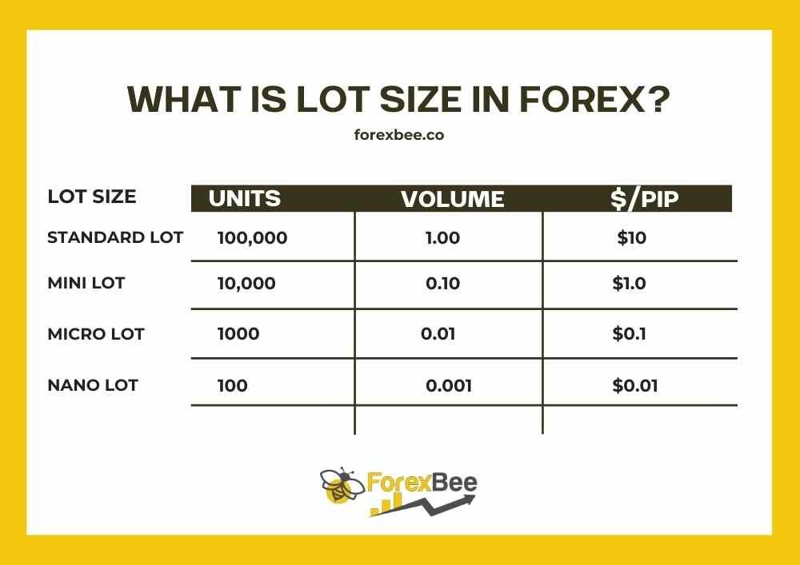

Forex trading is a highly active financial market where participants engage in buying and selling currencies. The market operates around the clock, enabling traders from different time zones to participate without interruption. A fundamental aspect of forex trading involves dealing with various lot sizes, which define the volume or size of currency trades. Understanding these lot sizes is crucial for traders to effectively manage risk and capital.

In forex trading, the most commonly referenced lot sizes are standard lots, mini lots, and micro lots. A standard lot consists of 100,000 units of the base currency. This large size requires significant capital investment and is typically more suitable for experienced traders with a higher risk tolerance. A mini lot, in comparison, is equivalent to 10,000 units of the base currency. This smaller size offers traders, especially beginners, a more accessible entry point into the market by allowing for reduced financial exposure. Lastly, a micro lot, comprising 1,000 units of the base currency, provides even more precise control over trade sizes, ideal for those looking to refine and test trading strategies with minimal risk.



The importance of understanding lot sizes cannot be overstated in forex trading. Selecting an appropriate lot size aligns with a trader's capital, risk tolerance, and strategic goals. This article focuses on mini lot forex trading, highlighting its benefits compared to other lot sizes. Additionally, it explores the integration of mini lot trading with algorithmic strategies to enhance trading efficiency and optimize outcomes.

## Table of Contents

## Understanding Mini Lots in Forex Trading

A mini lot in forex trading represents 10,000 units of the base currency. This size is precisely one-tenth of a standard lot, which stands at 100,000 units. The mini lot's smaller size makes it an attractive option for traders who might have limited capital or who prefer to engage in lower-risk trading activities.

Trading with mini lots provides several benefits, particularly in terms of risk management. Because the position sizes are smaller, traders can better manage their exposure to market fluctuations. This feature is especially advantageous for beginners who are still learning to navigate the complexities of forex trading. By trading with mini lots, they can limit their losses while gaining valuable experience in the market.

Additionally, the lower capital requirement associated with mini lots makes forex trading more accessible. Instead of needing substantial capital to participate in the forex market, traders can engage with smaller amounts of money. This lower barrier to entry provides a cost-effective way for individuals to start trading. They can gradually increase their investment as they gain confidence and experience.

For instance, if a trader wanted to buy a mini lot of EUR/USD and the current exchange rate is 1.2000, they would need 12,000 USD to open a position. The advantage here is that a 1 pip movement in a mini lot is equal to a $1 change in the trade's value, which is significantly less volatile than the $10 impact per pip in a standard lot. This reduced [volatility](/wiki/volatility-trading-strategies) can be beneficial for those who are risk-averse or new to trading. 

Overall, mini lots offer a prudent approach to [forex](/wiki/forex-system) trading, allowing traders to balance risk with the opportunity to profit from currency movements while maintaining manageable capital requirements.

## Mini Lots vs. Other Lot Sizes

In forex trading, understanding the differences between various lot sizes is essential for effective risk management and developing suitable trading strategies. Standard, mini, and micro lots are the three most common denominations that traders can use to manage their positions.

A standard lot represents 100,000 units of the base currency. This lot size is typically preferred by traders who have significant capital and experience in the forex market. Trading with standard lots offers the potential for substantial profit but also involves higher risk, as even minor market fluctuations can lead to significant gains or losses. The capital requirement for trading standard lots is higher, which may not be suitable for every trader, especially beginners or those with limited funding.

Mini lots, on the other hand, are smaller units, equivalent to one-tenth of a standard lot, or 10,000 units of the base currency. This size permits traders to manage smaller positions, offering a balance between leveraging potential and risk exposure. Mini lots are advantageous for those who wish to mitigate volatility and are a popular choice among novice traders. They provide a cost-effective entry point into forex trading with relatively lower capital requirements while still enabling traders to engage actively with the market.

Micro lots are even smaller trading units, consisting of 1,000 units of the base currency. Micro lots afford traders the most granular level of control over their trades, allowing for precise adjustments to trading strategies with minimal risk. This size is ideal for individuals who prefer to hedge minor positions or those who wish to test new strategies with minimal financial exposure.

Choosing the appropriate lot size relies on several factors, including the trader's available capital, risk tolerance, and overall trading strategy. Larger lot sizes like standard lots may offer higher returns, but at a greater risk, making them suitable for experienced traders with a robust risk management plan. Conversely, mini and micro lots offer lower risk and capital entry barriers, providing significant flexibility and control that can foster a gradual learning curve for less experienced traders. 

Understanding these distinctions allows traders to align their trading practices with their investment goals and available resources, thereby optimizing their trading performance in the forex market.

## Advantages of Mini Lot Forex Trading

Mini lot forex trading offers several advantages, particularly for those new to the forex market. One of the primary benefits is the reduced risk and volatility compared to trading with standard lots. A mini lot represents 10,000 units of the base currency, which is significantly smaller than a standard lot of 100,000 units. This smaller lot size means that price movements have a less dramatic impact on the total investment, allowing beginners to enter and learn the market environment without exposing themselves to the substantial financial risks associated with larger positions.

Trading with mini lots provides increased flexibility in managing position sizes. Traders can effectively test and refine their trading strategies without the burden of excessive financial exposure. By having smaller increments available, traders can precisely adjust their positions to align with market conditions and their personal risk management strategies. This flexibility is invaluable when experimenting with new trading methods or adjusting existing ones.

Moreover, mini lots present the opportunity for traders to leverage and scale their trades progressively as they gain more experience and confidence. As traders develop their skills and understanding of market dynamics, they can gradually increase their trade sizes, seamlessly transitioning from mini lots to standard lots if desired. This stepwise approach facilitates a smoother learning curve and can contribute to more consistent performance and improved trading outcomes over time.

In summary, the key advantages of mini lot forex trading lie in its ability to mitigate risk, provide flexibility in strategy development, and support scalable growth as traders become more proficient. These features make mini lots an attractive choice for novice traders and those looking to maintain tighter control over their trading endeavors.

## Integration of Mini Lot Trading With Algorithmic Trading

Algorithmic trading, which uses computer algorithms to execute trades based on pre-defined criteria, can significantly enhance the effectiveness of mini lot trading in the forex market. By using algorithms, traders can optimize both entry and [exit](/wiki/exit-strategy) strategies, crucial for maximizing returns and managing risk. The integration of mini lot trading with algorithmic strategies provides traders with several advantages, particularly in handling smaller trade sizes.

Algorithmic systems can analyze large datasets in real-time, identifying trends and anomalies more efficiently than human traders. This capability is especially useful in configuring strategies for mini lots, which allow traders to engage with lower capital risk due to their smaller size of 10,000 units of the base currency. The implementation of algorithms in this context means consistent performance with minimal human error, executing trades swiftly and accurately even in volatile conditions.

For instance, [algorithmic trading](/wiki/algorithmic-trading) systems can use technical indicators such as moving averages, relative strength index (RSI), and others to automate decision-making processes. Below is a simplified example using Python to implement a basic moving average crossover strategy that can be applied to mini lot trading:

```python
import pandas as pd
import numpy as np

# Sample data, you would typically use your trading platform's API to get real data
data = pd.DataFrame({
    'price': [1.1525, 1.1530, 1.1540, 1.1535, 1.1545]  # hypothetical price data
})

# Calculate moving averages
short_window = 3
long_window = 5

data['short_mavg'] = data['price'].rolling(window=short_window, min_periods=1).mean()
data['long_mavg'] = data['price'].rolling(window=long_window, min_periods=1).mean()

# Generate signals
data['signal'] = 0
data['signal'][short_window:] = np.where(data['short_mavg'][short_window:] 
                                         > data['long_mavg'][short_window:], 1, 0)

# Calculate positions
data['positions'] = data['signal'].diff()

print(data)
```

In this strategy, trades are executed when the short-term moving average crosses the long-term moving average. By using mini lots, traders can test this strategy with smaller capital sizes, reducing potential losses in case of unfavorable market movements. Additionally, the flexibility in trade sizing offered by mini lots allows algorithmic traders to fine-tune their strategies, facilitating gradual scaling as experience and confidence grow.

Moreover, the risk management aspect of using mini lots in algorithmic trading is enhanced. Since mini lots reduce the monetary impact of each trade, algorithms can take more granular market actions, executing trades at higher frequencies or adjusting positions incrementally without significant financial exposure. This agility aids in achieving controlled and consistent trading outcomes, even in diverse market conditions.

Overall, the integration of mini lot trading with algorithmic strategies offers a strategic advantage by marrying the granularity and flexibility of mini lots with the precision and computational power of algorithmic systems. This synergy supports traders in leveraging technology to improve performance, minimize risk, and capitalize on forex market opportunities.

## Tips for Trading Mini Lots Successfully

Successful trading with mini lots in forex requires a strategic approach to manage risk while optimizing profits. Developing a clear trading plan is essential. This involves setting specific goals, identifying entry and exit points, and determining the amount of capital to allocate for each trade. Effective risk management tools, such as stop-loss and take-profit orders, should be integrated to limit potential losses. A disciplined approach ensures that you are not swayed by market volatility and stick to your trading plan.

Utilizing trading platforms and tools to simulate and back-test strategies is another vital aspect. Many platforms offer demo accounts where you can practice mini lot trading without financial risk. This allows traders to test their strategies in real-time market conditions, making necessary adjustments before applying them in actual trading. Tools such as MetaTrader 4 or 5 provide traders with the ability to analyze historical data, evaluate the performance of their trading plan, and refine strategies accordingly.

Being continuously educated about market trends and trading strategies is crucial for enhancing trading skills. The forex market is highly dynamic, influenced by geopolitical events, economic indicators, and monetary policies. Staying updated on these factors helps traders anticipate market movements and adjust their strategies as needed. Engaging in educational activities, such as reading forex market analyses, attending webinars, and participating in trading forums, can provide valuable insights and foster better trading decisions.

Overall, the combination of a well-defined trading plan, the effective use of trading platforms for simulation, and a commitment to ongoing education can significantly improve the success rate of trading mini lots in the forex market.

## Conclusion

Mini lot forex trading offers a strategic avenue for those prioritizing lower risk and enhanced flexibility in their trading approaches. One of the key benefits of engaging with mini lots is the empowerment it provides to traders by allowing a nuanced understanding and application of different lot sizes. This enables traders to make informed decisions tailored to their specific risk appetites and investment goals. The ability to choose appropriately between mini lots, micro lots, and standard lots is crucial for customizing trading strategies effectively in alignment with one's financial capabilities and risk management preferences.

Furthermore, the integration of algorithmic trading with mini lot trading streamlines operational efficiency and strategic implementation, making it an attractive option for traders. Algorithmic trading facilitates the optimization of entry and exit points within trading strategies, effectively managing risks associated with forex trading. The automation offered by algorithmic systems minimizes human errors and biases, thus enhancing consistency in trading performance. Employing mini lot sizes within algorithmic frameworks offers an additional layer of risk mitigation, providing traders the opportunity to fine-tune their strategies with minimal financial exposure.

Overall, mini lot forex trading, when combined with algorithmic advancements, signifies a compelling approach for exploring the forex market efficiently. It calls for a judicious understanding and application of various trading tools and strategies, equipping traders with a powerful method to navigate the complexities of the forex landscape while maintaining a firm grip on their exposure and potential risks.

## References & Further Reading

[1]: ["Forex Trading: A Beginner's Guide"](https://www.investing.com/brokers/guides/forex/forex-trading-for-beginners-a-beginners-guide-to-currency-markets/) by Jean Folger on Investopedia.

[2]: ["Algorithmic Trading: Winning Strategies and Their Rationale"](https://books.google.com/books/about/Algorithmic_Trading.html?id=WAlFDwAAQBAJ) by Ernie Chan.

[3]: ["Technical Analysis of the Currency Market: Classic Techniques for Profiting from Market Swings and Trader Sentiment"](https://onlinelibrary.wiley.com/doi/book/10.1002/9781119201496) by Boris Schlossberg.

[4]: ["Forex Trading Using Intermarket Analysis: Discovering Hidden Market Relationships that Provide Early Clues for Price Direction"](https://archive.org/details/forextradingusin0000mend) by Louis B. Mendelsohn.

[5]: ["The Basics of Forex Trading"](https://www.forextime.com/education/forex-trading-for-beginners) on FXCM Insights.