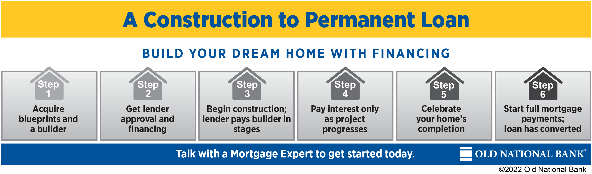

## Table of Contents

## What is a mini-perm loan?

A mini-perm loan is a type of short-term loan that businesses or real estate developers use to finish building a project. It's called "mini-perm" because it's a smaller, temporary loan that helps until a permanent loan can be secured. Usually, it lasts from three to five years. This loan helps the borrower finish the project and start making money from it before they need to get a long-term loan.

After the project is done and making money, the borrower uses the mini-perm loan to show banks or lenders that the project is successful. This makes it easier to get a permanent loan. The mini-perm loan acts like a bridge, helping the borrower move from construction to long-term financing. It's a helpful tool for developers who need a bit more time to prove their project's worth before getting a bigger, long-term loan.

## What is a construction loan?

A construction loan is a short-term loan that helps people or businesses build a new home, building, or project. It's different from a regular loan because the money is given out in stages as the construction work gets done. This way, the lender can make sure the project is moving forward before they give more money.

Once the construction is finished, the borrower usually needs to get a different loan to pay off the construction loan. This new loan is called a permanent loan or a take-out loan. The construction loan helps cover the costs of building until the project is done and ready to be used or sold.

## How do mini-perm loans differ from construction loans?

Mini-perm loans and construction loans both help with building projects, but they are used at different times and for different reasons. A construction loan is used during the building process. It gives money in stages as the work gets done. This loan helps pay for the costs of building until the project is finished. Once the building is done, the construction loan needs to be paid back, usually with a permanent loan.

A mini-perm loan comes in after the construction loan. It's a short-term loan that lasts about three to five years. The mini-perm loan helps the borrower finish the project and start making money from it. It acts like a bridge between the construction loan and a long-term loan. The borrower uses the mini-perm loan to show that the project is successful and making money, which makes it easier to get a permanent loan later.

In simple terms, a construction loan is for building, and a mini-perm loan is for the time right after building, helping the project become stable and profitable before getting a long-term loan.

## What are the typical terms and conditions of a mini-perm loan?

A mini-perm loan usually lasts from three to five years. It's a short-term loan that helps after a construction loan. The [interest rate](/wiki/interest-rate-trading-strategies) can be fixed or change over time. Lenders might ask for a down payment, which is a part of the total loan amount that the borrower pays upfront. The loan amount depends on how much the project is worth and how much money it's expected to make.

Lenders want to make sure the project will be successful, so they look at things like the project's plans, how much money it will make, and the borrower's credit history. They might also ask for regular reports on how the project is doing. If the borrower doesn't pay back the loan on time, the lender can take the property. The goal of a mini-perm loan is to help the project become stable and profitable, so the borrower can get a long-term loan later.

## What are the typical terms and conditions of a construction loan?

A construction loan is a short-term loan that helps pay for building a new home or project. It usually lasts from six months to three years. The interest rate can be fixed or change over time. Lenders give out the money in stages as the work gets done. This way, they can check the progress before giving more money. The borrower might need to pay a down payment, which is a part of the total loan amount paid upfront. The loan amount depends on how much the project will cost and how much it's expected to be worth when finished.

Lenders want to make sure the project will be successful, so they look at things like the project's plans, the builder's experience, and the borrower's credit history. They might ask for regular reports on how the construction is going. If the borrower doesn't pay back the loan on time, the lender can take the property. Once the building is done, the construction loan needs to be paid back, usually with a permanent loan. This new loan helps the borrower keep the property and start making money from it.

## In what scenarios would a borrower choose a mini-perm loan over a construction loan?

A borrower would choose a mini-perm loan over a construction loan when they have already finished building their project and need a short-term loan to help them until they can get a long-term loan. The mini-perm loan helps the borrower show that their project is making money and is successful. This makes it easier to get a permanent loan later. For example, if a developer has just finished building an apartment building, they might use a mini-perm loan to cover costs and prove the building can make money before getting a long-term loan.

Another scenario is when a borrower needs more time to stabilize their project before getting a permanent loan. A mini-perm loan gives them three to five years to do this. During this time, they can work on getting tenants, fixing any problems, and making sure the project is running smoothly. This extra time can be very helpful for projects that need a bit more work before they are ready for a long-term loan.

## What are the interest rates like for mini-perm loans compared to construction loans?

Interest rates for mini-perm loans and construction loans can be different. Both types of loans can have fixed or variable interest rates. Fixed rates stay the same for the whole loan, while variable rates can change over time. Usually, mini-perm loans have slightly higher interest rates than construction loans because they are riskier for lenders. The lender is giving money to a project that is already built but not yet stable, so they want a higher return to cover that risk.

Construction loans often have lower interest rates because the lender is giving money to a project that is still being built. The lender can check the progress of the construction and stop giving money if things go wrong. This makes construction loans less risky for the lender, so the interest rates are usually lower. But, the exact interest rates can change depending on things like the borrower's credit, the project's value, and the economy.

## How does the repayment structure of mini-perm loans compare to construction loans?

The repayment structure for mini-perm loans is different from construction loans. With a mini-perm loan, the borrower usually starts making regular payments after they get the loan. These payments can be for both the interest and part of the loan amount, or just the interest. The goal is to pay off the mini-perm loan within three to five years, showing the project is doing well and can get a long-term loan.

Construction loans have a different repayment structure. During the building time, the borrower often only pays the interest on the money they have used so far. The full loan amount doesn't need to be paid back until the building is done. Once the project is finished, the borrower usually pays off the construction loan with a permanent loan. This means the repayment structure of a construction loan is more flexible during the building time but needs a big payment at the end.

## What are the common uses of mini-perm loans in real estate development?

Mini-perm loans are often used in real estate development to help projects move from the building stage to being stable and making money. Developers use these loans after they finish building, like an apartment building or a shopping center. The mini-perm loan gives them a few years to get tenants, fix any problems, and make sure the project is running smoothly. This time helps the project become successful and ready for a long-term loan.

Another common use of mini-perm loans is to help developers show that their project is making money. Lenders want to see that a project is doing well before they give a long-term loan. With a mini-perm loan, developers can prove the project's worth over three to five years. This makes it easier to get a permanent loan later, which is important for keeping the property and continuing to make money from it.

## How do the approval processes and criteria differ between mini-perm loans and construction loans?

The approval process for a construction loan focuses on the building project itself. Lenders look at the project's plans, the builder's experience, and the borrower's credit history. They want to make sure the project will be built on time and within budget. Lenders also check the property's value when it's finished to see if it will be worth enough to pay back the loan. During the building time, lenders give out money in stages, checking the progress before giving more money. This helps them control the risk of the loan.

For a mini-perm loan, the approval process looks at how the project is doing after it's built. Lenders want to see that the project is making money and is stable. They check the project's income, how much it's worth now, and the borrower's ability to pay back the loan. The mini-perm loan helps the borrower show that the project is successful over a few years. This makes it easier to get a long-term loan later. The lender's focus is on the project's current performance and future potential, rather than just the building plans.

## What are the potential risks and benefits associated with using mini-perm loans versus construction loans?

Using mini-perm loans has some risks and benefits. One risk is that the interest rates might be higher than construction loans because lenders see them as riskier. If the project doesn't make money or has problems, it can be hard to pay back the mini-perm loan. Another risk is that if the project doesn't become stable and profitable in a few years, it might be hard to get a long-term loan later. But, there are also benefits. Mini-perm loans give developers time to fix any issues and make sure the project is running well. This extra time can help the project become successful and make it easier to get a permanent loan.

Construction loans also have risks and benefits. A big risk is that if the project runs out of money or faces delays, the lender might stop giving money, and the project could fail. Another risk is that the project might not be worth enough when it's finished to pay back the loan. But, construction loans have benefits too. They help cover the costs of building and give money in stages, so lenders can check the progress. This can make it easier to manage the project and keep it on track. Once the building is done, the borrower can use a permanent loan to pay off the construction loan and start making money from the project.

## Can you provide case studies or examples where mini-perm loans were more advantageous than construction loans?

A real estate developer in a growing city finished building a new apartment complex. They used a construction loan to build it, but they needed more time to get tenants and make sure the building was running well. They chose a mini-perm loan because it gave them three years to do this. During this time, they fixed some small problems and filled most of the apartments. By the end of the mini-perm loan, the building was making good money. This made it easy for them to get a long-term loan. If they had gone straight from the construction loan to a permanent loan, they might not have been able to show the building was successful.

Another example is a shopping center project in a small town. The developer used a construction loan to build the center, but they knew it would take time to get enough stores to move in. They got a mini-perm loan to give them four years to fill the center and make it profitable. During this time, they worked hard to attract businesses and make the center a popular place to shop. By the end of the mini-perm loan, the shopping center was doing well and making money. This made it much easier to get a long-term loan. Without the mini-perm loan, they might have struggled to show the center was successful enough for a permanent loan.

## References & Further Reading

[1]: Geltner, D., Miller, N., Clayton, J., & Eichholtz, P. (2014). ["Commercial Real Estate Analysis & Investments."](https://www.researchgate.net/publication/245702364_Commercial_Real_Estate_Analysis_and_Investments) South-Western Educational Publishing.

[2]: Fabozzi, F. J., Shiller, R. J., & Tunaru, R. (2010). ["Real Estate Finance: Theory and Practice."](http://aida.econ.yale.edu/~shiller/pubs/property-derivatives2010.pdf) Wiley-Blackwell.

[3]: Linneman, P. (2011). ["Real Estate Finance and Investments: Risks and Opportunities."](https://www.amazon.com/Real-Estate-Finance-Investments-Opportunities/dp/1792377134) Linneman Associates.

[4]: Elder, A. (2002). ["Come Into My Trading Room: A Complete Guide to Trading."](https://www.amazon.com/Come-Into-My-Trading-Room/dp/0471225347) Wiley Trading.

[5]: Harris, C. K. (2012). ["Real Estate Market Analysis: Methods and Case Studies, Second Edition."](https://www.amazon.com/Real-Estate-Market-Analysis-Methods/dp/0874203651) Urban Land Institute.