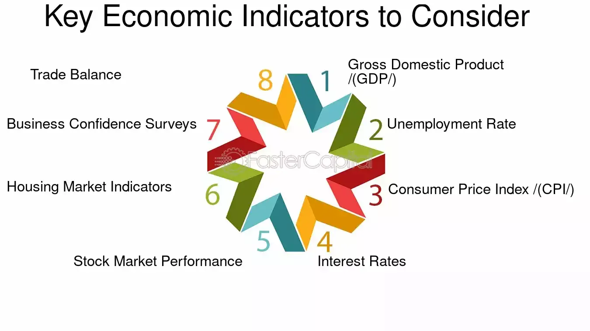

## Table of Contents

## What are Mini-Sized Dow Options?

Mini-Sized Dow Options are financial contracts that let people bet on where they think the Dow Jones Industrial Average (DJIA) will go. The DJIA is a big stock market index that shows how well 30 large companies in the U.S. are doing. These options are called "mini-sized" because they are smaller than regular Dow options, making them cheaper and easier for more people to trade.

These options can be used for different reasons. Some people use them to try to make money by guessing if the DJIA will go up or down. Others use them to protect their investments from big losses if the market goes down. Mini-Sized Dow Options are popular because they give people a way to get involved with the stock market without needing a lot of money to start.

## How do Mini-Sized Dow Options differ from standard Dow Options?

Mini-Sized Dow Options and standard Dow Options both let you bet on where the Dow Jones Industrial Average (DJIA) is heading, but they are different in size and cost. Mini-Sized Dow Options are smaller. This means they control fewer points of the DJIA than the standard options. Because they are smaller, they cost less to trade. This makes them more affordable for people who don't have a lot of money to spend on trading.

The smaller size of Mini-Sized Dow Options also means they can be a good choice for people who want to try out trading without risking too much money. They allow for more flexibility in trading strategies because you can buy more of them for the same amount of money compared to standard options. On the other hand, standard Dow Options, being larger, are often used by big investors or institutions that can handle bigger trades and the higher costs that come with them.

## What is the underlying asset for Mini-Sized Dow Options?

The underlying asset for Mini-Sized Dow Options is the Dow Jones Industrial Average (DJIA). The DJIA is a famous stock market index that tracks how well 30 big companies in the United States are doing. These companies come from different industries, like technology, finance, and healthcare. The DJIA is used as a way to see how the overall stock market is performing.

When you trade Mini-Sized Dow Options, you're not buying the actual stocks of these 30 companies. Instead, you're betting on whether the DJIA will go up or down. The value of your options will change based on the movements of the DJIA. This makes Mini-Sized Dow Options a way to get involved with the stock market without directly buying or selling stocks.

## What are the contract specifications for Mini-Sized Dow Options?

Mini-Sized Dow Options are financial contracts that track the Dow Jones Industrial Average (DJIA). Each contract represents 5 times the value of the DJIA, which is much smaller than the standard Dow Options that represent 10 times the DJIA. This smaller size makes Mini-Sized Dow Options more affordable for people who want to trade without spending a lot of money. The options are traded in points, and each point is worth $5. So, if the DJIA moves by 1 point, the value of one Mini-Sized Dow Option changes by $5.

These options expire on the third Friday of the contract month, which can be March, June, September, or December. They are settled in cash, meaning you don't have to buy or sell any actual stocks when the option expires. Instead, you get paid in cash based on the difference between the DJIA's value at expiration and the price you paid for the option. Trading Mini-Sized Dow Options happens on the Chicago Board Options Exchange (CBOE), and they are available during regular market hours, from 9:30 AM to 4:00 PM Eastern Time, Monday through Friday.

## How can Mini-Sized Dow Options be used for hedging?

Mini-Sized Dow Options can be used for hedging to protect investments from big losses if the stock market goes down. If you own stocks or other investments that might lose value when the Dow Jones Industrial Average (DJIA) drops, you can buy Mini-Sized Dow Options to help reduce your risk. For example, if you think the market might go down, you can buy a put option. This gives you the right to sell the DJIA at a certain price, even if the market goes lower. If the DJIA does go down, the value of your put option will go up, which can help offset the losses in your other investments.

Using Mini-Sized Dow Options for hedging is a smart way to manage risk because they are smaller and cheaper than regular Dow Options. This makes it easier for people with smaller investment portfolios to use them for protection. By buying these options, you're not locked into selling your investments at a loss. Instead, you have a safety net that can help you stay calm during market downturns. This can be especially useful if you need to keep your investments for a long time and want to avoid selling them at the wrong time.

## What are the trading hours for Mini-Sized Dow Options?

Mini-Sized Dow Options are traded during regular market hours. This means you can buy and sell them from 9:30 AM to 4:00 PM Eastern Time, Monday through Friday. These hours match the trading times for the stock market, so it's easy to keep track of when you can trade.

The trading hours are set this way to give everyone a fair chance to trade. If you want to use Mini-Sized Dow Options to bet on where the Dow Jones Industrial Average is going or to protect your investments, you need to make your trades during these times. Knowing the exact hours helps you plan your trading strategy better.

## What are the advantages of trading Mini-Sized Dow Options over other financial instruments?

Trading Mini-Sized Dow Options has several advantages over other financial instruments. One big advantage is that they are smaller and cheaper than regular Dow Options. This means you can start trading with less money, making it easier for more people to get involved in the stock market. Because they are less expensive, you can buy more Mini-Sized Dow Options for the same amount of money you would spend on larger options or other investments. This can give you more flexibility in how you trade and manage your investments.

Another advantage is that Mini-Sized Dow Options let you bet on the whole Dow Jones Industrial Average instead of just one stock. This can be less risky than picking individual stocks because you're spreading your bet across 30 big companies. If you're worried about the market going down, you can use these options to protect your other investments. They are settled in cash, so you don't have to worry about actually buying or selling stocks when the options expire. This makes them a simple and effective way to hedge against market downturns.

## How does the pricing of Mini-Sized Dow Options work?

The pricing of Mini-Sized Dow Options is based on how the Dow Jones Industrial Average (DJIA) is expected to move. Each Mini-Sized Dow Option contract represents 5 times the value of the DJIA, and each point of the DJIA is worth $5. So, if the DJIA goes up by 1 point, the value of one Mini-Sized Dow Option goes up by $5. The price you pay for an option, called the premium, depends on several things, like how long until the option expires, how much the DJIA is expected to move, and whether the market thinks the DJIA will go up or down.

When you buy a Mini-Sized Dow Option, you're not buying the actual stocks in the DJIA. Instead, you're buying the right to bet on where the DJIA will be at a certain time in the future. If you think the DJIA will go up, you can buy a call option, which lets you benefit if the DJIA rises. If you think it will go down, you can buy a put option, which helps you if the DJIA falls. The cost of these options changes all the time, based on what traders think will happen to the DJIA. This makes trading Mini-Sized Dow Options a way to try to make money or protect your investments, depending on your strategy.

## What are the key strategies for trading Mini-Sized Dow Options?

One key strategy for trading Mini-Sized Dow Options is using them to bet on the direction of the Dow Jones Industrial Average (DJIA). If you think the DJIA will go up, you can buy a call option. This gives you the right to benefit if the DJIA rises above a certain price before the option expires. If you think the DJIA will go down, you can buy a put option. This helps you make money if the DJIA falls below a certain price. By choosing the right kind of option, you can try to make a profit based on your guess about where the market is headed.

Another strategy is using Mini-Sized Dow Options for hedging. If you have other investments that might lose value if the stock market goes down, you can buy put options to protect yourself. For example, if you own stocks and the DJIA drops, the value of your put options will go up, which can help offset the losses in your stocks. This way, you're not locked into selling your investments at a loss. Instead, you have a safety net that can help you stay calm during market downturns. This can be especially useful if you need to keep your investments for a long time and want to avoid selling them at the wrong time.

A third strategy is to use Mini-Sized Dow Options for income generation. You can sell options to other traders who want to buy them. If you sell a call option and the DJIA doesn't go above the price you set, you keep the money you got from selling the option. If you sell a put option and the DJIA doesn't fall below the price you set, you also keep the money. This can be a way to earn extra income, but it comes with risks because you might have to buy or sell the DJIA at a loss if the market moves against you.

## How do market conditions affect Mini-Sized Dow Options?

Market conditions can have a big impact on Mini-Sized Dow Options. If the stock market is going up and people think it will keep going up, the price of call options will go up because more people want to buy them. On the other hand, if the market is going down and people think it will keep going down, the price of put options will go up because more people want to buy them to protect their investments. The more the market moves, the more the options prices change. This is because options are all about betting on where the market will go, so big moves in the market make the options more exciting and valuable.

Volatility, or how much the market goes up and down, also affects Mini-Sized Dow Options. When the market is very volatile, the prices of options go up because there's a bigger chance the DJIA will move a lot. This makes the options more valuable because they give you a bigger chance to make money if the market moves in the direction you bet on. On the other hand, if the market is calm and not moving much, the prices of options might go down because there's less chance of big moves. So, understanding how the market is behaving can help you decide when to buy or sell Mini-Sized Dow Options.

## What are the risks associated with trading Mini-Sized Dow Options?

Trading Mini-Sized Dow Options comes with several risks. One big risk is losing money. If you buy a call option and the DJIA doesn't go up like you thought it would, the option can lose all its value, and you lose the money you paid for it. The same thing happens if you buy a put option and the DJIA doesn't go down. Options can be very risky because they can lose all their value if the market doesn't move the way you expect.

Another risk is the effect of market volatility. If the market moves a lot, the price of options can change quickly. This can be good if the market moves in your favor, but it can also be bad if it moves against you. The more the market moves, the more your options can lose value. Also, options have an expiration date, so if the market doesn't move in time, your options can expire worthless, and you lose your investment.

## How can one analyze the performance of Mini-Sized Dow Options over time?

To analyze the performance of Mini-Sized Dow Options over time, you can look at how the price of the options changes compared to the Dow Jones Industrial Average (DJIA). If you bought a call option and the DJIA went up, you would want to see if the value of your option went up too. You can do this by keeping track of the price of your option from when you bought it until it expires or you sell it. You can also look at charts and graphs that show the price of the DJIA and your options over time. This helps you see if your guesses about the market were right and if you made or lost money.

Another way to analyze the performance is by looking at how much money you made or lost on your options trades. You can keep a record of all your trades, including how much you paid for each option and how much you got when you sold it or when it expired. By adding up all your wins and losses, you can see if you did well overall. This kind of analysis can help you learn from your past trades and make better decisions in the future. It's important to remember that options trading can be risky, so looking at your performance over time can help you understand those risks better.

## What are the key concepts in option pricing?

Pricing options is a fundamental aspect of options trading, involving sophisticated models and analysis to determine the fair value of an options contract. In the context of Mini-Sized Dow options, understanding the pricing mechanism is crucial given the specific characteristics of these financial instruments.

Volatility plays a pivotal role in option pricing, representing the price fluctuations of the underlying asset—in this case, the Dow Jones Industrial Average (DJIA). When [volatility](/wiki/volatility-trading-strategies) is high, the potential for larger price swings increases, leading to a higher premium on options due to the greater likelihood of significant movement in either direction. Traders typically measure volatility using metrics such as historical volatility or the Volatility Index (VIX), which can significantly influence the price of Mini-Sized Dow options.

Time decay, or theta, is another critical component in option pricing. As options near their expiration date, they tend to lose value, a phenomenon known as time decay. This aspect is particularly relevant for options traders, as it affects the strategy around when to buy or sell an options contract. The closer an option is to expiration, the more rapidly its extrinsic value diminishes, affecting both long and short positions in the market.

Intrinsic value is the inherent value of an option if it were exercised today, calculated as the difference between the current price of the underlying asset and the strike price of the option. For Mini-Sized Dow options, this is determined by the DJIA's current level relative to the option’s strike price. If an option is "in the money," it holds intrinsic value; otherwise, its value is primarily extrinsic, driven by volatility and time decay.

The Black-Scholes model is a widely used method for calculating European-style options prices, including Mini-Sized Dow options, which may closely adhere to this structure. The model integrates factors such as the current price of the underlying asset, strike price, time to expiration, risk-free [interest rate](/wiki/interest-rate-trading-strategies), and volatility to derive an option's theoretical price. The Black-Scholes formula is represented as:

$$
C = S_0 N(d_1) - X e^{-rT} N(d_2)
$$

$$
d_1 = \frac{\ln(S_0/X) + (r + \sigma^2/2)T}{\sigma \sqrt{T}}
$$

$$
d_2 = d_1 - \sigma \sqrt{T}
$$

Where:
- $C$ is the call option price.
- $S_0$ is the current stock price.
- $X$ is the strike price.
- $T$ is the time to expiration.
- $r$ is the risk-free interest rate.
- $\sigma$ is the volatility of the stock.
- $N(\cdot)$ is the cumulative distribution function of the standard normal distribution.

The Greeks, such as delta, gamma, and theta, quantify the sensitivity of the option's price to factors like price changes in the underlying asset or the passage of time. Delta measures the rate of change of the option's price with respect to changes in the underlying asset's price, while gamma indicates the rate of change of delta itself, reflecting the curvature of the delta function. These metrics are instrumental in managing the risks associated with options trading.

Accurate option pricing also depends on assessing market conditions and historical data to inform predictions. By analyzing past price action and market trends, traders can make informed decisions about future potential movements, enhancing the precision of pricing models for Mini-Sized Dow options. Employing models like Black-Scholes alongside the Greeks equips traders to navigate the complexities of these financial products effectively, optimizing their strategies in response to changing market dynamics.

## References & Further Reading

[1]: Black, F., & Scholes, M. (1973). ["The Pricing of Options and Corporate Liabilities."](https://www.cs.princeton.edu/courses/archive/fall09/cos323/papers/black_scholes73.pdf) The Journal of Political Economy, 81(3), 637-654.

[2]: Hull, J. C. (2018). ["Options, Futures, and Other Derivatives."](https://www.semanticscholar.org/paper/Options%2C-Futures%2C-and-Other-Derivatives-Hull/89bdee500c8623864fc9eb7a471546aa713acc44) Pearson Education.

[3]: Geman, H. (2005). ["Commodities and Commodity Derivatives: Modelling and Pricing for Agriculturals, Metals and Energy."](https://download.e-bookshelf.de/download/0000/5675/90/L-G-0000567590-0015270354.pdf) Wiley Finance.

[4]: Aldridge, I. (2013). ["High-Frequency Trading: A Practical Guide to Algorithmic Strategies and Trading Systems."](https://www.amazon.com/High-Frequency-Trading-Practical-Algorithmic-Strategies/dp/1118343506) Wiley.

[5]: Chan, E. P. (2009). ["Quantitative Trading: How to Build Your Own Algorithmic Trading Business."](https://github.com/ftvision/quant_trading_echan_book) Wiley.