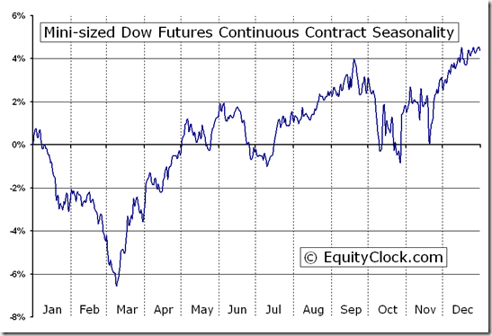

In the dynamic world of finance, trading options on indices such as the Mini-Sized Dow presents numerous opportunities for both traders and investors. These derivative instruments provide a versatile platform for speculating on the movements of the Dow Jones Industrial Average (DJIA), allowing engagement with the market using a smaller capital outlay compared to traditional options.

Options trading is inherently complex due to the multitude of factors influencing the pricing and performance of options contracts. Factors like volatility, time decay, and intrinsic value are essential components in determining an option's price, making it imperative for traders to possess a comprehensive understanding of these elements. However, the complexity of options trading can be significantly mitigated through the use of algorithms. Algorithmic trading employs advanced computer programs to automate trading strategies based on pre-defined rules, enhancing trading efficiency and reducing the likelihood of human error.



This article focuses on the intricacies of option pricing with emphasis on Mini-Sized Dow options, discussing the application of algorithmic trading strategies to these particular financial instruments. Algorithmic approaches enable the systematic analysis of vast datasets, facilitating more informed decision-making by identifying and exploiting market opportunities that may be otherwise overlooked by human traders. By understanding and utilizing these strategies, traders are equipped with the necessary tools to maximize potential gains and navigate the challenges of market volatility more effectively.

With technological advancements continuously reshaping the landscape of financial markets, embracing algorithm-driven trading models is becoming increasingly critical for those looking to achieve success. This article aims to provide insight into these concepts, offering a foundation from which traders and investors can build robust trading strategies tailored to Mini-Sized Dow options. As the financial environment evolves, mastering these tools not only opens the door to immediate opportunities but also lays the groundwork for sustained financial success in the future.

## Table of Contents

## Understanding Mini-Sized Dow Options

Mini-Sized Dow options are a type of derivative contract linked to the Dow Jones Industrial Average (DJIA), a prominent stock market index in the United States that tracks 30 large publicly-owned companies. These options empower traders to speculate on the movements of the DJIA with a reduced capital requirement compared to full-sized options, catering to those looking for cost-effective entry points into the market.

The primary advantage of Mini-Sized Dow options is their smaller contract size, which is typically one-fifth the size of standard Dow options. This peculiarity allows for more granular position sizing and risk management, making them an ideal choice for individual traders and smaller investment portfolios. By allowing trades at a smaller scale, these options mirror the movements of the DJIA, while minimizing the financial commitment and potential risk.

Mini-Sized Dow options offer versatility through multiple strategic functions. Traders can engage in speculative activities, banking on market movements without owning the underlying assets. Alternatively, these options serve as tools for hedging, providing protection against unfavorable shifts in the index. The ability to either hedge existing portfolios or speculate on the index's future direction grants traders strategic flexibility.

Understanding the mechanics of trading these options is crucial. Each Mini-Sized Dow option contract represents the opportunity to trade the DJIA index options with reduced exposure. Traders pay a premium for these options, which gives them the right, though not the obligation, to buy (call options) or sell (put options) at a predetermined price (strike price) before the option expires. Should the index's market price exceed the strike price at expiration for a call option, or fall below it for a put option, the option can be exercised for profit.

Contract specifications include details such as the expiration date, strike price, and type of option (call or put). The expiration cycle for Mini-Sized Dow options typically follows the standard options calendar, which can include monthly, weekly, and quarterly expiration terms, providing various opportunities for alignment with market strategies.

Understanding the structure and benefits of Mini-Sized Dow options equips traders with essential insights for effective trading, allowing them to tailor their approaches to capitalize on the unique opportunities these financial instruments present within the broader options trading landscape.

## Key Concepts in Option Pricing

Pricing options is a fundamental aspect of options trading, involving sophisticated models and analysis to determine the fair value of an options contract. In the context of Mini-Sized Dow options, understanding the pricing mechanism is crucial given the specific characteristics of these financial instruments.

Volatility plays a pivotal role in option pricing, representing the price fluctuations of the underlying asset—in this case, the Dow Jones Industrial Average (DJIA). When [volatility](/wiki/volatility-trading-strategies) is high, the potential for larger price swings increases, leading to a higher premium on options due to the greater likelihood of significant movement in either direction. Traders typically measure volatility using metrics such as historical volatility or the Volatility Index (VIX), which can significantly influence the price of Mini-Sized Dow options.

Time decay, or theta, is another critical component in option pricing. As options near their expiration date, they tend to lose value, a phenomenon known as time decay. This aspect is particularly relevant for options traders, as it affects the strategy around when to buy or sell an options contract. The closer an option is to expiration, the more rapidly its extrinsic value diminishes, affecting both long and short positions in the market.

Intrinsic value is the inherent value of an option if it were exercised today, calculated as the difference between the current price of the underlying asset and the strike price of the option. For Mini-Sized Dow options, this is determined by the DJIA's current level relative to the option’s strike price. If an option is "in the money," it holds intrinsic value; otherwise, its value is primarily extrinsic, driven by volatility and time decay.

The Black-Scholes model is a widely used method for calculating European-style options prices, including Mini-Sized Dow options, which may closely adhere to this structure. The model integrates factors such as the current price of the underlying asset, strike price, time to expiration, risk-free [interest rate](/wiki/interest-rate-trading-strategies), and volatility to derive an option's theoretical price. The Black-Scholes formula is represented as:

$$
C = S_0 N(d_1) - X e^{-rT} N(d_2)
$$

$$
d_1 = \frac{\ln(S_0/X) + (r + \sigma^2/2)T}{\sigma \sqrt{T}}
$$

$$
d_2 = d_1 - \sigma \sqrt{T}
$$

Where:
- $C$ is the call option price.
- $S_0$ is the current stock price.
- $X$ is the strike price.
- $T$ is the time to expiration.
- $r$ is the risk-free interest rate.
- $\sigma$ is the volatility of the stock.
- $N(\cdot)$ is the cumulative distribution function of the standard normal distribution.

The Greeks, such as delta, gamma, and theta, quantify the sensitivity of the option's price to factors like price changes in the underlying asset or the passage of time. Delta measures the rate of change of the option's price with respect to changes in the underlying asset's price, while gamma indicates the rate of change of delta itself, reflecting the curvature of the delta function. These metrics are instrumental in managing the risks associated with options trading.

Accurate option pricing also depends on assessing market conditions and historical data to inform predictions. By analyzing past price action and market trends, traders can make informed decisions about future potential movements, enhancing the precision of pricing models for Mini-Sized Dow options. Employing models like Black-Scholes alongside the Greeks equips traders to navigate the complexities of these financial products effectively, optimizing their strategies in response to changing market dynamics.

## Algorithmic Trading in Options

Algorithmic trading employs sophisticated computer programs to execute trades based on pre-defined rules. These algorithms are designed to optimize trading efficiency by reducing costs, minimizing human errors, and allowing for the rapid analysis of large datasets to identify profitable opportunities. The use of algorithms is particularly advantageous in the trading of Mini-Sized Dow options, where they can enhance decision-making by optimizing strategies based on real-time price movements and market conditions.

One of the primary benefits of [algorithmic trading](/wiki/algorithmic-trading) is its ability to process extensive data sets much faster than a human trader. This capability allows for the instantaneous detection of [arbitrage](/wiki/arbitrage) opportunities and the rapid adjustment of trading strategies to reflect market changes. In the context of Mini-Sized Dow options, algorithms can continuously monitor the Dow Jones Industrial Average for fluctuations that might indicate profitable trading moments.

Various algorithmic strategies are employed in options trading, each with unique advantages. Some common algorithmic trading strategies include:

1. **Trend Following Algorithms**: These algorithms attempt to capture gains through the analysis of an asset's momentum in a particular direction. For Mini-Sized Dow options, a simple moving average (SMA) or an exponential moving average (EMA) might be used to identify the start of a new trend.

2. **Market Making Algorithms**: These algorithms provide liquidity to the market by continuously buying and selling assets on the exchange. By quoting both a buy and a sell price, they profit from the spread between the two. This strategy can stabilize prices and reduce volatility.

3. **Arbitrage Algorithms**: Arbitrage opportunities arise when there is a price discrepancy between related markets or assets. For example, if the Mini-Sized Dow options price is misaligned with the underlying index, an arbitrage algorithm could capitalize on this difference.

4. **Statistical Arbitrage**: These strategies use statistical methods and data mining to identify price discrepancies and predict future movements. They rely heavily on historical data and statistical models.

5. **Machine Learning-Based Algorithms**: These algorithms use machine learning models to predict price movements based on patterns recognized in historical data. Techniques such as neural networks, decision trees, or reinforcement learning can be applied to Mini-Sized Dow options to enhance predictive accuracy.

Here is a simple Python example demonstrating how an algorithm might be set up to trade Mini-Sized Dow options based on moving averages:

```python
import numpy as np
import pandas as pd

def moving_average_strategy(ohlc_data, short_window=40, long_window=100):
    signals = pd.DataFrame(index=ohlc_data.index)
    signals['price'] = ohlc_data['close']
    signals['short_mavg'] = ohlc_data['close'].rolling(window=short_window, min_periods=1, center=False).mean()
    signals['long_mavg'] = ohlc_data['close'].rolling(window=long_window, min_periods=1, center=False).mean()

    signals['signal'] = 0.0
    signals['signal'][short_window:] = np.where(signals['short_mavg'][short_window:] > signals['long_mavg'][short_window:], 1.0, 0.0)   
    signals['positions'] = signals['signal'].diff()

    return signals

# Example usage
# ohlc_data = pd.read_csv('mini_sized_dow_ohlc.csv')
# signals = moving_average_strategy(ohlc_data)
```

Algorithmic trading has transformed the landscape of financial markets by facilitating more precise and efficient trading practices. When implemented correctly, algorithms for trading Mini-Sized Dow options can significantly enhance profitability while managing risk.

## Developing a Pricing Algorithm for Mini-Sized Dow Options

Creating a pricing algorithm for Mini-Sized Dow options involves selecting appropriate models and parameters. This process requires an understanding of key elements such as historical data, market volatility, and [machine learning](/wiki/machine-learning) techniques to improve predictive accuracy.

### Choosing Suitable Models and Parameters

The first step in developing a pricing algorithm is selecting a suitable model. Among the most widely used is the Black-Scholes model, which provides a foundation for understanding option pricing. However, given the complexities of modern financial markets, models like GARCH (Generalized Autoregressive Conditional Heteroskedasticity) are often incorporated to better capture volatility patterns observed in historical data. Critical parameters to consider include the risk-free rate, time to expiration, and volatility, the latter being particularly crucial for options.

### Historical Data Analysis

An understanding of historical data is paramount. By analyzing past price movements of the Dow Jones Industrial Average and its Mini-Sized Dow derivatives, we can model expected future behavior. Statistical techniques, such as time series analysis, are employed to ascertain trends and cyclical patterns. These insights assist in calibrating the selected pricing model, ensuring it closely aligns with historical realities.

### Machine Learning Techniques

Machine learning (ML) is increasingly used to enhance predictive capabilities. Algorithms such as random forests, support vector machines, or neural networks can be deployed to spot patterns not easily discernible through traditional statistical methods. These techniques often require a substantial dataset for training. The model is iteratively refined to minimize prediction errors.

An example of an ML application would be using Python with libraries like Scikit-learn or TensorFlow to implement a [neural network](/wiki/neural-network) for predicting option prices. The network would be trained on historical data, learning the nuanced relationships between input variables (e.g., current price, strike price, volatility) and option prices.

```python
from sklearn.model_selection import train_test_split
from sklearn.neural_network import MLPRegressor
import numpy as np

# Hypothetical dataset with features and option prices
X = np.random.rand(1000, 5)  # Features: current price, strike price, volatility, etc.
y = np.random.rand(1000)     # Option prices

# Split dataset into training and testing
X_train, X_test, y_train, y_test = train_test_split(X, y, test_size=0.2, random_state=42)

# Initialize a neural network model
model = MLPRegressor(hidden_layer_sizes=(100, 50), max_iter=1000, random_state=42)

# Train the model
model.fit(X_train, y_train)

# Predict and evaluate
predictions = model.predict(X_test)
```

### Building and Testing the Algorithm

Constructing a pricing algorithm involves iterative testing and validation. After selecting a model and leveraging historical market data, the algorithm is built and examined under various market scenarios. Sensitivity analysis is employed to evaluate how changes in input parameters affect the output. This step ensures robustness and reliability.

### Improving Pricing Efficiency and Accuracy

Algorithms can significantly enhance pricing efficiency and accuracy. By automating calculations, they greatly expedite the pricing process compared to manual methods. Moreover, the integration of machine learning models further refines prediction accuracy by continuously learning from new data. These enhancements reduce latency in trading decisions, providing traders with a significant competitive advantage.

Integrating these elements results in a comprehensive pricing algorithm tailored for the Mini-Sized Dow options, enabling more informed trading strategies and potentially greater profit margins.

## Real-World Applications and Case Studies

Examining real-world case studies of algorithmic trading in options trading, particularly in Mini-Sized Dow options, highlights the significant advantages and practical applications of these strategies.

One key success story comes from a trading firm that integrated algorithmic strategies into their Mini-Sized Dow options trading. By utilizing a combination of high-frequency trading algorithms and machine learning models, the firm optimized their trading strategy to capitalize on small market movements. The algorithm allowed them to execute trades with precision and speed, minimizing human error and maximizing potential returns. As a result, they reported a significant increase in profitability over a six-month period, demonstrating the effectiveness of algorithmic trading in capturing arbitrage opportunities and exploiting market inefficiencies.

Another example includes a financial institution that incorporated predictive algorithms to enhance their pricing models for Mini-Sized Dow options. By leveraging vast datasets comprising historical prices, implied volatility, and macroeconomic indicators, this institution developed an advanced algorithm capable of predicting price movements with remarkable accuracy. The integration of machine learning techniques further refined their models, leading to better hedging strategies and improved risk management.

Industry leaders, such as hedge funds and proprietary trading firms, have also adopted algorithmic trading strategies, benefiting from their ability to process vast amounts of data and identify trends that are imperceptible to human traders. These firms often employ quantitative analysts and software developers to create sophisticated algorithms that can adapt to changing market conditions in real time. The ability to backtest these algorithms on historical data facilitates continuous improvement and enhances their performance in live markets.

The transformative impact of technology on financial markets is evident, as demonstrated by these case studies. Algorithmic trading not only increases efficiency and reduces costs but also fosters innovation and competitiveness in the trading landscape. Moreover, the adoption of these technologies enables traders to exploit new trading opportunities, leading to enhanced market [liquidity](/wiki/liquidity-risk-premium) and depth.

Ultimately, these examples underscore the vital role of technology in modern trading practices and highlight how algorithmic strategies have become indispensable in the pursuit of financial success in options trading, including Mini-Sized Dow options.

## Conclusion

Mini-Sized Dow options, when combined with algorithmic trading, offer traders and investors substantial opportunities for profit. The synergy between understanding option pricing and employing algorithmic strategies is vital to achieving success in today's fast-paced financial markets. Algorithmic trading enhances decision-making by automating processes, thereby minimizing human error and increasing the speed and efficiency of transactions. This is particularly advantageous in dealing with market volatility, where timing and precision are critical.

For traders seeking to optimize their engagement with Mini-Sized Dow options, integrating robust pricing algorithms is indispensable. These algorithms can process extensive amounts of data and react to minute changes in the market conditions, providing a superior edge over traditional trading methodologies. They not only refine pricing strategies but also facilitate the prediction of market trends, offering traders a tactical advantage.

In conclusion, embracing technology and integrating advanced algorithmic techniques lay a strong foundation for future financial success. Traders and investors equipped with these tools are better positioned to navigate the complexities of modern financial markets and maximize their potential returns. By mastering the intricacies of option pricing and algorithmic trading, they can effectively manage risks and harness the full potential of Mini-Sized Dow options.

## References & Further Reading

[1]: Black, F., & Scholes, M. (1973). ["The Pricing of Options and Corporate Liabilities."](https://www.cs.princeton.edu/courses/archive/fall09/cos323/papers/black_scholes73.pdf) The Journal of Political Economy, 81(3), 637-654.

[2]: Hull, J. C. (2018). ["Options, Futures, and Other Derivatives."](https://www.semanticscholar.org/paper/Options%2C-Futures%2C-and-Other-Derivatives-Hull/89bdee500c8623864fc9eb7a471546aa713acc44) Pearson Education.

[3]: Geman, H. (2005). ["Commodities and Commodity Derivatives: Modelling and Pricing for Agriculturals, Metals and Energy."](https://download.e-bookshelf.de/download/0000/5675/90/L-G-0000567590-0015270354.pdf) Wiley Finance.

[4]: Aldridge, I. (2013). ["High-Frequency Trading: A Practical Guide to Algorithmic Strategies and Trading Systems."](https://www.amazon.com/High-Frequency-Trading-Practical-Algorithmic-Strategies/dp/1118343506) Wiley.

[5]: Chan, E. P. (2009). ["Quantitative Trading: How to Build Your Own Algorithmic Trading Business."](https://github.com/ftvision/quant_trading_echan_book) Wiley.