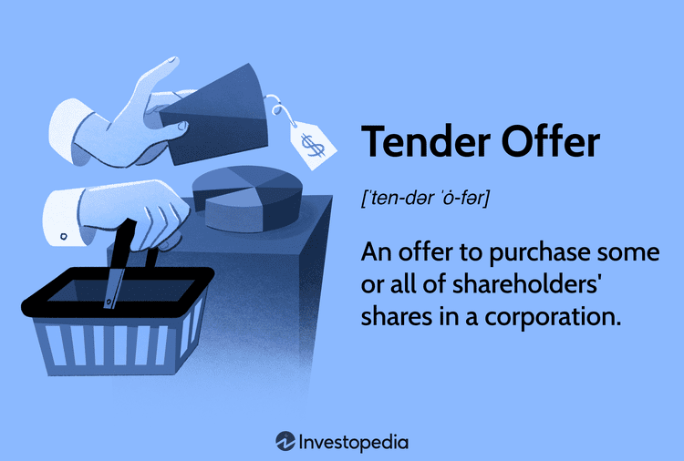

## Table of Contents

## What is a mini-tender offer?

A mini-tender offer is a type of offer to buy shares of a company, but it's smaller than a regular tender offer. Instead of trying to buy a lot of shares, like in a regular tender offer, a mini-tender offer only tries to buy less than 5% of a company's shares. Because it's smaller, it doesn't have to follow all the strict rules that bigger tender offers have to follow.

This can be risky for investors because the people making the mini-tender offer might offer a lower price than the current market price of the shares. It's important for investors to be careful and check the details of the offer before deciding to sell their shares. The company whose shares are being bought might also warn its shareholders about the mini-tender offer to help them make a better decision.

## How does a mini-tender offer differ from a regular tender offer?

A mini-tender offer and a regular tender offer are both ways for someone to buy shares of a company, but they are different in some important ways. A regular tender offer is usually for a big part of the company, often more than 5% of its shares. Because it's big, it has to follow a lot of strict rules set by the government. These rules are there to protect the people who own the shares and make sure everything is fair. The company being bought usually has to tell its shareholders about the offer and give them time to decide what to do.

On the other hand, a mini-tender offer is much smaller. It's for less than 5% of the company's shares, so it doesn't have to follow all those strict rules. This can make it easier for the person making the offer, but it can also be riskier for the shareholders. Sometimes, the price offered in a mini-tender offer is lower than the current market price of the shares. That's why it's important for shareholders to be careful and check the details of the offer before deciding to sell their shares. The company might also warn its shareholders about the mini-tender offer to help them make a better decision.

## What are the typical characteristics of a mini-tender offer?

A mini-tender offer is a small offer to buy shares of a company. It is for less than 5% of the company's shares, which makes it different from a regular tender offer. Because it's small, it doesn't have to follow all the strict rules that bigger offers have to follow. This can make it easier for the person or group making the offer, but it can also be riskier for the people who own the shares.

Sometimes, the price offered in a mini-tender offer is lower than the current market price of the shares. This means shareholders might not get as much money as they could if they sold their shares on the open market. It's important for shareholders to be careful and check the details of the offer before deciding to sell their shares. The company being targeted by the mini-tender offer might also warn its shareholders about the offer to help them make a better decision.

## Why do companies or investors launch mini-tender offers?

Companies or investors launch mini-tender offers because they want to buy a small number of shares without having to follow all the strict rules that come with bigger offers. These rules can be hard to follow and can take a lot of time and money. By keeping the offer small, they can avoid these rules and make the process easier and cheaper. This can be a good way for them to slowly increase their ownership in a company without drawing too much attention.

Another reason is that mini-tender offers can be a way to buy shares at a lower price than what they are worth on the open market. Sometimes, shareholders might not know the real value of their shares or might not pay close attention to the offer. This can lead them to sell their shares for less than they could get if they sold them on the stock market. For the company or investor making the offer, this means they can get more shares for less money, which can be a good deal for them.

## What are the potential benefits of participating in a mini-tender offer?

Participating in a mini-tender offer can be a quick and easy way for shareholders to sell their shares. Since mini-tender offers are for less than 5% of a company's shares, they don't have to follow all the strict rules that bigger offers do. This means the process can be simpler and faster. If a shareholder wants to sell their shares quickly without going through the usual steps of selling on the stock market, a mini-tender offer can be a good option.

Another potential benefit is that shareholders might get a guaranteed price for their shares. Even if the offer price is lower than the current market price, it can still be appealing if the shareholder believes the market price might drop in the future. By selling through a mini-tender offer, they can lock in a price and avoid the risk of the share price falling. This can be especially useful for shareholders who need the money right away or who want to avoid the uncertainty of the stock market.

## What are the risks associated with mini-tender offers?

One big risk of mini-tender offers is that the price offered might be lower than what the shares are worth on the stock market. This means shareholders could lose money if they sell their shares through the offer instead of selling them on the open market. Sometimes, shareholders might not know the real value of their shares or might not pay close attention to the offer, which can lead them to sell for less than they should.

Another risk is that mini-tender offers don't have to follow all the strict rules that bigger offers do. This can make it easier for the people making the offer to do things that might not be fair to shareholders. For example, they might not give shareholders all the information they need to make a good decision. This lack of rules can make it harder for shareholders to know if the offer is a good deal or not.

It's also important for shareholders to be careful because the company being targeted by the mini-tender offer might not warn them about the offer. Without a warning, shareholders might miss important details or not realize that the offer could be risky. This can lead them to make a decision they might regret later.

## How can an investor identify a legitimate mini-tender offer?

To identify a legitimate mini-tender offer, an investor should first check if the offer is coming from a well-known and trusted company or investor. They can do this by researching the name of the person or group making the offer. If the offer is from someone they've never heard of, it might be a good idea to be extra careful. Also, investors should look for any warnings or statements from the company whose shares are being bought. The company might put out a notice to its shareholders about the mini-tender offer, which can help investors understand if the offer is legitimate or not.

Another important thing to do is to compare the price offered in the mini-tender offer with the current market price of the shares. If the offer price is much lower than the market price, it could be a sign that the offer is not a good deal. Investors should also read all the details of the offer carefully. Legitimate offers will usually have clear information about who is making the offer, how long the offer will be open, and what will happen to the shares after they are bought. If any of this information is missing or unclear, it might be a red flag that the offer is not legitimate.

## What regulatory considerations should be noted with mini-tender offers?

Mini-tender offers are for less than 5% of a company's shares, so they don't have to follow all the strict rules that bigger offers do. This means they don't have to file as many documents with the government or give shareholders as much time to decide. But there are still some rules they have to follow. For example, they have to tell the Securities and Exchange Commission (SEC) about the offer and follow some basic rules about how they talk to shareholders. The SEC keeps an eye on mini-tender offers to make sure they are fair and that shareholders are not tricked.

Even though mini-tender offers don't have to follow all the rules, the SEC can still step in if they think something is wrong. They might do this if they think the offer is trying to trick shareholders or if the people making the offer are not telling the truth. The SEC can also warn shareholders about risky offers. It's a good idea for investors to check the SEC's website to see if there are any warnings about the mini-tender offer they are thinking about. This can help them make a better decision about whether to sell their shares or not.

## Can you provide examples of successful mini-tender offers?

One example of a successful mini-tender offer happened in 2019 when TRC Capital Investment Corporation made an offer to buy shares of First Majestic Silver Corp. TRC Capital offered to buy up to 4.9% of First Majestic's shares at a price that was a bit lower than the market price. Even though the price was lower, some shareholders decided to sell their shares through the offer. This was a good deal for TRC Capital because they were able to buy the shares they wanted without having to follow all the strict rules that bigger offers have to follow.

Another example was in 2020 when TRC Capital made a mini-tender offer for shares of Kirkland Lake Gold Ltd. They offered to buy up to 4.9% of the company's shares at a price that was also lower than the market price. Some shareholders took the offer and sold their shares to TRC Capital. This was another successful mini-tender offer for TRC Capital because they were able to increase their ownership in Kirkland Lake Gold without drawing too much attention or having to deal with a lot of rules.

## What are the steps to participate in a mini-tender offer?

To participate in a mini-tender offer, an investor first needs to receive the offer document. This document will come from the company or investor making the offer and will explain all the details about the offer, like how many shares they want to buy, the price they are offering, and how long the offer will be open. The investor should read this document carefully and compare the offer price to the current market price of the shares. If the investor decides they want to sell their shares through the mini-tender offer, they need to follow the instructions in the document to accept the offer.

The next step is to send the required documents back to the company or investor making the offer. This might include a form to fill out and send back, or it might be done electronically through a website. The investor should make sure they do this before the deadline mentioned in the offer document. Once the company or investor gets the documents, they will check everything to make sure it's correct. If everything is good, they will buy the shares from the investor at the offered price. It's important for the investor to keep an eye on their account to make sure the money from the sale comes in as expected.

## How do mini-tender offers impact the stock price of a company?

Mini-tender offers usually don't have a big impact on the stock price of a company because they are for a small number of shares, less than 5%. When a mini-tender offer happens, it might cause a tiny change in the stock price, but it's often so small that most people won't even notice. This is because the offer is not big enough to change how people think about the company or its future.

However, if a lot of shareholders decide to sell their shares through the mini-tender offer, it could lead to a small drop in the stock price. This is because there are more shares available to buy, which can make the price go down a little bit. But this drop is usually not very big and doesn't last long. The company might also put out a notice to its shareholders about the mini-tender offer, which can help keep the stock price stable by making sure everyone knows what's going on.

## What strategies can companies employ to respond to unsolicited mini-tender offers?

When a company gets an unsolicited mini-tender offer, they can do a few things to respond. One thing they can do is put out a notice to their shareholders about the offer. This notice can tell shareholders about the offer and warn them if it might not be a good deal. The company can explain why they think the offer price is too low or why shareholders might want to wait and sell their shares on the open market instead. By doing this, the company can help protect their shareholders from making a bad decision.

Another strategy is for the company to talk to the person or group making the mini-tender offer. They might try to find out more about why the offer is being made and see if there's a way to work together. Sometimes, the company might even make a counter-offer to buy back the shares themselves at a better price. This can help keep the shares in the hands of people who believe in the company's future. By being proactive and communicating clearly, the company can manage the situation and protect their shareholders' interests.

## References & Further Reading

1. **"Investment Strategies for the 21st Century" by John Doe**  
   This book provides a comprehensive overview of modern investment strategies, including detailed chapters on mini-tenders and tender offers. It highlights case studies and real-world applications of these concepts.

2. **"Algorithmic Trading: Winning Strategies and Their Rationale" by Ernie Chan**  
   Ernie Chan's book is a staple for understanding the fundamentals of [algorithmic trading](/wiki/algorithmic-trading). It covers various trading algorithms, their implementation, and includes practical examples for better comprehension.

3. **"Mergers & Acquisitions Analysis: Understanding Tender Offers and Their Market Impact" by Katherine Hunt**  
   This text takes a deep dive into the mechanics of tender offers, both friendly and hostile, and examines their effects on stock prices and shareholder decisions.

4. **"High-Frequency Trading: A Practical Guide to Algorithmic Strategies and Trading Systems" by Irene Aldridge**  
   Aldridge's guide is an essential resource for those interested in the technical and practical aspects of high-frequency trading. It addresses the development and implementation of trading algorithms.

5. **"The Art of Risk Management: Practical Techniques to Apply to Trading and Investing" by Peter Bossaerts**  
   This book offers insights into effective risk management practices crucial for algorithmic trading, emphasizing compliance and ethical trading strategies.

6. **"The Evolution of Trading Technology" - Article from Financial Times**  
   This article explores the advancements in trading technologies, including AI and [machine learning](/wiki/machine-learning), and discusses their potential impact on global financial markets.

7. **"The Economics of Mergers and Acquisitions" - Online Course by Coursera**  
   Providing learners with an understanding of the economic principles behind mergers and acquisitions, this [course](/wiki/best-algorithmic-trading-courses) discusses the strategic considerations and market impacts of tender offers.

8. **Case Study: "Algorithmic Trading's Role in Modern Tender Offers" by Harvard Business Review**  
   An in-depth analysis of how algorithmic trading has influenced recent tender offer outcomes, offering valuable insights into the intersection of these two financial concepts.

9. **The Securities & Exchange Commission's (SEC) Investor Bulletins**  
   Regularly updated, these bulletins provide regulatory insights and guidelines regarding mini-tenders and tender offers, ensuring investors are aware of their rights and protections.

10. **"Deep Learning and Neural Networks for Trading" - Video Series by QuantInsti**  
    This series introduces the application of AI and machine learning in trading, predicting future trends and innovations in market behavior and technology.

