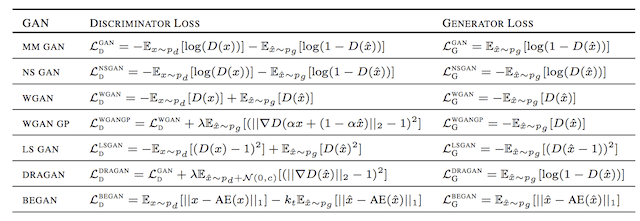

## Table of Contents

## What is Minimax Loss in the context of machine learning?

Minimax Loss is a concept used in machine learning, particularly in adversarial training and game theory. It involves finding the best strategy for a model by minimizing the maximum possible loss. Imagine you're playing a game where you want to make the best move, but you also have to consider the worst possible move your opponent could make. In machine learning, this means training a model to perform well even when faced with the most challenging scenarios. The goal is to make the model robust by considering the worst-case situations and optimizing its performance against them.

In more technical terms, Minimax Loss can be expressed as finding the model parameters that minimize the maximum loss over all possible inputs. Mathematically, if we denote the model parameters by $$\theta$$ and the input data by $$x$$, the Minimax Loss can be formulated as $$\min_{\theta} \max_{x} L(\theta, x)$$, where $$L$$ is the loss function. This approach is particularly useful in scenarios like generative adversarial networks (GANs), where a generator model tries to produce realistic data, while a discriminator model tries to distinguish between real and generated data. By using Minimax Loss, the generator learns to create data that is increasingly difficult for the discriminator to classify correctly, leading to better overall performance of the system.

## How does Minimax Loss differ from other loss functions?

Minimax Loss is different from other loss functions because it focuses on the worst-case scenario. Most loss functions, like Mean Squared Error or Cross-Entropy Loss, aim to minimize the average error across all examples. But Minimax Loss tries to minimize the maximum possible loss, which means it prepares the model for the toughest situations. Imagine you're training a model to recognize cats and dogs. A regular loss function would try to get most predictions right, but Minimax Loss would focus on the hardest-to-classify images, making sure the model can handle them well.

In practical terms, Minimax Loss is often used in adversarial settings, like in Generative Adversarial Networks (GANs). Here, one part of the model (the generator) tries to create data that looks real, while another part (the discriminator) tries to tell real from fake. The goal is to minimize the maximum loss, which can be written as $$\min_{\theta} \max_{x} L(\theta, x)$$. This means the generator keeps improving until it can fool the discriminator even in the worst cases. This approach makes the model more robust and better at handling tricky situations, which is different from other loss functions that might not push the model as hard.

## What are the basic components of a Minimax Loss function?

The basic components of a Minimax Loss function include the model parameters, the input data, and the loss function itself. The model parameters, often denoted as $$\theta$$, are what the model learns during training. The input data, which can be represented as $$x$$, includes all possible inputs the model might encounter. The loss function, $$L(\theta, x)$$, measures how well the model is performing with its current parameters on the given input data.

In a Minimax Loss setup, the goal is to find the model parameters that minimize the maximum possible loss. This means the model is trained to perform well even in the worst-case scenarios. Mathematically, this is expressed as $$\min_{\theta} \max_{x} L(\theta, x)$$. This approach is particularly useful in adversarial settings, where one part of the model tries to outsmart another part. By focusing on the worst-case loss, Minimax Loss helps the model become more robust and better at handling challenging situations.

## Can you explain the mathematical formulation of Minimax Loss?

The mathematical formulation of Minimax Loss involves finding the best set of model parameters that minimize the worst-case loss. In simple terms, it's like trying to do your best even when things are at their hardest. If we call the model parameters $$\theta$$ and the input data $$x$$, the Minimax Loss can be written as $$\min_{\theta} \max_{x} L(\theta, x)$$. Here, $$L$$ is the loss function that measures how well the model is doing. The goal is to adjust $$\theta$$ so that no matter what input $$x$$ comes along, the loss $$L(\theta, x)$$ is as small as possible.

This approach is especially useful in situations where you're training a model to handle tricky or adversarial inputs. For example, in a game where one player tries to outsmart another, Minimax Loss helps the first player find the best strategy by always considering the worst move the opponent could make. By focusing on the maximum possible loss and trying to minimize it, the model becomes more robust and better at dealing with challenging scenarios. This makes Minimax Loss different from other loss functions that might only focus on average performance.

## In what types of machine learning problems is Minimax Loss commonly applied?

Minimax Loss is commonly used in [machine learning](/wiki/machine-learning) problems where you need to make the model strong against tough situations. One big area where it's used is in Generative Adversarial Networks (GANs). In GANs, there are two parts: a generator that makes fake data and a discriminator that tries to tell if the data is real or fake. The generator wants to fool the discriminator, so it uses Minimax Loss to get better at making data that's hard for the discriminator to spot as fake. The goal is to minimize the worst-case loss, which means the generator keeps improving until it can fool the discriminator even in the hardest cases. This is written as $$\min_{\theta} \max_{x} L(\theta, x)$$, where $$\theta$$ are the model parameters and $$x$$ is the input data.

Another area where Minimax Loss is used is in [reinforcement learning](/wiki/reinforcement-learning), especially in games where you need to plan against an opponent. Imagine playing chess: you want to make the best move, but you also need to think about the worst move your opponent could make. Minimax Loss helps you find the best strategy by always considering the worst possible move from your opponent. This makes your strategy more robust and better at handling tricky situations. By focusing on the maximum possible loss and trying to minimize it, the model learns to perform well even when faced with the toughest challenges.

## How does Minimax Loss help in dealing with adversarial examples?

Minimax Loss is really helpful when dealing with adversarial examples because it makes the model strong against tricky inputs. Adversarial examples are like sneaky inputs that can fool a model, even if they look normal to us. By using Minimax Loss, the model learns to handle the worst possible inputs. It's like training to be ready for the hardest test. The goal is to minimize the maximum possible loss, which means the model gets better at dealing with even the trickiest examples. This is written as $$\min_{\theta} \max_{x} L(\theta, x)$$, where $$\theta$$ are the model's parameters and $$x$$ is the input data.

In practice, this approach is often used in things like Generative Adversarial Networks (GANs). In GANs, there's a generator that makes fake data and a discriminator that tries to tell if the data is real or fake. The generator uses Minimax Loss to get better at making data that's hard for the discriminator to spot as fake. By always trying to minimize the worst-case loss, the generator improves until it can fool the discriminator even in the hardest cases. This makes the whole system more robust and better at dealing with adversarial examples, which can be really important in making sure models work well in the real world.

## What are the advantages of using Minimax Loss in model training?

Minimax Loss helps make a model stronger by focusing on the toughest situations. Imagine you're learning to play a game. Instead of just trying to win most of the time, you practice for the hardest moves your opponent could make. This way, you're ready for anything. In machine learning, Minimax Loss works the same way. It trains the model to perform well even when faced with the trickiest inputs. This makes the model more reliable and better at handling real-world challenges, where things don't always go as planned.

One big advantage of Minimax Loss is seen in Generative Adversarial Networks (GANs). In GANs, there's a generator that makes fake data and a discriminator that tries to tell real from fake. The generator uses Minimax Loss to get better at making data that's hard for the discriminator to spot as fake. This is written as $$\min_{\theta} \max_{x} L(\theta, x)$$, where $$\theta$$ are the model's parameters and $$x$$ is the input data. By always trying to minimize the worst-case loss, the generator improves until it can fool the discriminator even in the hardest cases. This not only makes the GAN more effective but also helps in creating more realistic and diverse outputs.

## What are the potential challenges and limitations when using Minimax Loss?

Using Minimax Loss can be tricky because it focuses on the worst-case scenarios, which can make training a model take longer. Imagine trying to get really good at a game by always practicing against the hardest moves. It's tough and can take a lot of time. In machine learning, this means the model might need more time and more data to learn how to handle all those tricky situations. Also, because Minimax Loss pushes the model to do its best against the hardest examples, it can sometimes make the model overfit to those examples, meaning it might not work as well on easier ones.

Another challenge with Minimax Loss is that it can be hard to balance the different parts of the model. For example, in Generative Adversarial Networks (GANs), the generator and discriminator need to work together but also against each other. If one part gets too good too quickly, it can stop the other part from learning properly. This is called mode collapse in GANs, where the generator only makes a few types of outputs that fool the discriminator. To avoid this, you need to carefully adjust the training process, which can be complicated. Overall, while Minimax Loss helps make models more robust, it requires careful tuning and more resources to work well.

## How can Minimax Loss be implemented in a neural network?

To implement Minimax Loss in a [neural network](/wiki/neural-network), you need to set up a system where the model learns to minimize its worst-case loss. This means you'll have two parts working together: one trying to make things hard for the other. Imagine a game where one player tries to win while the other tries to make it as hard as possible. In a neural network, this could be a generator trying to create realistic images and a discriminator trying to tell if they're real or fake. The goal is to adjust the generator's parameters, $$\theta$$, so that it can fool the discriminator even in the toughest situations. This is written as $$\min_{\theta} \max_{x} L(\theta, x)$$, where $$x$$ is the input data and $$L$$ is the loss function.

In practice, implementing Minimax Loss involves training both parts of the network in a loop. First, you update the discriminator to get better at telling real from fake. Then, you update the generator to create images that are harder for the discriminator to classify correctly. This back-and-forth continues until the generator can produce images that the discriminator can't easily tell apart from real ones. Here's a simple example of how this might look in code using PyTorch:

```python
import torch
import torch.nn as nn

# Define the generator and discriminator
class Generator(nn.Module):
    def __init__(self):
        super(Generator, self).__init__()
        # Generator architecture

    def forward(self, z):
        # Forward pass for generator

class Discriminator(nn.Module):
    def __init__(self):
        super(Discriminator, self).__init__()
        # Discriminator architecture

    def forward(self, x):
        # Forward pass for discriminator

# Initialize generator and discriminator
generator = Generator()
discriminator = Discriminator()

# Define loss function and optimizers
criterion = nn.BCELoss()
optimizer_G = torch.optim.Adam(generator.parameters(), lr=0.0002, betas=(0.5, 0.999))
optimizer_D = torch.optim.Adam(discriminator.parameters(), lr=0.0002, betas=(0.5, 0.999))

# Training loop
for epoch in range(num_epochs):
    for i, (real_data, _) in enumerate(dataloader):
        # Train Discriminator
        optimizer_D.zero_grad()
        real_labels = torch.ones(real_data.size(0), 1)
        fake_labels = torch.zeros(real_data.size(0), 1)

        real_output = discriminator(real_data)
        d_loss_real = criterion(real_output, real_labels)

        z = torch.randn(real_data.size(0), latent_dim, 1, 1)
        fake_data = generator(z)
        fake_output = discriminator(fake_data.detach())
        d_loss_fake = criterion(fake_output, fake_labels)

        d_loss = d_loss_real + d_loss_fake
        d_loss.backward()
        optimizer_D.step()

        # Train Generator
        optimizer_G.zero_grad()
        output = discriminator(fake_data)
        g_loss = criterion(output, real_labels)
        g_loss.backward()
        optimizer_G.step()
```

This code shows how you can use Minimax Loss to train a GAN. The generator and discriminator are updated in turns, with the generator trying to minimize the loss against the discriminator's best efforts to maximize it.

## What are some practical examples or case studies where Minimax Loss has been successfully used?

One practical example where Minimax Loss has been successfully used is in the development of Generative Adversarial Networks (GANs) for image generation. Researchers at NVIDIA used Minimax Loss to train their StyleGAN model, which can generate highly realistic human faces. In this setup, the generator tries to create images that look real, while the discriminator tries to tell if they are real or fake. By using Minimax Loss, the generator learns to produce images that are increasingly difficult for the discriminator to classify correctly. This back-and-forth training process, expressed as $$\min_{\theta} \max_{x} L(\theta, x)$$, helps the generator improve until it can create images that are almost indistinguishable from real photographs.

Another case study involves using Minimax Loss in reinforcement learning for game AI. In the game of Go, the AlphaGo system developed by DeepMind used Minimax Loss to train its neural network to play against itself. The goal was to find the best move by considering the worst possible move the opponent could make. This approach helped AlphaGo become robust and capable of handling complex strategies from human players. By focusing on minimizing the maximum possible loss, AlphaGo was able to outperform top human players, demonstrating the power of Minimax Loss in creating strong AI systems for competitive games.

## How does Minimax Loss interact with other optimization techniques in machine learning?

Minimax Loss works with other optimization techniques to make models stronger. It's like playing a game where you practice against the hardest moves while also trying to win most of the time. In machine learning, Minimax Loss focuses on the worst-case scenarios, but other techniques like Stochastic Gradient Descent (SGD) help the model learn from all kinds of examples. SGD adjusts the model's parameters a little bit at a time, helping it get better step by step. When you use Minimax Loss with SGD, the model not only learns to handle tough situations but also improves its overall performance by considering all inputs.

In practical settings, like training Generative Adversarial Networks (GANs), Minimax Loss and other optimization techniques work together to balance the training process. For example, while Minimax Loss (expressed as $$\min_{\theta} \max_{x} L(\theta, x)$$) helps the generator create realistic images by minimizing the worst-case loss, techniques like learning rate scheduling can be used to adjust how quickly the model learns. This helps prevent issues like mode collapse, where the generator might only create a few types of images. By combining Minimax Loss with other optimization strategies, the model becomes more robust and better at dealing with real-world challenges.

## What are the current research trends and future directions for Minimax Loss in machine learning?

Current research trends in Minimax Loss focus on making it work better in different machine learning tasks. One big area is improving how it's used in Generative Adversarial Networks (GANs). Researchers are trying to find new ways to balance the training of the generator and discriminator so that they both get better without one getting too far ahead. They're also looking at how to use Minimax Loss in other types of models, like reinforcement learning, to make them more robust against tricky situations. For example, in games like chess or Go, Minimax Loss helps the AI think about the worst moves the opponent could make, making it stronger and better at winning.

Future directions for Minimax Loss involve making it easier to use and more effective. Researchers are working on new algorithms that can handle the challenges of Minimax Loss, like the long training times and the risk of overfitting to the hardest examples. They're also exploring how to combine Minimax Loss with other optimization techniques to create even more powerful models. By focusing on these areas, the goal is to make Minimax Loss a standard tool in machine learning, helping models perform well even when faced with the toughest challenges.

## References & Further Reading

[1]: Goodfellow, I. J., Pouget-Abadie, J., Mirza, M., Xu, B., Warde-Farley, D., Ozair, S., ... & Bengio, Y. (2014). ["Generative adversarial nets."](https://arxiv.org/abs/1406.2661) Advances in Neural Information Processing Systems 27.

[2]: Arjovsky, M., Chintala, S., & Bottou, L. (2017). ["Wasserstein GAN."](https://arxiv.org/abs/1701.07875) arXiv preprint arXiv:1701.07875.

[3]: Silver, D., Huang, A., Maddison, C. J., Guez, A., Sifre, L., van den Driessche, G., ... & Hassabis, D. (2016). ["Mastering the game of Go with deep neural networks and tree search."](https://www.nature.com/articles/nature16961) Nature, 529(7587), 484-489.

[4]: Ian J. Goodfellow, Patrick McDaniel, and Nicolas Papernot. (2018). ["The Challenges of Adversarial Machine Learning."](https://dl.acm.org/doi/10.1145/3134599) Queue 16, 4, Article 30.

[5]: Madry, A., Makelov, A., Schmidt, L., Tsipras, D., & Vladu, A. (2018). ["Towards Deep Learning Models Resistant to Adversarial Attacks."](https://arxiv.org/abs/1706.06083) arXiv preprint arXiv:1706.06083.

[6]: Ian Goodfellow's experiments with GANs: ["NVIDIA's StyleGAN Architecture."](https://en.wikipedia.org/wiki/History_of_artificial_neural_networks)