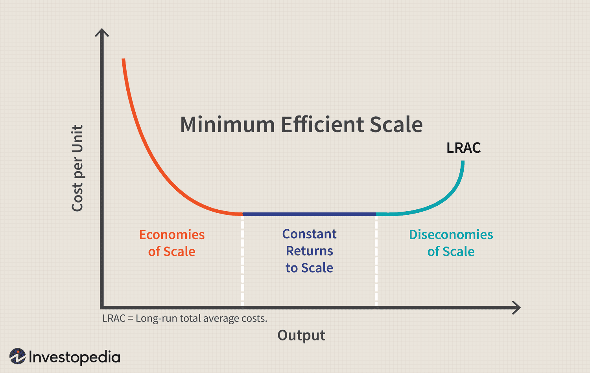

## Table of Contents

## What is the Minimum Efficient Scale (MES)?

The Minimum Efficient Scale (MES) is the smallest amount of production a company can achieve while still keeping costs low. It's the point where a business can make things as cheaply as possible compared to bigger companies. Imagine a factory: if it's too small, it won't be able to buy materials in bulk or use big machines that save money. But if it grows to the MES, it can do these things and compete with larger factories.

Finding the MES is important for businesses because it helps them decide how big they need to be to stay competitive. If a company is smaller than the MES, it might struggle to make profits because its costs will be higher. On the other hand, growing beyond the MES might not help much, because the costs won't go down any more. So, knowing the MES helps companies plan their growth and manage their resources wisely.

## Why is the Minimum Efficient Scale important for businesses?

The Minimum Efficient Scale (MES) is really important for businesses because it tells them the smallest size they need to be to keep their costs as low as possible. If a business is smaller than the MES, it will have higher costs for making things, which can make it hard to make money. By knowing the MES, a business can figure out how big it needs to grow to compete with other companies that might be bigger and can produce things more cheaply.

Understanding the MES also helps businesses plan their growth wisely. If they grow too small, they won't be able to take advantage of things like buying materials in bulk or using big machines that save money. But if they grow past the MES, they might not save any more money, so it's not worth it to get bigger. By aiming for the MES, businesses can use their resources in the best way and make sure they're as efficient as they can be.

## How does the MES relate to economies of scale?

The Minimum Efficient Scale (MES) is closely tied to the idea of economies of scale. Economies of scale happen when a business gets bigger and can make things cheaper. This is because bigger businesses can buy materials in bulk, use bigger machines, and spread out their fixed costs over more products. The MES is the smallest size a business needs to be to start enjoying these lower costs as much as bigger businesses do.

If a business is smaller than the MES, it won't be able to take full advantage of economies of scale. Its costs will be higher because it can't buy things in bulk or use the same big machines that bigger businesses use. But once a business reaches the MES, it can produce things just as cheaply as its bigger competitors. This makes the MES a key point for businesses to aim for if they want to stay competitive and keep their costs down.

## Can you explain the concept of MES with a simple example?

Imagine you want to start a bakery. At first, you bake cakes in your small kitchen at home. You buy ingredients in small amounts, and you can only make a few cakes at a time. Your costs are high because you can't buy flour or sugar in bulk, and you don't have big ovens that can bake many cakes at once. This is smaller than the Minimum Efficient Scale (MES).

Now, let's say you decide to open a bigger bakery. You buy a larger space with big ovens and start buying ingredients in larger amounts. Once your bakery is big enough, you can make a lot more cakes at once, and your costs go down because you're buying things in bulk and using bigger equipment. This size of your bakery is the MES because it's the smallest size where you can make cakes as cheaply as bigger bakeries. If you get even bigger, your costs might not go down much more, so the MES is the sweet spot for your bakery to be efficient and competitive.

## What factors determine the Minimum Efficient Scale for a company?

The Minimum Efficient Scale (MES) for a company depends on several things. One big thing is the type of industry the company is in. For example, making cars needs big factories and a lot of machines, so the MES might be bigger than for a company that makes clothes. Another thing is how much the company can save by buying things in bulk. If buying more materials at once saves a lot of money, the MES might be bigger because the company needs to be large enough to buy in bulk.

Another [factor](/wiki/factor-investing) is the technology the company uses. If new machines or computers can make things faster and cheaper, the MES might be smaller because the company doesn't need to be as big to save money. Also, how much it costs to start up the business matters. If it's expensive to get everything ready to start, the company might need to be bigger right from the start to make back that money, which would mean a bigger MES. All these things together help decide what the MES is for a company.

## How can a company calculate its Minimum Efficient Scale?

To find out its Minimum Efficient Scale (MES), a company needs to look at how its costs change as it gets bigger. The company should start by figuring out all its costs, like buying materials, paying for machines, and other things it needs to make its products. Then, it should see how these costs go down as it makes more and more stuff. The MES is the point where the costs stop going down a lot when the company gets bigger. This means the company is big enough to make things as cheaply as it can, but getting even bigger won't help much.

A company can use numbers and graphs to help with this. It can make a graph that shows how its costs change as it makes more products. The MES will be where the line on the graph starts to flatten out, showing that costs aren't going down much anymore. The company might also look at other businesses in the same industry to see what their MES is. By comparing, the company can get a good idea of what size it needs to be to keep its costs low and stay competitive.

## What are the implications of operating below the MES?

If a company operates below the Minimum Efficient Scale (MES), it means the company is too small to make things as cheaply as it could. This can be a big problem because the company's costs will be higher than they need to be. For example, a small bakery might have to buy flour in small bags, which costs more than buying a big bag. Also, the bakery might not be able to use a big oven that can bake many cakes at once, so it will take longer to make the same number of cakes. This makes it hard for the bakery to make money and compete with bigger bakeries that can make things more cheaply.

Being smaller than the MES can also make it hard for a company to grow. If the company is always spending more money to make things, it won't have extra money to invest in getting bigger. This can keep the company stuck at a small size, and it might struggle to stay in business. On the other hand, if the company can figure out how to get to the MES, it can start making things more cheaply and have a better chance of growing and being successful.

## How does MES affect market structure and competition?

The Minimum Efficient Scale (MES) plays a big role in how a market looks and how companies compete with each other. If the MES is big, it means companies need to be large to keep their costs low. This can lead to a market where there are only a few big companies because it's hard for smaller companies to compete. These big companies might have a lot of control over the market and can set higher prices because there aren't many other options for customers. This kind of market is called an oligopoly, where a few big companies dominate.

On the other hand, if the MES is small, it's easier for more companies to enter the market and compete. When the MES is small, companies can be smaller and still make things cheaply enough to compete. This can lead to a market with lots of companies, which is called a competitive market. In a competitive market, companies have to keep their prices low and try harder to make their products better because there are so many other choices for customers. So, the size of the MES can change how many companies are in a market and how they compete with each other.

## Can MES vary between industries? If so, how?

Yes, the Minimum Efficient Scale (MES) can be different for different industries. This happens because each industry has its own special needs and ways of making things. For example, in industries like car making or airplane building, the MES is usually big. These industries need huge factories and very expensive machines to make things cheaply. So, companies in these industries need to be big to save money and compete well. On the other hand, in industries like making clothes or software, the MES can be smaller. These industries can use smaller machines or even just computers, and they don't need such big factories to keep costs low.

The MES also changes because of how much companies can save by buying things in bulk. In some industries, buying a lot of materials at once can save a lot of money, so the MES is bigger because companies need to be large enough to buy in bulk. For example, a big bakery can buy flour in huge bags and save money, while a small bakery can't. In other industries, buying in bulk might not save as much money, so the MES can be smaller. This means the size a company needs to be to make things cheaply can be very different from one industry to another.

## What role does technology play in changing the MES over time?

Technology can change the Minimum Efficient Scale (MES) by making it easier for companies to make things more cheaply even if they're not very big. New machines and computers can help small companies do things that used to need big factories. For example, a small bakery might use a new kind of oven that can bake a lot of cakes at once without taking up too much space. This means the bakery can make things more cheaply without needing to be as big as before. So, technology can make the MES smaller because companies don't need to be as big to save money.

Over time, as technology keeps getting better, the MES can keep changing. If new technology comes out that makes it even easier to make things cheaply, the MES might get even smaller. For example, if a new computer program helps a small clothing company design and make clothes faster, that company can compete with bigger companies without needing a big factory. This means more small companies can enter the market and compete, which can make the market more competitive. So, technology plays a big role in changing how big a company needs to be to keep its costs low.

## How do global economic conditions influence the MES?

Global economic conditions can change the Minimum Efficient Scale (MES) for companies. If the world economy is doing well, companies might find it easier to get money to grow bigger and reach the MES. When the economy is good, people are buying more things, so companies can make more stuff and save money by buying materials in bulk. But if the economy is not doing well, it can be harder for companies to grow. They might not be able to sell as much, so they can't buy in bulk and save money. This means the MES might seem bigger because it's harder to reach.

Also, things like the cost of materials and how easy it is to get them can change because of global economic conditions. If the price of materials goes up because of problems in other countries, companies might need to be bigger to buy enough materials at a good price. This makes the MES bigger. On the other hand, if new trade deals make it easier and cheaper to get materials, companies might not need to be as big to save money. This can make the MES smaller. So, what's happening in the world economy can make a big difference in how big a company needs to be to keep costs low.

## What are the advanced strategies to optimize operations around the MES?

To optimize operations around the Minimum Efficient Scale (MES), companies can focus on improving their technology and processes. By using new machines or software, companies can make things more cheaply even if they're not very big. For example, a small factory might use robots to help make things faster and with less waste. This means the factory can reach the MES without needing to be as big as before. Also, companies can look at how they do things and find ways to make them better. Maybe they can change the way they make things so they use less materials or make fewer mistakes. This can help them save money and get to the MES more easily.

Another strategy is to work with other companies to share costs. If a small company can't buy materials in bulk by itself, it might be able to join with other small companies to buy together. This way, they can all save money and get closer to the MES. Companies can also share machines or other resources to save money. For example, a few small bakeries might share a big oven so they can all bake more cakes at once without each one needing to buy their own big oven. By working together, small companies can enjoy some of the same savings that big companies do, which helps them reach the MES.

## What is Minimum Efficient Scale (MES)?

Minimum Efficient Scale (MES) is a concept in production economics that identifies the lowest point at which a firm can produce its goods at a minimum average cost. It represents the scale of production required for a company to exploit economies of scale fully, thereby reducing its average total costs (ATC) as production [volume](/wiki/volume-trading-strategy) increases. MES is closely tied to the long-run average total cost (LRATC) curve, which shows the lowest possible average cost at which any output level can be produced after all inputs are optimized.

### Relationship Between MES and the LRATC Curve

The LRATC curve typically has a U-shape due to the behavior of economies and diseconomies of scale. Initially, as a firm expands production, it benefits from increasing returns to scale, leading to a downward slope of the curve. The MES point is located at the lowest segment of the LRATC, where economies of scale are fully realized, and any further increase in production does not significantly lower average costs. Beyond the MES, diseconomies of scale can set in, causing the average costs to rise.

Mathematically, the MES can be expressed when the derivative of the LRATC with respect to output (Q) is zero:

$$
\frac{d(LRATC)}{dQ} = 0
$$

This point signifies where the production level achieves minimum cost per unit.

### Factors Influencing MES

Several factors can influence the MES of a firm:

1. **Consumer Demand**: A larger market size allows for greater production capacity, facilitating the achievement of MES.
2. **Industry Characteristics**: Sectors with high fixed costs, like manufacturing, often have a more pronounced MES.
3. **Technology**: Advanced production techniques can shift MES to a lower or higher output level depending on efficiency improvements.
4. **Input Costs**: Variability in raw material costs can impact the cost function and subsequently the MES.

### Case Studies on Achieving MES

Various companies across industries serve as notable examples of achieving MES through strategic adjustments:

- **Automotive Industry**: Companies like Toyota have optimized their production processes to achieve MES by adopting lean manufacturing techniques. They standardize components and processes, reducing waste and improving efficiency, thus lowering average costs.

- **Retail Sector**: Retail giants such as Walmart have attained MES by leveraging extensive distribution networks and purchasing economies, enabling them to minimize costs and offer competitive pricing.

- **Technology Sector**: Firms like Amazon Web Services achieve MES by scaling their cloud infrastructure efficiently, capitalizing on massive server farms to reduce per-unit costs and pass savings to customers.

Each case illustrates the strategies employed to reach MES, such as optimizing supply chains, embracing technological advancements, and scaling operations to match market demands. Challenges remain in maintaining the MES as market conditions, and technological landscapes evolve, requiring continual assessment and adaptation of production strategies.

## References & Further Reading

[1]: Carlsson, H., & Dahl, D. (2009). ["Economies of Scale in Algorithmic Trading: An Experimental Analysis."](https://www.researchgate.net/publication/243073634_Topology_and_Data) Journal of Trading, 5(3), 51-60.

[2]: ["Economies of Scale and Scope"](https://www.investopedia.com/ask/answers/042215/what-difference-between-economies-scope-and-economies-scale.asp) by Alfred D. Chandler Jr.

[3]: Lopez de Prado, M. (2018). ["Advances in Financial Machine Learning."](https://www.amazon.com/Advances-Financial-Machine-Learning-Marcos/dp/1119482089) Wiley.

[4]: Varian, H. R. (1992). ["Microeconomic Analysis"](https://archive.org/details/microeconomicana0000vari_g1b1). W. W. Norton & Company.

[5]: Aronson, D. R. (2007). ["Evidence-Based Technical Analysis: Applying the Scientific Method and Statistical Inference to Trading Signals."](https://onlinelibrary.wiley.com/doi/book/10.1002/9781118268315) Wiley.