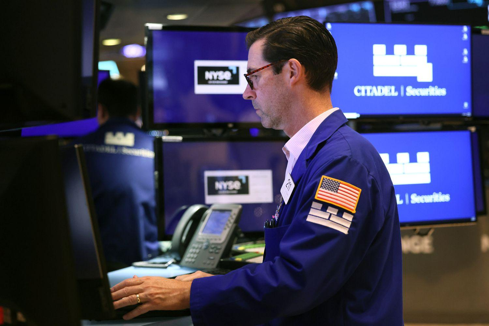

Understanding the dynamics of order execution is crucial for making informed investment decisions in stock trading. Among various order types, the Minimum Guaranteed Fill (MGF) order stands out as an essential tool in algorithmic trading. MGF orders ensure that small retail trades are executed at the best available price, thereby providing retail investors with fair access to the market even under fluctuating conditions. This article aims to provide a comprehensive overview of how MGF orders function, their distinct advantages, and their integration into the broader framework of algorithmic trading. By examining these orders, we can appreciate their role in enhancing market efficiency and investor confidence.

## Table of Contents

## What is a Minimum Guaranteed Fill (MGF) Order?

Minimum Guaranteed Fill (MGF) orders are a specialized order type in financial markets, specifically tailored to ensure that retail investors’ small order purchases are executed at the most favorable prices in the market, whether it be the best bid or ask. These orders are predominantly utilized on the Toronto Stock Exchange (TSX), where they play a significant role in enhancing market liquidity and providing investors with greater certainty, even amidst fluctuating market conditions.

The essence of MGF orders lies in their ability to secure the execution of orders within a predefined size limit without unnecessary delays. This ensures that the trading process is both efficient and equitable. The guaranteed execution at optimal prices is achieved through a regulatory mechanism that obligates market participants, such as market makers, to fulfill these orders. This obligation is crucial, as it mitigates the risk of partial executions or unfavorable pricing that might occur during periods of insufficient liquidity.

By bolstering liquidity, MGF orders enable a smooth transactional flow, thereby promoting stability within the trading environment. The facility established for executing MGF orders ensures that trades are completed promptly, which is beneficial not just for the individual investors but also for the overall health of the market. This assurance of quick and fair trades increases investor confidence, as they can participate in the market knowing their smaller size orders will be executed promptly at competitive prices. Consequently, MGF orders serve as a vital tool in maintaining the balance between market accessibility and the protective measures needed to guard against volatility and inefficiency.

## How MGF Orders Work

The Minimum Guaranteed Fill (MGF) facility is designed to ensure that small retail orders are executed efficiently, even when market [liquidity](/wiki/liquidity-risk-premium) is insufficient. The key feature of the MGF facility is its ability to guarantee the completion of orders up to a predetermined size. This size is often dictated by prevailing market conditions and the specific rules set by the exchange, such as the Toronto Stock Exchange (TSX).

Market makers play a critical role within this framework. They are tasked with the obligation to fulfill eligible MGF orders at the best available market prices. By doing so, they contribute significantly to enhancing market liquidity and ensuring price stability. This obligation means that market makers must match incoming orders with the best bid or ask prices available, thus preventing potential price slippage and contributing to a more stable trading environment.

For an order to benefit from the MGF facility, it must be explicitly marked as 'MGF-YES'. This designation signifies that the order should be processed under the rules governing MGF. Additionally, such orders must comply with specific eligibility criteria, which might include restrictions related to the size of the order, the type of trader, and possibly the underlying asset being traded.

In practical terms, once an order is marked 'MGF-YES', the system automatically checks for eligibility based on the predefined criteria. If the order qualifies, the market maker is then responsible for ensuring it is filled at the best available price, even if the immediate liquidity in the [order book](/wiki/order-book-trading-strategies) is insufficient to cover the entire order [volume](/wiki/volume-trading-strategy). This mechanism provides assurance to retail investors that their trades will be executed fairly and promptly, bolstering their confidence in the market's integrity.

## Example of an MGF Order

Consider an investor who wants to purchase 3,000 shares of XYZ stock on the Toronto Stock Exchange (TSX) using a Minimum Guaranteed Fill (MGF) order marked as 'MGF-YES'. In an active but fluctuating market, the order book at the current best offer price registers only 300 shares available. Under normal circumstances, this discrepancy might lead to a partial fill and potentially adverse price movement, known as slippage, for the remaining shares.

However, the MGF facility ensures that the 2,700 shares not readily available in the order book are fulfilled promptly. This system guarantees that these remaining shares are procured at the best available offer price, ensuring the investor obtains a fair and market-consistent value for the entire 3,000 share order. This is particularly beneficial in low liquidity scenarios where immediate access to a large block of shares at a consistent price would otherwise be challenging.

The MGF mechanism significantly enhances the liquidity provided by the market makers, who are mandated to fulfill these eligible orders despite market limitations. In this example, the MGF facility acts as a liquidity bridge, effectively filling the gap between available and required shares and maintaining market stability. This capability not only assures investors of fair pricing but also promotes efficient trade execution, as shown in this hypothetical transaction involving XYZ stock.

## Benefits of MGF Orders

Minimum Guaranteed Fill (MGF) orders offer several key advantages for retail investors by ensuring that trades are executed at fair market prices, which is crucial in maintaining efficient market operations and investor confidence.

Firstly, MGF orders play a vital role in ensuring fair pricing. In volatile markets where prices can change rapidly, the risk of "slippage"—the difference between the expected price of a trade and the price at which the trade is actually executed—can be significant. By guaranteeing the execution of orders at the best market prices, MGF orders mitigate this risk, ensuring that investors receive fills at the prices they anticipate.

Moreover, MGF orders are pivotal in enhancing market liquidity. Liquidity refers to the ease with which assets can be bought or sold in the market without affecting the asset's price significantly. By providing additional shares to fulfill trades, MGF orders effectively increase the available liquidity in the market. This process not only facilitates smoother transactions but also helps stabilize prices, making the market more attractive to all participants.

Additionally, MGF orders inspire confidence among investors. The assurance that trades will be executed swiftly and fairly at the best available prices aligns with market realities, thereby fostering an environment of trust. This confidence is crucial, particularly for retail investors who may not have the resources to monitor market movements constantly.

In summary, the benefits of MGF orders—ensuring fair pricing, enhancing liquidity, and fostering investor confidence—underscore their important role in promoting efficient market operations. These advantages make MGF orders a valuable tool for investors looking to navigate the complexities of stock trading with greater assurance and effectiveness.

## Limitations and Eligibility Requirements

Minimum Guaranteed Fill (MGF) orders have specific limitations and eligibility requirements, primarily aimed at ensuring that the mechanism serves its intended purpose of supporting retail investors and smaller institutional trades. Not all market participants are eligible to use MGF orders. They are specifically designed for retail investors and smaller institutional traders, which distinguishes them from larger, algorithmic, or high-frequency traders.

The exclusion of orders from [algorithmic trading](/wiki/algorithmic-trading) and high-frequency trading is essential to maintain fairness and accessibility. These sophisticated trading strategies often involve significant volumes of shares executed at high speeds, potentially exploiting the liquidity guarantees offered by MGF orders to gain an unfair advantage. By excluding such advanced trading strategies, exchanges ensure that the MGF facility serves those who need it most—retail investors who might otherwise face challenges in securing favorable trade execution under volatile market conditions.

Eligibility for MGF orders depends on the use of pre-qualified trader IDs. This requirement ensures that only those classified as eligible by the exchange can access the benefits of MGF orders. Furthermore, adherence to order size restrictions is crucial, as MGF orders are specifically designed to accommodate smaller trades. Each exchange sets a maximum order size that can be guaranteed under the MGF facility, tailored to reflect current market conditions and liquidity levels. These restrictions help ensure that the MGF mechanism can effectively fulfill its role in promoting liquidity and fair trade execution.

The outlined restrictions play a critical role in preserving the integrity and utility of MGF orders, thereby ensuring that they meet their objectives of enhancing market access and fairness for qualified participants.

## The Role of Market Makers

Market makers are central to the functioning of the Minimum Guaranteed Fill (MGF) facility, as they are responsible for providing the necessary liquidity to ensure the smooth execution of trades. By ensuring the availability of shares at the best bid or ask prices, market makers help maintain market stability and efficiency.

The profitability of market makers arises primarily from capturing the bid-ask spread. This spread represents the difference between the price at which a market maker is willing to buy an asset (the bid) and the price at which they are willing to sell it (the ask). For example, if the bid price for a stock is $100 and the ask price is $100.05, the market maker earns a $0.05 spread for each share traded. However, participating in the MGF facility requires market makers to fill eligible orders promptly, increasing their operational risk as they might need to fill orders even when market conditions are not optimal.

The MGF facility offers market makers the opportunity to handle a greater volume of trades, which can lead to increased profitability. By ensuring that all small orders are executed efficiently, market makers can handle a higher number of transactions, which in turn amplifies their earnings from bid-ask spreads. Essentially, the MGF facility provides a structured environment whereby market makers can optimize their operations and leverage the higher trade volumes to their advantage.

In summary, while market makers face the obligation of fulfilling trades under the MGF framework, the facility simultaneously enables them to expand their trading operations, allowing for potentially improved profitability through an increased capture of bid-ask spreads and larger trading volumes.

## Conclusion

MGF orders are an essential component of contemporary stock trading systems, providing retail investors with access to fair and efficient markets. These orders effectively guarantee that smaller trades are executed at optimal market prices, which minimizes trading risks such as slippage. By ensuring that retail investors can secure the best bid or offer available, MGF orders enhance the overall liquidity of the market and promote more stable and predictable trading environments. 

Despite encountering eligibility constraints, primarily reserved for retail investors and smaller trade sizes, the benefits of MGF orders in facilitating fair pricing and enhancing liquidity make them an invaluable trading tool. By excluding high-frequency trading algorithms from eligibility, MGF orders aim to maintain equitable market dynamics, focusing on the participation of genuine retail investors.

Understanding the function and application of MGF orders equips investors with strategic insights into algorithmic trading mechanisms. This knowledge can lead to more informed investment decisions and help traders better navigate the complexities inherent in modern financial markets. In conclusion, MGF orders not only uphold the principles of fair trading but also empower retail investors to effectively engage in the stock market, contributing to a more dynamic and inclusive trading ecosystem.

## References & Further Reading

[1]: Hasbrouck, J. (2007). ["Empirical Market Microstructure: The Institutions, Economics, and Econometrics of Securities Trading."](https://academic.oup.com/book/52241) Oxford University Press.

[2]: Harris, L. (2003). ["Trading and Exchanges: Market Microstructure for Practitioners."](https://www.amazon.com/Trading-Exchanges-Market-Microstructure-Practitioners/dp/0195144708) Oxford University Press.

[3]: O'Hara, M. (1995). ["Market Microstructure Theory."](https://www.semanticscholar.org/paper/Market-Microstructure-Theory-O'Hara/2bd0833b023f3270a2a6bf301e86b8e02e2f28ed) Blackwell Publishers.

[4]: Aitken, M., & Winn, R. (1997). ["What is This Thing Called the Minimum Volume Provision?"](https://www.taylorfrancis.com/books/mono/10.4324/9781003356110/thing-called-knowledge-duncan-pritchard) Journal of Business Finance & Accounting, 24(9‐10), 1417-1439.

[5]: Chan, E. (2009). ["Quantitative Trading: How to Build Your Own Algorithmic Trading Business."](https://github.com/ftvision/quant_trading_echan_book) John Wiley & Sons.