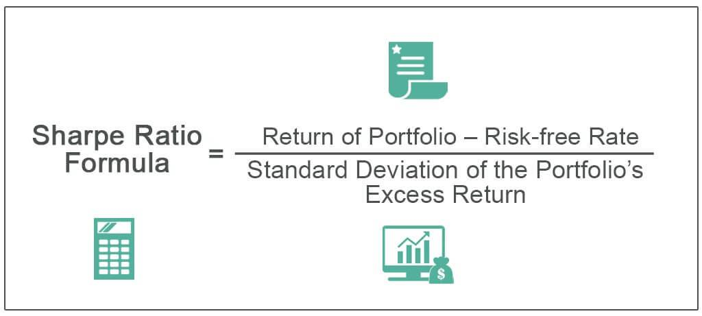

In today's fast-paced financial markets, effective investment strategies are paramount for achieving financial goals. As markets continue to evolve with technological advancements, investors face both opportunities and challenges in optimizing their portfolios. Implementing minimum investment strategies becomes increasingly important in this landscape, as they provide a structured framework for capital deployment, risk management, and strategic planning.

Minimum investment strategies refer to the practice of allocating a specified minimum amount of capital into various investment vehicles such as mutual funds, hedge funds, and other securities. These strategies ensure that investors commit to a baseline level of exposure, which can be crucial for maintaining discipline and consistency within their portfolios. In the context of mutual funds and hedge funds, minimum investment thresholds often serve as a signal of the fund's exclusivity and potential for higher returns due to a lower investor base and more personalized management.



Algorithmic trading, a domain that thrives on speed and precision, greatly benefits from minimum investment strategies. By integrating these strategies within algorithmic frameworks, investors can efficiently manage order sizes, reduce transaction costs, and minimize market impact. Algorithmic trading involves utilizing computer programs to execute trades based on predefined criteria, such as statistical models or trend-following algorithms. This technology-driven approach can process vast amounts of market data swiftly, allowing for strategic positioning without the emotional biases that could affect human traders.

By understanding the interplay between minimum investment strategies and algorithmic trading, investors can make informed decisions that align with their financial objectives. As the financial landscape grows increasingly complex, the ability to implement sound investment strategies becomes vital. These strategies not only aid in optimizing portfolio performance but also provide a foundation for navigating the intricate dynamics of global markets. Through disciplined financial planning and the adoption of advanced trading systems, investors can enhance their potential for achieving sustainable financial success.

## Table of Contents

## Understanding Minimum Investment Strategies

Minimum investment refers to the smallest sum of capital that an investor must commit to participate in a particular financial vehicle, such as mutual funds, hedge funds, and other trading systems. These minimums are significant because they establish the accessibility of various investment opportunities to different classes of investors, allowing fund managers to pool resources efficiently.

Mutual funds typically have lower minimum investment requirements compared to hedge funds, making them more accessible to the average investor. The minimum investment for mutual funds can range from as low as $1,000 to $10,000, depending on the fund's policy and the investor's residency or other factors. For example, the Vanguard 500 Index Fund requires a minimum investment of $3,000. The rationale behind such thresholds is to accommodate operational costs and ensure that the fund's administrative expenses are proportionally distributed among investors.

Conversely, hedge funds often require significantly higher minimum investments, reflected in thresholds that can start at $100,000 or more, sometimes reaching millions. This high barrier is due in part to the complex and tailored nature of [hedge fund](/wiki/hedge-fund-trading-strategies) strategies, which involve greater risk and more intricate financial instruments.

Moreover, minimum investment requirements can influence trading systems as well. In [algorithmic trading](/wiki/algorithmic-trading), for instance, a minimum investment is crucial to achieve sufficient diversification and execute strategies effectively without incurring prohibitive transaction costs. A trading system may require a minimum of $50,000 to properly deploy a trend-following algorithm due to the need for position-sizing and maintaining a diversified portfolio able to withstand market [volatility](/wiki/volatility-trading-strategies).

The influence of minimum investments extends beyond structural accessibility—it affects how investors strategize their participation in a fund. For mutual funds, investors may have to allocate larger portions of their savings to meet minimum criteria, potentially impacting their cash flow or [liquidity](/wiki/liquidity-risk-premium) preferences. Meanwhile, hedge fund investors must often assess the opportunity cost of committing large sums to strategies that, while promising high returns, might lock in their capital for extended periods or impose redemption restrictions.

Overall, understanding minimum investment requirements is vital for investors as they shape strategy, manage expectations, and align investments with financial goals. By recognizing these thresholds, investors can better equip themselves to navigate the complexities of various financial instruments.

## The Role of Financial Planning in Investment Strategy

Financial planning is essential for any successful investment strategy, as it ensures that capital is effectively allocated to meet both short-term and long-term financial objectives. A well-formulated financial plan enables individuals and organizations to manage their resources prudently, minimize risks, and optimize returns. Within this framework, the integration of minimum investment strategies can substantially influence overall financial planning and asset allocation.

Minimum investment strategies refer to the practice of determining the smallest amount of capital required to invest in financial instruments such as mutual funds or trading systems. These strategies are critical as they dictate the accessibility of certain investments and directly impact an investor’s approach to building their portfolio. For instance, a mutual fund with a higher minimum investment threshold might require an investor to initially allocate a substantial portion of their capital, which can affect liquidity and diversification.

In the context of financial planning, understanding and implementing minimum investment strategies can lead to more informed decision-making. Consider an investor with a fixed amount of capital aiming to diversify their portfolio. By being aware of minimum investment requirements, this investor can strategically allocate funds across various asset classes while ensuring liquidity needs are met. This might involve selecting a combination of securities with varying minimum requirements to balance risk and return effectively.

Moreover, incorporating minimum investment strategies into a financial plan offers several benefits. Firstly, it allows investors to prioritize investments based on their capability and financial goals, ensuring that capital is allocated efficiently. Secondly, it aids in risk management by preventing over-concentration in high-risk assets, especially when capital is limited. Lastly, it provides a disciplined approach to investing, promoting regular assessment of investment thresholds and the reallocation of assets as financial situations change.

The role of minimum investment strategies within financial planning highlights the importance of thorough research and strategic forethought. By aligning minimum investment considerations with overall financial strategies, investors can achieve more tailored and potentially more successful outcomes. Integration of these strategies can lead to improved portfolio robustness, optimized returns, and better risk-adjusted performance—essentially fortifying the financial foundation necessary for navigating ever-changing financial markets.

## Benefits of Algo Trading in Investment Strategies

Algorithmic trading, a cornerstone of modern financial markets, employs computerized systems to execute trades with precision and speed, adhering to predefined criteria that enhance efficiency beyond human capability. The integration of minimum investment strategies with popular algorithmic trading strategies, such as trend-following, statistical [arbitrage](/wiki/arbitrage), and mean reversion, can significantly optimize investment portfolios.

**Trend-Following Strategies**

Trend-following is a widely used algorithmic strategy that capitalizes on the [momentum](/wiki/momentum) of asset price movements. By identifying and investing in assets trending upwards or shorting those trending downwards, traders aim to maximize returns. This strategy can be integrated with minimum investment strategies by setting predetermined investment amounts for each buy or sell signal. This ensures disciplined capital allocation, minimizing risk while maintaining potential profit from trending markets.

**Statistical Arbitrage**

Statistical arbitrage leverages statistical techniques to exploit pricing inefficiencies between related financial instruments. By using quantitative models, traders identify opportunities for temporary price discrepancies, executing trades to capture profits as prices converge. When paired with minimum investment thresholds, this strategy becomes more accessible, allowing traders with limited capital to participate in arbitrage opportunities without excessive risk exposure.

For instance, consider two correlated stocks, Stock A and Stock B. An algorithm might determine that historically, Stock A trades 2% higher than Stock B. If the price difference diverges from this historical norm, the system initiates trades to profit from the expected reversion to the mean. By setting minimum investment criteria, traders can systematically allocate capital to each arbitrage opportunity, ensuring an optimal balance of risk and reward.

**Mean Reversion**

Mean reversion is based on the idea that asset prices tend to revert to their historical mean over time. This strategy involves identifying overbought or oversold conditions and executing trades that anticipate a regression to historical averages. Incorporating minimum investment strategies into mean reversion trading allows investors to maintain a consistent level of exposure across various trades, reducing the likelihood of excessive losses from isolated events while taking advantage of predictable patterns.

In Python, a simple mean reversion strategy could look like this:

```python
import numpy as np
import pandas as pd

def execute_trade(signal, stock_price, investment_amount):
    if signal == "buy":
        return investment_amount / stock_price
    elif signal == "sell":
        return -investment_amount / stock_price
    return 0

# Example data
stock_data = pd.Series([100, 102, 101, 105, 95, 98, 97, 105])
signal = stock_data - stock_data.rolling(window=3).mean()
investment_amount = 1000  # dollars

positions = [execute_trade("buy" if sig < 0 else "sell", price, investment_amount) for sig, price in zip(signal, stock_data)]
```

**Technological Enhancements**

Technology plays a pivotal role in fine-tuning and executing these sophisticated trading strategies. High-frequency trading platforms, supported by robust algorithms, process vast datasets to make informed decisions within fractions of a second. This technological prowess ensures enhanced precision, allowing traders to capitalize on fleeting market opportunities efficiently.

Moreover, [machine learning](/wiki/machine-learning) algorithms can analyze historical data to improve predictive accuracy, adapting trading strategies in real time to evolving market conditions. These advancements democratize access to sophisticated trading strategies, lowering the entry barriers historically associated with high-cost investments.

In conclusion, algorithmic trading, combined with minimum investment strategies, offers significant benefits for modern investors. By leveraging advanced technology and systematic approaches, traders can optimize portfolio performance, navigate complex markets, and achieve financial objectives more efficiently.

## Challenges and Considerations

Algorithmic trading and minimum investment strategies have revolutionized the financial industry, offering efficiency, speed, and precision. However, they also present several challenges that must be considered.

**Market Volatility**

One significant risk associated with algorithmic trading is market volatility. Algorithms, designed to operate at high speed, can exacerbate price swings during periods of high volatility. Flash crashes, a sudden drop in security prices, are a notable example where algorithms created a feedback loop of selling pressure. To mitigate this risk, traders can employ volatility filters in their algorithms, ensuring trades are executed only under predefined volatility conditions. Techniques such as volatility risk premium strategies can be incorporated to hedge against sudden market swings.

**Technical Glitches**

Technical glitches are another potential risk. Trading algorithms rely heavily on technology infrastructure, which means any system failure, software bug, or latency issue can lead to significant financial losses. To reduce this risk, implementing rigorous testing and validation procedures for algorithms is essential. Regular [backtesting](/wiki/backtesting) on historical data and real-time simulation can help identify potential faults. Additionally, employing redundant systems and having a robust disaster recovery plan can ensure continuity and integrity of trading operations.

**Regulatory Complexities**

Regulatory complexities add another layer of challenges. Algorithmic trading is subject to various regulations aimed at ensuring fair trading practices and reducing systemic risk. Compliance with these regulations requires continuous monitoring and updating of trading systems. For instance, regulations such as the EU's Markets in Financial Instruments Directive II (MiFID II) impose stringent requirements on algorithmic traders to maintain transparency and integrity. Engaging with legal experts and using compliance software tools can aid in navigating these complexities. 

**Risk Mitigation Strategies**

Investors can leverage several strategies to mitigate these challenges while capitalizing on the advantages of algorithmic trading and minimum investment strategies. Employing a diversified investment approach can help spread risk across various asset classes and algorithms, reducing the impact of any single error or market movement. Moreover, integrating robust risk management frameworks, including stop-loss orders and automated risk assessments, can further safeguard investments against unpredictable market behaviors.

In conclusion, while algorithmic trading and minimum investment strategies offer a promising pathway for optimized investment, acknowledging and addressing their associated challenges is essential. By adopting thoughtful risk management techniques and staying informed of technological and regulatory developments, investors can effectively navigate these complexities.

## Conclusion

In today's dynamic financial landscape, the integration of minimum investment strategies with comprehensive financial planning and algorithmic trading stands as a vital approach for investors seeking to optimize their portfolios. The essence of minimum investment strategies is rooted in the efficient utilization of capital, allowing investors to participate in markets with defined financial requirements while effectively managing risk exposure. By understanding and implementing these strategies, investors can forge a path toward achieving both short-term and long-term financial objectives.

Algorithmic trading, characterized by the execution of trades based on predefined criteria through computerized systems, offers the advantage of precision, speed, and efficiency. This technological advancement in the trading sector enables investors to respond rapidly to market fluctuations, harnessing the power of data and analytics. Combining these capabilities with minimum investment strategies allows for optimized asset allocation and enhanced decision-making processes.

However, the financial markets are continually evolving, and so must the strategies of informed investors. It is crucial for investors to remain educated about emerging technologies and trends within the sector. As market conditions and regulatory environments change, adapting strategies accordingly can help mitigate risks such as market volatility and technical challenges inherent in algorithmic trading.

In conclusion, the strategic integration of minimum investment strategies, financial planning, and algorithmic trading can lead to significant improvements in portfolio performance. Investors who embrace this comprehensive approach stand to benefit from a well-balanced, technology-driven investment practice. As the financial sector progresses, continued education and adaptation will be key to unlocking new opportunities and achieving sustained financial success.

## References & Further Reading

1. **Investopedia - Minimum Investment**: This resource provides a comprehensive overview of minimum investment requirements across various financial instruments such as mutual funds and trading systems. It explains why these minimums are necessary and their impact on investment strategies. [Investopedia - Minimum Investment](https://www.investopedia.com/terms/m/minimuminvestment.asp)

2. **CFA Institute - Financial Planning Fundamentals**: The CFA Institute offers detailed insights into financial planning, emphasizing the importance of strategic asset allocation and the integration of minimum investment strategies in achieving financial objectives. [CFA Institute - Financial Planning](https://www.cfainstitute.org/en)

3. **Algorithmic Trading Platforms**: Understanding the role of technology is crucial in algorithmic trading. Popular platforms such as MetaTrader and QuantConnect provide resources for developing and testing trading algorithms, which can be beneficial when integrating with investment strategies. [MetaTrader](https://www.metatrader4.com) and [QuantConnect](https://www.quantconnect.com)

4. **Journal of Financial Markets - Algorithmic Trading**: This journal publishes research on various aspects of algorithmic trading, including its benefits and challenges. It covers trading strategies such as trend-following and statistical arbitrage. [Journal of Financial Markets](https://www.journals.elsevier.com/journal-of-financial-markets)

5. **Python for Finance by O'Reilly**: This book is an excellent resource for financial professionals looking to leverage Python for enhancing their algorithmic trading strategies. It includes practical examples and expert analyses to support automated trading systems. [Python for Finance on O'Reilly](https://www.oreilly.com/library/view/python-for-finance/9781491945285/)

6. **SEC - Trading and Markets**: The U.S. Securities and Exchange Commission (SEC) provides a robust framework on regulatory considerations associated with algorithmic trading, helping investors understand potential legal implications. [SEC - Trading and Markets](https://www.sec.gov/fast-answers/answerstradinghtm.html)

7. **Morningstar - Mutual Fund Analysis**: Morningstar offers tools and analysis on mutual funds, allowing investors to assess the minimum investment requirements and their potential impacts on portfolio construction. [Morningstar](https://www.morningstar.com)

8. **Wharton Online - Financial Planning and Analysis**: An online course from the Wharton School provides an educational foundation in financial planning, enhancing understanding of how minimum investments align with broader investment strategies. [Wharton Online - Financial Planning and Analysis](https://www.online.wharton.upenn.edu) 

These resources offer a thorough understanding and practical insights into minimum investment strategies, financial planning, and algorithmic trading, facilitating enhanced decision-making in financial markets.

