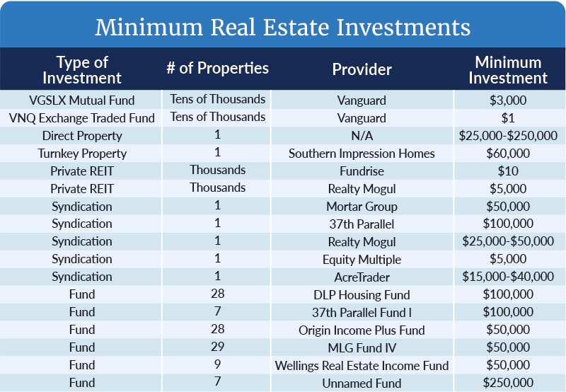

## Table of Contents

## What is the concept of minimum investment?

The concept of minimum investment refers to the smallest amount of money that someone needs to put into an investment opportunity. This can apply to various types of investments, like stocks, mutual funds, or real estate. The minimum investment amount is set by the company or the investment platform and can vary widely. For example, some mutual funds might require a minimum investment of $1,000, while certain stocks can be bought for much less.

Understanding the minimum investment is important because it helps people decide if they can afford to invest in a particular opportunity. It acts as a barrier to entry, meaning that if someone doesn't have enough money to meet the minimum, they can't invest. This concept is especially relevant for people who are just starting to invest and might not have a lot of money to spare. By knowing the minimum investment, they can plan their finances better and choose investments that fit their budget.

## Why is minimum investment important for investors?

Minimum investment is important for investors because it helps them know how much money they need to start investing. If an investor wants to put their money into something like a mutual fund or a stock, they need to have at least the minimum amount required. This helps them plan their finances and decide if they can afford to invest in a certain opportunity. For people who are new to investing and might not have a lot of money, knowing the minimum investment is really helpful. It lets them find investments that fit their budget and start building their portfolio without spending too much at once.

Also, minimum investment acts like a gatekeeper. It stops people from investing if they don't have enough money. This can be good because it makes sure that investors are serious about their investment and have thought about it carefully. It also protects them from putting in too little money and not seeing much growth. By setting a minimum, investment companies can make sure that their investors are committed and that the investment can grow over time. This way, both the investor and the company can benefit from the investment.

## How does minimum investment affect portfolio diversification?

Minimum investment can make it harder for someone to spread their money across different types of investments. If the minimum amount needed to invest in something is high, a person might not have enough money to buy into many different things. For example, if a mutual fund needs $1,000 to start, and someone only has $3,000 to invest, they can only put their money into three different funds. This means they can't spread their money out as much as they might want to, which can make their portfolio less diverse.

On the other hand, if the minimum investment is low, it's easier for someone to diversify their portfolio. With less money needed to start, they can buy into more different types of investments. For instance, if a stock only costs $10 to buy, someone with $3,000 can buy shares in many different companies. This helps them spread out their risk and potentially get better returns because their money is in different places. So, the size of the minimum investment can really affect how well someone can diversify their investments.

## What are common minimum investment requirements for different types of investments?

Minimum investment amounts can be different for different types of investments. For stocks, you can often start with a very small amount. Some stocks can be bought for just a few dollars, which makes it easy for anyone to start investing. But for mutual funds, the minimum investment can be higher. Many mutual funds ask for at least $1,000 to start. This can make it harder for people who don't have a lot of money to invest in mutual funds.

For real estate, the minimum investment is usually much higher. Buying a house or a piece of land can cost tens of thousands of dollars, which means only people with a lot of money can invest in real estate on their own. But there are also real estate investment trusts (REITs) that let you invest in real estate with less money. Some REITs might let you start with just a few hundred dollars. So, the type of investment you choose can really affect how much money you need to start.

## Can minimum investment thresholds vary by financial institution?

Yes, minimum investment thresholds can be different depending on which financial institution you use. For example, one bank might let you start a mutual fund with $500, while another bank might ask for $1,000 for the same type of fund. This difference happens because each bank or investment company can set its own rules about how much money you need to start investing.

These differences can affect where people choose to invest their money. If someone doesn't have a lot of money, they might look for a bank or a platform that has lower minimums so they can start investing without spending too much. Knowing that minimums can vary can help people shop around and find the best place for their money.

## How do minimum investments impact accessibility to certain investment vehicles?

Minimum investments can make it harder for some people to get into certain types of investments. If the minimum amount needed to start is high, like $1,000 for a mutual fund, people who don't have that much money can't invest in it. This means they might miss out on good investment opportunities because they can't afford to meet the minimum. It's like a door that's closed to them because they don't have enough money to open it.

On the other hand, if the minimum investment is low, more people can join in. For example, if you can buy a stock for just $10, almost anyone can start investing. This makes investing more open to everyone, no matter how much money they have. Lower minimums help more people build their savings and take part in the market, which can be good for both the investors and the economy.

## What strategies can be used to meet minimum investment requirements?

One way to meet minimum investment requirements is by saving up money over time. If you want to invest in something that needs a lot of money to start, like a mutual fund that asks for $1,000, you can save a little bit each month until you have enough. This way, you can slowly build up your savings and then put it all into the investment when you're ready. It's like filling up a piggy bank until you can buy what you want.

Another strategy is to look for investments with lower minimums. Not all investments need a lot of money to start. Some stocks can be bought for just a few dollars, and some mutual funds might let you start with less money if you use certain banks or investment platforms. By choosing investments that don't need as much money to start, you can get into the market without having to save up a big amount first. This can help you start investing sooner and spread your money across different things.

## How have minimum investment requirements evolved over time?

Over the years, minimum investment requirements have changed a lot. In the past, many investments needed a lot of money to start. For example, mutual funds used to ask for $3,000 or more to begin. This made it hard for people who didn't have a lot of money to invest. But as time went on, more and more people wanted to invest, and companies saw this. So, they started to lower the minimum amounts to let more people join in. Now, you can find mutual funds that let you start with as little as $100 or even less.

This change has made investing easier for everyone. Today, you can buy stocks for just a few dollars, and some investment platforms let you start with very little money. This is good because it means more people can save and grow their money. But even though minimums are lower now, they can still be different depending on where you invest. Some places might still ask for more money to start, while others are more open to people with less to spend. This means you can choose where to put your money based on what you can afford.

## What are the implications of minimum investments on investment returns?

Minimum investments can affect how much money you make from your investments. If the minimum amount to start is high, you might have to put a lot of money into one thing. This can be risky because if that investment doesn't do well, you could lose a lot of money. But if it does well, you could make more money because you put in more at the start. So, the size of the minimum investment can change how much risk you take and how much you might earn.

On the other hand, if the minimum investment is low, you can spread your money across many different investments. This is called diversification, and it can help you lower your risk. By putting a little bit of money into many different things, you might not make as much money from any one investment, but you also won't lose as much if one of them does badly. So, lower minimums can help you build a safer investment plan, but it might also mean smaller returns from each investment.

## How do robo-advisors and online platforms influence minimum investment levels?

Robo-advisors and online platforms have made it easier for people to start investing with less money. They often have lower minimum investment amounts than traditional investment companies. For example, some robo-advisors let you start with just $5 or $10. This means more people can invest, even if they don't have a lot of money to spare. By making the minimums lower, these platforms help people who are new to investing or who want to try out different investments without spending a lot at once.

These platforms also help people save money on fees. Traditional investment companies might charge a lot of money to manage your investments, but robo-advisors and online platforms usually have lower fees. This means more of your money can stay in your investments and grow over time. By making investing more affordable and accessible, robo-advisors and online platforms are changing how people think about minimum investments and helping more people get started with investing.

## What are some examples of investments with low minimum investment thresholds?

Some investments that you can start with very little money are stocks and exchange-traded funds (ETFs). Many online platforms let you buy stocks for just a few dollars. This means you can start investing even if you don't have a lot of money. ETFs are like baskets of different stocks, and you can often buy them for less than $100. This makes it easy to spread your money across many different companies without needing a big amount to start.

Robo-advisors are another good option for low minimum investments. They use computers to help you invest your money, and some of them let you start with as little as $5 or $10. This is great for people who are just starting to invest and want to try it out without spending a lot. By using a robo-advisor, you can put your money into a mix of different investments, which can help you grow your savings over time.

## How can investors navigate high minimum investment requirements in exclusive investment opportunities?

If an investor wants to get into an investment that needs a lot of money to start, they can try saving up over time. By putting a little bit of money away each month, they can slowly build up enough to meet the minimum. This way, they don't have to find a big amount all at once. It's like saving for a big purchase, but instead, they're saving to invest in something that could help them grow their money.

Another way is to look for other people who also want to invest in the same thing. They can join together and put their money into the investment as a group. This is called a syndicate or a partnership. By working together, they can meet the high minimum and share the risk and rewards. This can make it easier to get into exclusive investments that might be too expensive for one person alone.

## References & Further Reading

1. **Investopedia - Minimum Investment**: This resource provides a comprehensive overview of minimum investment requirements across various financial instruments such as mutual funds and trading systems. It explains why these minimums are necessary and their impact on investment strategies. [Investopedia - Minimum Investment](https://www.investopedia.com/terms/m/minimuminvestment.asp)

2. **CFA Institute - Financial Planning Fundamentals**: The CFA Institute offers detailed insights into financial planning, emphasizing the importance of strategic asset allocation and the integration of minimum investment strategies in achieving financial objectives. [CFA Institute - Financial Planning](https://www.cfainstitute.org/en)

3. **Algorithmic Trading Platforms**: Understanding the role of technology is crucial in algorithmic trading. Popular platforms such as MetaTrader and QuantConnect provide resources for developing and testing trading algorithms, which can be beneficial when integrating with investment strategies. [MetaTrader](https://www.metatrader4.com) and [QuantConnect](https://www.quantconnect.com)

4. **Journal of Financial Markets - Algorithmic Trading**: This journal publishes research on various aspects of algorithmic trading, including its benefits and challenges. It covers trading strategies such as trend-following and statistical arbitrage. [Journal of Financial Markets](https://www.journals.elsevier.com/journal-of-financial-markets)

5. **Python for Finance by O'Reilly**: This book is an excellent resource for financial professionals looking to leverage Python for enhancing their algorithmic trading strategies. It includes practical examples and expert analyses to support automated trading systems. [Python for Finance on O'Reilly](https://www.oreilly.com/library/view/python-for-finance/9781491945285/)

6. **SEC - Trading and Markets**: The U.S. Securities and Exchange Commission (SEC) provides a robust framework on regulatory considerations associated with algorithmic trading, helping investors understand potential legal implications. [SEC - Trading and Markets](https://www.sec.gov/fast-answers/answerstradinghtm.html)

7. **Morningstar - Mutual Fund Analysis**: Morningstar offers tools and analysis on mutual funds, allowing investors to assess the minimum investment requirements and their potential impacts on portfolio construction. [Morningstar](https://www.morningstar.com)

8. **Wharton Online - Financial Planning and Analysis**: An online course from the Wharton School provides an educational foundation in financial planning, enhancing understanding of how minimum investments align with broader investment strategies. [Wharton Online - Financial Planning and Analysis](https://www.online.wharton.upenn.edu) 

These resources offer a thorough understanding and practical insights into minimum investment strategies, financial planning, and [algorithmic trading](/wiki/algorithmic-trading), facilitating enhanced decision-making in financial markets.

