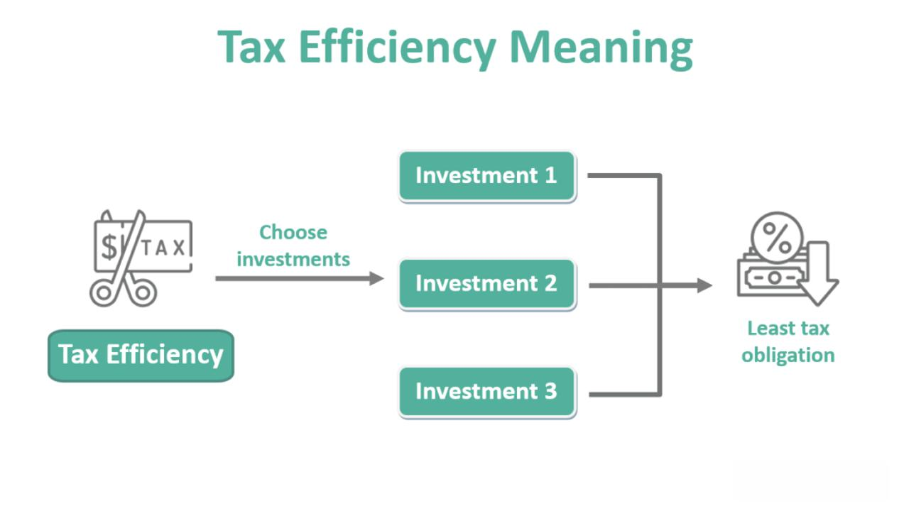

Investing provides a myriad of opportunities catering to both beginners embarking on their financial journeys and seasoned investors seeking to enhance their portfolios. Within this diverse landscape, mutual funds stand out as one of the most favored investment vehicles, primarily due to their inherent diversification and the expertise of professional fund managers overseeing them. By pooling resources from numerous investors, mutual funds offer access to a wide array of assets, which individually might be inaccessible to a typical investor.

At the forefront of informed investment decisions lies an understanding of investment minimums and technological advancements such as algorithmic trading. Investment minimums establish the smallest financial commitment required to partake in a mutual fund, thus playing a pivotal role in shaping investors' portfolio strategies. Meanwhile, algorithmic trading—through its usage of sophisticated computer programs to execute pre-defined trading strategies—has revolutionized the efficiency and execution of trades, increasingly finding a place within mutual funds' operational frameworks.



This article aims to provide insight into the dynamics of investment minimums associated with mutual funds and the impact of algorithmic trading in the contemporary investing environment. By exploring these critical aspects, investors can better navigate the intricate mutual fund landscape and align their investment strategies with their financial objectives. Through a thorough examination of these themes, you will gain the knowledge necessary to make sound investment choices aligned with the ever-evolving financial markets.

## Table of Contents

## Overview of Mutual Funds

Mutual funds are investment vehicles that aggregate capital from numerous investors to construct a diversified portfolio comprising stocks, bonds, or other securities. This pooling of resources allows individual investors to participate in a broad spectrum of investments, which they might not access independently due to capital constraints or lack of expertise.

Professional fund managers administer mutual funds, utilizing their expertise to allocate and manage the fund's assets effectively to meet specific investment objectives. These objectives vary based on the type of mutual fund, the strategy employed, and the risk-return profile targeted by the fund manager.

There are several types of mutual funds, each catering to different investor needs and financial goals:

1. **Equity Funds**: Focus primarily on investing in stocks. These funds can be sector-specific or diversified across industries and are generally suited for investors seeking capital appreciation and willing to accept higher levels of risk.

2. **Bond Funds**: Also known as fixed-income funds, these aim to provide regular income by investing in bonds or other debt securities. They are typically less volatile than equity funds and are preferred by investors seeking stable returns.

3. **Balanced Funds**: These funds invest in a mix of equities and fixed-income securities, aiming to offer a combination of income and capital appreciation. Balanced funds can help investors achieve a balanced risk-reward profile.

Understanding the types of mutual funds and their characteristics aids investors in selecting funds that align with their risk tolerance and long-term financial objectives. For instance, a risk-averse investor might gravitate towards bond funds, while one with a higher risk appetite might choose equity funds.

Mutual funds provide several advantages, making them appealing to a wide array of investors. The primary benefit is diversification; by investing in a variety of securities, mutual funds reduce the risk associated with holding a single security. They also offer [liquidity](/wiki/liquidity-risk-premium), allowing investors to redeem their shares at any time, at the current net asset value (NAV), minus any fees. Furthermore, mutual funds offer convenience, as they are professionally managed, saving individual investors the effort of researching and assembling a diversified portfolio themselves.

Overall, mutual funds serve as a popular investment choice due to their ability to provide diversification, professional management, liquidity, and broad accessibility, thus fitting the needs of both novice and experienced investors.

## Investment Minimum Requirements for Mutual Funds

Investment minimums refer to the lowest threshold of capital that an investor is required to commit to participate in a mutual fund. These requirements can differ significantly across mutual funds, influenced by factors such as the specific type of mutual fund, the policies of the fund management company, and the underlying investment strategy employed.

Mutual funds may have initial minimum investment amounts that range from as low as $500 to $3,000 or higher. For instance, some index funds or target-date funds might set their initial investment limits at the lower end of the spectrum, making them more accessible for investors who are just starting and may have limited capital. Conversely, actively managed funds, renowned for their strategic management aimed at outperforming market indexes, might command higher initial investments, reflecting both their operational complexities and the heightened cost structures often associated with active management.

Understanding these minimums is crucial for investors as they craft their investment portfolios. Acknowledging the diversity in minimum investment requirements can help investors align their selections with their financial capacities and investment goals. Lower minimums can facilitate easier portfolio diversification, enabling investors to distribute their assets across multiple funds and asset classes, thereby mitigating risk. On the other hand, higher minimums might limit the ability to diversify, thereby necessitating careful selection to ensure alignment with broader financial objectives.

As investors consider these factors, they may benefit from establishing a clear understanding of their financial situation and long-term objectives, potentially using tools such as budget analysis or investment calculators. Moreover, staying informed about the mutual fund industry trends and taking into account the guidance provided by financial advisors can support the strategic development of a well-rounded investment portfolio that accommodates both individual capital constraints and market opportunities.

## Impact of Minimum Requirements on Investment Strategy

Investment minimums play a significant role in shaping an investor's strategic approach, especially when it comes to diversification. Diversification is a fundamental principle in investing, aiming to spread exposure across various securities to reduce risk. For investors with limited capital, high minimum investment requirements can pose a substantial barrier to achieving a well-diversified portfolio.

Investors often aim to allocate their capital across multiple mutual funds to mitigate the risk associated with concentrated investments in a single fund or asset class. When mutual funds have lower minimums, it becomes easier for investors to distribute their available capital over a broader range of funds, enhancing diversification and potentially improving risk-adjusted returns. For instance, an investor with $5,000 can invest in multiple funds with low minimums, such as those requiring $500 each, allowing for diversification across various sectors or asset classes.

Conversely, high minimum investment requirements can limit diversification options for small investors. If a mutual fund mandates a minimum investment of $3,000, an individual with $5,000 has fewer opportunities to diversify, as they can realistically consider investing in only one or two funds. This restriction necessitates careful selection of funds that align not only with the investor's financial capacity but also their investment horizon and risk tolerance.

Investors must weigh their financial capacity against desired diversification goals. Here is a simple Python example to illustrate how one might approach this problem programmatically:

```python
def calculate_possible_funds(capital, min_investments):
    return [capital // minimum for minimum in min_investments]

# Example of available capital and minimum investment requirements for various funds
capital_available = 5000
minimum_investments = [500, 1000, 3000]

possible_funds = calculate_possible_funds(capital_available, minimum_investments)
print("Maximum number of funds based on different minimum requirements:", possible_funds)
```

In this example, the investor's capital is divided by the minimum investments of various funds, demonstrating the maximum number of funds into which they could potentially invest. This kind of analysis helps investors understand how minimum requirements interact with their capital constraints.

Understanding and strategically navigating investment minimums enable investors to effectively diversify their portfolios, thereby aligning their investment choices with their broader financial objectives. Adopting strategies that accommodate existing minimum requirements and available capital can enhance an individual's ability to achieve a well-balanced investment portfolio.

 to Algorithmic Trading

Algorithmic trading involves the use of computer programs to automate the process of buying and selling financial instruments based on predetermined criteria. This method of trading harnesses algorithms, which are sets of rules or instructions designed to perform specific tasks, to analyze vast datasets for the identification of market opportunities. These algorithms can process data at a speed and precision far superior to human capabilities, allowing for rapid decision-making and execution of trades in real-time.

The fundamental advantage of [algorithmic trading](/wiki/algorithmic-trading) is its ability to execute trades with high efficiency and minimal delay. This is achieved by eliminating human intervention, thereby reducing the likelihood of manual errors and emotions affecting trading decisions. The incorporation of algorithmic trading has profoundly transformed the market landscape, primarily by increasing the transaction speed and enabling high-frequency trading strategies.

The creation of an algorithmic trading strategy involves multiple components, including the selection of trading signals, which are indicators that prompt the buy or sell decision, the development of rules for order execution, and risk management protocols to safeguard against significant losses. These strategies often rely heavily on statistical models and data analytics.

Historically, algorithmic trading was largely the domain of institutional investors such as hedge funds, investment banks, and proprietary trading firms owing to the significant financial resources and technical expertise required to develop sophisticated trading systems. However, advances in technology have gradually made algorithmic trading more accessible to retail investors. With the advent of user-friendly trading platforms and open-source financial libraries, individuals can now build and deploy their own trading algorithms.

For beginner traders interested in algorithmic trading, Python serves as an excellent starting point due to its simplicity and extensive libraries such as NumPy, pandas, and TA-Lib, which are designed for data manipulation and technical analysis in finance. Here is a basic Python snippet demonstrating a simple moving average crossover strategy, a popular form of algorithmic trading technique:

```python
import pandas as pd

def moving_average_strategy(data, short_window, long_window):
    signals = pd.DataFrame(index=data.index)
    signals['signal'] = 0.0
    signals['short_mavg'] = data['Close'].rolling(window=short_window, min_periods=1, center=False).mean()
    signals['long_mavg'] = data['Close'].rolling(window=long_window, min_periods=1, center=False).mean()
    signals['signal'][short_window:] = np.where(signals['short_mavg'][short_window:] > signals['long_mavg'][short_window:], 1.0, 0.0)   
    signals['positions'] = signals['signal'].diff()
    return signals

# Example usage
# Assuming 'df' is a pandas DataFrame with a datetime index and a column 'Close' for closing prices
short_window = 40
long_window = 100
signals = moving_average_strategy(df, short_window, long_window)
```

This algorithm generates buy signals when the short-term moving average crosses above the long-term moving average, and sell signals when the opposite occurs. While simple, this example illustrates the foundational aspects of algorithmic trading.

As the technology continues to evolve, algorithmic trading is expected to become increasingly sophisticated and widespread, offering potential advantages in trade execution, market analysis, and portfolio management for both institutional and individual investors.

## Role of Algorithmic Trading in Mutual Funds

Mutual fund managers increasingly utilize algorithmic trading as an integral component of their investment strategies. This adoption is primarily driven by algorithms' ability to optimize trade execution, manage large trading volumes efficiently, and reduce transaction costs, making them invaluable in the increasingly complex and fast-paced financial markets.

Algorithmic trading involves using computer programs to execute trades based on pre-defined criteria like price, [volume](/wiki/volume-trading-strategy), or timing. These algorithms can process vast amounts of data quickly, allowing fund managers to seize trading opportunities that might be too rapid for human analysis. For instance, by employing techniques such as statistical [arbitrage](/wiki/arbitrage) and market-making, mutual funds can execute trades at optimal prices, thereby enhancing overall fund performance.

Additionally, algorithmic trading allows for the implementation of complex trading strategies that necessitate precise timing and accuracy, reducing the likelihood of human error. For example, a mutual fund manager might use algorithms to rebalance the fund's portfolio based on real-time market data, taking advantage of temporary discrepancies in asset valuations.

A practical example of algorithmic trading in mutual funds could involve a simple moving average crossover strategy, where trades are executed when a short-term moving average crosses a long-term moving average. This can be implemented in Python as follows:

```python
import pandas as pd

# Load historical price data
data = pd.read_csv('price_data.csv')
data['Short_MA'] = data['Close'].rolling(window=50).mean()
data['Long_MA'] = data['Close'].rolling(window=200).mean()

# Generate trading signals
data['Signal'] = 0
data['Signal'][50:] = np.where(data['Short_MA'][50:] > data['Long_MA'][50:], 1, 0)
data['Position'] = data['Signal'].diff()

# Implement trade executions based on signals
# Use this logic to execute trades within the trading platform using APIs
```

The incorporation of algorithmic trading into mutual fund operations not only enhances execution efficiency but also facilitates cost-effective scaling of investment strategies across global markets. However, successful implementation requires a robust technological infrastructure and constant monitoring to mitigate risks such as algorithm failures or unforeseen market conditions.

As mutual funds continue to integrate algorithmic trading, fund managers are better positioned to navigate the complexities of modern financial markets, ultimately leading to improved fund performance and investor satisfaction.

## Benefits and Challenges of Algorithmic Trading

Algorithmic trading, often referred to as algo trading, has become a significant component of modern financial markets. It offers a plethora of advantages, primary among them being speed, accuracy, and the capacity to process large volumes of data in real-time. By automating trading decisions through sophisticated algorithms, the execution of trades is achieved within milliseconds, which is essential in the fast-paced trading environment where time equates to profit. This automation minimizes human intervention, thereby reducing errors associated with manual trading and enhancing precision in executing complex trading strategies.

One of the core benefits of algorithmic trading is its ability to handle and analyze extensive datasets swiftly. Algorithms can scan multiple data sources, evaluating vast amounts of market information to identify trading opportunities that may not be visible to human traders. This capability allows for the detection of patterns and trends in financial markets, facilitating the development of strategies that capitalize on these observations. The efficiency gained from processing vast data can also translate into improved decision-making, potentially yielding higher returns on investment.

However, algorithmic trading does present several challenges. Technical failures pose a significant risk; systems can encounter software bugs, connectivity issues, or hardware malfunctions, leading to substantial financial losses. The reliance on technological infrastructure means that robust systems and protocols need to be in place to mitigate these risks.

Another challenge associated with algorithmic trading is its potential to increase market [volatility](/wiki/volatility-trading-strategies). Algorithms react to market changes much faster than humans, which can lead to rapid buying and selling actions that amplify price movements. This phenomenon, sometimes referred to as "flash crashes," highlights the double-edged nature of speed in algorithmic trading.

Furthermore, the infrastructure required for effective algorithmic trading is sophisticated and costly. Developing and maintaining these systems require investments in technology and talent, which may be prohibitive for smaller firms or individual investors. This includes investment in high-performance computing resources and skilled personnel capable of designing and managing complex trading algorithms.

Investors considering the integration of algorithmic trading into their portfolios must carefully evaluate these benefits and challenges. While the potential for improved efficiency and profitability is significant, the associated risks and costs must be managed prudently. Balancing these elements is critical to successfully leveraging algorithmic trading to achieve financial objectives. Through informed decision-making and strategic planning, investors can harness the power of algorithms while safeguarding against inherent risks.

## Conclusion

Understanding the minimum investment requirements and the role of algorithmic trading is paramount for modern investors as they navigate the complexities of mutual funds. Investment minimums define the initial financial commitment required for participation, influencing an investor's strategy, especially for those with constrained capital. Selecting funds with appropriate minimums enables broader diversification, ensuring investors can allocate resources effectively to achieve a balanced portfolio.

Algorithmic trading has emerged as a transformative force in mutual funds, offering enhanced speed, precision, and data-processing capabilities. By executing trades based on pre-defined algorithms, mutual fund managers can optimize trade execution, manage voluminous transactions efficiently, and implement strategies with precise timing, reducing human error.

Together, these elements significantly impact investment choices and portfolio management strategies, enabling investors to align their investments more closely with their financial objectives. Harnessing the benefits of algorithmic trading, alongside a comprehensive understanding of investment minimums, equips investors with the tools necessary to reach their financial goals more effectively.

As the financial landscape continues to evolve with technological advancements, ongoing education and adaptability are crucial. Investors must remain informed and agile, ready to integrate new strategies and technologies into their investment approach to remain competitive and successful in the ever-changing world of finance.

## References & Further Reading

[1]: Bergstra, J., Bardenet, R., Bengio, Y., & Kégl, B. (2011). ["Algorithms for Hyper-Parameter Optimization."](https://dl.acm.org/doi/10.5555/2986459.2986743) Advances in Neural Information Processing Systems 24.

[2]: ["Advances in Financial Machine Learning"](https://books.google.com/books/about/Advances_in_Financial_Machine_Learning.html?id=oU9KDwAAQBAJ) by Marcos Lopez de Prado

[3]: ["Evidence-Based Technical Analysis: Applying the Scientific Method and Statistical Inference to Trading Signals"](https://www.amazon.com/Evidence-Based-Technical-Analysis-Scientific-Statistical/dp/0470008741) by David Aronson

[4]: ["Machine Learning for Algorithmic Trading"](https://github.com/PacktPublishing/Machine-Learning-for-Algorithmic-Trading-Second-Edition) by Stefan Jansen

[5]: ["Quantitative Trading: How to Build Your Own Algorithmic Trading Business"](https://books.google.com/books/about/Quantitative_Trading.html?id=j70yEAAAQBAJ) by Ernest P. Chan