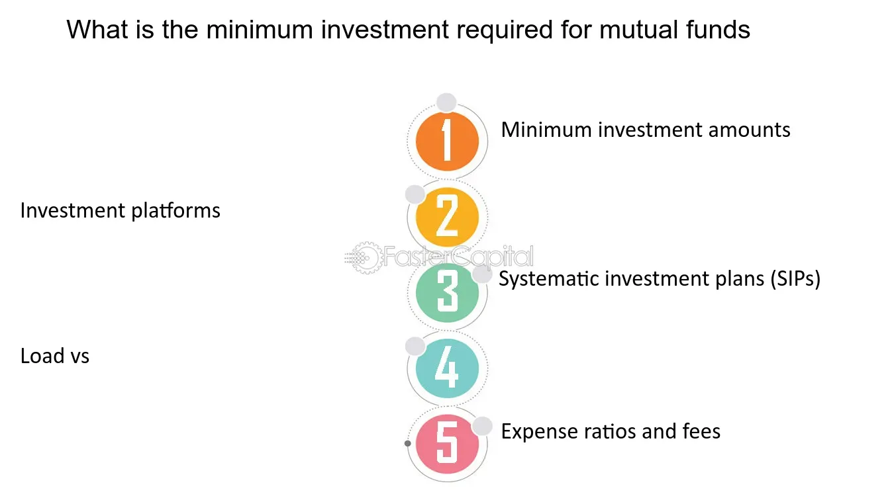

## Table of Contents

## What is a mutual fund?

A mutual fund is a type of investment where many people pool their money together to buy a variety of stocks, bonds, or other assets. It's like a big basket where everyone puts in some money, and a professional manager decides what to buy with it. This makes it easier for people who don't have a lot of money or time to invest in a diverse range of assets on their own.

When you invest in a mutual fund, you buy shares of the fund, and the value of your shares goes up or down based on how well the investments in the fund are doing. Mutual funds can be a good way to spread out your risk because they invest in many different things. This means if one investment does poorly, it might be balanced out by others that do well.

## Why do mutual funds have minimum investment requirements?

Mutual funds have minimum investment requirements because it costs money to manage the fund. The people who run the fund need to pay for things like research, trading, and keeping records. If everyone could invest just a little bit of money, it would be hard to cover these costs. So, by setting a minimum amount, the fund can make sure it has enough money coming in to pay for everything it needs to do its job well.

Also, minimums help keep the fund running smoothly. If too many people were putting in and taking out small amounts of money all the time, it would be hard for the fund managers to make good investment decisions. By having a minimum, the fund can attract investors who are more likely to leave their money in for a longer time. This makes it easier for the managers to plan and invest the money wisely.

## What is the typical minimum investment amount for mutual funds?

The typical minimum investment amount for mutual funds can vary a lot. Some mutual funds might ask for as little as $100 or $500 to start. These are often called "no-load" funds, which means you don't pay a fee to buy or sell them. Other funds might need you to invest $1,000 or even $3,000 to get started. It really depends on the type of fund and the company that runs it.

Sometimes, if you agree to set up automatic monthly investments, the minimum amount can be lower. For example, a fund might let you start with $50 if you promise to add $50 every month. This can make it easier for people who want to invest but don't have a lot of money all at once. So, it's a good idea to check different funds and see what their rules are before you decide where to put your money.

## Are there mutual funds with no minimum investment requirements?

Yes, there are some mutual funds that don't have a minimum investment requirement. These funds are often offered by big companies like Vanguard or Fidelity. They want to make it easy for everyone to start investing, even if you don't have a lot of money. So, they let you put in as little as you want, like $1 or $10.

These no-minimum funds are great for people who are just starting out or who want to invest a little bit at a time. But, you should know that even though there's no minimum to start, there might be other rules. For example, some funds might ask you to keep adding money every month, or they might charge you a fee if you take your money out too soon. So, it's always good to read the rules carefully before you invest.

## How do minimum investment requirements vary between different types of mutual funds?

Minimum investment requirements can be different depending on the type of mutual fund. For example, index funds, which try to match the performance of a market index like the S&P 500, often have lower minimums. Some might let you start with just $100 or even no minimum at all if you agree to invest a little bit each month. On the other hand, actively managed funds, where a person picks the investments, might ask for more money to start. These funds can have minimums of $1,000 or more because they cost more to run.

Also, the company that runs the fund can make a big difference. Big companies like Vanguard or Fidelity might offer funds with low or no minimums to attract more investors. Smaller companies or funds that focus on special things, like investing in a certain country or type of business, might need more money to start. These special funds can have minimums of $3,000 or even higher because they are more expensive to manage and might not get as many investors. So, when you're looking at mutual funds, it's good to check the minimum investment and see if it fits with how much money you have to invest.

## Can the minimum investment requirement be waived, and if so, under what conditions?

Yes, sometimes the minimum investment requirement for a mutual fund can be waived. This often happens if you agree to set up an automatic investment plan. For example, if you promise to put in a little bit of money every month, like $50 or $100, the fund might let you start with less money than their usual minimum. This helps the fund company because they know you'll keep adding money over time.

Another way to get the minimum waived is if you already have other accounts with the same company. If you have a lot of money in other investments with them, they might let you start a new mutual fund with less money. Also, some funds might waive the minimum if you're investing through a retirement plan at work, like a 401(k). It's always a good idea to ask the fund company if they can make an exception for you.

## How do minimum investment requirements affect investment strategies for beginners?

Minimum investment requirements can make it harder for beginners to start investing in mutual funds. If a fund needs a lot of money to start, like $1,000 or more, it might be too much for someone who is just beginning and doesn't have a lot of money saved up. This can make beginners feel left out or make them wait longer before they can start investing. But, it's not all bad news. Some funds have lower minimums or even no minimum if you agree to add a little bit of money every month. This can be a good way for beginners to get started without needing a big chunk of money all at once.

Because of these minimums, beginners might need to be more careful about which funds they choose. They might look for funds with lower minimums or ones that let them start with less money if they set up automatic monthly investments. This can help them spread out their money over time and still get into the market. It's also important for beginners to think about their long-term goals and how much they can afford to invest regularly. By choosing the right funds and sticking to a plan, beginners can start building their investments even if they can't put in a lot of money right away.

## What are the implications of minimum investment requirements for portfolio diversification?

Minimum investment requirements can make it harder for people to have a lot of different types of investments in their portfolio. If each mutual fund needs a big amount of money to start, it can be tough to buy many different funds. This means you might not be able to spread your money out as much as you want. Spreading your money, or diversifying, is important because it can help lower the risk of losing money if one type of investment does badly. So, high minimums can make it harder to have a well-rounded portfolio.

On the other hand, some mutual funds have lower minimums or even no minimum if you agree to add a little bit of money every month. This can help people start investing in different funds without needing a lot of money all at once. By choosing funds with lower minimums, you can slowly build a more diverse portfolio over time. This way, even if you don't have a lot of money to start with, you can still work towards having a mix of investments that can help protect your money and grow it over time.

## How do minimum investment requirements compare between traditional mutual funds and ETFs?

Minimum investment requirements for traditional mutual funds can be higher than for ETFs. Many mutual funds ask for a certain amount of money to start, like $1,000 or more. This can make it hard for people who don't have a lot of money to invest in them. But, some mutual funds have lower minimums or even no minimum if you agree to add a little bit of money every month. This can help more people get started with mutual funds.

ETFs, or exchange-traded funds, usually don't have a minimum investment requirement in the same way. You can buy just one share of an [ETF](/wiki/etf-trading-strategies), and the price of one share can be as low as $50 or even less. This makes it easier for people to start investing in ETFs with less money. So, if you're just starting out and don't have a lot to invest, ETFs might be a better choice because you can buy them one share at a time without needing a big amount of money upfront.

## What are the trends in minimum investment requirements over the past decade?

Over the past decade, there has been a trend towards lowering minimum investment requirements for mutual funds. Many big companies like Vanguard and Fidelity have started offering funds with lower or even no minimums to make it easier for more people to invest. This change has been driven by a desire to attract more investors, especially younger people who might not have a lot of money to start with. By lowering the barriers to entry, these companies hope to help more people begin their investment journey and build their savings over time.

Another trend is the rise of automatic investment plans. Many mutual funds now let you start with a small amount of money if you agree to add a little bit every month. This has made it easier for people to get into the market without needing a big chunk of money all at once. As a result, more people can now invest in a variety of funds and build a diverse portfolio over time, even if they can't afford high minimums upfront.

## How do international mutual funds' minimum investment requirements differ from domestic ones?

International mutual funds often have higher minimum investment requirements than domestic ones. This is because managing an international fund can be more expensive. The fund managers need to deal with different countries' rules, currencies, and markets, which takes more work and money. So, to cover these extra costs, international funds might ask for more money to start, like $2,000 or $3,000 instead of the $1,000 or less that some domestic funds might need.

However, not all international funds have high minimums. Some big companies, like Vanguard or Fidelity, offer international funds with lower or even no minimums if you agree to invest a little bit every month. This makes it easier for people who want to spread their money across different countries but don't have a lot to start with. So, it's good to check different funds and see what their rules are before deciding where to put your money.

## What advanced strategies can investors use to meet minimum investment requirements in high-cost funds?

Investors who want to get into high-cost funds but can't meet the minimum investment requirements right away can use a few smart strategies. One way is to save up money over time until they have enough to meet the minimum. They can put a little bit of money aside each month in a savings account until they reach the amount needed. Another strategy is to look for funds that offer lower minimums if you agree to set up automatic monthly investments. This means you can start with less money if you promise to keep adding a little bit every month.

Another approach is to use a strategy called dollar-cost averaging. This means you invest a fixed amount of money at regular intervals, like every month, instead of putting in a big amount all at once. Over time, this can help you build up to the minimum required for the high-cost fund. Also, some investors might consider pooling their money with family or friends to meet the minimum. By working together, they can invest in the fund and then share the returns based on how much each person put in. These strategies can help investors get into high-cost funds even if they can't meet the minimum right away.

## References & Further Reading

[1]: Bergstra, J., Bardenet, R., Bengio, Y., & Kégl, B. (2011). ["Algorithms for Hyper-Parameter Optimization."](https://dl.acm.org/doi/10.5555/2986459.2986743) Advances in Neural Information Processing Systems 24.

[2]: ["Advances in Financial Machine Learning"](https://books.google.com/books/about/Advances_in_Financial_Machine_Learning.html?id=oU9KDwAAQBAJ) by Marcos Lopez de Prado

[3]: ["Evidence-Based Technical Analysis: Applying the Scientific Method and Statistical Inference to Trading Signals"](https://www.amazon.com/Evidence-Based-Technical-Analysis-Scientific-Statistical/dp/0470008741) by David Aronson

[4]: ["Machine Learning for Algorithmic Trading"](https://github.com/PacktPublishing/Machine-Learning-for-Algorithmic-Trading-Second-Edition) by Stefan Jansen

[5]: ["Quantitative Trading: How to Build Your Own Algorithmic Trading Business"](https://books.google.com/books/about/Quantitative_Trading.html?id=j70yEAAAQBAJ) by Ernest P. Chan