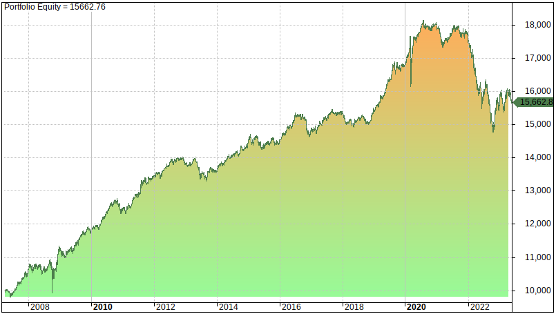

In recent years, the stock market has become significantly more accessible to individual investors. This increased accessibility is largely attributed to the rise of low-cost, easily accessible investment vehicles like Vanguard Exchange-Traded Funds (ETFs) and technological advancements, including algorithmic trading. Vanguard ETFs are popular among investors due to their low-cost structure and ease of access, facilitating participation without requiring substantial initial capital. Unlike traditional mutual funds, they can be traded on major stock exchanges much like individual stocks, providing a flexible investment option that aligns well with diverse financial goals and strategies.

Algorithmic trading, a technology-driven approach to trading securities, has further opened the market to individuals with minimal investment. By automating the trading process using algorithms based on predefined criteria, investors can execute trades more efficiently and with reduced emotional bias, an advantage that historically benefitted only institutional investors. This technological advancement now democratizes sophisticated trading strategies, enabling individual investors to participate more actively and with greater confidence.



This article examines the synergy between Vanguard ETFs and algorithmic trading, focusing on their potential benefits for investors with limited resources. Vanguard's absence of minimum investment requirements for most ETFs allows even the most modest investor to start building a diverse portfolio. At the same time, algorithmic trading can enhance market engagement by providing tools for dynamic and strategic trading decisions. A combination of these elements offers a promising path for individual investors aiming to optimize their financial outcomes, regardless of their initial capital.

We will cover essential topics such as the minimum investment needed for Vanguard ETFs, how algorithmic trading plays a role in today's financial landscape, and a practical guide for getting started with these investment tools. This approach can empower investors to leverage the benefits of low-cost, diversified investments while using technology to maximize market opportunities.

## Table of Contents

## Understanding Vanguard ETFs

Vanguard Exchange-Traded Funds (ETFs) have gained popularity among individual investors, known for their low expense ratios and a wide array of offerings. These funds provide a cost-effective way for investors to gain exposure to a comprehensive range of asset classes, including equities, bonds, and international markets. This broad exposure is facilitated by Vanguard's commitment to passively managed index funds, which generally aim to replicate the performance of a specific index, minimizing the impact of frequent buying and selling.

The low-cost structure of Vanguard ETFs is often attributed to their passive management style. By tracking market indexes, Vanguard can keep the expense ratios significantly lower than those of actively managed funds. These savings are passed on to investors, enhancing their potential long-term growth. For example, with average expense ratios substantially below the industry average [1], the accumulation of savings over time can result in considerable enhancements to an investor’s returns.

Diversification is another essential benefit offered by Vanguard ETFs. By investing in a single Vangaurd [ETF](/wiki/etf-trading-strategies), individuals can own a broad cross-section of a particular index, spreading risk across numerous securities. This diversification reduces the susceptibility of the portfolio to [volatility](/wiki/volatility-trading-strategies) arising from individual stock or bond fluctuations. Moreover, because these ETFs are traded on major stock exchanges, they provide the convenience and [liquidity](/wiki/liquidity-risk-premium) similar to individual stocks, allowing investors to buy or sell shares throughout the trading day at market prices.

Understanding the basics of ETFs, particularly Vanguard's offerings, is crucial for beginner investors aiming to make informed decisions. A basic comprehension of how ETFs operate, including their trading patterns and underlying asset structures, allows investors to strategize effectively according to their financial goals and risk appetite. For those interested in long-term growth, the passive strategy employed by Vanguard often aligns well with investment philosophies that prioritize steady appreciation over short-term gains.

In summary, Vanguard ETFs afford investors access to a diversified, cost-efficient investment tool, enabling broad market participation with minimal costs. Their blend of low expense ratios, ease of trading, and diversification makes them an attractive option for both novice and seasoned investors fostering a long-term growth strategy.

[1] Vanguard's reported average expense ratio: https://investor.vanguard.com/etf/faqs<|vq_14244|>

## Minimum Investment Requirements for Vanguard ETFs

A significant advantage of Vanguard ETFs is that they generally do not impose minimum investment requirements, making them an accessible choice for individual investors. These ETFs can be purchased much like stocks, where investors buy shares at the current market price. This approach allows investors to engage with the stock market with modest capital, expanding their investment portfolios over time as they gain experience and confidence.

The flexibility offered by Vanguard ETFs is particularly beneficial for those who wish to start investing with limited funds. By enabling purchases without minimum thresholds, these ETFs empower investors to incrementally build their holdings. For instance, if the market price of a Vanguard ETF is $100 per share, an investor can acquire as few shares as they can afford, such as purchasing one share for $100, rather than needing a large sum to meet a minimum requirement.

While the absence of a minimum investment is an appealing feature, it is critical to understand potential costs associated with investing in ETFs. Transaction fees, although typically low for Vanguard ETFs, should be considered while budgeting for investments. Investors should also be aware of the expense ratios, which, although generally low, can affect the overall return on investment.

Strategic planning is essential in selecting which Vanguard ETFs to invest in, ensuring that they align with the investor's financial goals. With a broad spectrum of ETFs available, covering various sectors and asset classes, investors should research and assess which options best suit their investment strategy. Evaluating the performance, historical trends, and projected growth of these ETFs will aid in making informed investment decisions.

By understanding these aspects, investors can take advantage of the opportunities presented by Vanguard ETFs, supporting their financial growth objectives with a flexible and cost-effective investment vehicle.

 to Algorithmic Trading

Algorithmic trading, often referred to as algo trading, involves the use of automated systems to execute trades based on a set of pre-established criteria. These systems utilize complex algorithms and leverage technology to [carry](/wiki/carry-trading) out trading actions such as buying or selling financial instruments swiftly. One of the primary advantages of [algorithmic trading](/wiki/algorithmic-trading) lies in its ability to make rapid decisions, often within milliseconds, which can be crucial in highly volatile markets.

By removing the human element from the decision-making process, algorithmic trading significantly reduces the emotional biases that can affect traditional trading methods. Emotions such as fear and greed often lead to irrational trading decisions, and algorithmic systems help mitigate these influences by adhering strictly to the set rules encoded within them.

The emergence of algorithmic trading has fundamentally transformed the way investors interact with stock markets. Originally the domain of large institutional investors, such as hedge funds and investment banks, advancements in technology have democratized access, enabling individual traders to utilize algorithmic strategies. Platforms offering algorithmic services have become more user-friendly, lowering the barrier to entry for retail investors.

Understanding the basics of coding and stock market strategies is beneficial for those looking to harness algorithmic trading. Programming languages such as Python are widely used due to their ease of use and the extensive libraries available for financial data analysis. For instance, a simple trading algorithm to determine the moving average can be implemented as follows in Python:

```python
import pandas as pd

def moving_average_strategy(data, short_window=20, long_window=50):
    signals = pd.DataFrame(index=data.index)
    signals['price'] = data['price']
    signals['short_mavg'] = data['price'].rolling(window=short_window, min_periods=1, center=False).mean()
    signals['long_mavg'] = data['price'].rolling(window=long_window, min_periods=1, center=False).mean()
    signals['signal'] = 0.0
    signals['signal'][short_window:] = np.where(signals['short_mavg'][short_window:] > signals['long_mavg'][short_window:], 1.0, 0.0)
    signals['positions'] = signals['signal'].diff()
    return signals
```

This code snippet calculates the short-term and long-term moving averages of stock prices and generates buy/sell signals based on their crossover points. Such algorithms can be scaled and modified to meet more sophisticated requirements, adapting to multiple trading scenarios.

In summary, algorithmic trading represents a significant evolution in financial markets, providing investors with tools to execute precise and timely trades. With the right technical skills and market understanding, individual traders can employ algorithmic trading to enhance their investment strategies, combining speed and efficiency historically unavailable to non-professional traders.

## How Algorithmic Trading Works with Vanguard ETFs

Algorithmic trading refers to the use of computer programs to execute trades based on predetermined criteria. When applied to Vanguard ETFs, these algorithms can automate processes like purchasing, selling, or holding assets in response to specific market indicators or personalized investment strategies. By removing human emotion from trading decisions, algorithmic trading aims to implement strategies designed to capitalize on market conditions and enhance investment outcomes.

One primary advantage of algorithmic trading with Vanguard ETFs is the ability to achieve diversification. Diversification involves spreading investments across various financial assets to reduce risk. Algorithms can rebalance portfolios automatically, ensuring that they maintain the desired asset allocation when certain conditions are met. For instance, if an ETF's weighting in a portfolio exceeds a predefined threshold due to changes in its market value, an algorithm can trigger a rebalancing action, which might involve selling the over-weighted ETF and redistributing the proceeds to other assets. This process helps maintain the portfolio's risk profile without requiring constant manual adjustments.

Moreover, algorithmic trading can assist in identifying market trends and responding to market volatility far more efficiently than manual trading. Through complex calculations and data analysis, algorithms can detect patterns and make rapid trading decisions, which is vital in fast-moving markets. For example, an algorithm could be programmed to buy or sell Vanguard ETFs based on moving averages, relative strength index (RSI), or other technical indicators. A simple moving average (SMA) crossover algorithm, for example, might look like this in Python:

```python
def moving_average(data, window):
    return data.rolling(window=window).mean()

def trade_signal(prices, short_window=40, long_window=100):
    signals = pd.DataFrame(index=prices.index)
    signals['price'] = prices
    signals['short_mavg'] = moving_average(prices, short_window)
    signals['long_mavg'] = moving_average(prices, long_window)
    signals['signal'] = 0.0
    signals['signal'][short_window:] = np.where(signals['short_mavg'][short_window:] > signals['long_mavg'][short_window:], 1.0, 0.0)  
    signals['positions'] = signals['signal'].diff()
    return signals
```

In this example, the algorithm scans historical price data for a given ETF and uses a short and long moving average to generate buy or sell signals.

Platforms providing algorithmic trading capabilities often include tools and resources to support investors in constructing effective trading models. These platforms can offer [backtesting](/wiki/backtesting) features, allowing users to test their algorithms against historical data to evaluate potential performance before deploying them in live markets. Additionally, educational material and community support services may be available to help traders refine their strategies.

However, successful algorithmic trading requires ongoing supervision and fine-tuning to align with changing market conditions. Algorithms are not infallible; they depend on constant data flow and must be adjusted as market dynamics evolve. This could involve recalibrating parameters or completely revamping the strategy underpinning the algorithm.

Overall, algorithmic trading with Vanguard ETFs presents opportunities to optimize investment strategies through automation and data-driven decision-making, though it demands careful oversight and adaptive management to minimize risks and maximize returns.

## Steps to Start Investing with Vanguard ETFs and Algorithmic Trading

To begin investing with Vanguard ETFs and utilize algorithmic trading, it is essential to first establish clear financial goals and assess your risk tolerance. This foundational step ensures that all subsequent investment decisions align with your overall objectives and comfort with market volatility. Here are the steps to guide you through the process:

1. **Select a Brokerage Platform**: Choose a brokerage that supports both trading Vanguard ETFs and offers functionality for algorithmic trading. Popular platforms often include tools for seamless ETF transactions and the capability to implement automated trading strategies.

2. **Educate Yourself**: Develop knowledge in programming and trading algorithms. Languages such as Python provide robust libraries like pandas, NumPy, and matplotlib, that are beneficial for trading analytics and automation. Several online resources, courses, and forums can assist in building these skills. For instance, a simple moving average strategy might be coded as follows:

    ```python
    import pandas as pd

    def moving_average(data, window_size):
        return data.rolling(window=window_size).mean()

    # Example usage with historical price data for a Vanguard ETF
    prices = pd.Series([100, 102, 101, 104, 102])  # Replace with actual ETF price data
    ma = moving_average(prices, window_size=2)
    print(ma)
    ```

3. **Start Small**: Before committing substantial capital, it is advisable to test algorithmic strategies in a simulated trading environment. Paper trading platforms allow investors to apply their algorithms without real financial risk, facilitating a practical understanding of the strategy's effectiveness under real-time market conditions.

4. **Continuous Review and Adjustment**: Regularly monitor the performance of your trading algorithms and the ETFs in your portfolio. Market dynamics change, requiring updates to strategy parameters such as threshold values or trading signals. This iterative process ensures that your approach remains aligned with evolving financial landscapes.

By following these steps, investors can strategically engage with the stock market, leveraging both the low-cost diversification offered by Vanguard ETFs and the precision of algorithmic trading to potentially enhance investment outcomes.

## Benefits and Risks of Combining Vanguard ETFs with Algorithmic Trading

Combining Vanguard ETFs with algorithmic trading offers numerous advantages that can enhance an investor's portfolio while introducing specific risks that require careful management. By integrating these two financial tools, investors can potentially realize increased efficiency and profitability.

Diversification is a fundamental advantage of using Vanguard ETFs, as they provide exposure to a wide array of asset classes. When combined with algorithmic trading, this diversification can be further refined. Algorithms can be programmed to identify and act on market signals, allowing for timely and precise adjustment of ETF holdings. For example, if an algorithm detects a market condition that indicates a potential downturn in a specific sector, it can automatically rebalance the portfolio by increasing exposure to more stable sectors, thus maintaining or enhancing diversification.

Moreover, algorithmic trading enables the potential generation of passive income. By automating the trading process according to predefined strategies, it minimizes the need for continuous monitoring by the investor. This automation allows algorithms to execute trades based on market data in real-time, potentially capturing gains from short-term market movements that manual traders might miss.

However, these benefits are accompanied by significant risks. One such risk is the possibility of technical failures. The dependence on technology means that any malfunction within the trading platform or algorithm can lead to unintended trades or missed opportunities. Furthermore, incorrect algorithmic models pose another risk. These models rely heavily on underlying assumptions and market data; if assumptions are flawed or if there is a rapid market shift, the algorithm could execute trades that result in financial losses.

To mitigate these risks and optimize returns, continuous innovation and adaptation are crucial. Investors should regularly evaluate and update their algorithms to ensure alignment with current market conditions and their investment objectives. This could include incorporating [machine learning](/wiki/machine-learning) techniques to enable algorithms to learn and evolve over time, improving their predictive accuracy and responsiveness to market changes.

Here's a simple example of Python code to simulate rebalancing a portfolio using algorithmic trading:

```python
import numpy as np

# Define initial portfolio allocations
initial_allocation = np.array([0.4, 0.3, 0.3])  # Example for a portfolio with 3 ETFs

# Define market conditions (simulated)
market_conditions = np.random.rand(3)  # Random market condition factors for demonstration

# Define a threshold for rebalancing
threshold = 0.05  # Rebalance if the change exceeds 5%

# Simulate the algorithm's decision on rebalancing the portfolio
def rebalance_portfolio(allocation, conditions, threshold):
    # Calculate the change required in the portfolio
    change = allocation * conditions

    # Determine if rebalancing is needed
    if np.any(abs(change - allocation) > threshold):
        # Adjust allocations based on market conditions
        new_allocation = allocation + change
        # Normalize to ensure total allocation sums to 1
        new_allocation /= new_allocation.sum()
        return new_allocation
    return allocation

# Run the rebalancing function
adjusted_allocation = rebalance_portfolio(initial_allocation, market_conditions, threshold)
print("Adjusted Portfolio Allocation:", adjusted_allocation)
```

This script provides a simplistic illustration of how an algorithm might decide to rebalance a portfolio based on simulated market conditions and predefined thresholds. In practice, more sophisticated approaches would be employed to include a broader range of market indicators and complex strategies. Overall, the combination of Vanguard ETFs and algorithmic trading represents a powerful investment strategy, balancing the prospects of higher returns with inherent technological and model risks.

## Conclusion

Investors today have unprecedented tools and resources at their disposal, allowing for strategic market engagement that was not accessible just a few years ago. Vanguard ETFs serve as a cornerstone for individual investors seeking a cost-effective, diversified entry into the stock market. With low expense ratios and the ability to access a wide array of asset classes, these ETFs offer a straightforward investment pathway. They allow individuals to establish a diversified portfolio, mitigating risks associated with holding individual stocks while benefiting from general market trends.

When combined with algorithmic trading, these ETFs can greatly enhance investment efficiency. Algorithmic trading provides the advantage of executing trades based on predefined criteria, reducing the emotional biases that often accompany manual trading. By utilizing algorithms, investors can automatically rebalance their portfolios and quickly respond to market volatility, actions that would be challenging to replicate manually. However, this approach requires a solid understanding of both programming and trading concepts, alongside diligent monitoring to ensure the algorithms remain effective under varying market conditions.

This synergistic approach of using Vanguard ETFs with algorithmic trading supports goals of growth and diversification. Investors can create sophisticated strategies that capitalize on both long-term market trends and short-term opportunities by integrating automation into their investment processes. Nevertheless, success in this area demands continuous learning and strategy refinement. As financial markets evolve, staying informed and adapting strategies to align with current trends is essential for optimizing returns and mitigating risks. This ongoing process of learning and adaptation is crucial to navigating the complexities of modern financial markets, ensuring investors maximize their potential in the dynamic environments they operate within.

## References & Further Reading

[1]: ["ETF Basics: Exchange-Traded Funds Guide"](https://www.nerdwallet.com/article/investing/what-is-an-etf) - Investopedia

[2]: ["Advances in Financial Machine Learning"](https://www.amazon.com/Advances-Financial-Machine-Learning-Marcos/dp/1119482089) by Marcos Lopez de Prado

[3]: ["Vanguard ETF Fact Sheet"](https://investor.vanguard.com/investment-products/etfs) - Vanguard

[4]: ["Algorithmic Trading: Winning Strategies and Their Rationale"](https://www.wiley.com/en-us/Algorithmic+Trading%3A+Winning+Strategies+and+Their+Rationale-p-9781118460146) by Ernest P. Chan

[5]: ["Machine Learning for Algorithmic Trading"](https://github.com/PacktPublishing/Machine-Learning-for-Algorithmic-Trading-Second-Edition) by Stefan Jansen