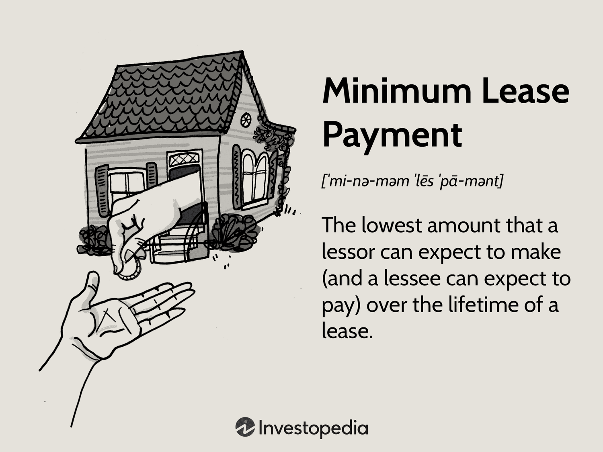

## Table of Contents

## What are minimum lease payments?

Minimum lease payments are the smallest amount of money a person has to pay over the course of a lease agreement. This includes things like the basic rent, any payments for using the asset, and any amounts that must be paid at the end of the lease. It's important because it helps both the person leasing the asset and the owner of the asset understand the least amount of money that will change hands.

These payments do not include things like taxes, insurance, or maintenance costs that might be part of the lease. Knowing the minimum lease payments is useful for budgeting and financial planning. It helps people figure out if they can afford the lease and helps businesses know how much income they can expect from leasing out their assets.

## Why are minimum lease payments important in accounting?

Minimum lease payments are important in accounting because they help businesses figure out how to record leases in their financial statements. When a company leases something, like equipment or a building, it needs to know the total amount it will have to pay over time. This total, called the minimum lease payments, helps the company decide if the lease should be treated as a capital lease or an operating lease. A capital lease is like owning the asset, and it goes on the balance sheet, while an operating lease is more like renting and goes on the income statement.

Knowing the minimum lease payments also helps with budgeting and planning. Companies use this information to predict their future cash flows and make sure they have enough money to cover their lease obligations. This is important for making smart financial decisions and keeping the business running smoothly. By understanding the minimum lease payments, companies can better manage their finances and ensure they are not caught off guard by large lease payments in the future.

## How do minimum lease payments differ from total lease payments?

Minimum lease payments are the smallest amount of money a person has to pay over the course of a lease. This includes the basic rent, any payments for using the asset, and any amounts that must be paid at the end of the lease. They do not include extra costs like taxes, insurance, or maintenance fees that might also be part of the lease agreement. Knowing the minimum lease payments helps people understand the least amount they need to pay to use the asset.

Total lease payments, on the other hand, include everything a person has to pay over the lease term. This means the total lease payments are the minimum lease payments plus any additional costs like taxes, insurance, and maintenance fees. While minimum lease payments give a clear picture of the basic financial commitment, total lease payments show the full cost of leasing the asset. This is important for budgeting and planning, as it helps people see the entire financial impact of the lease.

## What components make up minimum lease payments?

Minimum lease payments are made up of a few key parts. The first part is the basic rent, which is the regular payment you make to use the asset. This could be monthly, quarterly, or any other agreed-upon schedule. The second part is any payments you make for using the asset, like a down payment or a security deposit. These are amounts you pay upfront to start the lease.

The third part of minimum lease payments is any amounts you have to pay at the end of the lease. This could be a final payment or a fee for returning the asset. These end-of-lease payments are included because they are part of the total cost of leasing the asset. Together, these parts make up the minimum lease payments, which are the smallest amount you have to pay over the entire lease term.

## Can you explain the difference between operating and finance leases in relation to minimum lease payments?

When you lease something, it can be an operating lease or a finance lease. The difference between them is how they treat the minimum lease payments. In an operating lease, the minimum lease payments are treated like rent. You just pay to use the asset for a while, and the payments are recorded as expenses on your income statement each month or year. At the end of the lease, you give the asset back, and you don't own it.

In a finance lease, the minimum lease payments are treated more like buying the asset. You record the asset on your balance sheet, and the total of the minimum lease payments is like a loan you have to pay back. Each payment you make reduces the loan and also counts as an expense. At the end of the lease, you might own the asset or have the option to buy it for a small amount. So, the minimum lease payments in a finance lease are part of a bigger plan to eventually own the asset.

## How do you calculate the present value of minimum lease payments?

To calculate the present value of minimum lease payments, you need to know the total of all the minimum lease payments and the interest rate that the lease uses. The present value is what those future payments are worth right now. You take each payment and figure out what it's worth today by using the interest rate to "discount" it. You add up all these discounted payments to get the present value.

For example, if you have to pay $100 every year for 5 years and the interest rate is 5%, you would take each $100 payment and figure out what it's worth now. The first payment is easy because it's already today, so it's worth $100. But the second payment a year from now is worth less, about $95.24 today. You keep doing this for all 5 years, and then add them up. The total present value of those payments would be less than $500 because each future payment is worth less today.

## What is the impact of lease incentives on minimum lease payments?

Lease incentives are things like free rent or money given to you by the landlord to help you start the lease. These incentives can lower the minimum lease payments you have to make. For example, if you get a month of free rent, that month's payment is not part of your minimum lease payments. This makes the total amount you have to pay over the lease term smaller.

When you are figuring out the minimum lease payments, you need to take away the value of any incentives you get. This gives you a true picture of what you will have to pay. It's important because it helps you know how much money you need to budget for the lease. By understanding how incentives affect the minimum lease payments, you can make better decisions about whether the lease is a good deal for you.

## How do changes in interest rates affect the calculation of minimum lease payments?

Changes in interest rates can affect how much you have to pay for a lease. When interest rates go up, the cost of borrowing money goes up too. This means that if your lease payments are based on an interest rate, like in a finance lease, you might have to pay more each month. The higher interest rate makes the total amount you have to pay over the lease term bigger.

On the other hand, if interest rates go down, the cost of borrowing money goes down. This can make your lease payments smaller if they are tied to the interest rate. Lower interest rates mean you pay less over the lease term. It's important to keep an eye on interest rates because they can change how much you have to pay for your lease.

## What are some common methods used to estimate the lease term for calculating minimum lease payments?

When figuring out how long a lease will last, people often look at the time written in the lease agreement. This is the easiest way because it tells you exactly how many months or years the lease will go on for. But sometimes, the lease might have options to renew or end early. If you think you will use these options, you need to guess how long the lease will really last. For example, if you have a 5-year lease but you know you will renew it for another 2 years, you would count the lease term as 7 years.

Another way to estimate the lease term is to think about how long you will actually use the thing you are leasing. If you are leasing a car and you know you will need it for 3 years, that's the term you should use, even if the lease says it's for 5 years. This method helps you plan better because it matches the lease term to your real needs. Both ways of estimating the lease term are important for figuring out the minimum lease payments because they help you know how long you will be making those payments.

## How do you account for residual value guarantees in the calculation of minimum lease payments?

When you lease something, sometimes you have to promise to pay a certain amount if the thing you leased is worth less than expected at the end of the lease. This promise is called a residual value guarantee. If you have to make this promise, you need to add the amount you might have to pay to the total of your minimum lease payments. This makes the total amount you have to pay over the lease term bigger because it includes this possible extra payment.

For example, if you lease a car and you promise to pay $5,000 if the car is worth less than $10,000 at the end of the lease, you need to add that $5,000 to your minimum lease payments. This way, when you are figuring out how much money you need to budget for the lease, you include the chance that you might have to pay more at the end. It's important to think about these guarantees because they can change how much the lease will really cost you.

## What are the tax implications of minimum lease payments for both lessees and lessors?

For lessees, the tax implications of minimum lease payments depend on whether the lease is an operating lease or a finance lease. With an operating lease, the lessee can usually deduct the lease payments as a business expense on their tax return. This means they can lower their taxable income by the amount they pay for the lease each year. On the other hand, with a finance lease, the lessee can deduct both the interest part of the lease payment and the depreciation of the leased asset. This can also help lower their taxable income, but it's a bit more complicated because they need to figure out how much of each payment is interest and how much is for the asset itself.

For lessors, the tax implications are different. When they lease out an asset, they can usually claim depreciation on the asset as a tax deduction. This means they can lower their taxable income by the amount the asset loses value each year. The lease payments they receive from the lessee are considered income, so they have to pay taxes on that money. If the lease is a finance lease, the lessor might also have to report the interest income they earn from the lease payments separately, which can affect their tax situation. Both lessees and lessors need to keep good records of their lease payments and follow the tax rules carefully to make sure they are paying the right amount of taxes.

## How do international accounting standards (like IFRS 16) influence the calculation and reporting of minimum lease payments?

International accounting standards like IFRS 16 have changed how companies report leases. Before IFRS 16, companies could keep some leases off their balance sheets if they were operating leases. But now, IFRS 16 says that most leases need to be on the balance sheet. This means companies have to figure out the present value of the minimum lease payments and show that as a liability on their balance sheet. They also have to show the leased asset on their balance sheet. This makes it easier for people looking at the company's finances to see all the lease commitments.

To calculate the minimum lease payments under IFRS 16, companies need to add up all the payments they have to make over the lease term. This includes the regular rent, any payments for using the asset, and any amounts they have to pay at the end of the lease. They then have to figure out what those future payments are worth right now, using the interest rate in the lease or another rate if the lease doesn't give one. This present value is what goes on the balance sheet. IFRS 16 makes companies more open about their leases, which helps everyone understand the company's financial situation better.

## What are minimum lease payments?

Minimum lease payments represent the minimum financial commitment that a lessee agrees to make to the lessor over the [course](/wiki/best-algorithmic-trading-courses) of a lease agreement. They include the total amount of payments scheduled over the lease's term, excluding any executory costs such as insurance or maintenance, which are not considered part of the minimum lease obligations.

The calculation of minimum lease payments is defined by the present value of these agreed payments. This approach ensures that the time value of money is taken into account. Specifically, the present value concept presumes that a dollar today is worth more than a dollar in the future due to its potential [earning](/wiki/earning-announcement) capacity. To reflect this in lease accounting, future lease payments are discounted back to their present value using a suitable discount rate, often the [interest rate](/wiki/interest-rate-trading-strategies) implicit in the lease, or, if unknown, the lessee’s incremental borrowing rate.

The significance of understanding and calculating minimum lease payments is underscored by accounting standards. The Statement of Financial Accounting Standards No. 13 (FAS 13), which has been superseded by ASC 840 and ultimately by ASC 842, provides guidance on how leases are classified and accounted for. Under these standards, the determination of minimum lease payments is a crucial step in assessing whether a lease should be classified as a finance (capital) lease or an operating lease. This classification impacts both the balance sheet and income statement of the lessee.

The mathematical calculation for minimum lease payments is as follows:

$$
PV = \sum_{t=1}^{n} \frac{PMT_t}{(1 + r)^t} + \frac{RV}{(1+r)^n}
$$

Where:
- $PV$ is the present value of the minimum lease payments.
- $PMT_t$ is the lease payment in each period $t$.
- $r$ is the discount rate (either the rate implicit in the lease or the lessee's incremental borrowing rate).
- $n$ is the number of total lease periods.
- $RV$ is the residual value of the leased asset assumed at the end of the lease term.

Understanding these concepts not only ensures compliance with accounting standards but also aids in strategic financial planning and analysis for businesses and individuals engaging in leasing contracts.

## How do you calculate minimum lease payments?

Minimum lease payments are calculated by determining the present value of the payments that will be made over the lease term, excluding any non-lease components such as taxes, insurance, or maintenance costs. The present value is determined by applying a discount rate to the scheduled lease payments, which adjusts future cash flows to reflect their value in current terms.

The primary components in this calculation are:

1. **Lease Payment for Each Period**: Regular payments made by the lessee to the lessor for the use of the asset. These payments are typically fixed amounts due at regular intervals, such as monthly or annually.

2. **Discount Rate**: This is typically the interest rate implicit in the lease or the lessee's incremental borrowing rate if the implicit rate isn't known. The discount rate is used to calculate the present value of future lease payments. 

3. **Number of Payment Periods**: This refers to the total number of lease payments to be made over the life of the lease.

Furthermore, the residual value of the leased asset at the end of the lease term may also play a role in these calculations, particularly for capital leases. This is the estimated value of the asset once the lease concludes.

The following formula can be used to calculate the present value of minimum lease payments:

$$

PV = \sum_{t=1}^{n} \frac{PMT_t}{(1 + r)^t} + \frac{RV}{(1 + r)^n} 
$$

Where:
- $PV$ is the present value of lease payments.
- $PMT_t$ is the lease payment in period $t$.
- $r$ is the discount rate.
- $n$ is the total number of periods.
- $RV$ is the residual value at the end of the lease term.

Lease classification in financial statements hinges on the present value of these payments. According to accounting standards, if the present value of minimum lease payments covers a substantial portion — generally 90% or more — of the fair value of the leased asset at the commencement date, the lease is typically classified as a capital lease (or finance lease under IFRS). Otherwise, it may be considered an operating lease. This classification affects financial reporting and tax implications, making it crucial for businesses to accurately calculate minimum lease payments.

## How is a lease payment calculated? A case study example.

In this case study, we explore the detailed calculation of lease payments for a company leasing equipment worth $50,000, with a 7% interest rate over a 3-year term. The objective is to compute the monthly depreciation fee, finance charge, and total lease payment. 

### Depreciation Fee

The depreciation fee represents the portion of the leased asset's cost that is amortized over the lease term. This fee is calculated by dividing the capitalized cost by the total number of months in the lease term.

1. **Capitalized Cost**: $50,000
2. **Lease Term**: 3 years or 36 months

$$
\text{Depreciation Fee} = \frac{\text{Capitalized Cost}}{\text{Lease Term (in months)}} = \frac{50,000}{36} \approx 1,388.89
$$

Thus, the monthly depreciation fee is approximately $1,388.89.

### Finance Charge

The finance charge is determined by applying the interest rate to the average of the capitalized cost and the residual value. Assuming the residual value is zero for simplicity, the calculation simplifies to applying the interest rate to the capitalized cost directly.

1. **Interest Rate**: 7% per annum
2. **Monthly Interest Rate**: $\frac{7\%}{12} \approx 0.5833\%$

$$
\text{Finance Charge} = \text{Capitalized Cost} \times \text{Monthly Interest Rate} = 50,000 \times 0.005833 \approx 291.67
$$

The monthly finance charge amounts to approximately $291.67.

### Total Monthly Lease Payment

The total monthly lease payment is the sum of the monthly depreciation fee and the finance charge.

$$
\text{Total Monthly Lease Payment} = \text{Depreciation Fee} + \text{Finance Charge} = 1,388.89 + 291.67 \approx 1,680.56
$$

Consequently, the total monthly lease payment for the equipment is approximately $1,680.56.

### Conclusion

This example highlights how theoretical concepts are utilized in real-world scenarios to calculate lease payments. Understanding how to break down and compute these components is vital for both lessees and lessors in forming efficient lease agreements that align with financial strategies and regulations. 

Analyzing such examples also underscores the importance of accurately considering all relevant costs and interest components to ensure precise financial planning and reporting.

## References & Further Reading

[1]: ["Accounting Standards Codification (ASC) 842: Leases"](https://asc.fasb.org/layoutComponents/getPdf?isSitesBucket=false&fileName=GUID-B634D7F7-44FF-49D9-ABC9-EE1D1A346D77.pdf) by the Financial Accounting Standards Board (FASB).

[2]: Farlex Financial Dictionary. ["Minimum Lease Payment"](https://library.fiveable.me/key-terms/financial-accounting-ii/minimum-lease-payments) definition and overview.

[3]: ["International Financial Reporting Standards (IFRS) 16: Leases"](https://www.ifrs.org/content/dam/ifrs/publications/html-standards/english/2021/issued/ifrs16.html) by the International Accounting Standards Board (IASB).

[4]: ["Algorithmic Trading and DMA: An introduction to direct access trading strategies"](https://archive.org/details/algorithmictradi0000john) by Barry Johnson.

[5]: Higgins, R.C. (2016). ["Analysis for Financial Management"](https://archive.org/details/analysisforfinan0011higg). McGraw-Hill Education.