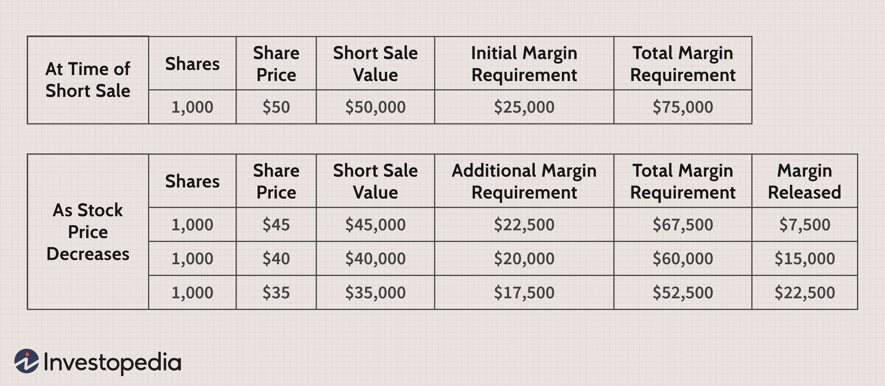

## Table of Contents

## What is the concept of minimum margin in trading?

The concept of minimum margin in trading refers to the smallest amount of money that a trader must have in their account to open a position. This is also known as the initial margin. It acts like a deposit or a security that the trader needs to put down to start trading. The minimum margin requirement is set by brokers and can vary depending on the asset being traded, the broker's policies, and the level of risk involved.

When a trader opens a position, they are essentially borrowing money from the broker to make the trade. The minimum margin ensures that the trader has enough funds to cover potential losses. If the market moves against the trader and the account balance falls below the minimum margin requirement, the broker may issue a margin call. This means the trader must deposit more money into their account to meet the minimum margin, or the broker may close the position to limit further losses.

## How does minimum margin affect trading strategies?

Minimum margin can really change how traders plan their moves. When you know you need a certain amount of money to start trading, it makes you think carefully about how much risk you want to take. If the minimum margin is high, you might decide to trade less often or with smaller amounts because you need more money upfront. This can lead to more conservative trading strategies where you might choose safer investments or use less leverage to avoid big losses.

On the other hand, if the minimum margin is low, it might encourage you to trade more often or take bigger risks. With less money needed to start, you might feel more comfortable trying out different strategies or trading more aggressively. But remember, even with a low minimum margin, you still need to keep an eye on your account balance to avoid margin calls, which can force you to add more money or close your trades early. So, understanding the minimum margin helps you balance risk and reward in your trading plan.

## What are the typical minimum margin requirements for different types of financial instruments?

Minimum margin requirements can vary a lot depending on what you're trading. For stocks, brokers often ask for a minimum margin of around 25% to 50% of the total value of the stocks you want to buy. This means if you want to buy $10,000 worth of stocks, you might need to have $2,500 to $5,000 in your account. For futures contracts, the margin requirements can be much lower, usually between 3% to 12% of the contract's value. So, if you're trading a futures contract worth $100,000, you might only need $3,000 to $12,000 to start.

Forex trading has its own set of rules, with minimum margin requirements often ranging from 0.25% to 2% of the trade's value. This means for a $100,000 [forex](/wiki/forex-system) trade, you might need just $250 to $2,000 to open the position. Options trading can be a bit more complex, with margin requirements that depend on whether you're buying or selling options. Buying options usually requires paying the full premium upfront, while selling options might require a margin of around 15% to 20% of the underlying stock's value. These differences in margin requirements can really affect how you plan your trades and manage your money.

## How can traders calculate the minimum margin for their trades?

To calculate the minimum margin for your trades, you need to know the margin requirement set by your broker for the specific financial instrument you're trading. For example, if you're trading stocks and your broker requires a 50% margin, you would need to have half the value of the stocks you want to buy in your account. So, if you want to buy $10,000 worth of stocks, you would need $5,000 in your account as the minimum margin.

For other types of instruments like futures or forex, the calculation can be different. If you're trading futures and the margin requirement is 5%, and you want to trade a contract worth $100,000, you would need $5,000 in your account. In forex, if the margin requirement is 1%, and you want to trade $100,000, you would need $1,000. Always check with your broker for the exact margin requirements, as they can vary and affect how much money you need to start trading.

## What are the risks associated with trading on minimum margin?

Trading on minimum margin can be risky. When you use the smallest amount of money possible to start a trade, you are using a lot of borrowed money from your broker. This means you are taking on more risk. If the market moves against you, even a small change can wipe out your account quickly because you have less of a cushion to absorb losses. This can lead to a margin call, where you have to add more money to your account fast or your broker will close your trade to limit their risk.

Another risk is that trading on minimum margin can make you more likely to make emotional decisions. When you see your account balance dropping close to the minimum margin, you might panic and make quick trades to try to save your money. This can lead to bad decisions and even bigger losses. It's important to always have a clear trading plan and stick to it, even when trading on minimum margin, to help manage these risks.

## How does minimum margin relate to leverage in trading?

Minimum margin and leverage are closely connected in trading. Leverage is like borrowing money from your broker to make bigger trades than you could with just your own money. The minimum margin is the smallest amount of your own money you need to put down to use this borrowed money. So, if you want to use a lot of leverage, you need to know the minimum margin because that's what you'll need to start the trade.

When you trade with leverage, the minimum margin acts as a safety net for your broker. It makes sure you have enough money in your account to cover possible losses. If the market goes against you, and your account balance gets close to the minimum margin, you might get a margin call. This means you need to add more money or your broker might close your trade to protect themselves. So, understanding the minimum margin helps you manage how much leverage you use and the risks that come with it.

## Can you explain the regulatory aspects of minimum margin requirements?

Regulators set rules about minimum margin to keep trading safe and fair. In the United States, the Federal Reserve sets a rule called Regulation T, which says that traders need to have at least 50% of the value of stocks they want to buy in their account. This is to make sure traders don't take too much risk and to protect the market from big losses. Other countries have their own rules, but they all want to make sure that traders have enough money to cover their trades.

Brokers also have to follow these rules, but they can set their own minimum margin requirements that are higher than what the regulators say. This is because brokers want to protect themselves from losing money if a trader can't pay back what they borrowed. So, even if the law says you need 50% for stocks, your broker might ask for more. It's important for traders to know these rules and how they can affect their trading plans.

## What historical events have influenced changes in minimum margin requirements?

Changes in minimum margin requirements have often been influenced by big events in the economy. One of the most famous times was during the Great Depression in the 1930s. After the stock market crashed in 1929, many people lost a lot of money because they were trading with a lot of borrowed money. To stop this from happening again, the U.S. government made a rule called Regulation T, which said that people needed to have at least 50% of the value of the stocks they wanted to buy in their account. This was to make trading safer and to stop people from taking too much risk.

Another important time was during the 2008 financial crisis. The crisis showed that even with rules in place, too much borrowing could still cause big problems. After 2008, regulators around the world started looking at how to make margin rules even stricter. They wanted to make sure that traders had enough money to cover their trades and to stop another big crash from happening. These changes were all about making the financial system more stable and protecting people from losing too much money.

## How do different brokers set their minimum margin requirements?

Different brokers set their minimum margin requirements based on a few things. One big thing is what the law says they have to do. For example, in the U.S., the government says that for stocks, you need at least 50% of the value of the stocks in your account. But brokers can ask for more than that if they want to. They might do this to protect themselves from losing money if the market goes down and you can't pay back what you borrowed. 

Another thing brokers look at is how risky the thing you want to trade is. If it's something that can change a lot in price quickly, like some futures or forex, they might ask for a higher minimum margin. They want to make sure you have enough money to cover any big losses. Also, some brokers might change their minimum margin requirements based on how much money you have in your account or how much you trade. If you're a big trader with a lot of money, they might let you use less margin because they think you're less risky.

## What strategies can traders use to manage their exposure when trading on minimum margin?

When trading on minimum margin, one good strategy is to use stop-loss orders. A stop-loss order is like a safety net that automatically closes your trade if the price goes against you by a certain amount. This can help you limit your losses and keep your account balance from dropping too low. Another strategy is to not use all of your available margin at once. If you only use a part of it, you'll have some money left to cover any losses or to keep trading if the market moves against you.

Another way to manage your exposure is to keep an eye on your account balance and be ready for margin calls. If your broker tells you that you need to add more money to your account, you should have a plan ready. This might mean having extra money saved up or being ready to close some trades quickly. Also, it's a good idea to diversify your trades. Instead of putting all your money into one thing, spread it out over different types of investments. This can help reduce the risk of losing everything if one trade goes bad.

## How does minimum margin impact portfolio diversification?

Minimum margin can make it harder for traders to diversify their portfolios. When you have to put down a certain amount of money to start a trade, you might not have enough left to buy different kinds of investments. If the minimum margin is high, you might only be able to afford to trade one or two things instead of spreading your money out over many different assets. This means you're putting all your eggs in one basket, which can be risky if the market for that one thing goes down.

On the other hand, if the minimum margin is low, it can be easier to diversify. With less money needed to start each trade, you can use your money to buy a little bit of many different things. This way, if one investment doesn't do well, you still have others that might be doing better. So, understanding the minimum margin helps you decide how to spread your money out and manage your risk better.

## What advanced techniques can be used to optimize trading performance with minimum margin constraints?

One advanced technique to optimize trading performance with minimum margin constraints is to use a strategy called scaling in and out. This means you start with a small trade using just a bit of your available margin. If the trade goes your way, you can add more to it, using more of your margin. But if it goes against you, you can close part of the trade to free up some margin. This way, you can keep trading without using up all your money at once. It helps you stay in the game longer and take advantage of good opportunities while managing your risk.

Another technique is to use a strategy called hedging. Hedging means you make another trade that can help protect you from losses on your first trade. For example, if you buy a stock, you might also buy an option that goes up in value if the stock goes down. This can help you keep your account balance above the minimum margin even if the market moves against you. By using hedging, you can keep trading without worrying as much about margin calls, which can help you make the most of your money and keep your trading going smoothly.

## References & Further Reading

[1]: ["Margin Trading Handbook: Insightful Guide to Leverage and Risk Management"](https://www.schwab.com/learn/story/understanding-margin-and-leverage-trading) by Lawrence Marks

[2]: Federal Reserve Board. ["Regulation T: Credit by Brokers and Dealers."](https://www.ecfr.gov/current/title-12/chapter-II/subchapter-A/part-220)

[3]: ["FINRA - Financial Industry Regulatory Authority."](https://www.finra.org/about)

[4]: Lopez de Prado, M. (2018). ["Advances in Financial Machine Learning."](https://www.amazon.com/Advances-Financial-Machine-Learning-Marcos/dp/1119482089)

[5]: Chan, E.P. (2009). ["Quantitative Trading: How to Build Your Own Algorithmic Trading Business."](https://github.com/ftvision/quant_trading_echan_book) 

[6]: Aronson, D.R. (2006). ["Evidence-Based Technical Analysis: Applying the Scientific Method and Statistical Inference to Trading Signals."](https://www.amazon.com/Evidence-Based-Technical-Analysis-Scientific-Statistical/dp/0470008741)

[7]: Jansen, S. (2020). ["Machine Learning for Algorithmic Trading."](https://github.com/stefan-jansen/machine-learning-for-trading)