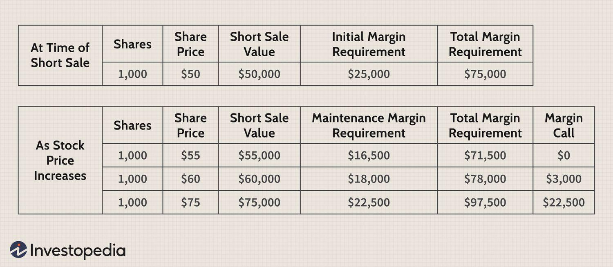

## Table of Contents

## What is a short sale in the context of equities?

A short sale in the context of equities is when an investor borrows shares of a stock from a broker and sells them on the market, hoping to buy them back later at a lower price. The investor makes a profit if the stock price goes down, because they can buy the shares back cheaper than they sold them for. They then return the borrowed shares to the broker and keep the difference as profit.

However, if the stock price goes up instead, the investor loses money. They still have to buy the shares back to return them, but now they have to pay more than they sold them for. This can lead to big losses if the stock price rises a lot. Short selling is considered risky because of this potential for unlimited losses, but it can be a useful strategy for investors who think a stock's price will fall.

## Why are minimum margin requirements important for short sales?

Minimum margin requirements are important for short sales because they help manage the risk involved. When you do a short sale, you borrow stocks and sell them, hoping to buy them back cheaper later. But if the stock price goes up instead, you could lose a lot of money. The minimum margin requirement is like a safety net. It's the minimum amount of money you need to have in your account to cover possible losses. This rule helps make sure you don't lose more money than you can afford to lose.

Brokers use these margin requirements to protect themselves and their clients. If the stock price goes up and your losses get too big, the broker might ask you to put more money into your account. This is called a margin call. If you can't meet the margin call, the broker can close your position to limit the losses. So, minimum margin requirements are there to keep the short selling process safer for everyone involved.

## What is the definition of minimum margin requirements for equities?

Minimum margin requirements for equities are the smallest amount of money you need to have in your account when you want to buy stocks on margin or do a short sale. When you buy on margin, you're borrowing money from your broker to buy stocks. When you do a short sale, you're borrowing stocks to sell them. The minimum margin requirement is set by financial regulators to make sure you have enough money to cover possible losses.

For example, if you want to buy $10,000 worth of stocks on margin, you might need to have at least $2,000 in your account. This $2,000 is the minimum margin requirement. It acts like a safety net. If the stock price goes down and you lose money, the money in your account can help cover those losses. This rule helps keep trading safer for you and your broker.

## How do minimum margin requirements protect investors and the market?

Minimum margin requirements help protect investors by making sure they have enough money in their accounts to cover possible losses. When someone buys stocks on margin or does a short sale, they are borrowing money or stocks from their broker. If the stock price goes down or up in a way that causes losses, the money in the account can help pay for those losses. This means investors are less likely to lose more money than they can afford to lose, which keeps their finances safer.

These requirements also help protect the market by reducing the risk of big losses that could affect other investors and the overall market. If lots of people were allowed to trade without enough money to cover losses, a big drop in stock prices could cause many investors to go bankrupt at the same time. This could lead to panic selling and make the market unstable. By setting minimum margin requirements, regulators help keep the market stable and protect everyone involved from big, unexpected losses.

## What are the current minimum margin requirements set by regulatory bodies for short selling equities?

The current minimum margin requirements for short selling equities are set by the Federal Reserve's Regulation T and the Financial Industry Regulatory Authority (FINRA). According to Regulation T, the initial margin requirement for short selling is 50% of the value of the short sale. This means if you want to short sell $10,000 worth of stock, you need to have at least $5,000 in your account. FINRA also has rules that say the maintenance margin requirement, which is the minimum amount you need to keep in your account after the short sale, is usually 25% to 30% of the value of the short position.

These requirements help make sure that investors have enough money to cover possible losses. If the stock price goes up and your losses get too big, your broker might ask you to put more money into your account. This is called a margin call. If you can't meet the margin call, the broker can close your position to limit the losses. By having these rules, regulators help keep the market stable and protect investors from big, unexpected losses.

## How do minimum margin requirements differ between various stock exchanges?

Minimum margin requirements can be different between various stock exchanges because each country or region might have its own rules set by their financial regulators. For example, in the United States, the Federal Reserve's Regulation T sets the initial margin requirement for short selling at 50% of the value of the short sale. In contrast, the European Union might have different rules based on the European Securities and Markets Authority (ESMA) guidelines, which could set different margin requirements for short selling. These differences reflect the unique financial environments and regulatory priorities of each region.

Some stock exchanges might also have their own additional rules on top of the national or regional regulations. For instance, the New York Stock Exchange (NYSE) and the NASDAQ in the U.S. might follow the federal rules but could also impose stricter maintenance margin requirements, like 25% to 30% of the value of the short position. Similarly, the London Stock Exchange (LSE) might have its own set of rules that align with ESMA but could add specific requirements for its traders. These variations help each exchange manage risk and protect investors according to their specific market conditions and regulatory frameworks.

## What are the consequences of not meeting the minimum margin requirements for a short sale?

If you don't meet the minimum margin requirements for a short sale, your broker might issue a margin call. This means they will ask you to put more money into your account to cover the losses. If you can't add more money, the broker can close your short position to limit the losses. This is done to protect both you and the broker from bigger losses if the stock price keeps going up.

Not meeting the margin requirements can also lead to other problems. If your account falls below the required level, you might not be able to make new trades until you add more money. This can limit your ability to take advantage of other investment opportunities. Plus, if the broker has to close your position, you could end up losing money on the short sale, which can affect your overall financial situation.

## How can an investor calculate the minimum margin required for a specific short sale?

To calculate the minimum margin required for a specific short sale, an investor needs to know the initial margin requirement set by the regulatory body, like the Federal Reserve's Regulation T in the U.S., which is 50% of the value of the short sale. For example, if you want to short sell $10,000 worth of stock, you would need at least $5,000 in your account to meet the initial margin requirement. This means you need to have half the value of the stocks you are short selling in cash or other securities in your account before you can make the trade.

After the short sale, you also need to keep an eye on the maintenance margin requirement, which is usually set by the broker and can be between 25% to 30% of the value of the short position. If the stock price goes up and the value of your short position increases, you might need to add more money to your account to meet this maintenance margin. If you don't, your broker could issue a margin call, asking you to add more funds, or they might close your position to limit losses. So, it's important to keep enough money in your account to cover these requirements and avoid unexpected problems.

## What strategies can investors use to manage their margin accounts effectively when short selling?

When short selling, it's important for investors to keep a close eye on their margin accounts to manage risks. One strategy is to always have more money in the account than the minimum margin requirement. This extra money acts like a cushion. If the stock price goes up and you get a margin call, you'll have the funds ready to add to your account without rushing. Another helpful strategy is to set up stop-loss orders. These are automatic orders to buy back the stock if it reaches a certain price. This can help limit your losses if the stock price goes up a lot.

It's also smart to keep checking the value of your short position and the money in your account. If the stock price starts to go up, you might need to add more money to your account to meet the maintenance margin requirement. Being proactive and adding money before you get a margin call can help you avoid having your broker close your position. Lastly, understanding the risks of short selling and not borrowing too much money can help keep your investments safer. By using these strategies, investors can better manage their margin accounts and reduce the chances of big losses.

## How have minimum margin requirements for short sales evolved historically, and what prompted these changes?

Minimum margin requirements for short sales have changed a lot over time because of big events and changes in the economy. In the early 1900s, there were no set rules for how much money you needed in your account to short sell. This led to a lot of risky trading and big losses, especially during the stock market crash of 1929. After that, the U.S. government stepped in and created rules to make trading safer. In 1934, the Federal Reserve introduced Regulation T, which set the initial margin requirement for short selling at 50% of the value of the short sale. This was a big change to help prevent the kind of risky behavior that led to the crash.

Over the years, these rules have been adjusted to respond to new challenges in the market. For example, during times of high market [volatility](/wiki/volatility-trading-strategies), like in 2008 during the financial crisis, regulators might increase margin requirements to make sure investors have enough money to cover losses. These changes help keep the market stable and protect investors. The rules are always being looked at and updated to make sure they work well with the current financial environment, helping to balance the need for safe trading with the ability to make investments.

## What are the advanced risk management techniques used by professional traders to handle margin requirements in short selling?

Professional traders use several advanced risk management techniques to handle margin requirements when short selling. One key technique is using sophisticated risk models to predict how much the price of a stock might go up. These models help traders figure out how much money they need in their account to cover potential losses. Traders also use something called "stress testing," where they see how their short position would do if the market went through a really bad time. This helps them know if they have enough money to handle big price changes. Another technique is "hedging," where traders buy other investments that can help offset losses if the stock they shorted goes up. This can be like buying options or other securities that gain value when the stock price goes up.

Another important technique is "dynamic margin management." This means traders keep a close eye on their margin account and adjust it as the market changes. If the stock price starts to rise, they might add more money to their account before they get a margin call. This helps them avoid having their broker close their position. Traders also use "portfolio margining," which looks at the overall risk of all their investments, not just the short sale. This can sometimes let them use less money for margin because it takes into account how different investments might balance each other out. By using these techniques, professional traders can manage their margin requirements better and reduce the risk of big losses.

## How do international regulations on minimum margin requirements for short sales compare, and what impact does this have on global trading strategies?

International regulations on minimum margin requirements for short sales can be quite different from one country to another. In the United States, the Federal Reserve sets the initial margin requirement at 50% of the value of the short sale. In Europe, the European Securities and Markets Authority (ESMA) might have different rules, and each country can add its own rules too. For example, in the UK, the Financial Conduct Authority (FCA) might set different margin requirements. These differences mean that traders need to understand the rules in each country they trade in, which can make things more complicated.

These different rules affect how traders plan their global trading strategies. If a trader wants to short sell stocks in different countries, they need to make sure they have enough money in their account to meet the margin requirements in each place. This can limit how much they can trade or where they can trade. Traders might choose to focus on countries with lower margin requirements to save money, or they might use strategies like hedging to manage the risk across different markets. Understanding these international differences is key for traders to manage their risks and make the most of their investments around the world.

## References & Further Reading

[1]: ["Securities Exchange Act of 1934"](https://www.nyse.com/publicdocs/nyse/regulation/nyse/sea34.pdf) by the U.S. Securities and Exchange Commission

[2]: ["Guide to Margin Requirements"](https://m1.com/knowledge-bank/margin-requirements-regulatory-guidelines/) by the Financial Industry Regulatory Authority (FINRA)

[3]: Aitken, M., Harris, F. H. deB., & Mason, S. P. (2007). ["The Impact of Electronic Trading on Bid-Ask Spreads: Evidence from Futures Markets in Hong Kong, London, and Sydney."](https://researchers.mq.edu.au/en/publications/high-frequency-trading-assessing-the-impact-on-market-efficiency-) Journal of Financial and Quantitative Analysis

[4]: Aldridge, I. (2013). ["High-Frequency Trading: A Practical Guide to Algorithmic Strategies and Trading Systems."](https://www.amazon.com/High-Frequency-Trading-Practical-Algorithmic-Strategies/dp/1118343506) Wiley Trading

[5]: Harris, L. (2003). ["Trading and Exchanges: Market Microstructure for Practitioners."](https://academic.oup.com/book/52292) Oxford University Press

[6]: Jones, C. M. (2013). ["What Do We Know about High-Frequency Trading?"](https://papers.ssrn.com/sol3/papers.cfm?abstract_id=2236201) The Annual Review of Financial Economics