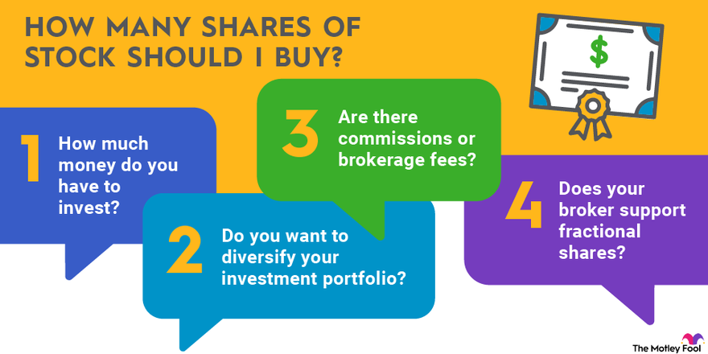

## Table of Contents

## What is the concept of minimum number of shares for purchase?

The concept of the minimum number of shares for purchase is a rule set by some companies or brokers. It means that when you want to buy shares of a company, you have to buy at least a certain number of shares. This number can be different for each company or broker. For example, a company might say you need to buy at least 10 shares at a time. This rule is used to make sure that the costs of handling small orders do not become too high for the company or broker.

This rule can affect how you plan your investments. If you only have a small amount of money to invest, you might not be able to buy shares from a company that has a high minimum share requirement. For instance, if one share costs $100 and the minimum purchase is 10 shares, you need at least $1,000 to invest in that company. Knowing about these minimums can help you decide which companies you can invest in based on how much money you have.

## Why do companies set a minimum number of shares for purchase?

Companies set a minimum number of shares for purchase to make their work easier and less costly. When people buy shares, the company or the broker has to do a lot of work to handle each order. If someone buys just one share, it takes almost as much work as if they bought many shares. By setting a minimum, the company can reduce the number of small orders they have to handle. This saves them time and money because they don't have to process as many transactions.

This rule also helps keep the costs down for everyone. If a company had to handle lots of tiny orders, they might have to charge more fees to cover their costs. By setting a minimum, they can keep their fees lower because they are dealing with fewer, larger orders. This makes it more affordable for people to buy shares, even if they have to buy more at once.

## How does the minimum number of shares affect individual investors?

The minimum number of shares for purchase can make it harder for some people to invest in certain companies. If an investor only has a little money to spend, they might not be able to buy shares from a company that has a high minimum. For example, if a share costs $50 and the minimum purchase is 20 shares, the investor needs at least $1,000. This can limit the choices of where they can put their money, especially if they are just starting to invest.

On the other hand, this rule can also help investors in the long run. By buying more shares at once, they might pay less in fees because the company or broker doesn't have to handle as many small orders. This can make investing more affordable over time. However, it's important for investors to know about these minimums so they can plan their investments wisely and choose companies that fit their budget.

## What are the typical minimum share purchase requirements for different types of stocks?

The minimum number of shares you need to buy can be different depending on the type of stock and the company or broker you are using. For big companies that are well-known, like those in the S&P 500, the minimum is often just one share. This makes it easier for more people to invest in these companies. But some smaller companies or those that are less well-known might have a higher minimum, like 10 or even 100 shares. This is because they want to make sure they don't have to handle too many small orders.

Brokers can also set their own rules about minimum share purchases. Some brokers might let you buy just one share of any stock, while others might have a rule that you need to buy a certain number of shares or spend a certain amount of money. For example, a broker might say you need to buy at least 5 shares or spend at least $500 on your order. Knowing these rules can help you decide which stocks and brokers are best for you based on how much money you have to invest.

## Can the minimum number of shares for purchase change over time?

Yes, the minimum number of shares for purchase can change over time. Companies and brokers can decide to change their rules about how many shares you need to buy. This might happen if they want more people to be able to invest in their company, so they might lower the minimum. Or, they might raise the minimum if they want to handle fewer orders and keep their costs down.

These changes can affect investors. If a company lowers the minimum, more people might be able to buy shares because they don't need as much money. But if the minimum goes up, some people might not be able to invest in that company anymore. It's a good idea for investors to keep an eye on these rules and see if they change, so they can plan their investments the best way possible.

## How do brokerage firms handle minimum share purchase requirements?

Brokerage firms handle minimum share purchase requirements by setting their own rules about how many shares you need to buy. Some brokers might let you buy just one share of any stock, while others might say you need to buy a certain number of shares or spend a certain amount of money. For example, a broker might require you to buy at least 5 shares or spend at least $500 on your order. This helps the broker manage their costs because they don't have to handle as many small orders.

These rules can change over time. A brokerage firm might decide to lower the minimum if they want more people to be able to invest through them. Or, they might raise the minimum if they want to handle fewer orders and keep their costs down. Investors need to know about these rules and any changes to them so they can plan their investments the best way possible. If a broker changes their minimum, it can affect who can buy shares and how much money they need to start investing.

## What are the implications of not meeting the minimum share purchase requirement?

If you don't meet the minimum share purchase requirement, you won't be able to buy the shares you want. This means if a company or broker says you need to buy at least 10 shares and you only want to buy 5, you can't make that purchase. You would have to either find more money to buy the minimum number of shares or look for another company or broker with a lower minimum.

Not being able to meet the minimum can limit your investment choices. If you only have a small amount of money to invest, you might not be able to buy shares in companies that have high minimums. This can be frustrating if you really want to invest in a certain company but can't because of their rules. It's important to know about these minimums so you can plan your investments and choose companies that fit your budget.

## How does the minimum number of shares impact the liquidity of a stock?

The minimum number of shares for purchase can affect how easy it is to buy and sell a stock, which is called its [liquidity](/wiki/liquidity-risk-premium). If a company sets a high minimum number of shares, it might make it harder for people to buy the stock. This is because not everyone can afford to buy a lot of shares at once. When fewer people can buy the stock, there are fewer trades happening, which can make the stock less liquid. This means it might be harder to sell the stock quickly if you need to, because there are fewer buyers.

On the other hand, if a company has a low minimum number of shares, more people can afford to buy it. This can make the stock more liquid because more people are trading it. When more people can buy and sell the stock easily, it's easier to find someone to trade with. This can be good for investors because they can get in and out of their investments more easily. So, the minimum number of shares can play a big role in how liquid a stock is.

## What strategies can investors use to navigate minimum share purchase requirements?

Investors can use a few strategies to deal with minimum share purchase requirements. One way is to save up more money so they can meet the minimum number of shares needed to buy a stock. This might mean waiting a bit longer before they can invest, but it lets them buy the shares they want. Another strategy is to look for companies or brokers with lower minimums. Some companies let you buy just one share, which can be easier on your wallet. By choosing these companies, investors can start investing with less money.

Another approach is to use a broker that offers fractional shares. Fractional shares let you buy a part of a share instead of a whole one. This can help if you can't afford the minimum number of whole shares. For example, if a share costs $100 and the minimum is 10 shares, you would need $1,000. But with fractional shares, you might be able to buy $100 worth of the stock, even if that's less than one full share. This way, you can still invest in the company without meeting the high minimum.

## How do minimum share purchase requirements vary across different markets globally?

Minimum share purchase requirements can be different in different countries and markets around the world. In the United States, many big companies let you buy just one share, which makes it easier for people to start investing. But in some other countries, like in parts of Europe or Asia, some companies might have higher minimums. They might say you need to buy 10 or even 100 shares at once. This can make it harder for people with less money to invest in those companies.

Brokers in different countries also have their own rules about minimum share purchases. In some places, brokers might let you buy any number of shares, even just one. But in other markets, brokers might have rules that you need to buy a certain number of shares or spend a certain amount of money. For example, a broker in one country might say you need to buy at least 5 shares, while a broker in another country might let you buy just one share. Knowing these differences can help investors choose where and how to invest their money based on what they can afford.

## What are the regulatory considerations regarding minimum share purchase requirements?

Regulatory bodies in different countries can have rules about minimum share purchase requirements. These rules are made to protect investors and make sure that everyone can invest fairly. For example, some countries might say that companies can't have too high a minimum number of shares, so more people can buy them. This helps make the market fair for everyone, no matter how much money they have. Regulators might also check that brokers are clear about their minimum purchase rules, so investors know what they need to do before they buy shares.

In some places, regulators might not have strict rules about minimum share purchases. They might let companies and brokers set their own minimums, as long as they follow other rules about being honest and fair with investors. This can mean that the minimum number of shares can be different from one company or broker to another. Investors need to know about these rules in their country and how they might affect their ability to buy shares.

## How do minimum share purchase requirements influence corporate governance and shareholder rights?

Minimum share purchase requirements can affect how a company is run and how much say shareholders have. If a company sets a high minimum number of shares, it might mean fewer people can buy the stock. This can lead to fewer shareholders overall, which might make it easier for a small group of people to control the company. When there are fewer shareholders, it can be harder for individual investors to have a big impact on decisions like who sits on the board of directors or how the company is managed.

On the other hand, if a company has a low minimum share purchase, more people can buy the stock. This can lead to more shareholders, which might make it harder for any one group to control the company. With more shareholders, individual investors might have more power because there are more voices to be heard. This can lead to better corporate governance because the company has to listen to a wider range of shareholders. So, the minimum number of shares can play a big role in how a company is governed and how much say shareholders have in its decisions.

## References & Further Reading

[1]: ["Quantitative Trading: How to Build Your Own Algorithmic Trading Business"](https://www.amazon.com/Quantitative-Trading-Build-Algorithmic-Business/dp/1119800064) by Ernest P. Chan

[2]: ["Advances in Financial Machine Learning"](https://www.amazon.com/Advances-Financial-Machine-Learning-Marcos/dp/1119482089) by Marcos Lopez de Prado

[3]: ["Machine Learning for Algorithmic Trading"](https://www.amazon.com/Machine-Learning-Algorithmic-Trading-alternative/dp/1839217715) by Stefan Jansen

[4]: ["Evidence-Based Technical Analysis: Applying the Scientific Method and Statistical Inference to Trading Signals"](https://www.amazon.com/Evidence-Based-Technical-Analysis-Scientific-Statistical/dp/0470008741) by David Aronson

[5]: Bergstra, J., Bardenet, R., Bengio, Y., & Kégl, B. (2011). ["Algorithms for Hyper-Parameter Optimization."](https://dl.acm.org/doi/10.5555/2986459.2986743) Advances in Neural Information Processing Systems 24.