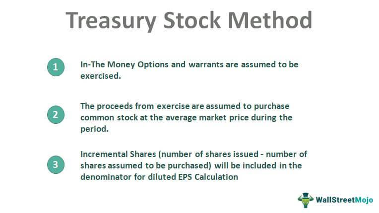

In recent years, algorithmic trading has fundamentally transformed the landscape of stock trading. This advancement has opened the door for investors with minimal capital to participate actively in the markets. Algorithmic trading, often referred to as algo trading, employs sophisticated computer algorithms that automatically execute trades based on pre-established criteria. These criteria can include various parameters such as price, timing, and volume. By utilizing such algorithms, trading becomes a more efficient process—executing complex trading strategies with precision and speed that human traders are generally incapable of achieving.

The rise of algorithmic trading has particularly been significant in democratizing stock investments, making them more accessible to individual retail investors. Traditionally, stock trading was a domain dominated by large institutional investors who had the resources to absorb high transaction costs and leverage economies of scale. However, with the innovations brought by algo trading, even small-scale investors can engage in the stock market with just a few dollars. This is largely due to the introduction of fractional shares and the lowering of barriers to entry by online trading platforms that offer algorithmic tools.



Algorithmic trading aids investors by potentially maximizing returns through strategies that ride on quantitative models, historical data, and real-time analytics. These systems can operate continuously without the limitations of human fatigue, thereby capturing trading opportunities that may arise instantly due to market fluctuations. Moreover, algo trading allows for diversification in investment strategies, accommodating varying risk appetites and investment goals.

For beginner investors, understanding algorithmic trading can seem daunting due to its reliance on complex mathematical models and programming languages. However, many platforms provide user-friendly interfaces and automated tools that simplify this complexity, thus empowering individuals to craft investment plans that suit their financial capabilities and objectives. As investors start small, they can gradually scale their investments, all while leveraging the same tools that enable strategic and informed decision-making.

As we explore the mechanics and benefits of algorithmic trading, this article aims to demystify the process for beginner investors and provide insights into how technology has lowered the barriers to stock market participation. Through informed engagement with algo trading, retail investors stand to harness the potential of this technological advancement, charting a path toward achieving their financial aspirations.

## Table of Contents

## Understanding Algorithmic Trading

Algorithmic trading, often referred to as algo trading, leverages computer algorithms to execute trades at remarkably fast speeds according to pre-defined instructions. These algorithms can manage complex tasks like deciding the timing, price, and quantity of an order, typically based on criteria such as price movements, timing conditions, or mathematical models.

This technology-driven approach offers significant advantages in optimizing trading strategies. Chief among these is the reduction of human error and emotional decision-making, which can lead to suboptimal trades. Algorithms can process large volumes of data with precision, ensuring trades are executed at the most advantageous times without hesitation or bias.

The evolution of [algorithmic trading](/wiki/algorithmic-trading) dates back to the 1970s with the advent of electronic trading platforms. Initially, it catered to institutional investors seeking efficiency and scalability. As technology advanced, the capabilities of algorithms grew, allowing more sophisticated strategies. By the 2000s, with high-frequency trading ([HFT](/wiki/high-frequency-trading-strategies)) gaining prominence, the use of algorithms had become widespread in the financial markets. Today, algo trading accounts for a significant portion of total trading [volume](/wiki/volume-trading-strategy) worldwide, reflecting its integral role in modern markets.

Algorithmic trading has a profound impact on market [liquidity](/wiki/liquidity-risk-premium) and efficiency. It facilitates greater market depth, as algorithms can manage numerous small trades across various assets simultaneously. This increases liquidity, ensuring that markets remain liquid, even at high volumes. Moreover, it enhances pricing efficiency. By responding to market changes in real-time, algorithms can help correct mispricings quickly, maintaining market equilibrium.

The advancement of data analytics and [machine learning](/wiki/machine-learning) has further expanded the capabilities of algorithmic systems. Machine learning algorithms, in particular, can identify patterns and trends from vast datasets, enabling predictive analytics. For example, algorithms can forecast price movements based on historical data analysis and execute trades that align with these predictions. This type of data-driven decision-making is crucial for developing adaptive trading strategies that can respond to dynamic market conditions. 

Python has emerged as a popular programming language for creating and testing algo trading systems, largely due to its simplicity and the extensive libraries available for financial data analysis and machine learning. For instance, libraries like NumPy and pandas assist in handling numerical data, while scikit-learn and TensorFlow are suited for machine learning tasks. A fundamental component of algo trading could be a simple moving average crossover strategy, implemented as follows in Python:

```python
import numpy as np
import pandas as pd

# Example DataFrame for historical prices
data = pd.DataFrame({
    'price': [101, 102, 103, 102, 100, 98, 99, 100, 101, 105]
})

# Calculate short-term and long-term moving averages
short_window = 3
long_window = 5

data['short_mavg'] = data['price'].rolling(window=short_window).mean()
data['long_mavg'] = data['price'].rolling(window=long_window).mean()

# Generate trading signals (1 for buy, 0 for sell)
data['signal'] = 0
data.loc[data['short_mavg'] > data['long_mavg'], 'signal'] = 1
data['positions'] = data['signal'].diff()

print(data)
```

In this example, a buy signal is generated when the short-term moving average surpasses the long-term average, indicating a potential upward trend. Such strategies can be modified and scaled according to the trader's objectives and available data, reflecting the customization capability inherent to algorithmic systems.

Overall, algorithmic trading not only makes trading more systematic and efficient, but it also opens up possibilities for new strategies powered by technology, reshaping how traders and investors operate within financial markets.

## How Algo Trading Enables Minimum Investment

Traditionally, stock investing was often associated with the need for substantial capital, creating barriers for many potential investors. However, algorithmic trading, or algo trading, has dramatically reduced these barriers by introducing the ability to trade fractional shares and automated strategies. Fractional shares allow investors to buy portions of a stock, rather than entire shares, making it possible to invest with much smaller amounts of money. For example, an investor with only $50 can purchase a portion of a stock priced at $500.

Automated strategies further democratize the investment process by executing trades based on predetermined criteria, effectively managing portfolios with minimal human intervention. These strategies are accessible through various trading platforms that now offer integrated algo-trading services with low entry barriers. Platforms such as Robinhood, M1 Finance, and others allow users to engage in algo trading without needing significant initial capital or deep technical expertise.

Robo-advisors also play a crucial role in enabling minimal investment. These are digital platforms that provide automated, algorithm-driven financial planning services with minimal human supervision. Each robo-advisor uses proprietary portfolio management strategies to create customized portfolios based on individual risk tolerance and investment goals. They are particularly beneficial for small investors as they typically have lower fees compared to traditional financial advisors and offer access to diversified portfolios.

Furthermore, automated rebalancing is another key feature that can optimize a small investment portfolio for better returns. Rebalancing involves adjusting the weightings of assets in a portfolio to maintain a desired level of asset allocation. This can be especially important for small portfolios that might otherwise become unbalanced due to market fluctuations. Automation ensures that rebalancing happens on a regular schedule or when certain market conditions trigger adjustments, optimizing the portfolio efficiently and consistently without requiring constant manual oversight.

Python, with its rich ecosystem of libraries, is often used to implement these automated strategies. Here is a simple example of a Python code snippet that checks and rebalances a hypothetical portfolio:

```python
# Example of a simple portfolio rebalancing script
import numpy as np

# Define target portfolio allocation
target_allocation = {'Stock_A': 0.5, 'Stock_B': 0.3, 'Stock_C': 0.2}

# Current portfolio values
portfolio_values = {'Stock_A': 1500, 'Stock_B': 1000, 'Stock_C': 500}

# Calculate total value
total_value = sum(portfolio_values.values())

# Check current allocation
current_allocation = {stock: value / total_value for stock, value in portfolio_values.items()}

# Rebalance function
def rebalance_portfolio(target, current, total):
    adjustments = {}
    for stock in target.keys():
        target_value = total * target[stock]
        current_value = total * current[stock]
        adjustments[stock] = target_value - current_value
    return adjustments

# Calculate needed adjustments
needed_adjustments = rebalance_portfolio(target_allocation, current_allocation, total_value)

print("Rebalancing Adjustments Required:", needed_adjustments)
```

Investors can use similar strategies and tools to automate their trades, manage portfolios more effectively, and help overcome traditional investment barriers. With continued innovations in algorithmic technology, the landscape of investment will likely continue to evolve, providing even more opportunities for those with minimal capital to participate in stock markets.

## Benefits and Risks of Algo Trading for Small Investors

Algorithmic trading offers significant benefits for small investors, making it possible to invest with increased precision and cost-efficiency. By automating trading decisions, algorithmic strategies reduce the likelihood of human error and emotional biases, ensuring that trades are executed at optimal times based on predefined criteria. This automation is particularly beneficial for small investors as it lowers transaction costs and facilitates participation in the stock market with minimal capital.

The ability to analyze large volumes of data quickly allows algorithms to detect patterns and make informed trading decisions. This precision can result in better pricing and improved execution when entering or exiting positions. Algorithmic trading also provides small investors with access to sophisticated strategies such as [arbitrage](/wiki/arbitrage), [market making](/wiki/market-making), and [trend following](/wiki/trend-following), which can be difficult to employ manually without extensive resources or expertise.

However, algorithmic trading is not without risks. Market [volatility](/wiki/volatility-trading-strategies) can result in significant losses, especially if the algorithm is not designed to respond appropriately to sudden market shifts. Additionally, system-related issues, such as software bugs or connectivity problems, can lead to unexpected outcomes or missed trading opportunities. These risks underline the importance of due diligence when selecting algorithmic models and trading platforms.

Selecting the right algorithm and platform is crucial for small investors. It's essential to ensure that the algorithms align with individual risk tolerance and investment goals. Investors should evaluate platform reliability, security features, and support services before committing funds. Balancing algorithmic trading with traditional investment strategies can also mitigate risks. By diversifying strategies, investors can reduce dependency on automated systems and adapt to changing market conditions.

Risk management is fundamental when starting with minimal investments. Small investors should implement stop-loss orders to limit potential losses and continuously monitor the performance of their algorithmic strategies. Setting realistic expectations, such as acknowledging market limitations and the potential for drawdowns, can prevent discouragement during initial phases.

Educational resources and demo accounts are invaluable tools for newcomers. They allow investors to gain hands-on experience without the financial risk, providing a sandbox environment to test strategies and improve their understanding of market dynamics. By leveraging these resources and continuously educating themselves, small investors can navigate the complexities of algorithmic trading more effectively. 

In summary, while algorithmic trading presents several advantages for small investors, acknowledging its potential risks is paramount. Thoughtful preparation, continuous learning, and strategic diversification can help investors harness the full potential of algorithmic trading while safeguarding their investments.

## Steps to Begin Algo Trading with Minimal Investment

To begin algorithmic trading with minimal investment, selecting the right trading platform is crucial. Start by identifying platforms that cater to small-scale investors and offer robust algorithmic trading features. Look for platforms with low account minimums, competitive fees, and integrated tools for algorithm execution. Popular platforms like Robinhood, [Interactive Brokers](/wiki/interactive-brokers-api), and E*TRADE offer such features, but it's essential to compare their offerings to find the best fit for your needs.

Once you've selected a platform, the next step is to set up your account. This typically involves providing personal information, funding your account with the required minimum deposit, and choosing whether to use built-in robo-advisors or designing custom algorithms. Robo-advisors automate investment management based on predefined strategies, which is ideal for beginners. For those interested in custom algorithms, platforms often offer coding environments with access to various financial data. Here’s a simple illustrative example in Python using the Alpaca API to buy stocks when a certain condition is met:

```python
import alpaca_trade_api as tradeapi

# Initialize API connection
api = tradeapi.REST('APCA-API-KEY-ID', 'APCA-API-SECRET-KEY', base_url='https://paper-api.alpaca.markets')

# Define simple buy condition
def buy_signal(stock):
    barset = api.get_barset(stock, 'minute', limit=5)
    bars = barset[stock]
    return bars[-1].c > bars[0].o  # Buy if the most recent close price is higher than the open price

# Place an order if condition is met
stock = "AAPL"
if buy_signal(stock):
    api.submit_order(
        symbol=stock,
        qty=1,
        side='buy',
        type='market',
        time_in_force='gtc'
    )
```

Education is pivotal in algorithmic trading. Familiarize yourself with the functionalities of the platform through tutorials and guides it offers. Utilize demo accounts—also known as paper trading—as a risk-free method to practice strategies without using real money. This hands-on experience is invaluable for understanding market dynamics and refining your algorithms.

For those interested in coding or tweaking algorithmic parameters, mastering the basics of programming can be advantageous. Languages such as Python, widely used in financial markets for their powerful libraries (e.g., NumPy, Pandas), are useful. Online educational resources, including platforms like Coursera, Udemy, and Khan Academy, provide structured courses on programming and financial algorithms.

Engaging with support communities and online forums can further enrich your learning journey. Websites such as QuantConnect, Quantopian (now part of Robinhood), and Stack Exchange offer vibrant communities where traders exchange insights and discuss strategies. Regular participation in these forums can keep you updated on the latest developments in algorithmic trading.

Finally, staying informed about ongoing market trends is essential. Subscribing to newsletters, reading financial news, and listening to podcasts specializing in algorithmic trading can provide expert analysis and market insights, crucial for adapting strategies to changing market conditions. With these steps, even novice investors can embark on algorithmic trading with minimal investment, leveraging technology for potential financial growth.

## Conclusion

Algorithmic trading has reshaped the financial landscape, providing significant opportunities for investors, especially those who wish to begin with limited funds. By leveraging technology and sophisticated algorithms, small investors can participate in the stock market more effectively than ever before. This innovative approach allows individuals to create tailored investment strategies, aimed at achieving specific financial goals with greater precision and efficiency.

For those starting with minimal capital, it is essential to take a structured approach. Begin by educating yourself on how algorithmic trading functions and the various strategies that can be employed. This foundational knowledge is vital for understanding the risks and rewards involved. Furthermore, as the financial markets evolve and algorithmic trading techniques advance, maintaining an ongoing commitment to learning is crucial.

Starting small and gaining experience incrementally can be beneficial. Utilizing demo accounts and engaging with supportive online communities can provide practical insights and confidence before committing real capital. Additionally, adapting strategies in response to market changes is key to long-term success. This adaptability allows investors to optimize their portfolios continually and remain competitive.

In an automated trading environment, due diligence is indispensable. Thorough research is necessary to select reliable algorithmic models and trusted trading platforms. Striking a balance between algorithmic and traditional investment methods can also mitigate potential risks while enhancing portfolio performance.

Looking ahead, the future of algorithmic trading promises further democratization of investment opportunities. As technology continues to advance and accessibility improves, a broader range of investors will be able to exploit these tools to their advantage. Nevertheless, it is imperative to approach this potential with caution, ensuring that strategic decisions are informed and deliberate.

In conclusion, while algorithmic trading opens doors to new financial possibilities, success hinges on continuous learning, prudent research, and strategic adaptation. By embracing these principles, small investors can effectively harness the power of algorithmic trading to achieve their financial aspirations in an increasingly automated world.

## Additional Resources

### List of Recommended Books on Algorithmic Trading and Investing

1. **"Algorithmic Trading: Winning Strategies and Their Rationale" by Ernest P. Chan** - This book provides a detailed insight into different algorithmic trading strategies with a focus on practical implementation.
2. **"Quantitative Trading: How to Build Your Own Algorithmic Trading Business" by Ernie Chan** - A comprehensive guide for those interested in developing their own trading algorithms and understanding market microstructure.
3. **"Algorithmic Trading and DMA: An Introduction to Direct Access Trading Strategies" by Barry Johnson** - Offers a thorough overview of algorithmic trading techniques alongside an exploration of Direct Market Access processes.
4. **"Advances in Financial Machine Learning" by Marcos Lopez de Prado** - Integrates machine learning techniques with algorithmic trading, valuable for those eager to explore cutting-edge methodologies.

### Links to Online Courses and Webinars Focused on Algo Trading for Beginners

- **Coursera's "Machine Learning for Trading Specialization"** - An online course series by Georgia Tech, combining finance principles and machine learning concepts.
- **"Algorithmic Trading for Beginners" on Udemy** - Offers practical exposure to the basics for those who want to enter algorithmic trading.
- **edX's "Algorithmic Trading and Finance Models with Python, R, and Stata"** - Taught by instructors from the University of Michigan, this course introduces algorithmic trading methodologies using popular programming languages.

### Compilation of Websites and Forums

- **QuantConnect (www.quantconnect.com)** - A collaborative platform offering quantitative resources, backtesting services, and algorithms shared by an active community.
- **Quantitative Finance (Quantitative Finance Forum on Reddit)** - This forum allows traders to share knowledge, experiences, and code related to quantitative finance and trading.
- **Elite Trader (www.elitetrader.com)** - Offers discussion threads on various trading strategies and provides a diverse range of perspectives from active traders.

### References to Financial Regulations and Best Practices for Algo Trading

- **The U.S. Securities and Exchange Commission (www.sec.gov)** - Provides guidelines on trading compliance and regulatory practices specific to algorithmic trading. 
- **The European Securities and Markets Authority (ESMA) Guidelines** - Offers frameworks within which algorithmic and high-frequency trading firms should operate to ensure market integrity.

### Suggestions for Newsletters and Podcasts

- **"Trading the Markets" Podcast by IG** - Provides insights into trading strategies and market movements with contributions from industry professionals.
- **"Quantitative Finance" Newsletter on Substack** - Covers a broad array of topics within quantitative finance, including algorithmic trading trends and innovations.
- **"Algorithmic Trading & Quantitative Strategies" Financial Times Newsletter** - Keeps subscribers updated with the latest news and research from the world of finance and trading algorithms.

These resources offer a comprehensive foundation for those interested in exploring algorithmic trading from an educational, practical, and regulatory perspective.

## References & Further Reading

[1]: Chan, E. P. (2009). ["Quantitative Trading: How to Build Your Own Algorithmic Trading Business"](https://github.com/ftvision/quant_trading_echan_book). John Wiley & Sons.

[2]: Chan, E. P. (2013). ["Algorithmic Trading: Winning Strategies and Their Rationale"](https://github.com/ftvision/quant_trading_echan_book). John Wiley & Sons.

[3]: Johnson, B. (2010). ["Algorithmic Trading and DMA: An Introduction to Direct Access Trading Strategies"](https://archive.org/details/algorithmictradi0000john). 4Myeloma Press.

[4]: Lopez de Prado, M. (2018). ["Advances in Financial Machine Learning"](https://www.amazon.com/Advances-Financial-Machine-Learning-Marcos/dp/1119482089). Wiley.

[5]: Aronson, D. R. (2006). ["Evidence-Based Technical Analysis: Applying the Scientific Method and Statistical Inference to Trading Signals"](https://www.amazon.com/Evidence-Based-Technical-Analysis-Scientific-Statistical/dp/0470008741). Wiley.

[6]: Jansen, S. (2020). ["Machine Learning for Algorithmic Trading"](https://github.com/stefan-jansen/machine-learning-for-trading). Packt Publishing.

[7]: U.S. Securities and Exchange Commission. ["Algorithmic Trading Compliance"](https://blog.counselstack.com/algorithmic-trading-regulations-compliance-risk-controls/).

[8]: European Securities and Markets Authority (ESMA). ["Guidelines on Systems and Controls in an Automated Trading Environment"](https://www.esma.europa.eu/document/final-report-guidelines-systems-and-controls-in-automated-trading-environment-trading).

[9]: Coursera. ["Machine Learning for Trading"](https://www.coursera.org/specializations/machine-learning-trading).

[10]: QuantConnect. ["Algorithmic Trading & Quant Strategies"](https://www.quantconnect.com/docs/v2/writing-algorithms/strategy-library).