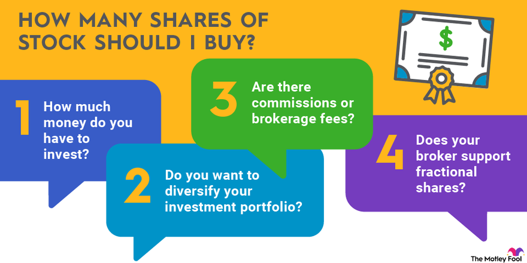

## Table of Contents

## What is the concept of minimum number of shares purchasable?

The concept of the minimum number of shares purchasable refers to the smallest amount of shares that an investor can buy in a company. This rule is set by the company itself and can vary depending on the stock. For example, some companies might allow investors to buy just one share, while others might require a minimum purchase of 100 shares. This rule is important because it helps companies manage their shareholder base and can affect how accessible their stock is to the general public.

Understanding the minimum number of shares purchasable is crucial for investors, especially those with limited funds. If a company sets a high minimum, it might be out of reach for smaller investors. On the other hand, a low minimum can make it easier for more people to invest. This can influence an investor's decision on whether to buy a particular stock, as they need to consider if they can afford the minimum purchase and if it fits their investment strategy.

## Why is it important to know the minimum number of shares one can buy?

Knowing the minimum number of shares you can buy is important because it helps you figure out if you can afford to invest in a certain company. If a company says you need to buy at least 100 shares, and each share costs $50, you would need $5,000 just to start. This can be a lot of money, especially if you are a small investor. By knowing the minimum, you can plan your investments better and make sure you are not spending more than you can afford.

It also affects how easy it is for you to become a shareholder. Some companies might let you buy just one share, which makes it easier for more people to invest. If a company has a high minimum, it might keep smaller investors away. This can be important if you want to own a piece of a company but don't have a lot of money to spend. Understanding the minimum number of shares helps you decide if a stock is right for you and fits your investment goals.

## How does the minimum number of shares purchasable affect investment strategies?

The minimum number of shares you can buy can really change how you plan your investments. If a company says you need to buy a lot of shares to start, it might be too expensive for you. This means you might have to look for other companies where you can buy fewer shares. For example, if you only have $1,000 to invest, you might choose a company that lets you buy one share for $1,000 instead of one that makes you buy 10 shares at $100 each.

Also, knowing the minimum can help you spread your money around. If you can buy just a few shares of many different companies, you can have a more varied investment plan. This is called diversification, and it can help lower your risk. But if the minimum is high, you might have to put all your money into one company, which can be riskier. So, understanding the minimum number of shares helps you decide how to best use your money and manage your investment risks.

## What factors determine the minimum number of shares that can be purchased?

Companies decide the minimum number of shares you can buy based on a few things. One big reason is how they want to manage their shareholders. If a company wants to keep the number of shareholders small, they might set a high minimum. This means only people with more money can buy their shares. Another reason is the cost of keeping track of shareholders. It can be expensive for a company to deal with a lot of small investors, so they might set a higher minimum to make it easier and cheaper for them.

Also, the type of stock can affect the minimum number of shares. Some stocks are meant for big investors like banks or investment funds, so the minimum might be high. Other stocks are made for regular people to buy, so the minimum might be lower. The company's goals and the kind of investors they want can really change how many shares you need to buy to get started.

## Can the minimum number of shares purchasable vary between different brokers?

The minimum number of shares you can buy can be different depending on which broker you use. Sometimes, a company might say you can buy just one share, but your broker might have their own rules. They might make you buy more shares than the company says, or they might let you buy less. It all depends on the broker's rules and what they think is best for their business.

This can be important for you as an investor because it might change where you decide to buy your shares. If one broker lets you buy fewer shares and that fits your budget better, you might choose that broker. But if another broker has a higher minimum that you can't afford, you might have to look somewhere else. So, it's a good idea to check with different brokers to see what their rules are before you decide where to invest your money.

## How does the price per share influence the minimum number of shares one can buy?

The price per share can affect the minimum number of shares you can buy because it changes how much money you need to start investing. If a share costs a lot of money, like $1,000, and the company says you need to buy at least 10 shares, you would need $10,000 just to get started. But if the share price is lower, like $10, and the minimum is still 10 shares, you would only need $100. So, the price per share can make a big difference in whether you can afford to buy the minimum number of shares.

Sometimes, companies might set a higher minimum number of shares if the price per share is low. They do this to make sure they still get enough money from each investor. For example, if a share costs $1, a company might say you need to buy 1,000 shares to start, which would still be $1,000. This way, even with a low share price, the company can control how much money they get from new investors.

## What are the implications of fractional shares on the minimum number of shares purchasable?

Fractional shares change the game when it comes to the minimum number of shares you can buy. Before fractional shares, if a company said you needed to buy at least 10 shares, and each share cost $100, you had to spend $1,000 to start. But with fractional shares, you can buy a piece of a share. So, if you only have $100, you can still invest in the company by buying one-tenth of a share. This makes it a lot easier for people with less money to invest in stocks that might have been too expensive before.

Fractional shares also mean that companies don't need to set a high minimum number of shares to make sure they get enough money from each investor. If a company's shares are expensive, like $1,000 each, they might not need to say you have to buy 10 shares because people can just buy a part of a share. This can help more people invest in the company and make the stock market more open to everyone. But, not all brokers offer fractional shares, so it's important to check with your broker to see if they let you buy them.

## How do different stock markets around the world handle the minimum number of shares purchasable?

Different stock markets around the world have their own rules about the minimum number of shares you can buy. In the United States, for example, many companies let you buy just one share, but some might have a higher minimum. The New York Stock Exchange and NASDAQ don't have a set rule for all companies, so it depends on what each company decides. In Europe, the rules can be different too. For example, on the London Stock Exchange, some companies might let you buy one share, while others might have a higher minimum. It's important to check the rules for each company you're interested in.

In Asia, the rules can also vary. On the Tokyo Stock Exchange in Japan, some companies might have a minimum number of shares you need to buy, but it's often not very high. In China, the Shanghai and Shenzhen stock exchanges might have different rules for different types of stocks. Some stocks might be easier to buy with a low minimum, while others might need you to buy more shares. No matter where you are, it's a good idea to look up the specific rules for the stock market and the company you want to invest in.

## What are the historical trends in the minimum number of shares purchasable?

In the past, the minimum number of shares you could buy was often set higher than it is now. Many years ago, companies might say you needed to buy 100 shares to start. This was because they wanted to keep the number of shareholders small and make it easier to manage their investors. Back then, the stock market was mostly for big investors like banks and rich people, so a high minimum didn't keep many people out. But as more regular people started to want to invest, companies began to lower the minimum number of shares you could buy.

Over time, the trend has been to make it easier for more people to buy stocks. Today, many companies let you buy just one share, which makes investing more open to everyone. The rise of online brokers and new technology has also helped. Now, you can even buy a piece of a share with something called fractional shares. This means you don't need a lot of money to start investing. The rules can still be different for each company, but overall, it's gotten a lot easier for people to buy stocks than it was in the past.

## How can investors work around the minimum number of shares purchasable to optimize their portfolios?

Investors can work around the minimum number of shares by choosing companies that let you buy just one share or by using brokers that offer fractional shares. If a company says you need to buy 100 shares and you can't afford that, you might look for another company with a lower minimum. Or, if your broker lets you buy fractional shares, you can still invest in the company you want even if you can't buy a whole share. This way, you can put your money into different companies and spread out your risk, which is called diversification.

Another way to optimize your portfolio is to save up until you can meet the minimum number of shares for the stocks you want. If you really want to invest in a company with a high minimum, you might need to wait and save more money. While you're saving, you can invest in other companies with lower minimums to keep your money working for you. By being smart about which companies and brokers you choose, you can make the most of your money and build a strong investment portfolio.

## What are the regulatory considerations regarding the minimum number of shares purchasable?

Regulatory bodies like the Securities and Exchange Commission (SEC) in the United States don't set a specific rule for the minimum number of shares you can buy. Instead, they make sure companies follow rules about how they sell their shares. Companies can decide their own minimum, but they have to be clear about it and treat all investors fairly. This means they can't change the minimum just to keep some people out. The SEC wants to make sure the stock market is fair for everyone, so they watch how companies set their rules.

In other countries, the rules can be different. For example, in Europe, the European Securities and Markets Authority (ESMA) helps make sure the stock market is fair and clear. They don't set a specific minimum number of shares either, but they make sure companies follow the rules of their local stock exchanges. Some countries might have their own rules about minimum shares, so it's important for investors to know the rules where they live. This helps everyone understand what they need to do to buy shares and keeps the market fair.

## How might future technological advancements impact the minimum number of shares purchasable?

Future technological advancements could make it even easier for people to buy shares. Right now, you can buy fractional shares, which means you can own a piece of a share instead of a whole one. In the future, new technology might make it even simpler to buy and sell these small pieces of shares. This could mean that the minimum number of shares you need to buy might not matter as much, because you could buy just a tiny bit of a share. This would help more people invest, even if they don't have a lot of money.

Also, technology might change how companies and brokers set their rules. With better computers and online systems, it could be easier for companies to handle a lot of small investors. This might make them more likely to lower the minimum number of shares you can buy, because it won't be as hard for them to keep track of everyone. As technology keeps getting better, it could make the stock market more open to everyone, no matter how much money they have.

## References & Further Reading

[1]: Chan, E. P. (2009). ["Quantitative Trading: How to Build Your Own Algorithmic Trading Business"](https://github.com/ftvision/quant_trading_echan_book). John Wiley & Sons.

[2]: Chan, E. P. (2013). ["Algorithmic Trading: Winning Strategies and Their Rationale"](https://github.com/ftvision/quant_trading_echan_book). John Wiley & Sons.

[3]: Johnson, B. (2010). ["Algorithmic Trading and DMA: An Introduction to Direct Access Trading Strategies"](https://archive.org/details/algorithmictradi0000john). 4Myeloma Press.

[4]: Lopez de Prado, M. (2018). ["Advances in Financial Machine Learning"](https://www.amazon.com/Advances-Financial-Machine-Learning-Marcos/dp/1119482089). Wiley.

[5]: Aronson, D. R. (2006). ["Evidence-Based Technical Analysis: Applying the Scientific Method and Statistical Inference to Trading Signals"](https://www.amazon.com/Evidence-Based-Technical-Analysis-Scientific-Statistical/dp/0470008741). Wiley.

[6]: Jansen, S. (2020). ["Machine Learning for Algorithmic Trading"](https://github.com/stefan-jansen/machine-learning-for-trading). Packt Publishing.

[7]: U.S. Securities and Exchange Commission. ["Algorithmic Trading Compliance"](https://blog.counselstack.com/algorithmic-trading-regulations-compliance-risk-controls/).

[8]: European Securities and Markets Authority (ESMA). ["Guidelines on Systems and Controls in an Automated Trading Environment"](https://www.esma.europa.eu/document/final-report-guidelines-systems-and-controls-in-automated-trading-environment-trading).

[9]: Coursera. ["Machine Learning for Trading"](https://www.coursera.org/specializations/machine-learning-trading).

[10]: QuantConnect. ["Algorithmic Trading & Quant Strategies"](https://www.quantconnect.com/docs/v2/writing-algorithms/strategy-library).