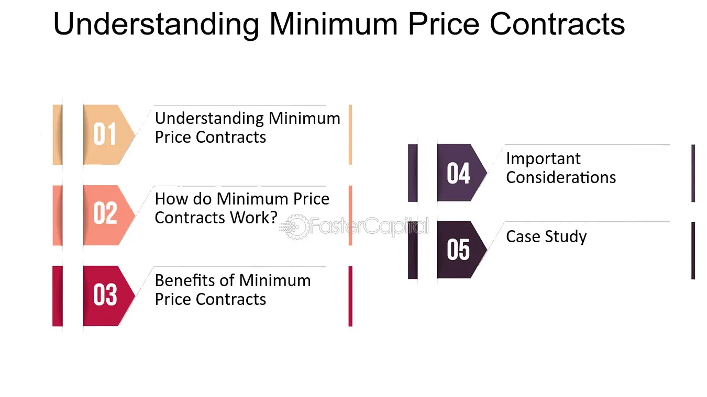

## Table of Contents

## What is a minimum price contract?

A minimum price contract is a type of agreement used in farming and agriculture. It helps farmers by setting a lowest price they will get for their crops. This way, farmers know they will not sell their crops for less than this set price, even if the market prices go down.

This kind of contract is useful because it gives farmers more certainty about their income. They can plan better because they know the least amount of money they will make from their crops. It also helps them feel more secure when they are deciding how much to plant and what to grow.

## How does a minimum price contract work?

A minimum price contract works by setting a lowest price that a farmer will get for their crops. When a farmer signs this contract, they agree to sell their crops to a buyer, like a company or a cooperative, at a price that is no less than the minimum price set in the contract. This means that even if the market price for the crops goes down, the farmer will still get at least the minimum price.

For example, if a farmer agrees to a minimum price of $5 per bushel of wheat, and the market price drops to $4 per bushel, the farmer will still get $5 per bushel from the buyer. But if the market price goes up to $6 per bushel, the farmer can choose to sell at the higher market price instead of the minimum price. This gives the farmer the chance to earn more money if prices go up, while still protecting them if prices go down.

## What are the benefits of using a minimum price contract?

Using a minimum price contract can help farmers a lot. It gives them a safety net by making sure they get at least a certain amount of money for their crops. This is good because it helps farmers plan their budgets better. They know the lowest amount of money they will get, so they can make plans for things like buying seeds or paying for equipment without worrying too much about falling prices.

Another benefit is that it can make farmers feel more secure. When they know they have a minimum price, they can decide what to plant and how much to plant with more confidence. This can lead to better choices and more stable farming operations. Plus, if the market price goes up, farmers can still sell their crops at the higher price, so they don't miss out on extra money.

## What are the potential drawbacks of a minimum price contract?

One potential drawback of a minimum price contract is that it can limit the farmer's ability to take advantage of high market prices. If the market price goes up a lot, the farmer might be stuck selling at the minimum price if they have already agreed to the contract. This means they could miss out on making more money if they had waited to sell at the higher price.

Another issue is that minimum price contracts can sometimes be complex and hard to understand. Farmers might need to spend time learning about the contract details or even get help from experts. This can be a hassle and might lead to mistakes if the farmer does not fully understand what they are agreeing to. 

Also, there might be fees or other costs involved with setting up and managing these contracts. These extra costs can eat into the farmer's profits, making the benefits of the minimum price less valuable.

## Who typically uses minimum price contracts?

Farmers are the main people who use minimum price contracts. They use these contracts to make sure they get a certain amount of money for their crops, no matter what happens in the market. This helps them feel more secure and plan their farming better.

Sometimes, big companies or cooperatives that buy crops from farmers also use minimum price contracts. They offer these contracts to farmers to make sure they have a steady supply of crops. This can help both the farmers and the companies by giving them more stability in their business dealings.

## In what industries are minimum price contracts most common?

Minimum price contracts are most common in the farming and agriculture industry. Farmers use these contracts to make sure they get a certain amount of money for their crops, even if the market prices go down. This helps them plan their budgets better and feel more secure about their income. Companies and cooperatives that buy crops from farmers also use these contracts to ensure they have a steady supply of crops, which can help both the farmers and the buyers.

In addition to agriculture, minimum price contracts can sometimes be found in other industries where there is a lot of price uncertainty. For example, in the energy sector, companies that produce oil or natural gas might use minimum price contracts to protect against big drops in prices. This can help them manage their finances better and plan for the future.

## Can you provide a basic example of a minimum price contract?

A farmer named John grows corn. He wants to make sure he gets at least $4 per bushel for his corn, no matter what the market price is. So, John signs a minimum price contract with a company that buys corn. The contract says that the company will buy John's corn at a price of at least $4 per bushel. This means that even if the market price for corn drops to $3 per bushel, John will still get $4 per bushel from the company.

If the market price for corn goes up to $5 per bushel, John can choose to sell his corn at the higher market price instead of the minimum price. This way, John can make more money if the market price goes up, but he is still protected if the market price goes down. The minimum price contract helps John plan his budget better because he knows the least amount of money he will get for his corn.

## How is the minimum price determined in these contracts?

The minimum price in a minimum price contract is usually set by looking at different things like what the market prices have been in the past, what people think the prices will be in the future, and how much it costs to grow the crops. The farmer and the buyer, like a company or a cooperative, talk about these things and agree on a price that seems fair to both of them. This price is the lowest amount the farmer will get for their crops, no matter what happens in the market.

Sometimes, the minimum price can also be influenced by other things like government rules or programs that help farmers. For example, if the government sets a certain price for a crop to help farmers, this can affect the minimum price in the contract. The main goal is to find a price that gives the farmer some protection from low market prices but also makes sense for the buyer.

## What happens if the market price falls below the minimum price?

If the market price falls below the minimum price in a minimum price contract, the farmer will still get paid the minimum price for their crops. This is the main benefit of the contract. For example, if the minimum price is set at $4 per bushel of corn and the market price drops to $3 per bushel, the farmer will still get $4 per bushel from the buyer. This helps the farmer because they know they will get at least that amount of money, even if the market price goes down a lot.

The buyer, like a company or a cooperative, has to pay the farmer the minimum price even though the market price is lower. This can be a risk for the buyer because they might lose money if they have to sell the crops at the lower market price. But, they agreed to this when they made the contract with the farmer. So, both the farmer and the buyer need to think carefully about the minimum price they set in the contract.

## What are the legal considerations when drafting a minimum price contract?

When drafting a minimum price contract, it's important to make sure the contract is clear and easy to understand. Both the farmer and the buyer need to know exactly what they are agreeing to. The contract should spell out the minimum price, how long the contract lasts, and what happens if the market price goes above or below the minimum price. It's also important to include any fees or costs that might come up. If the contract is not clear, it could lead to disagreements or legal problems later on.

Another thing to think about is following the law. The contract needs to follow any rules set by the government or local laws. For example, there might be laws about how contracts can be made or what needs to be in them. It's a good idea to check with a lawyer to make sure the contract follows all the rules. This can help avoid legal trouble and make sure both the farmer and the buyer are protected.

## How do minimum price contracts affect market dynamics?

Minimum price contracts can change how the market works by making sure farmers get at least a certain amount of money for their crops. When farmers use these contracts, they are less worried about prices going down. This can make them feel more secure and willing to keep growing their crops, even if the market is not doing well. As a result, the supply of crops might stay more stable, which can help keep the market from having big ups and downs.

On the other hand, minimum price contracts can also affect buyers like companies or cooperatives. When they agree to pay a minimum price, they might have to pay more than the market price if prices drop a lot. This can make them more careful about how much they buy and how much they are willing to pay. Over time, this could lead to changes in how much they buy and sell, which can also affect the market. In the end, minimum price contracts can help keep the market more balanced, but they can also make it more complicated for buyers.

## What advanced strategies can be employed with minimum price contracts to optimize outcomes?

Farmers can use minimum price contracts in smart ways to get the best results. One way is to use them along with other tools like futures contracts or options. Futures contracts let farmers lock in a price for their crops in the future, while options give them the right to buy or sell at a certain price. By mixing these tools with minimum price contracts, farmers can protect themselves from low prices and still take advantage of high prices. For example, a farmer might use a minimum price contract to set a floor price and then use options to benefit if the market price goes up a lot.

Another strategy is to carefully choose the timing and length of the minimum price contract. Farmers can look at market trends and decide when to sign the contract. If they think prices might go down soon, they can sign a contract to protect themselves. They can also choose how long the contract lasts. A shorter contract might be good if they think prices will go up soon, while a longer contract can give them more security if they expect prices to stay low for a while. By thinking about these things, farmers can use minimum price contracts to make the most of their crops and their income.

## What are the future trends in contract pricing and algorithmic trading?

The landscape of contract pricing and [algorithmic trading](/wiki/algorithmic-trading) is rapidly changing due to continuous technological advancements. These changes have significant implications for the future of minimum price contracts and algorithmic trading strategies.

One of the key emerging trends is the increasing integration of [machine learning](/wiki/machine-learning) (ML) and [artificial intelligence](/wiki/ai-artificial-intelligence) (AI) in financial markets. These technologies allow for more sophisticated pricing models that can dynamically adapt to market conditions. Machine learning algorithms, with their ability to learn from data and identify patterns, offer the potential to enhance pricing strategies by predicting market trends and adjusting pricing in real-time. For instance, machine learning models can be employed to analyze historical price data and forecast future price movements, leading to more precise and effective minimum price contract formulation.

A practical application of AI in pricing strategies can be illustrated with the use of neural networks. Neural networks can be trained on extensive datasets to recognize complex patterns that may not be immediately apparent to human analysts. The formula for a simple [neural network](/wiki/neural-network) can be represented as:

$$
y = f(W \cdot x + b)
$$

where $y$ is the output, $f$ is the activation function, $W$ represents the weights, $x$ is the input, and $b$ is the bias. Such networks can process varying inputs, like market volatility indices, and produce outputs that advise on optimal price points.

Another significant trend involves the use of blockchain technology, which offers enhanced security and transparency in financial transactions. Blockchain can provide a decentralized and immutable ledger, ensuring that all parties have transparent access to contract terms and historical pricing information. This transparency can reduce fraud and increase trust between contract parties, thus promoting the broader adoption of minimum price contracts.

Furthermore, quantitative finance and algorithmic trading are embracing more advanced simulation techniques, such as agent-based modeling, to forecast the impacts of macroeconomic changes on pricing strategies. These models simulate the actions and interactions of autonomous [agents](/wiki/agents) to assess their effects on the financial environment, offering insights into potential future trends and informing contract pricing decisions.

For market stakeholders, it is crucial to adopt these emerging technologies to maintain a competitive edge. Key considerations include investing in the latest algorithmic trading platforms that harness AI capabilities, upgrading IT infrastructure to support blockchain implementations, and cultivating data science expertise within teams to interpret complex datasets effectively.

In conclusion, the evolution of contract pricing and algorithmic trading is intertwined with technological progress. By leveraging machine learning, AI, blockchain, and advanced simulation techniques, market participants can enhance their pricing strategies and stay ahead in the competitive financial landscape.

## References & Further Reading

[1]: Bergstra, J., Bardenet, R., Bengio, Y., & Kégl, B. (2011). ["Algorithms for Hyper-Parameter Optimization."](https://dl.acm.org/doi/10.5555/2986459.2986743) Advances in Neural Information Processing Systems 24.

[2]: ["Advances in Financial Machine Learning"](https://www.amazon.com/Advances-Financial-Machine-Learning-Marcos/dp/1119482089) by Marcos Lopez de Prado

[3]: ["Evidence-Based Technical Analysis: Applying the Scientific Method and Statistical Inference to Trading Signals"](https://www.amazon.com/Evidence-Based-Technical-Analysis-Scientific-Statistical/dp/0470008741) by David Aronson

[4]: ["Machine Learning for Algorithmic Trading"](https://github.com/stefan-jansen/machine-learning-for-trading) by Stefan Jansen

[5]: ["Quantitative Trading: How to Build Your Own Algorithmic Trading Business"](https://www.amazon.com/Quantitative-Trading-Build-Algorithmic-Business/dp/1119800064) by Ernest P. Chan