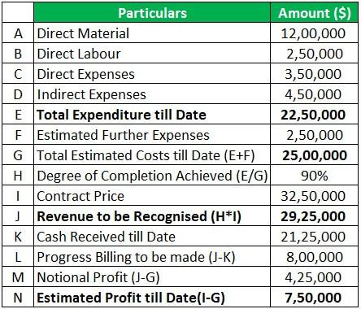

In the intricate world of finance, understanding the various contract pricing mechanisms is vital for effective financial management. At the heart of these mechanisms is the minimum price contract, a fundamental element in financial agreements that plays a significant role in protecting parties against market volatility. These contracts serve as an essential tool in ensuring that a baseline price is guaranteed, offering a sense of security and predictability amidst fluctuating market conditions.

The minimum price contract is particularly relevant in markets where price instability can have significant negative impacts, such as in the agricultural and commodity markets. They provide producers and farmers with the assurance of receiving a fair price for their goods, mitigating the risk associated with sudden price drops. By establishing a floor price, these contracts ensure that stakeholders can make informed financial plans without the constant fear of adverse price movements.

In this article, we will explore the concept of minimum price contracts in detail, examining their structure and the components that make them indispensable in contract pricing. We will also delve into the relationship between these contracts and algorithmic trading—a transformative approach that utilizes computer algorithms to execute trades at optimal prices. The integration of algorithmic trading in financial markets has significantly influenced how contract pricing is strategized, and understanding this interaction is crucial for leveraging these tools effectively.

By the end of this article, readers will gain a comprehensive understanding of how minimum price contracts function, their impact on financial strategies, and their critical role in enhancing pricing models in today’s financial landscape. This knowledge equips stakeholders with the insights needed to make informed decisions and optimize their financial activities in increasingly complex markets.

## Table of Contents

## Understanding Minimum Price Contracts

Minimum price contracts are specialized agreements designed to establish a baseline price for a commodity or asset, thus providing security against market volatility. Predominantly, these contracts are employed in agricultural and commodity markets where price fluctuations can have significant economic impacts. By setting a minimum price, they safeguard producers, such as farmers, ensuring they receive a stable and fair compensation for their goods even when market prices fall.

The fundamental structure of a minimum price contract involves several key components:

1. **Baseline Price Negotiation**: The baseline price is the cornerstone of the contract. It is usually determined based on current market conditions, historical price data, and future market forecasts. This price serves as the minimum rate that the seller will receive, offering a safety net against unfavorable price dips.

2. **Duration of the Contract**: The contract duration must be clearly specified, outlining the time period for which the minimum price guarantee is effective. This period can vary widely depending on the commodity involved and the volatility of its market.

3. **Payment Terms**: Given the established baseline price, the contract specifies how and when payments will be made to the seller. This might include advance payments or installment-based payments structured to align with the production cycle of the commodity.

4. **Market Price Adjustments**: Provisions for adjustments based on the fluctuating market prices above the baseline are often included. If the market price exceeds the minimum price, the seller might be entitled to receive the market price, or a percentage of the difference between the base and market price, ensuring they benefit from favorable market conditions.

5. **Contract Enforcement and Penalties**: To safeguard the interests of both parties, minimum price contracts typically include clauses on enforcement mechanics and penalties for breach of contract. This ensures that both parties commit to the agreed-upon terms.

For instance, in the agricultural sector, if the market price of wheat were to drop significantly due to an oversupply, a farmer with a minimum price contract would still receive the agreed baseline price, thus stabilizing their income. This financial predictability facilitates better resource planning and management for producers, ultimately contributing to more resilient supply chains.

Minimum price contracts are crucial tools that not only stabilize income for producers but also contribute to market stability by mitigating the adverse effects of sudden price changes. Their structured approach to contract pricing provides a robust framework that benefits both sellers and buyers through enhanced predictability and security.

## The Role of Contract Pricing in Financial Agreements

Contract pricing is an integral component in constructing financial agreements, serving as the foundation upon which terms and conditions are established. To achieve a mutually beneficial outcome, selecting the right pricing strategy is vital for both parties involved. This selection can influence the economic feasibility and viability of a contract. Understanding the various pricing models available offers insight into how organizations tailor agreements to align with their financial goals.

Several distinct pricing strategies are commonly employed in financial agreements, each with unique characteristics and applications. Among these, fixed pricing, cost-plus pricing, and dynamic pricing are frequently used.

Fixed pricing is a straightforward approach where the price is determined at the outset and remains unchanged for the duration of the contract. This model provides certainty and simplicity, reducing administrative overhead and protecting against price [volatility](/wiki/volatility-trading-strategies). However, it can sometimes be inflexible, potentially leading to unfavorable outcomes if market conditions change significantly.

Cost-plus pricing, on the other hand, calculates the contract price by adding a specified markup to the cost of producing a good or service. This approach ensures that the provider covers expenses and earns a profit margin. While it offers transparency and justifies pricing based on actual incurred costs, it may lead to inefficiencies and higher costs for the purchaser, as it does not incentivize cost control.

Dynamic pricing, also known as variable pricing, adjusts the contract price based on predetermined criteria such as changes in demand, supply, or other market conditions. This model offers flexibility and responsiveness, aligning prices more closely with market realities. It can optimize revenue and resource allocation, though it may introduce complexity and require sophisticated systems for implementation.

Minimum price contracts fit within these pricing schemes by establishing a baseline or floor price for goods or services, ensuring parties receive a minimum acceptable return. They are particularly relevant in volatile markets, serving as a hedge against adverse price fluctuations. This feature adds a layer of security to both fixed and dynamic pricing models by safeguarding against steep price declines.

In practice, choosing a pricing method involves weighing numerous factors: market conditions, risk tolerance, and strategic objectives. A well-chosen strategy can lead to advantageous outcomes in financial agreements, facilitating equitable and sustainable relationships between parties.

## Algorithmic Trading and Its Impact on Contract Pricing

Algorithmic trading has become a cornerstone of modern financial markets, leveraging computer algorithms to automate trading processes. These algorithms analyze market data and execute trades at speeds and frequencies impossible for human traders, optimizing the price points and enhancing market [liquidity](/wiki/liquidity-risk-premium). By utilizing algorithms, traders can implement complex strategies that involve rapid decision-making based on real-time financial data.

The integration of [algorithmic trading](/wiki/algorithmic-trading) fundamentally changes how contract pricing is handled. One crucial aspect of this transformation is the impact on minimum price contracts. These contracts, which establish a baseline price for a commodity or asset, benefit significantly from algorithmic trading. Algorithms can continuously monitor market conditions and execute trades that respect the minimum price constraints while maximizing potential returns. This ensures that parties involved in contracts are protected from adverse price movements while taking advantage of favorable conditions.

Minimum price contracts complement algorithmic trading by providing a structured framework that can be seamlessly integrated into an algorithm's trading logic. These contracts offer predictability, which is crucial for algorithmic systems that require defined parameters to function effectively. Algorithms can [factor](/wiki/factor-investing) in constraints posed by minimum price contracts and adjust their trading strategies accordingly, ensuring both compliance and optimization.

A pertinent case study highlighting the successful integration of algorithmic trading with contract pricing is the agricultural futures market. Here, algorithmic systems are used to manage futures contracts for commodities like wheat and corn. The algorithm can monitor price changes and execute trades swiftly, even within the constraints of minimum price agreements. This approach not only preserves profit margins but also stabilizes income for producers by mitigating risks associated with price volatility.

The influence of algorithmic trading on minimum price contracts extends to dynamic pricing strategies. Algorithms are capable of recalibrating pricing models in response to fluctuating market conditions. For example, in energy markets, algorithms can adapt to changes in demand and supply, ensuring that minimum price conditions are met while capitalizing on market opportunities. This dynamic adaptation helps maintain competitiveness and profitability.

In conclusion, algorithmic trading has reshaped contract pricing by offering sophisticated tools that ensure adherence to minimum price constraints and enhance overall trading strategies. As technology continues to evolve, the synergy between algorithmic trading and contract pricing will likely deepen, offering new opportunities for investors and market participants to optimize their strategies within structured financial agreements.

## Advantages and Challenges of Minimum Price Contracts in Algo Trading

Minimum price contracts serve as a crucial risk management tool, providing a reliable safety net for algorithmic traders in volatile markets. These contracts guarantee a baseline price, thus allowing traders to hedge against adverse price movements while participating in potential upside market gains. However, the integration of minimum price contracts into algorithmic trading systems presents unique challenges that should be thoroughly understood.

### Benefits

1. **Risk Mitigation**: For algorithmic traders, the primary advantage of minimum price contracts is their ability to reduce exposure to price volatility. By establishing a floor price, traders can safeguard their portfolios from severe fluctuations, which is particularly beneficial in unpredictable market conditions.

2. **Predictability in Cash Flows**: These contracts facilitate more predictable cash flows, allowing traders to allocate resources efficiently and optimize their capital allocation strategies. Such predictability aligns with the algorithmic trading objective of executing trades at optimal times.

3. **Enhanced Strategy Flexibility**: With these contracts, traders can employ complex algorithmic strategies that involve both spot and futures positions, capitalizing on discrepancies and arbitrage opportunities without fear of significant losses due to market downturns.

### Challenges

1. **Integration with Algorithmic Systems**: Integrating minimum price contracts into existing algorithmic trading models can be technically challenging. These systems must be able to process and respond to real-time data, adjusting strategies dynamically to maintain profitability while honoring the contract terms.

2. **Complexity in Pricing Algorithms**: The inclusion of minimum price contracts requires sophisticated pricing algorithms capable of considering both the spot price movements and contract stipulations. This complexity can demand high computational power and advanced programming skills.

3. **Contract Execution Risks**: There are inherent risks associated with the execution of these contracts, such as liquidity issues and counterparty risks, which may affect the overall performance of an algorithmic trading strategy.

### Strategies to Overcome Challenges

1. **Advanced Algorithm Development**: Employing machine learning techniques to enhance predictive models can improve the integration of minimum price contracts. Algorithms using reinforcement learning could be particularly effective, as they adapt and optimize strategies based on market scenarios.

2. **Robust Risk Management Protocols**: Establishing comprehensive risk management frameworks that include stress testing and scenario analysis can mitigate the uncertainties associated with contract execution. These protocols ensure that traders are prepared for various market conditions.

3. **Flexible Trading Strategies**: Developing trading strategies that are not solely dependent on minimum price contracts is crucial. Diversification of strategies can reduce reliance on any single contract while still benefiting from the risk mitigation it offers.

As financial markets continue to evolve with advancing technology, understanding both the advantages and obstacles associated with minimum price contracts in algorithmic trading is essential. Effective integration and strategic application allow traders to leverage these contracts to enhance overall trading performance while maintaining a strong defense against market unpredictability.

## Case Studies and Real-world Applications

Minimum price contracts have found diverse applications across various sectors, showcasing their adaptability and strategic value. One prominent example is in agriculture, where minimum price contracts have been utilized to stabilize income for farmers facing volatile commodity markets. In this sector, these contracts ensure that producers receive a guaranteed minimum price for their crops, thus mitigating the financial risks associated with fluctuating market prices. This practice, often termed as "price floors", not only safeguards farmers' revenues but also provides a more predictable income stream, allowing for more effective financial planning.

The energy sector provides another illustrative case of minimum price contracts in action. Here, power purchase agreements (PPAs) often include minimum pricing clauses to secure a base revenue for electricity producers. These contracts are particularly vital in renewable energy projects, where the initial costs are significant, and market prices can be unpredictable. By employing a minimum price contract, energy providers can secure funding and investment, knowing they will achieve at least the agreed-upon price per unit of energy produced, thus facilitating the transition to more sustainable energy systems.

In the financial markets, algorithmic trading has leveraged minimum price contracts to optimize trading strategies. A case study of significance involved the integration of algorithmic models with minimum price contracts in commodity trading firms. These firms employed advanced algorithms to dynamically adjust their trading positions based on real-time market data, while the minimum price contracts assured them a floor price. This strategic combination allowed firms to maximize profits by capitalizing on market movements without the downside risk of selling below cost.

Furthermore, the dairy industry presents an innovative use of minimum price contracts. Dairy cooperatives often set a minimum price for milk, which is essential for ensuring stability and sustainability. These contracts can be crucial in periods of low demand or overproduction, where prices might otherwise fall below production costs. By securing a minimum price, dairy farmers are protected against severe market downturns, helping maintain the viability of dairy farming as an occupation.

These case studies underscore the practical advantages of minimum price contracts in various contexts, demonstrating their utility in enhancing financial stability and providing a hedge against market uncertainties. The strategic deployment of such contracts, especially when integrated with algorithmic trading systems, holds significant potential for optimizing operations and securing financial outcomes across different industries.

## Future Trends in Contract Pricing and Algorithmic Trading

The landscape of contract pricing and algorithmic trading is rapidly changing due to continuous technological advancements. These changes have significant implications for the future of minimum price contracts and algorithmic trading strategies.

One of the key emerging trends is the increasing integration of [machine learning](/wiki/machine-learning) (ML) and [artificial intelligence](/wiki/ai-artificial-intelligence) (AI) in financial markets. These technologies allow for more sophisticated pricing models that can dynamically adapt to market conditions. Machine learning algorithms, with their ability to learn from data and identify patterns, offer the potential to enhance pricing strategies by predicting market trends and adjusting pricing in real-time. For instance, machine learning models can be employed to analyze historical price data and forecast future price movements, leading to more precise and effective minimum price contract formulation.

A practical application of AI in pricing strategies can be illustrated with the use of neural networks. Neural networks can be trained on extensive datasets to recognize complex patterns that may not be immediately apparent to human analysts. The formula for a simple [neural network](/wiki/neural-network) can be represented as:

$$
y = f(W \cdot x + b)
$$

where $y$ is the output, $f$ is the activation function, $W$ represents the weights, $x$ is the input, and $b$ is the bias. Such networks can process varying inputs, like market volatility indices, and produce outputs that advise on optimal price points.

Another significant trend involves the use of blockchain technology, which offers enhanced security and transparency in financial transactions. Blockchain can provide a decentralized and immutable ledger, ensuring that all parties have transparent access to contract terms and historical pricing information. This transparency can reduce fraud and increase trust between contract parties, thus promoting the broader adoption of minimum price contracts.

Furthermore, quantitative finance and algorithmic trading are embracing more advanced simulation techniques, such as agent-based modeling, to forecast the impacts of macroeconomic changes on pricing strategies. These models simulate the actions and interactions of autonomous [agents](/wiki/agents) to assess their effects on the financial environment, offering insights into potential future trends and informing contract pricing decisions.

For market stakeholders, it is crucial to adopt these emerging technologies to maintain a competitive edge. Key considerations include investing in the latest algorithmic trading platforms that harness AI capabilities, upgrading IT infrastructure to support blockchain implementations, and cultivating data science expertise within teams to interpret complex datasets effectively.

In conclusion, the evolution of contract pricing and algorithmic trading is intertwined with technological progress. By leveraging machine learning, AI, blockchain, and advanced simulation techniques, market participants can enhance their pricing strategies and stay ahead in the competitive financial landscape.

## Conclusion

Understanding minimum price contracts and their integration with algorithmic trading is crucial for modern financial markets. These contracts are a stabilizing force, offering both predictability and security in fluctuating markets. By ensuring a baseline price, they mitigate the risks associated with volatile price variations and provide a reliable framework for pricing strategies. As markets continue to evolve, the integration of algorithmic trading with these contracts has become increasingly significant. The algorithms optimize trading performance by executing strategies that align with predefined pricing mechanisms, thus enhancing the effectiveness of financial operations.

Staying informed about such developments is vital for stakeholders aiming to navigate the complexities of today's fast-paced financial environment. Technological advancements, including the emergence of machine learning and artificial intelligence, are set to further reshape these dynamics, making continual learning and adaptation essential. The landscape of financial markets demands not only strategic foresight but also the ability to leverage innovative tools and methodologies.

With the insights provided in this article, stakeholders are better equipped to make informed decisions in their financial endeavors. By understanding the intricate relationship between minimum price contracts and algorithmic trading, they can effectively harness these mechanisms to achieve stability, optimize pricing strategies, and enhance overall trading performance. As we look to the future, embracing these developments will be key to maintaining a competitive edge in financial markets.

## References & Further Reading

[1]: Bergstra, J., Bardenet, R., Bengio, Y., & Kégl, B. (2011). ["Algorithms for Hyper-Parameter Optimization."](https://dl.acm.org/doi/10.5555/2986459.2986743) Advances in Neural Information Processing Systems 24.

[2]: ["Advances in Financial Machine Learning"](https://www.amazon.com/Advances-Financial-Machine-Learning-Marcos/dp/1119482089) by Marcos Lopez de Prado

[3]: ["Evidence-Based Technical Analysis: Applying the Scientific Method and Statistical Inference to Trading Signals"](https://www.amazon.com/Evidence-Based-Technical-Analysis-Scientific-Statistical/dp/0470008741) by David Aronson

[4]: ["Machine Learning for Algorithmic Trading"](https://github.com/stefan-jansen/machine-learning-for-trading) by Stefan Jansen

[5]: ["Quantitative Trading: How to Build Your Own Algorithmic Trading Business"](https://www.amazon.com/Quantitative-Trading-Build-Algorithmic-Business/dp/1119800064) by Ernest P. Chan