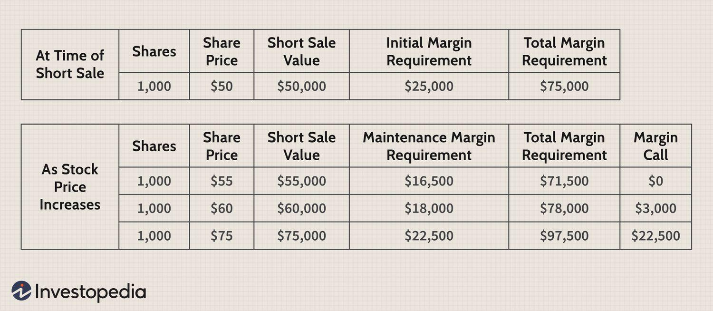

## Table of Contents

## What is a minimum share purchase requirement?

A minimum share purchase requirement is a rule set by some companies that says you have to buy a certain number of shares if you want to invest in their stock. This rule is often used by companies that want to make sure only serious investors buy their stock. For example, if a company has a minimum share purchase requirement of 100 shares, you can't buy just 50 shares; you have to buy at least 100.

This requirement can affect how easy it is for people to invest in a company. If the minimum number of shares is high, it might be harder for people with less money to invest. On the other hand, it can help keep the stock's price more stable because only people who are really interested in the company will buy it. So, it's important for investors to check if a company has a minimum share purchase requirement before they decide to invest.

## Why do companies set minimum share purchase requirements?

Companies set minimum share purchase requirements to make sure that only serious investors buy their stock. When a company has this rule, it means that people who want to invest have to buy a certain number of shares. This can help keep the stock's price more stable because only people who really want to invest in the company will buy it. If lots of people are buying and selling small amounts of stock all the time, the price can go up and down a lot. By setting a minimum, companies try to avoid this.

Another reason is to attract long-term investors. When people have to buy more shares at once, they might be more likely to hold onto them for a longer time. This can be good for the company because it shows that investors believe in the company's future. It also helps the company's stock price stay steady, which can make the company look more reliable to other investors and the public. So, setting a minimum share purchase requirement can be a way for a company to build a strong base of committed investors.

## How do minimum share purchase requirements affect individual investors?

Minimum share purchase requirements can make it harder for some individual investors to buy stock in a company. If a company says you have to buy at least 100 shares, and each share costs a lot of money, then you need a lot of money to start investing. This can be tough for people who don't have a lot of money to spend. They might want to invest in the company, but the minimum requirement stops them because they can't afford to buy that many shares all at once.

On the other hand, if an investor can meet the minimum share purchase requirement, it might be good for them. When a company sets a high minimum, it often means that the stock price might be more stable. This is because only people who really believe in the company will buy the stock. So, if an investor can afford to buy the minimum number of shares, they might be happy knowing that other investors are also serious about the company. This can make them feel more confident about their investment.

## What are the typical minimum share purchase amounts for different types of equity investments?

For different types of equity investments, the minimum share purchase amounts can vary a lot. If you want to buy stocks on a big stock market like the New York Stock Exchange or NASDAQ, there's usually no minimum. You can buy just one share if you want. But some companies might set their own rules and say you have to buy at least 100 shares to invest in them. This is more common with companies that aren't on the big stock markets.

For mutual funds and exchange-traded funds (ETFs), the rules can be different. Mutual funds often have a minimum investment amount, which can be anywhere from $500 to $3,000 or even more. ETFs are usually traded on stock markets, so you can buy just one share like with regular stocks. But some special types of ETFs might have their own minimums, like needing to buy at least 50 shares. It's always a good idea to check the rules for the specific investment you're interested in.

## Can minimum share purchase requirements vary by investment platform or broker?

Yes, minimum share purchase requirements can change depending on which investment platform or broker you use. Some brokers let you buy just one share of a stock, while others might say you need to buy a certain number of shares, like 100. This can make a big difference if you're trying to decide where to invest your money.

Different platforms might also have different rules for mutual funds and ETFs. For example, one platform might let you start investing in a mutual fund with $500, while another might need $1,000 or more. It's important to look at the rules of each platform or broker before you start investing, so you know what you need to do to buy the investments you want.

## How do minimum share purchase requirements impact portfolio diversification?

Minimum share purchase requirements can make it harder for investors to spread their money across different investments, which is called diversification. If a company says you have to buy at least 100 shares, and those shares cost a lot of money, you might not have enough money left to buy shares in other companies. This means you can't spread your risk as much as you'd like. If something bad happens to that one company, it could hurt your whole investment plan.

But if you can meet the minimum share purchase requirements, it might help you in another way. When a company has a high minimum, it often means that the stock price might be more stable because only serious investors are buying it. This can be good for your portfolio because having some stable investments can balance out riskier ones. So, while minimum requirements can make diversification harder, they can also help you build a more stable portfolio if you can afford to meet them.

## What strategies can investors use to meet minimum share purchase requirements?

Investors can use a few strategies to meet minimum share purchase requirements. One way is to save up enough money to buy the minimum number of shares all at once. This might take some time, but it's a straightforward approach. Another strategy is to look for a broker or investment platform that lets you buy fractional shares. Fractional shares are parts of a whole share, so you can invest smaller amounts of money and still meet the minimum requirement over time. Some platforms offer this option, so it's worth checking out if you're struggling to come up with the full amount needed.

Another strategy is to join forces with other investors. If you and a few friends or family members want to invest in the same company, you can pool your money together to buy the minimum number of shares. This way, everyone can get in on the investment without having to meet the minimum on their own. It's important to have a clear agreement about how you'll handle the investment, though, so everyone knows what to expect. By using these strategies, investors can find ways to meet minimum share purchase requirements and still build a diversified portfolio.

## Are there any exemptions or special cases where minimum share purchase requirements do not apply?

Sometimes, there are special cases where minimum share purchase requirements do not apply. For example, if you are an employee of the company, you might be able to buy shares without meeting the minimum. Companies often have special stock purchase plans for their employees that let them buy shares at a discount and without having to buy a certain number of shares.

Another case is if you use a certain type of investment account, like a dividend reinvestment plan (DRIP). With a DRIP, any dividends you earn from the stock can be used to buy more shares, often without needing to meet a minimum purchase amount. This can be a good way to slowly build up your investment over time without having to come up with a lot of money all at once.

## How do minimum share purchase requirements influence the liquidity of a stock?

Minimum share purchase requirements can make a stock less liquid. Liquidity means how easy it is to buy or sell a stock without affecting its price too much. If a company says you have to buy a lot of shares at once, fewer people might want to buy it. This means there are fewer buyers and sellers in the market, so it can be harder to find someone to trade with. When there are fewer people trading, it can be harder to sell your shares quickly if you need to, and the price can go up and down more when trades do happen.

On the other hand, minimum share purchase requirements can also help keep the stock's price more stable. When only serious investors are buying the stock, they are less likely to sell it quickly. This can make the stock's price move less wildly because there are fewer sudden changes in who owns the stock. So, while minimum requirements might make the stock less liquid in some ways, they can also help make the market for that stock more predictable and stable.

## What are the regulatory considerations regarding minimum share purchase requirements?

When it comes to minimum share purchase requirements, there are some rules that companies need to follow. These rules can come from the government or from the stock exchanges where the company's shares are traded. For example, the U.S. Securities and Exchange Commission (SEC) has rules that companies need to follow when they sell their stock. They need to make sure that their rules, like minimum share purchase requirements, are fair and don't trick people into buying the stock.

Stock exchanges also have their own rules. For instance, the New York Stock Exchange and NASDAQ might say that a company can't set a minimum share purchase that is too high because it could make it hard for people to buy the stock. These rules are there to protect investors and make sure that everyone has a fair chance to invest in a company. So, before a company decides on a minimum share purchase requirement, they need to make sure it fits with all the rules from the government and the stock exchanges.

## How do global minimum share purchase requirements compare across different countries?

Minimum share purchase requirements can be different in different countries. In the United States, most stocks on big stock markets like the New York Stock Exchange and NASDAQ don't have a minimum share purchase requirement. You can buy just one share if you want. But some smaller companies might say you need to buy at least 100 shares. In Canada, it's similar, with most stocks not having a minimum, but some might have their own rules. In the United Kingdom, while there's generally no minimum for buying shares on the London Stock Exchange, some companies might still set their own minimums.

In other parts of the world, the rules can be different. For example, in Japan, some companies on the Tokyo Stock Exchange might have a minimum share purchase requirement, especially if they are smaller companies. In Germany, while most stocks on the Frankfurt Stock Exchange don't have a minimum, some might. In Australia, the Australian Securities Exchange (ASX) usually doesn't have a minimum share purchase requirement, but again, some companies might set their own rules. So, it's important for investors to check the specific rules for each country and company they're interested in.

## What future trends might affect minimum share purchase requirements in equity investments?

In the future, technology and changes in the way people invest might make minimum share purchase requirements less common. More and more investment platforms are letting people buy parts of shares, called fractional shares. This means you don't need to buy a whole share to invest in a company. If more platforms start doing this, it could make it easier for people to invest smaller amounts of money and not worry about meeting a minimum share purchase requirement.

Also, rules from governments and stock exchanges might change. They might decide to make it easier for more people to invest by not letting companies set high minimums. This could help more people start investing, even if they don't have a lot of money. But, some companies might still want to keep minimums to attract serious investors and keep their stock price stable. So, while the trend might be towards making investing easier for everyone, some companies will still have their own reasons for keeping minimum share purchase requirements.

## References & Further Reading

[1]: Bertsimas, D., & Lo, A. W. (1998). ["Optimal Control of Execution Costs."](http://web.mit.edu/dbertsim/www/papers/Finance/Optimal%20control%20of%20execution%20costs.pdf) Journal of Financial Markets.

[2]: Cartea, Á., Jaimungal, S., & Penalva, J. (2015). ["Algorithmic and High-Frequency Trading."](https://assets.cambridge.org/97811070/91146/frontmatter/9781107091146_frontmatter.pdf) Cambridge University Press.

[3]: Malkiel, B. G. (2020). ["A Random Walk Down Wall Street: The Time-Tested Strategy for Successful Investing."](https://yourknowledgedigest.org/wp-content/uploads/2020/04/a-random-walk-down-wall-street.pdf) W. W. Norton & Company.

[4]: Aldridge, I. (2013). ["High-Frequency Trading: A Practical Guide to Algorithmic Strategies and Trading Systems."](https://www.amazon.com/High-Frequency-Trading-Practical-Algorithmic-Strategies/dp/1118343506) Wiley.

[5]: Fabozzi, F. J., & Focardi, S. M. (2013). ["Robust Portfolio Optimization and Management."](https://onlinelibrary.wiley.com/doi/book/10.1002/9781119202172) Wiley.