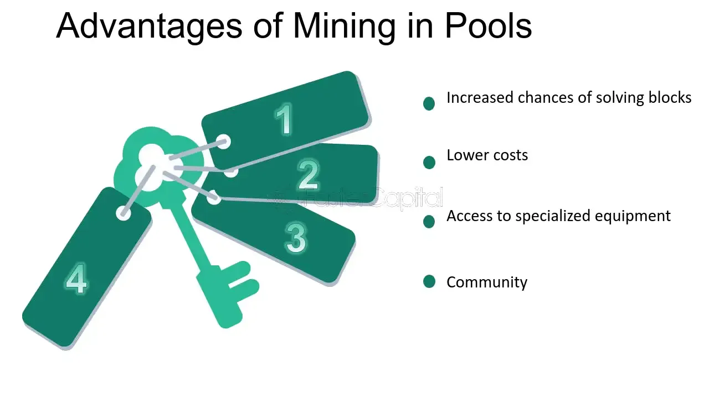

## Table of Contents

## What is a mining pool?

A mining pool is a group of miners who work together to solve complex math problems and earn rewards. When someone wants to add a new block of transactions to a blockchain, like Bitcoin, they need to solve a puzzle. This puzzle is hard and can take a long time to solve alone. So, miners join a pool to combine their computer power and increase their chances of solving the puzzle faster.

When the group successfully solves a puzzle and adds a new block, the reward is shared among all the miners in the pool. The reward is usually split based on how much computing power each miner contributed. This way, even if a single miner might not earn a reward often, being part of a pool means they can earn smaller, more frequent rewards. It makes mining more stable and predictable for everyone involved.

## How does a mining pool work?

A mining pool works by bringing together many miners who share their computer power to solve the math problems needed to add new blocks to a blockchain. Each miner in the pool uses their computer to try and solve the puzzle. When the puzzle is solved, the new block is added to the blockchain, and the miners get a reward in the form of cryptocurrency, like Bitcoin. The reward is then divided among all the miners in the pool, based on how much computing power each one contributed.

This system makes mining more reliable for individual miners. Instead of waiting a long time to solve a puzzle on their own and maybe earning a big reward, miners in a pool get smaller rewards more often. This is because the pool solves puzzles more frequently than a single miner could. The pool operator usually takes a small fee for managing the pool, but overall, it helps miners earn a steady income from their efforts.

## What are the benefits of joining a mining pool?

Joining a mining pool makes mining easier and more predictable. When you mine alone, it can take a long time to solve a puzzle and get a reward. But in a pool, many miners work together, so the group solves puzzles more often. This means you get smaller rewards more frequently, instead of waiting a long time for a big reward that might not come.

Another benefit is that it's fairer for everyone. In a pool, the rewards are shared based on how much work each miner does. So even if you don't have a powerful computer, you can still earn something. Plus, the pool takes care of the hard parts like managing the mining software and distributing the rewards, so you don't have to worry about that.

## What are the different types of mining pools?

There are a few different types of mining pools that miners can join. The first type is a pay-per-share (PPS) pool. In a PPS pool, miners get paid a fixed amount for each share they contribute to the pool, no matter if the pool actually finds a block or not. This makes it easy for miners to know how much they will earn, but the pool operator takes a bigger fee to cover the costs.

Another type is a proportional pool. In this kind of pool, the reward is split among the miners based on how many shares they contributed during the time it took to find a block. If the pool finds a block quickly, miners get a bigger reward. But if it takes a long time, the reward is smaller. This type of pool can be riskier because the reward changes a lot.

The last type is a peer-to-peer (P2Pool) pool. In a P2Pool, there is no central operator. Instead, all the miners work together directly. This makes it more decentralized and secure, but it can be harder to set up and manage. Miners in a P2Pool share the rewards based on their contributions, just like in other pools, but they have more control over the process.

## How do mining pools distribute rewards?

Mining pools distribute rewards in different ways depending on the type of pool. In a pay-per-share (PPS) pool, miners get paid a fixed amount for each share they contribute to the pool. This means miners know exactly how much they will earn for their work, no matter if the pool finds a block or not. The pool operator takes a fee to cover the costs of running the pool, but this method makes it easy for miners to predict their earnings.

In a proportional pool, the reward is split among the miners based on how many shares they contributed during the time it took to find a block. If the pool finds a block quickly, miners get a bigger reward. But if it takes a long time, the reward is smaller. This type of pool can be riskier because the reward changes a lot, but it can also be more rewarding if the pool is lucky.

In a peer-to-peer (P2Pool), there is no central operator, and miners work together directly. The rewards are shared based on each miner's contributions, just like in other pools. This method is more decentralized and secure, but it can be harder to set up and manage. Miners have more control over the process, but they still share the rewards fairly based on their work.

## What is the difference between PPS, PPLNS, and other payment methods in mining pools?

PPS, or Pay-Per-Share, is a payment method where miners get a fixed amount for each share they contribute to the pool. This means miners know exactly how much they will earn, no matter if the pool finds a block or not. The pool operator takes a fee to cover costs, but this method makes it easy for miners to predict their earnings. It's like getting paid by the hour instead of waiting for a big project to finish.

PPLNS, or Pay-Per-Last-N-Shares, is different because it rewards miners based on the shares they've contributed over a certain period, usually the last few hours or days. When the pool finds a block, the reward is split among the miners who contributed during that time. This method can be riskier because the reward depends on how long it takes to find a block. If it takes a long time, the reward per share goes down, but if the pool finds blocks quickly, miners can earn more.

There are other methods too, like Proportional, where the reward is split based on the shares contributed during the round when the block was found. This can be even more variable than PPLNS because the reward depends on the luck of the pool in finding a block. Each method has its own way of balancing risk and reward, and miners choose based on what fits their needs best.

## How can one choose the right mining pool?

Choosing the right mining pool depends on what you want and how much risk you're okay with. If you like knowing exactly how much you'll earn, a PPS pool might be good for you. It pays you a fixed amount for each share you contribute, so your earnings are predictable. But remember, the pool takes a fee, so your earnings might be a bit less than in other pools. If you're okay with waiting a bit longer for a bigger reward, a PPLNS or Proportional pool could work. These pools might pay more if they find blocks quickly, but if it takes a long time, your reward per share goes down.

It's also important to think about the size and reputation of the pool. A bigger pool might find blocks more often, but it also means you're sharing the reward with more people. A smaller pool might give you a bigger share of the reward when it finds a block, but it could take longer to find one. Look at reviews and see what other miners say about the pool. Make sure the pool is reliable and has good customer support. That way, you can feel confident that your mining efforts will be rewarded fairly and on time.

## What are the fees associated with mining pools?

Mining pools charge fees to cover the costs of running the pool and to make some money for the people who manage it. The fees can be different depending on the type of pool you join. In a PPS pool, the fee is usually higher because the pool pays miners a fixed amount for each share they contribute, no matter if the pool finds a block or not. This makes it easier for miners to predict their earnings, but the pool needs to charge more to cover the risk of not finding blocks.

In other types of pools like PPLNS or Proportional pools, the fees are often lower because the pool only pays out when it finds a block. This means the pool doesn't have to cover as many costs upfront, so they can charge less. But, the amount you earn can change a lot because it depends on how quickly the pool finds blocks. Always check the fee structure of a pool before joining to make sure it fits with what you want to earn and how much risk you're okay with.

## How do mining pools impact the decentralization of cryptocurrencies?

Mining pools can make cryptocurrencies less decentralized. When many miners join a big pool, that pool can control a lot of the computer power used to add new blocks to the blockchain. If one pool gets too big, it might be able to control what transactions get added or even try to change the rules of the cryptocurrency. This goes against the idea of decentralization, where no one person or group should have too much power.

On the other hand, mining pools also help more people get involved in mining. It's hard for someone with just one computer to compete with big miners who have lots of powerful machines. By joining a pool, smaller miners can still earn rewards and be part of the network. This can make the network stronger and more secure because more people are helping to keep it running. But it's important to keep an eye on how big the pools get to make sure they don't take over too much control.

## What are the security considerations when joining a mining pool?

When you join a mining pool, you need to think about security. One big thing to watch out for is if the pool is honest and fair. Some pools might try to cheat you by not giving you the right amount of rewards or by taking too much in fees. It's a good idea to read reviews and see what other miners say about the pool. Also, make sure the pool uses strong security measures to protect your personal information and your earnings. If the pool's website or app doesn't seem safe, it might be better to find another one.

Another thing to consider is how the pool handles its connection to the blockchain. If the pool is not well-managed, it could be a target for hackers who want to mess with the blockchain. This could cause problems for the whole network. So, it's important to choose a pool that has a good track record and strong security practices. That way, you can feel safe knowing your mining efforts are helping the network and not putting it at risk.

## How do mining pools handle network difficulty adjustments?

Mining pools handle network difficulty adjustments by working together to solve the puzzles needed to add new blocks to the blockchain. When the network difficulty goes up, it means the puzzles get harder to solve. Mining pools keep mining, using all their combined computer power to try and solve these harder puzzles. The pool's software automatically adjusts to the new difficulty, so miners don't have to do anything different. They just keep contributing their shares, and the pool keeps trying to find blocks.

If the network difficulty goes down, the puzzles get easier. This can happen if fewer people are mining or if the network wants blocks to be added faster. The mining pool's software will notice this change and adjust accordingly. Miners in the pool will find it easier to contribute shares and the pool might find blocks more quickly. Either way, the pool helps miners keep mining smoothly, no matter how the network difficulty changes.

## What advanced strategies can be used to maximize returns in mining pools?

To maximize returns in mining pools, one strategy is to choose the right type of pool based on your risk tolerance and mining goals. If you prefer a steady income, a PPS pool might be best because it pays you a fixed amount for each share you contribute. This means your earnings are more predictable, but you'll have to pay higher fees. On the other hand, if you're okay with waiting longer for potentially bigger rewards, a PPLNS or Proportional pool could work better. These pools might pay more if they find blocks quickly, but if it takes a long time, your reward per share goes down. It's all about finding the balance that works for you.

Another advanced strategy is to diversify your mining efforts by joining multiple pools. This can help spread out the risk and increase your chances of earning rewards more consistently. If one pool is having a slow day, another might be doing well, so you can still earn something. Also, keeping an eye on the fees and the pool's performance can help you switch to a better pool if needed. By staying informed and adjusting your strategy, you can make the most out of your mining efforts and increase your returns over time.

## What are the methods and payout schemes?

Common mining pool methods are crucial for understanding how earnings are distributed among participants. They provide frameworks to ensure fair reward allocation based on miners' computational contributions. The most prevalent methods include proportional, pay-per-share (PPS), and pay-per-last-N-shares (PPLNS), each with unique characteristics and payout mechanisms.

### Proportional Method

In the proportional method, miners receive rewards based on the number of shares they submit during a mining round. Here, a "share" represents a valid proof of work submitted by a miner, although not necessarily meeting the full network difficulty to constitute a block. Once a block is mined, the reward is divided among miners proportionally based on the number of shares they contributed.

For instance, consider a mining round where a pool successfully mines a block with a total reward of $R$ and collects $N$ shares in total. If a miner contributes $n$ shares, their reward $W$ can be calculated using the formula:

$$

W = \frac{n}{N} \times R 
$$

### Pay-Per-Share (PPS)

The PPS method offers miners a fixed reward per share that corresponds to their work contribution, regardless of whether the pool eventually finds a block. This method transfers the risk of block finding from the miner to the pool, ensuring a consistent payout for miners. The pool operator must have reserves to manage variability in block discoveries.

The payout per share $S$ is determined by the expected value of finding a block, factoring in the pool's fee. Therefore, the payment for a miner is straightforward:

$$

W = n \times S 
$$

### Pay-Per-Last-N-Shares (PPLNS)

PPLNS aims to reward miners based on the number of shares they contribute within a specific window of the last $N$ shares before the block discovery. This method accounts only for the shares in this recent window, incentivizing constant and reliable contributions from miners. By focusing on recent shares, PPLNS can often yield higher payouts for those consistently mining in the pool.

The calculation of payouts in PPLNS involves monitoring the miner's contribution relative to the sum of shares in the defined window, offering an alternative to balance risk and reward aligned with mining consistency. This method is particularly attractive for full-time, dedicated miners who maintain a steady contribution rate.

In sum, the chosen payout scheme can significantly impact a miner's profitability and risk exposure within a pool. Each method offers distinct advantages that cater to diverse miner preferences, from those seeking consistent, predictable income to those willing to assume more risk for potentially higher rewards. Miners must evaluate these schemes in the context of their mining strategies and comfort with associated risks.

## References & Further Reading

[1]: Taylor, M., & Swapnil, B. (2017). ["Bitcoin and cryptocurrency technologies."](https://press.princeton.edu/books/hardcover/9780691171692/bitcoin-and-cryptocurrency-technologies) Princeton University Press.

[2]: Nadkarni, M. (2020). ["Hands-On Bitcoin Programming with Python."](https://github.com/PacktPublishing/Hands-on-Bitcoin-Programming-with-Python) Packt Publishing.

[3]: Nakamoto, S. (2008). ["Bitcoin: A Peer-to-Peer Electronic Cash System."](https://nakamotoinstitute.org/library/bitcoin/)

[4]: Cheah, E.-T., Mishra, T., Parhi, M., & Zhang, Z. (2018). ["Long memory interdependency and inefficiency in Bitcoin markets."](https://pure.roehampton.ac.uk/portal/en/publications/long-memory-interdependency-and-inefficiency-in-bitcoin-markets) Economics Letters, 167, 18-25.

[5]: Antonopoulos, A. M. (2017). ["Mastering Bitcoin: Unlocking Digital Cryptocurrencies."](https://books.google.com/books/about/Mastering_Bitcoin.html?id=IXmrBQAAQBAJ) O'Reilly Media.

[6]: Narayanan, A., Bonneau, J., Felten, E., Miller, A., & Goldfeder, S. (2016). ["Bitcoin and Cryptocurrency Technologies."](https://press.princeton.edu/books/hardcover/9780691171692/bitcoin-and-cryptocurrency-technologies) Princeton University Press.

[7]: Gandal, N., Hamrick, J. T., & Moore, T. (2018). ["Price Manipulation in the Bitcoin Ecosystem."](https://www.sciencedirect.com/science/article/pii/S0304393217301666) Journal of Monetary Economics, 95, 86-102.

[8]: Peters, G. W., & Panayi, E. (2015). ["Understanding Modern Banking Ledgers through Blockchain Technologies: Future of Transaction Processing and Smart Contracts on the Internet of Money."](https://papers.ssrn.com/sol3/papers.cfm?abstract_id=2692487) SWIFT Institute Working Paper, no. 2015-007.