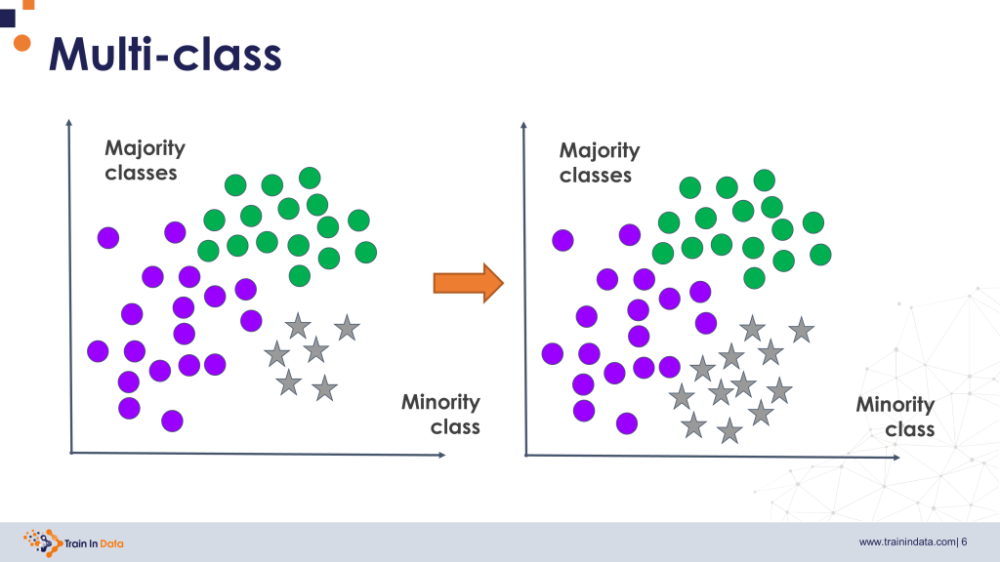

## Table of Contents

## What is a minority class in machine learning?

In machine learning, a minority class refers to a category in your data that has fewer examples compared to other categories. Imagine you are trying to predict whether an email is spam or not. If most of your emails are not spam, then the 'spam' category would be the minority class because it has fewer examples.

Dealing with minority classes can be tricky because machine learning models might have a hard time learning from them. This can lead to biased models that perform poorly on the minority class. To address this, techniques like oversampling the minority class or undersampling the majority class are often used to balance the data and improve model performance.

## Why is the minority class important in machine learning?

The minority class is important in machine learning because it often represents the group we care about the most. For example, in a medical diagnosis model, the minority class might be the patients with a rare disease. If the model can't predict this class well, it could miss diagnosing someone who really needs help. So, making sure the model works well for the minority class can be a matter of life and death.

Also, ignoring the minority class can lead to biased models. If a model is trained on data where one class is much bigger than the others, it might just learn to predict the majority class all the time. This can make the model seem like it's doing well, but it's actually not useful for real-world problems where all classes matter. Techniques like oversampling the minority class or using special algorithms can help make sure the model pays attention to all classes equally.

## What problems can arise from imbalanced datasets with a minority class?

When a dataset has a lot more examples of one class than another, it's called an imbalanced dataset. This can cause big problems for [machine learning](/wiki/machine-learning) models. The model might learn to just guess the class that shows up the most, because that's the easiest way to be right a lot of the time. For example, if you're trying to predict if a credit card transaction is fraud, and most transactions are not fraud, the model might just say "not fraud" all the time. This means the model won't be good at finding the rare cases of fraud, which is what we really care about.

Another problem is that the model's performance can look good on paper but be bad in real life. If you measure how well the model does by looking at overall accuracy, it might seem like the model is doing great because it gets the majority class right a lot. But if you look at how well it does on the minority class, you might see it's not doing well at all. This can lead to decisions that seem smart but are actually harmful, like a medical test that misses rare diseases because it's only good at spotting common ones.

## What are some common techniques used to handle the minority class?

One common way to handle the minority class is called oversampling. This means making more copies of the examples in the minority class until it's not so small compared to the other classes. For example, if you have a dataset where 90% of the examples are "not fraud" and only 10% are "fraud," you could make more copies of the "fraud" examples to balance things out. This helps the machine learning model see more of the minority class and learn from it better. Another way to do oversampling is to create new examples that are similar to the ones you already have, using methods like SMOTE (Synthetic Minority Over-sampling Technique).

Another technique is undersampling. This is the opposite of oversampling. Instead of making more examples of the minority class, you take away some examples from the majority class. If you have a dataset where 90% of the examples are "not fraud" and 10% are "fraud," you could remove some of the "not fraud" examples until the numbers are more even. This can help the model focus more on the minority class, but it means you're throwing away data, which might not be the best thing to do if you don't have a lot of examples to start with.

There are also special algorithms designed to handle imbalanced datasets. For example, some algorithms give more weight to the minority class during training, so the model pays more attention to those examples. Other methods change how the model is evaluated, so it doesn't just focus on overall accuracy. Techniques like using different performance metrics, such as precision, recall, or the F1 score, can help you see how well the model is doing on the minority class. This way, you can make sure the model is good at finding the important cases, not just the easy ones.

## How does oversampling help in dealing with the minority class?

Oversampling helps in dealing with the minority class by making more copies of the minority class examples. When a dataset has a lot more examples of one class than another, the machine learning model might focus too much on the majority class and ignore the minority class. By oversampling, we add more examples of the minority class to the dataset, making it more balanced. This gives the model more chances to learn about the minority class, so it can predict it better.

One common way to do oversampling is by using a technique called SMOTE, which stands for Synthetic Minority Over-sampling Technique. SMOTE creates new examples of the minority class that are similar to the existing ones but not exactly the same. This helps the model learn from a wider variety of examples in the minority class, which can improve its performance. By using oversampling, we can make sure that the model pays attention to all classes equally, not just the one with the most examples.

## What is undersampling and how does it address the issue of the minority class?

Undersampling is a way to fix the problem of having too many examples of one class and not enough of another. It works by taking away some of the examples from the class that has a lot of them, which is called the majority class. If you have a dataset where most examples are "not fraud" and only a few are "fraud," you could remove some of the "not fraud" examples until the numbers are more even. This makes the dataset more balanced, so the machine learning model can learn from both classes better.

By using undersampling, the model gets a fairer chance to learn about the minority class. It doesn't get overwhelmed by too many examples of the majority class, so it can focus on understanding the patterns in the minority class. This can help the model make better predictions for the minority class, which is often the most important one. However, undersampling means you're throwing away some data, which might not be the best thing to do if you don't have a lot of examples to start with.

## Can you explain the SMOTE technique for handling minority classes?

SMOTE, which stands for Synthetic Minority Over-sampling Technique, is a way to create more examples of the minority class in a dataset. It does this by making new examples that are similar to the ones you already have, but not exactly the same. Imagine you have a few red balls and a lot of blue balls. SMOTE would take those red balls and make more red balls that look a bit different from the original ones, so you end up with more red balls to balance out the blue ones. This helps the machine learning model see more examples of the minority class, so it can learn from them better.

The way SMOTE works is by looking at the features of the minority class examples and creating new examples that are a mix of the existing ones. For example, if you have two red balls with different features, SMOTE might create a new red ball with features that are somewhere in between. This makes the dataset more balanced and helps the model pay more attention to the minority class. By using SMOTE, you can improve the model's ability to predict the minority class, which is often the most important one.

## What are the advantages and disadvantages of using synthetic data generation for minority classes?

Using synthetic data generation for minority classes, like with SMOTE, has some big advantages. It helps balance the dataset by making more examples of the minority class. This gives the machine learning model more chances to learn about the minority class, so it can predict it better. This is really important when the minority class is the one we care about the most, like finding rare diseases or detecting fraud. By creating new examples that are similar but not exactly the same as the existing ones, synthetic data generation can help the model understand the patterns in the minority class better.

But there are also some disadvantages to using synthetic data generation. One problem is that the new examples might not be very realistic. They are made up, so they might not match real-world data perfectly. This can make the model learn things that aren't true, which can lead to bad predictions. Also, creating a lot of synthetic data can take a long time and use a lot of computer power. So, while synthetic data generation can help with the minority class problem, it's important to think about these downsides and make sure it's the right choice for your dataset.

## How can one evaluate the performance of a model trained on imbalanced data with a minority class?

When you're working with imbalanced data, where one class has a lot more examples than another, the usual way to check how well your model is doing might not work. Just looking at overall accuracy can be misleading. Imagine you're trying to predict if a transaction is fraud or not, and 99% of transactions are not fraud. If your model always says "not fraud," it would be right 99% of the time, but it would miss all the fraud cases. So, you need to use different ways to see how well your model is doing, especially with the minority class.

One good way to evaluate a model trained on imbalanced data is to look at metrics like precision, recall, and the F1 score. Precision tells you how many of the times the model said "fraud" were actually right. Recall tells you how many of the actual fraud cases the model found. The F1 score is a mix of precision and recall, and it's helpful when you want to balance both. You can also use something called a confusion matrix to see how well your model is doing for each class. By using these special ways to check performance, you can make sure your model is good at predicting the minority class, which is often the most important one.

## What metrics should be used to assess model performance when dealing with minority classes?

When dealing with minority classes in machine learning, it's important to use the right metrics to see how well your model is doing. Just looking at overall accuracy can be misleading because the model might be good at predicting the majority class but bad at predicting the minority class. For example, if you're trying to predict if a transaction is fraud or not, and most transactions are not fraud, a model that always says "not fraud" would have high accuracy but miss all the fraud cases. So, you need to use other metrics like precision, recall, and the F1 score to get a better picture of your model's performance.

Precision tells you how many of the times the model said "fraud" were actually right. It's calculated as the number of true positives divided by the total number of positive predictions, or $$ \text{Precision} = \frac{\text{True Positives}}{\text{True Positives} + \text{False Positives}} $$. Recall, on the other hand, tells you how many of the actual fraud cases the model found. It's calculated as the number of true positives divided by the total number of actual positives, or $$ \text{Recall} = \frac{\text{True Positives}}{\text{True Positives} + \text{False Negatives}} $$. The F1 score is a mix of precision and recall, and it's helpful when you want to balance both. It's calculated as $$ \text{F1 Score} = 2 \times \frac{\text{Precision} \times \text{Recall}}{\text{Precision} + \text{Recall}} $$. By using these metrics, you can make sure your model is good at predicting the minority class, which is often the most important one.

## How do ensemble methods like Random Forest handle the minority class problem?

Ensemble methods like Random Forest can handle the minority class problem pretty well. They do this by building a bunch of decision trees and then combining their predictions. Each tree in a Random Forest is trained on a different part of the data, which helps the model see the minority class more often. This way, the model doesn't just focus on the majority class. By looking at lots of different trees, Random Forest can figure out what's important about the minority class and make better predictions for it.

Another way Random Forest helps with the minority class is by using something called "bootstrap aggregating" or "bagging." When the trees are made, they use random samples of the data, which means some trees might see more of the minority class examples. This randomness helps the model learn from the minority class without being overwhelmed by the majority class. Overall, Random Forest's ability to look at the data from many angles and use different samples makes it good at handling imbalanced datasets and predicting the minority class well.

## What advanced techniques exist for addressing minority class issues in deep learning models?

In [deep learning](/wiki/deep-learning), one advanced technique for addressing minority class issues is called focal loss. Focal loss helps the model focus more on the hard examples, which are often from the minority class. It does this by reducing the importance of easy examples, so the model can learn better from the ones it's getting wrong. This can help the model predict the minority class more accurately. For example, if you're trying to find rare diseases, focal loss can help the model pay more attention to the few cases of the disease it's missing, rather than the many cases it's already getting right.

Another technique is called class weighting. In this method, you tell the model to care more about the minority class by giving it a higher weight. This means the model will try harder to get the minority class right. You can set the weights based on how imbalanced your data is. For example, if the minority class is much smaller than the majority class, you might give it a higher weight to balance things out. This can be done easily in many deep learning frameworks. For instance, in TensorFlow, you can use class weights like this:

```python
class_weights = {0: 1, 1: 10}
model.fit(X_train, y_train, class_weight=class_weights)
```

This tells the model to care 10 times more about the minority class (class 1) than the majority class (class 0). By using these advanced techniques, you can help your deep learning model perform better on the minority class, which is often the most important one.