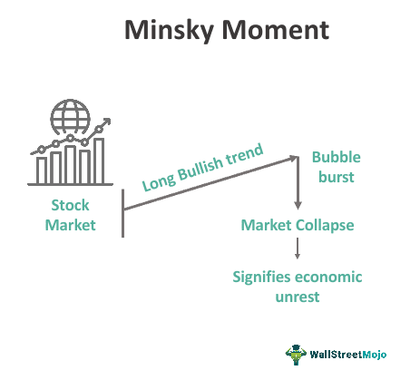

Welcome to an in-depth exploration of economic crises, focusing primarily on financial instability, the concept of the Minsky Moment, and the role of algorithmic trading. Economic crises are pivotal events that reshuffle the dynamics of global markets, often characterized by abrupt downturns and wide-reaching consequences. Central to understanding these phenomena is the Minsky Moment, a term coined to describe a tipping point in financial markets precipitated by unsustainable levels of debt and risky speculation. This moment signifies the transition from stability to instability, often leading to financial collapses that have historically left lasting impacts on economies.

As we explore this concept, it is vital to recognize how algorithmic trading has become an influential force in today's financial markets. With the ability to execute trades at speeds and volumes far exceeding human capability, algorithmic trading alters market dynamics in complex ways. Its dual nature as a source of both efficiency and volatility adds a nuanced layer to contemporary financial stability discussions. By examining algorithmic trading's potential to amplify market fluctuations or, alternatively, enhance liquidity and pricing efficiency, we can better understand its role in financial markets.

This article seeks to provide a comprehensive overview of these critical components, highlighting their interactions and implications for modern economic systems. Understanding these dynamics equips stakeholders with the necessary insights to navigate and potentially mitigate future economic crises.

## Table of Contents

## Understanding Economic Crises

Economic crises are marked by severe financial instability and economic downturns, disrupting economic activities on a broad scale. These crises are often characterized by declines in real GDP, widespread unemployment, depreciating asset prices, and a collapse in consumer and business confidence. They are complex events resulting from the interplay of various factors, including excessive speculation, elevated levels of debt, and regulatory failures.

Historically, economic crises have often emerged due to periods of overheated economic activity driven by speculative bubbles. Speculation occurs when asset prices are driven above their intrinsic value, often fueled by irrational exuberance and the belief that prices will continue to rise. This behavior can lead to the development of bubbles in markets such as real estate, stocks, or commodities, where investors significantly overvalue assets. When these bubbles burst, they can cause sharp corrections and a resultant economic downturn.

High levels of debt are another crucial factor contributing to economic crises. When individuals, corporations, or governments borrow excessively, they become vulnerable to changes in interest rates or economic conditions. A sudden inability to meet debt obligations can lead to defaults, causing panic among lenders and investors, which further aggravates financial instability. Such was the case during the 2008 financial crisis, characterized by the collapse of the housing market and large-scale defaults on subprime mortgages. This crisis illustrated how interconnected financial systems could transmit shocks globally, resulting in a severe and prolonged economic recession affecting virtually every economy worldwide.

Simultaneously, regulatory failures can also play a significant role in precipitating economic crises. Weak regulatory frameworks may fail to monitor or control risky financial practices, allowing them to proliferate unchecked. Inadequate oversight of financial institutions and markets has often exacerbated the impact of economic downturns by permitting the unchecked growth of vulnerable financial structures.

More recently, the COVID-19 pandemic has underscored the multifaceted nature of economic crises. The pandemic-induced crisis was unique in that it was precipitated by a public health emergency rather than financial imbalances. Governments worldwide adopted drastic measures to contain the virus's spread, including lockdowns and restrictions on movement, leading to sharp contractions in economic activity. The resultant economic disruptions highlighted vulnerabilities in global supply chains and labor markets, leading to widespread economic hardship.

Economic crises often herald prolonged periods of hardship marked by unemployment and declining living standards. When businesses fail or contract due to decreased demand, unemployment rises, resulting in diminished consumer spending and further exacerbating economic contraction. The social and economic costs of such crises are profound, often leading to increased poverty rates and income inequality.

Understanding the mechanisms that drive economic crises is essential for formulating policies to prevent or mitigate their impacts. Through analyzing past crises and recognizing the warning signs of excessive speculation, high debt levels, and regulatory gaps, policymakers can develop frameworks aimed at enhancing financial stability and resilience.

## The Minsky Moment: A Catalyst for Financial Instability

The Minsky Moment, an economic concept attributed to American economist Hyman Minsky, characterizes a sudden and severe market collapse that occurs after an extended period of financial exuberance. This phenomenon is often driven by speculative investment activities that lead to unsustainable levels of leverage among investors. According to Minsky's Financial Instability Hypothesis, financial markets go through a series of credit cycles which can be delineated into three stages: hedge finance, speculative finance, and Ponzi finance.

1. **Hedge Finance**: In this stage, borrowers can meet their debt obligations (interest and principal) through their cash flows. This phase is marked by stability as lenders and borrowers operate within a sustainable framework.

2. **Speculative Finance**: As market confidence grows, lenders and borrowers begin to take on riskier positions. Borrowers can cover their interest payments from their cash flows but must continually refinance their principal. This increases market fragility, as the system becomes more dependent on favorable refinancing conditions.

3. **Ponzi Finance**: At this point, borrowers rely on the continuous appreciation of asset values to meet their debt obligations, unable to cover even the interest payments from their income. This situation is precarious and unsustainable, often leading to a crisis.

When the financial system is dominated by Ponzi finance, it is vulnerable to even minor disruptions. A trigger event, such as a change in interest rates or a reassessment of risk, can lead to a cascading effect of asset sell-offs, rapidly depleting [liquidity](/wiki/liquidity-risk-premium). This tipping point, the Minsky Moment, results in a severe market downturn as investors scramble to unwind their leveraged positions, exacerbating market instability.

Minsky’s theory highlights the inherent cyclicality of financial markets and emphasizes how periods of stability can paradoxically sow the seeds of future instability. The Minsky Moment reminds policymakers and market participants of the importance of maintaining vigilance and implementing regulatory measures aimed at reducing excessive leverage and preventing speculative bubbles.

## Algorithmic Trading and Market Dynamics

Algorithmic trading, which involves the use of advanced mathematical models and pre-programmed instructions to execute trades, has transformed modern financial markets. Such systems can analyze massive datasets and execute trades in milliseconds, significantly outpacing human traders. At its core, [algorithmic trading](/wiki/algorithmic-trading) aims to capitalize on market opportunities for profit while maintaining efficient pricing and liquidity provision.

A primary benefit of algorithmic trading is enhanced market efficiency. By automating trades, algorithms can help ensure that asset prices reflect available information more quickly and accurately. This efficiency is achieved through the elimination of human biases and errors in trading, potentially leading to narrower bid-ask spreads and improved market liquidity. A key component of this process is high-frequency trading ([HFT](/wiki/high-frequency-trading-strategies)), which involves the rapid execution of a high [volume](/wiki/volume-trading-strategy) of trades. HFT firms compete to identify fleeting price discrepancies across markets, known as [arbitrage](/wiki/arbitrage) opportunities, thereby contributing to price alignment and liquidity.

However, the same features that contribute to market efficiency can also lead to increased [volatility](/wiki/volatility-trading-strategies), particularly under conditions of market stress. The speed and volume of algorithm-based operations can exacerbate price swings, resulting in phenomena such as flash crashes. A flash crash is a sudden and deep plunge in security prices, followed by a swift recovery, often occurring within minutes. Notable examples include the Flash Crash of May 6, 2010, where the Dow Jones Industrial Average plummeted nearly 1,000 points before rebounding in a short span. Such events have been partly attributed to rapid algorithmic trading strategies triggering a cascade of automated sell orders.

The dual impact of algorithmic trading raises questions about its role in financial stability. On one hand, algorithms, when designed with robust risk management protocols, can provide a stabilizing influence. By incorporating stop-loss mechanisms and other risk management strategies, algorithms can limit exposure to adverse market moves. Additionally, algorithmic market-making can supply much-needed liquidity during normal market conditions, reducing volatility.

On the other hand, the potential for these systems to disruptive markets underscores the need for effective regulation. Regulatory frameworks need to address the speed and complexity of algorithmic trading, focusing on risk controls and transparency. Measures such as circuit breakers, which halt trading temporarily during extreme price movements, can mitigate the risk of flash crashes. Additionally, mandating detailed audit trails and real-time monitoring of algorithmic strategies can enhance oversight and accountability.

Proponents argue that, with well-crafted regulation, algorithmic trading can achieve a balance between market efficiency and stability. By ensuring compliance with established risk parameters, regulators can harness the benefits of technology-driven trading while safeguarding against systemic risks. The ongoing evolution of financial markets necessitates adaptive regulatory approaches that keep pace with technological advancements.

In summary, algorithmic trading constitutes a powerful force in modern market dynamics, offering both opportunities and challenges. Its capacity to enhance liquidity and price efficiency is offset by the potential to amplify volatility and systemic risk. As markets continue to evolve, understanding the nuanced implications of algorithmic trading remains critical for policymakers, traders, and investors alike.

## Interplay between Minsky Moments and Algorithmic Trading

Algorithmic trading, with its reliance on computer algorithms to execute trades at high speeds, plays a significant role in modern financial markets. This technology can impact the timing and severity of market dislocations, potentially influencing the occurrence of Minsky Moments. One key mechanism is the programmed execution of stop-loss orders, which can lead to rapid sell-offs. These automated sell-offs may contribute to sudden market downturns, characteristic of a Minsky Moment, by increasing market volatility and exacerbating price declines.

While algorithmic trading might hasten the onset of a Minsky Moment in this manner, it also has the potential to enhance market stability. Algorithmic strategies can swiftly identify and capitalize on arbitrage opportunities, thereby injecting liquidity into the market. This can help to stabilize prices and reduce volatility during periods of market stress. For instance, high-frequency trading algorithms can exploit price discrepancies between different markets or financial instruments faster than human traders, restoring balance to prices and maintaining market efficiency.

A critical aspect of understanding the relationship between algorithmic trading and Minsky Moments involves assessing whether this technology injects systemic risk or provides a buffer against financial instability. The automated nature of algorithmic trading means large volumes of orders can be executed based on predefined rules without the intervention of human judgment, potentially leading to unintended consequences during periods of intense market stress. Moreover, the interactions between various algorithmic strategies, particularly when they are not transparent or understood by market regulators, could lead to feedback loops that amplify price movements and increase systemic risk.

On the other hand, when effectively regulated, algorithmic trading can offer solutions to financial crises by promoting liquidity, improving market efficiency, and reducing transaction costs. Regulators and market participants must work together to ensure that algorithmic trading systems are robust, transparent, and capable of operating effectively during periods of market stress. This may involve implementing circuit breakers to halt trading during periods of excessive volatility or ensuring that algorithms are designed to minimize the risk of flash crashes.

In conclusion, the interplay between Minsky Moments and algorithmic trading presents both challenges and opportunities. While algorithmic trading might accelerate market declines under certain conditions, it also holds the potential to stabilize markets and mitigate financial crises. Understanding this dual nature is essential for policymakers and financial institutions aiming to navigate the complex dynamics of modern markets.

## Predicting and Preparing for Minsky Moments

Predicting Minsky Moments presents a considerable challenge given the intricate dynamics of modern financial markets and the unforeseen emergence of speculative bubbles. A Minsky Moment, coined by economist Hyman Minsky, is characterized by a rapid market collapse following a period of exuberant growth, often precipitated by excessive leverage and speculative investment behavior. Understanding and anticipating these events necessitate the identification of certain key indicators that precede financial instability.

One primary indicator is rapid credit expansion, which often signals that the economy is entering risky territory. When credit growth outpaces the underlying economic fundamentals, it typically indicates an unsustainable build-up of debt that can lead to financial distress. This was vividly illustrated in the 2008 financial crisis, where a surge in subprime mortgage lending created a housing bubble that ultimately burst, cascading into global financial turmoil.

Asset bubbles themselves serve as another critical warning signal. These occur when the price of assets—such as real estate, stocks, or commodities—rises significantly above their intrinsic value, often driven by speculative fervor rather than fundamental valuation. The moment the bubble bursts, a chain reaction of sell-offs can ensue, triggering a Minsky Moment.

Deterioration of lending standards is also an essential metric to monitor. During periods of economic euphoria, financial institutions might relax their lending criteria to capitalize on the boom, thereby increasing the risk of defaults once the market turns. This relaxation can manifest in lower credit score requirements, higher loan-to-value ratios, or more lenient income verification processes.

Preparation for potential Minsky Moments involves implementing robust regulatory frameworks that can detect and mitigate excessive risk-taking activities across financial markets. Regulatory bodies must ensure that financial intermediaries maintain sufficient capital buffers to withstand economic shocks. Stress testing and macroprudential measures are tools that can be used to assess the resilience of financial institutions under hypothetical adverse conditions.

Proactive fiscal and monetary policies also play a crucial role in preparing for economic downturns. Central banks can stabilize markets through appropriate [interest rate](/wiki/interest-rate-trading-strategies) adjustments and liquidity provisions, while governments can employ fiscal stimulus to support economic activity. By promoting transparency, stringent oversight, and sound risk management practices, authorities can better cushion the adverse impacts of a financial crisis.

Ultimately, while predicting Minsky Moments with exact precision is inherently difficult, understanding these key indicators and preparing with comprehensive policy measures provide a pathway to reducing the magnitude and frequency of financial crises.

## Conclusion

Economic crises are intrinsic to capitalist systems, often driven by cycles of boom and bust that are, in turn, reinforced by speculation and leverage. These cycles can create financial environments ripe for instability, highlighting the essential role of oversight and adaptive policy measures as emphasized by the concept of Minsky Moments. Hyman Minsky's theory underscores the necessity for vigilant regulation and proactive economic policies to anticipate and mitigate the impacts of rapid financial transitions, ensuring economic stability.

Algorithmic trading further complicates this landscape, acting as a double-edged sword within financial markets. While it can significantly enhance market efficiency by providing liquidity and enabling rapid price discovery, it also has the potential to exacerbate volatility. The high-speed nature of algorithmic trading, especially during periods of market stress, can contribute to extreme price movements or flash crashes, thereby amplifying systemic risks. Yet, with adequate regulatory oversight, the benefits of algorithmic trading can be harnessed effectively, aligning with market efficiency objectives.

A comprehensive understanding of both economic crises and the tools that drive market dynamics is essential for stakeholders. Grasping the interplay between Minsky Moments and algorithmic trading enables investors, regulators, and policymakers to devise strategies that navigate and potentially mitigate financial crises. In equipping themselves with this knowledge, stakeholders can foster more resilient financial systems better prepared to withstand the inevitable ebbs and flows of a capitalist economy.

## References & Further Reading

[1]: ["Stabilizing an Unstable Economy"](https://archive.org/details/stabilizingunsta0000mins) by Hyman P. Minsky.

[2]: Malkiel, B. G. (2003). ["The Efficient Market Hypothesis and Its Critics."](https://www.princeton.edu/~ceps/workingpapers/91malkiel.pdf) Journal of Economic Perspectives, 17(1), 59-82.

[3]: Zigrand, J.-P., & Danielsson, J. (2008). ["What happens when you regulate risk? Evidence from a simple equilibrium model."](https://www.riskresearch.org/files/DanielssonZigrand2003.pdf) Economic Theory, 32, 1-23.

[4]: Borio, C. (2014). ["The financial cycle and macroeconomics: What have we learnt?"](https://www.sciencedirect.com/science/article/pii/S0378426613003063) Bank for International Settlements. Working Paper No. 395.

[5]: Kirilenko, A. A., Kyle, A. S., Samadi, M., & Tuzun, T. (2017). ["The Flash Crash: The Impact of High Frequency Trading on an Electronic Market."](https://onlinelibrary.wiley.com/doi/abs/10.1111/jofi.12498) The Journal of Finance, 72(3), 967-998.

[6]: Aldridge, I. (2010). ["High-Frequency Trading: A Practical Guide to Algorithmic Strategies and Trading Systems"](https://www.ahmetbeyefendi.com/wp-content/uploads/2020/07/High-Frequency-Trading-Irene-Aldridge.pdf) by Irene Aldridge.

[7]: Thurner, S., Farmer, J. D., & Geanakoplos, J. (2012). ["Leverage Causes Fat Tails and Clustered Volatility."](https://arxiv.org/abs/0908.1555) Proceedings of the National Academy of Sciences, 109(45), 18342-18346.