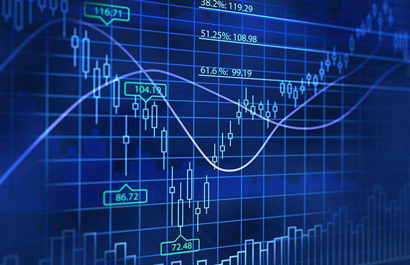

The world of coin production and trading is a fascinating intersection of history, economics, and technology. At the heart of coin production in the United States is the U.S. Mint, an institution steeped in history yet continuously evolving to meet modern needs. Established in 1792, the U.S. Mint is responsible for creating not only coins for everyday circulation but also collectibles that capture the interest of numismatists worldwide. Its operations are a reflection of tradition and progress, where time-honored methods meet cutting-edge techniques to ensure efficiency and precision in coin production.

Parallel to the historic evolution of coin minting is the rise of algorithmic trading, a transformative force in the financial markets. Algorithmic trading leverages sophisticated algorithms and high-speed computing to execute trading strategies at a pace and precision unattainable by human traders. It represents a remarkable leap in technological capability, fundamentally altering how trades are conducted by providing speed, accuracy, and complex strategy execution that optimizes profit potential. This technological advancement has not only reshaped trading practices but also significantly influenced market dynamics by enhancing liquidity and tightening spreads.



This article examines these two compelling fields—U.S. Mint coin production and algorithmic trading—highlighting their roles in the financial ecosystem and their impacts on the broader economic landscape. Together, they showcase an intriguing blend of historical legacy and technological innovation, underscoring how established practices evolve through the integration of new technologies to advance economic systems.

## Table of Contents

## Understanding Coin Production at the U.S. Mint

The United States Mint, founded in 1792, is integral to the production of the nation’s coin currency. An arm of the Department of the Treasury, the U.S. Mint's primary mission is to produce an adequate volume of circulating coinage for the nation to conduct its trade and commerce. Beyond this primary mandate, it also produces collectible coins, Congressional Gold Medals, and silver, gold, and platinum bullion coins.

The Mint operates multiple facilities, each specializing in different facets of coin production. These facilities are located in Philadelphia, Denver, San Francisco, and West Point. The Philadelphia Mint, as the largest facility, is primarily responsible for engraving and designing coins. Denver and Philadelphia both produce coins for circulation, while San Francisco focuses on proof coinage, and West Point manufactures mint-quality bullion coins and medals. These facilities also ensure the security and proper handling of metals used in coin production. 

Coin production is a complex process involving several stages. Initially, artists and engravers collaborate to develop a coin's design guided by legislative requirements and artistic considerations. The design is then engraved into steel dies, which are used to strike the coins. 

Modern mints have incorporated automated systems and advanced technology to enhance efficiency and precision in every stage of production. Computer-aided design (CAD) software converts artists' renderings into three-dimensional digital models. These are essential for precision in die creation and design transfers. Additionally, high-speed coining presses automate the striking process, producing coins at impressive speeds—up to 750 coins per minute in some machines. Automated packaging systems further streamline the post-production process by efficiently organizing coins for distribution.

Annually, the U.S. Mint produces billions of coins, with a substantial share dedicated to denominations such as pennies and quarters. For instance, in 2022, over 14 billion coins were minted, with pennies accounting for approximately 60% of that total production. Quarters, due to their utility and popularity, also represent a significant portion. These vast outputs ensure the continuous availability of coinage necessary for everyday transactions and commerce across the United States.

The U.S. Mint stands at the confluence of technology and tradition, ensuring the coins' supply meets the demands of a modern economy while preserving their historical and numismatic significance.

## The Role and Impact of Algorithmic Trading

Algorithmic trading involves the use of sophisticated algorithms and high-speed computing systems to execute trading decisions in financial markets. This approach offers significant advantages, notably enhanced trading speed and precision. With these algorithms, traders can execute complex strategies designed to maximize profit potential while minimizing human error.

One of the primary impacts of [algorithmic trading](/wiki/algorithmic-trading) is its ability to provide increased [liquidity](/wiki/liquidity-risk-premium) and tighter spreads in the market. Liquidity is critical for efficient market functioning as it allows traders to enter and [exit](/wiki/exit-strategy) positions with relative ease, influencing the bid-ask spread—the difference between the prices quoted for an immediate sale (ask) and an immediate buy (bid), which narrows with higher liquidity.

$$
\text{Bid-Ask Spread} = \text{Ask Price} - \text{Bid Price}
$$

Algorithmic trading strategies can include a variety of techniques such as statistical [arbitrage](/wiki/arbitrage), [market making](/wiki/market-making), and [trend following](/wiki/trend-following). These strategies are implemented using algorithms that can analyze vast datasets at speeds unmatched by human traders. Python is often used in this domain for its simplicity and extensive libraries like NumPy and pandas, aiding in data manipulation and analysis. Below is a basic example of how one might use Python to simulate a simple moving average crossover strategy:

```python
import numpy as np
import pandas as pd

# Sample data: placeholder for historical stock prices
prices = pd.Series([10, 12, 11, 13, 14, 13, 15, 16, 18, 17])

# Calculate short and long term moving averages
short_window = 2
long_window = 4
signals = pd.DataFrame(index=prices.index)
signals['price'] = prices
signals['short_mavg'] = prices.rolling(window=short_window, min_periods=1).mean()
signals['long_mavg'] = prices.rolling(window=long_window, min_periods=1).mean()

# Identify buy/sell signals
signals['signal'] = 0.0
signals['signal'][short_window:] = np.where(signals['short_mavg'][short_window:] > signals['long_mavg'][short_window:], 1.0, 0.0)
signals['positions'] = signals['signal'].diff()

print(signals)
```

While algorithmic trading has substantially benefited market efficiency, it also introduces concerns related to market [volatility](/wiki/volatility-trading-strategies) and stability. Flash crashes, for example, are rapid sell-offs in financial markets, exacerbated by automated trading systems suddenly retreating from the markets, as observed in past events such as the 2010 Flash Crash. These incidents raise questions about the safeguards necessary to balance technological advancement with market risk mitigation.

In conclusion, while algorithmic trading enhances the capabilities and functioning of financial markets, industry participants and regulators must continually assess the risks and ethical considerations brought forth by these advanced systems. Such evaluations ensure that the benefits of algorithmic trading are realized without compromising market integrity or investor protection.

## Intersecting Worlds: U.S. Mint Coin Production and Algo Trading

While seemingly disparate, U.S. Mint coin production and algorithmic trading symbolize two distinct yet intersecting worlds: one forged from historical craftsmanship, the other from cutting-edge technological advancement.

The modern production of coins at the U.S. Mint exemplifies efficiency and precision, achieved through a combination of automation and meticulous engineering. Automated machinery and digitally guided processes ensure that each coin is crafted to exact specifications. The minting process involves a series of steps such as designing, engraving intricate patterns, and striking the metal blanks with great force and precision. This evolution from manual to automated processes reflects a broader trend toward technological integration, enhancing both output and consistency in quality.

Algorithmic trading, by contrast, operates at the frontier of technological innovation in financial markets. It relies on complex algorithms and high-speed computing to execute trades with extraordinary speed and precision. The creation and deployment of advanced algorithms allow traders to capitalize on market opportunities that are fleeting and would be impossible to capture manually. These algorithms evaluate vast datasets, identifying patterns and executing trades based on predefined criteria, often in milliseconds.

Despite their divergent origins, both coin production and algorithmic trading are united by their reliance on technology to optimize performance. In mints, machinery has replaced much of the manual labor, paralleling the role of algorithms in trading, which transform data-driven strategies into actionable financial maneuvers. The technology stacks supporting these activities—automated production lines in mints and algorithmic platforms in trading—are a testament to the relentless march of technological progress.

Both sectors highlight an ongoing shift towards greater reliance on technology. In production, machines operate with minimal human intervention to ensure efficiency and reduce errors. Meanwhile, in financial markets, algorithmic trading continues to redefine the speed and nature of transactions, emphasizing the importance of speed and strategy in achieving economic gains.

The synergy between automation and precision in these fields signals how traditional and modern practices are converging. Coin production's shift towards automation mirrors the algorithmic trading sector's growing reliance on computational power. As we witness the ongoing evolution in both domains, they collectively embody a broader narrative of technological advancement, where precision and speed are paramount.

## The Future of Minting and Trading

As technological advancements continue, the future of both coin minting and algorithmic trading is expected to undergo significant evolution. The U.S. Mint, an institution with a long history of innovation in coin production, is continually exploring new methods to enhance its operations. This includes leveraging technology to improve efficiency, precision, and environmental sustainability. The introduction of more advanced automated systems and innovative materials in coin production processes are likely to play a pivotal role in the future.

For instance, the U.S. Mint can explore the use of [machine learning](/wiki/machine-learning) algorithms to optimize the design and engraving processes. By analyzing historical data and using predictive models, machine learning can suggest design improvements that reduce material waste and enhance the aesthetic appeal of coins. Additionally, automation and robotics can be further integrated into the production line to increase throughput and accuracy. The implementation of Internet of Things (IoT) technology can facilitate real-time monitoring of production metrics, allowing for immediate adjustments and minimizing downtime.

Concurrently, the field of algorithmic trading is rapidly advancing with the development of more sophisticated algorithms. These algorithms are designed to analyze large datasets at unprecedented speeds, providing traders with insights that were previously unattainable. The continuous evolution of machine learning and [artificial intelligence](/wiki/ai-artificial-intelligence) opens possibilities for creating predictive models that can better anticipate market movements and optimize trading strategies.

In algorithmic trading, the deployment of high-frequency trading ([HFT](/wiki/high-frequency-trading-strategies)) algorithms that capitalize on minute price discrepancies across different platforms is a burgeoning trend. These systems rely on state-of-the-art computing infrastructure to execute trades in milliseconds, significantly enhancing market efficiency. However, balancing the increased speed and complexity of trading algorithms with regulatory oversight to prevent market disruptions, such as flash crashes, remains a critical challenge.

The ongoing relationship between traditional and modern finance mechanisms becomes evident when considering these advancements. While the U.S. Mint represents the enduring legacy of tangible financial assets, algorithmic trading epitomizes the shift towards digital financial systems. Both sectors are bound by the common thread of innovation aimed at refining economic processes. As they integrate more advanced technologies, they highlight the convergence of traditional practices with modern advancements in finance.

Overall, the alignment of the minting process and algorithmic trading with emerging technological trends portends a future where financial operations are more efficient, transparent, and adaptive to global economic changes. This synergy not only promises to strengthen existing financial ecosystems but also sets the stage for new paradigms in economic interaction and commerce.

## Conclusion

Coin production at the U.S. Mint and algorithmic trading embody the dynamic progression of financial technology and commerce across different eras. These sectors illustrate the symbiotic relationship between enduring traditions and innovative techniques in enhancing economic systems. The U.S. Mint, steeped in centuries of history, continues to adapt and modernize by integrating automated systems and precision machinery into its coin production processes. This evolution ensures efficiency and accuracy, aligning traditional practices with contemporary demands.

Conversely, algorithmic trading exemplifies the cutting-edge application of technology in financial markets. By leveraging advanced algorithms and high-speed computing, traders can execute complex strategies with unmatched speed and precision, reshaping market dynamics. Despite the disparate nature of these fields, they share common ground in their reliance on technological advancement to achieve optimized outcomes.

As technological innovations progress, both the minting and trading realms are expected to undergo further transformation. The U.S. Mint remains dedicated to refining its production methodologies, while algorithm developers push the boundaries of trading strategies. This ongoing development underscores a broader narrative of convergence between traditional and modern financial methodologies.

The intertwining of coin production and algorithmic trading underscores their enduring impact on the global financial landscape. As both sectors continue to evolve, they promise to leave a profound and far-reaching legacy, shaping the future of economic systems worldwide.

## References & Further Reading

[1]: Taxay, D. (1983). "The U.S. Mint and Coinage: An Illustrated History from 1776 to the Present." Arco Publishing.

[2]: Marques, P. (2021). ["Algorithmic Trading and Quantitative Strategies."](https://api.pageplace.de/preview/DT0400.9781498737197_A39374186/preview-9781498737197_A39374186.pdf) CRC Press.

[3]: Tsang, A. A., & Wang, K. (2017). ["Algorithmic and High-Frequency Trading."](https://assets.cambridge.org/97811070/91146/frontmatter/9781107091146_frontmatter.pdf) Euromoney Institutional Investor.

[4]: Lo, A. W. (2017). ["Adaptive Markets: Financial Evolution at the Speed of Thought."](https://www.amazon.com/Adaptive-Markets-Financial-Evolution-Thought/dp/0691135142) Princeton University Press.

[5]: Snellings, M. (2009). "U.S. Mint: History and Coinage." Hachette Books.

[6]: Ferris, E. (2010). ["The Impact of Algorithmic Trading on the Financial Market."](https://www.semanticscholar.org/paper/Analyzing-the-impact-of-algorithmic-trading-on-A-Damilare-Oyeniyi/cfaa220cded37f824aa2bf5b97f26c9b2aa6cb95) IEEE Conference on Intelligence and Security Informatics.