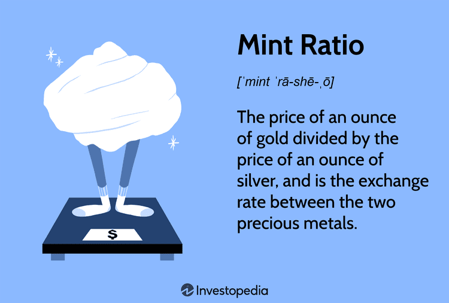

## Table of Contents

## What is the mint ratio?

The mint ratio is the number that shows how many ounces of silver are needed to get one ounce of gold. In the past, countries used this ratio to decide how much gold and silver should be in their coins. For example, if the mint ratio was 15, it meant that 15 ounces of silver were equal to one ounce of gold.

This ratio was important because it helped keep the value of money stable. If the ratio changed, people might start to hoard one metal and spend the other, which could mess up the economy. Governments had to be careful to set the right mint ratio to make sure people trusted their money.

## Why is the mint ratio important in numismatics?

The mint ratio is important in numismatics because it helps collectors and researchers understand the history and value of old coins. Numismatics is the study of coins and money, and knowing the mint ratio can tell us a lot about what metals were used in coins from different times and places. For example, if a coin from the 18th century has a certain amount of gold and silver, knowing the mint ratio of that time can help us figure out how valuable it was back then.

This ratio also affects how coins were made and used. If the mint ratio changed, it could make people want to save one metal and spend the other. This could lead to fewer coins being made with one metal, which is interesting for collectors. By studying the mint ratio, numismatists can learn about economic changes and how they affected the coins people used every day.

## How is the mint ratio calculated?

The mint ratio is calculated by figuring out how many ounces of silver are needed to equal one ounce of gold. This is done by looking at the official exchange rate set by a government or a mint. For example, if the government says that 15 ounces of silver are worth the same as one ounce of gold, then the mint ratio is 15 to 1.

This ratio can change over time because the value of gold and silver can go up or down. Governments might change the mint ratio to keep the economy stable. If the ratio is too high, people might start saving silver and spending gold, which can cause problems. So, the mint ratio is important for making sure that the value of coins stays balanced.

## Can you provide a simple example of a mint ratio?

Imagine you have a mint ratio of 10 to 1. This means that 10 ounces of silver are worth the same as 1 ounce of gold. If you have 10 ounces of silver, you could trade it for 1 ounce of gold, and everyone would think that's a fair deal.

This ratio is set by the government or the mint. They decide how much silver equals one ounce of gold. If the ratio changes, like if it goes to 12 to 1, then you would need 12 ounces of silver to get 1 ounce of gold. This can affect how people use and save their money.

## What factors can affect the mint ratio?

Several things can change the mint ratio. One big [factor](/wiki/factor-investing) is the supply and demand for gold and silver. If more people want gold, its value goes up, and the mint ratio might change to need more silver for the same amount of gold. Also, finding new sources of gold or silver can change how much is available, which can affect the ratio.

Another factor is what the government decides. They can change the mint ratio to help the economy. If they think too much gold is being saved and not enough silver, they might change the ratio to make people use more gold. Wars, economic problems, or new laws can also make governments adjust the mint ratio to keep money stable.

## How does the mint ratio influence the value of coins?

The mint ratio can change how much a coin is worth. If the mint ratio says that 15 ounces of silver are the same as one ounce of gold, then a coin made of gold will be worth a lot more than a coin made of silver. If the ratio changes to 20 ounces of silver for one ounce of gold, then the gold coin becomes even more valuable compared to the silver coin. This is because people need more silver to get the same amount of gold.

Changes in the mint ratio can also make people save one type of metal and spend the other. If the ratio goes up, people might start saving their silver coins and using their gold coins more. This can make silver coins rarer and more valuable over time. Governments have to be careful with the mint ratio because it can affect how people use money and how much their coins are worth.

## What historical events have impacted the mint ratio?

One big event that changed the mint ratio was when Christopher Columbus found America. Before this, Europe didn't know about all the gold and silver in the new world. When they started bringing back a lot of these metals, it made them less rare, so their value went down. This caused the mint ratio to change because now there was more silver and gold around.

Another important time was during the California Gold Rush in the 1800s. A lot of gold was found in California, which made the value of gold go down because there was so much of it. This meant the mint ratio changed to need less silver for the same amount of gold. These big events show how finding new sources of gold and silver can really affect the mint ratio and the economy.

## How do different countries manage their mint ratios?

Different countries manage their mint ratios in their own ways, but it usually depends on what the government decides. They look at how much gold and silver people have and how much they want. If there's a lot of gold but not much silver, the government might change the mint ratio to make people use more gold. This helps keep the economy stable and stops people from saving one metal and spending the other too much.

Sometimes, countries work together to set mint ratios. For example, in the past, countries in Europe used the same mint ratio to make trading easier. If one country changed its ratio, it could affect other countries, so they had to talk to each other. This teamwork helped keep the value of money the same across different places and made it easier for people to buy and sell things.

## What are the challenges in maintaining a consistent mint ratio?

Keeping the mint ratio the same is hard because the value of gold and silver can change a lot. If people find a lot of gold or silver in new places, it can make these metals less valuable. For example, when Columbus found America, a lot of gold and silver came to Europe, which made the mint ratio change. Also, if people suddenly want more gold or silver, it can make the value of these metals go up or down. Governments have to watch these changes and decide when to change the mint ratio to keep the economy stable.

Another challenge is that different countries might have different mint ratios. If one country changes its ratio, it can affect other countries too. This can make trading harder because the value of money is different in each place. To solve this, countries sometimes work together to set the same mint ratio. But this needs a lot of talking and agreeing, which can be tough. So, keeping the mint ratio the same is a big job that needs a lot of watching and working together.

## How does the mint ratio relate to the concept of seigniorage?

The mint ratio and seigniorage are connected because they both have to do with making and using coins. Seigniorage is the money a government makes from making coins. It's the difference between what it costs to make a coin and what the coin is worth. If the mint ratio is set right, the government can make more money from seigniorage. For example, if the mint ratio says 15 ounces of silver equal one ounce of gold, the government can decide how much gold and silver to put in coins to make the most money.

But if the mint ratio changes, it can affect seigniorage. If the value of gold goes up and the mint ratio changes to 20 ounces of silver for one ounce of gold, people might start saving their silver coins and spending their gold coins. This can make it harder for the government to make money from seigniorage because people are using less of one type of coin. So, the government has to be careful with the mint ratio to keep making money from seigniorage and to keep the economy stable.

## What advanced techniques are used to analyze mint ratios in economic studies?

In economic studies, researchers use advanced techniques like econometric modeling to analyze mint ratios. Econometric modeling helps them look at how the mint ratio changes over time and what affects it. They use math and [statistics](/wiki/bayesian-statistics) to see patterns and make predictions. For example, they might use regression analysis to see how the supply and demand for gold and silver change the mint ratio. This helps them understand how the mint ratio affects the economy and how governments should set it.

Another technique is historical data analysis. Researchers look at old records and documents to see how the mint ratio was set in the past and what happened when it changed. They might use computer programs to go through a lot of data quickly and find important information. This helps them see how big events, like finding new gold or silver, changed the mint ratio and the economy. By studying the past, they can learn how to manage the mint ratio better in the future.

## How might future technological advancements affect the mint ratio?

Future technology could change how we find and use gold and silver, which could affect the mint ratio. If new machines make it easier to find these metals, there might be more gold and silver around. This could make them less valuable, so the mint ratio might need to change. Also, if we invent new ways to use gold and silver, like in batteries or computers, it could make people want more of these metals. This would make their value go up and might change the mint ratio too.

Governments will have to watch these changes closely. They might use new computer programs to study the mint ratio and see how it's changing. These programs could help them decide when to change the mint ratio to keep the economy stable. As technology keeps getting better, it will be important for governments to keep up and adjust the mint ratio so that people trust their money and the economy stays strong.

## What is the role of financial analysis in investment?

Conducting financial analysis is a fundamental aspect of evaluating investment opportunities across various asset classes. It involves utilizing a range of quantitative tools and frameworks to assess the performance and risk associated with investment portfolios. Central to this evaluation are several key financial ratios, including the Sharpe Ratio, Treynor Ratio, and Sortino Ratio, each offering unique insights into how effectively a portfolio is managed relative to risk.

The Sharpe Ratio is perhaps the most widely known metric, measuring the average return earned in excess of the risk-free rate per unit of [volatility](/wiki/volatility-trading-strategies) or total risk. It is calculated as follows:

$$
\text{Sharpe Ratio} = \frac{R_p - R_f}{\sigma_p}
$$

where $R_p$ is the return of the portfolio, $R_f$ is the risk-free rate, and $\sigma_p$ is the standard deviation of the portfolio’s excess return. A higher Sharpe Ratio indicates a more attractive risk-adjusted return.

The Treynor Ratio, on the other hand, assesses returns relative to systemic risk, focusing on a portfolio's performance in relation to market-wide risks as captured by beta ($\beta_p$). It is defined as:

$$
\text{Treynor Ratio} = \frac{R_p - R_f}{\beta_p}
$$

This metric is particularly useful for investors who wish to evaluate the performance of a diversified portfolio, where portfolio beta reflects the portfolio’s sensitivity to market movements. A high Treynor Ratio suggests an efficient management of market risk.

The Sortino Ratio is another variation, similar to the Sharpe Ratio, but it differentiates between harmful volatility (downside risk) and total volatility by using downside deviation in the denominator. It is calculated as:

$$
\text{Sortino Ratio} = \frac{R_p - R_f}{\sigma_d}
$$

Here, $\sigma_d$ represents the downside deviation or the standard deviation of negative asset returns. This ratio is considered by investors more concerned with downside risk than total risk, offering a more nuanced view of risk-adjusted performance.

Financial analysis through these ratios helps investors mitigate risks and maximize returns by identifying undervalued or overvalued assets, enabling them to make informed and strategic decisions. Understanding how to calculate and interpret these ratios is essential for developing a robust long-term investment strategy. Mastery of these concepts allows investors to apply a critical, data-driven approach to investment decisions, enhancing their ability to optimize portfolios in alignment with their risk tolerance and financial goals. As such, these analytical tools form a vital part of any investor's toolkit, facilitating more effective portfolio management and risk assessment.

## How can one integrate Mint Ratio, Financial Analysis, and Algo Trading?

In the pursuit of a comprehensive investment strategy, the integration of the mint ratio, financial analysis, and [algorithmic trading](/wiki/algorithmic-trading) provides a pathway to identify and exploit lucrative trading opportunities. By effectively combining these elements, investors can create a multifaceted approach that enhances both the precision and efficiency of their trading endeavors.

Understanding the mint ratio, which is the exchange rate between gold and silver, plays a pivotal role in gauging market risk and investor sentiment. Historically, this ratio served as a fixed standard under gold and silver-based currency systems. In contemporary markets, fluctuations in the mint ratio can signal economic uncertainty, often prompting investors to gravitate towards gold as a safer asset. By monitoring these changes, investors can anticipate shifts in market sentiment and adjust their strategies accordingly.

Financial analysis, with metrics like the Sharpe Ratio, Treynor Ratio, and Sortino Ratio, offers insights into a portfolio’s performance relative to its risk. These ratios are instrumental in identifying overvalued or undervalued assets, guiding investors towards optimal asset allocation. For instance, the Sharpe Ratio, calculated as 

$$
\text{Sharpe Ratio} = \frac{R_p - R_f}{\sigma_p}
$$

where $R_p$ is the portfolio return, $R_f$ is the risk-free rate, and $\sigma_p$ is the standard deviation of the portfolio’s excess return, provides a measure of risk-adjusted return. By interpreting these financial metrics, investors are equipped to make data-driven decisions that align with their risk appetite and investment goals.

Algorithmic trading amplifies this framework by leveraging algorithms to automate trading decisions based on pre-defined criteria. These algorithms utilize historical data and technical indicators to facilitate strategies such as [trend following](/wiki/trend-following), [statistical [arbitrage](/wiki/arbitrage)](/wiki/statistical-arbitrage), and high-frequency trading. Python has become a preferred language for developing algorithmic trading models due to its powerful libraries and ease of use. Here is a simple Python script to backtest a moving average crossover strategy:

```python
import pandas as pd
import numpy as np
import matplotlib.pyplot as plt

# Load historical price data
data = pd.read_csv('historical_price_data.csv')  
data['Short_MA'] = data['Close'].rolling(window=50).mean()
data['Long_MA'] = data['Close'].rolling(window=200).mean()

# Generating signals
data['Signal'] = 0.0
data.loc[data['Short_MA'] > data['Long_MA'], 'Signal'] = 1.0

# Backtesting
data['Position'] = data['Signal'].diff()
buy_signals = data[data['Position'] == 1].index
sell_signals = data[data['Position'] == -1].index

# Plotting
plt.figure(figsize=(12,6))
plt.plot(data['Close'], label='Price')
plt.plot(data['Short_MA'], label='50-Day MA')
plt.plot(data['Long_MA'], label='200-Day MA')
plt.plot(data.loc[buy_signals]['Close'], '^', markersize=10, color='g', label='Buy Signal')
plt.plot(data.loc[sell_signals]['Close'], 'v', markersize=10, color='r', label='Sell Signal')
plt.title('Moving Average Crossover Strategy')
plt.legend()
plt.show()
```

Each trading strategy's deployment should consider prevailing mint ratio levels and financial ratios. For example, high economic uncertainty indicated by a rising mint ratio might necessitate conservative trading algorithms focused on capital preservation. Conversely, in stable conditions, investors might opt for aggressive strategies to exploit market opportunities.

Real-world applications illustrate successful integration. For instance, a quantitative fund may use algorithmic models to monitor mint ratio thresholds alongside financial ratios, triggering trades when conditions align. This synergy enhances decision-making by ensuring each component informs and supports the others, fostering a coherent, adaptive investment strategy that remains resilient to market dynamics.

## References & Further Reading

[1]: ["Market Indicators: The Best-Kept Secret to More Effective Trading and Investing"](https://www.amazon.com/Market-Indicators-Best-Kept-Effective-Investing/dp/1576603318) by Richard Yamarone

[2]: ["Quantitative Risk Management: Concepts, Techniques and Tools"](https://www.amazon.com/Quantitative-Risk-Management-Techniques-Princeton/dp/0691122555) by Alexander J. McNeil, Rüdiger Frey, and Paul Embrechts

[3]: ["Algorithmic Trading and DMA: An Introduction to Direct Access Trading Strategies"](https://www.amazon.com/Algorithmic-Trading-DMA-introduction-strategies/dp/0956399207) by Barry Johnson

[4]: ["The Gold/Silver Ratio: A Measure for the Value of the Money Metals"](https://summitmetals.com/blogs/guides-and-tips/understanding-the-gold-silver-ratio-a-key-indicator-for-precious-metals-investors) by Antal E. Fekete

[5]: ["Algorithmic Trading: Winning Strategies and Their Rationale"](https://www.amazon.com/Algorithmic-Trading-Winning-Strategies-Rationale-ebook/dp/B00CY5HC0U) by Ernest P. Chan