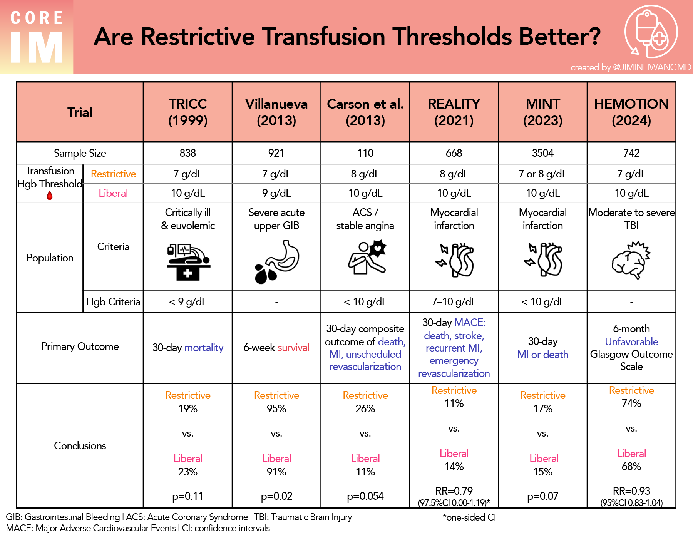

The MINT countries—Mexico, Indonesia, Nigeria, and Turkey—stand as emerging pillars in the global economy, offering significant opportunities for growth and development. These nations have exhibited certain shared characteristics that signal their potential to impact global markets significantly. By analyzing the criteria that led to their identification as MINT countries and examining their unique historical economic trajectories, investors can garner important insights.

Algorithmic trading has become an integral component of contemporary investment strategies, allowing traders to utilize these insights effectively. This trading method uses complex mathematical algorithms to analyze and execute trades swiftly, leveraging advantages found in market conditions such as those present in the MINT economies.



This article is structured to explain the reasoning behind the selection of these countries as MINTs, providing an overview of their historical economic backgrounds. Furthermore, it explores how algorithmic trading is employed to optimize investment in these diverse and rapidly evolving markets. By understanding these dynamics, investors can better position themselves to capitalize on the growth potential offered by these countries.

## Table of Contents

## What are MINTs?

MINT is an acronym representing the countries of Mexico, Indonesia, Nigeria, and Turkey. These nations are anticipated to experience significant economic growth due to their advantageous demographic and geographic characteristics, as well as strong economic potential. The concept was introduced by Fidelity Investments in 2011, highlighting these countries as viable options for investors seeking alternative emerging markets beyond the BRICS (Brazil, Russia, India, China, South Africa) countries.

The identification of MINT countries was motivated by several factors. Each of these nations is characterized by substantial young populations, promising workforce potential, and strategic locations that facilitate international trade. Economically, these countries demonstrate diverse industrial bases and growing middle classes, factors which contribute positively to their economic outlooks.

Fidelity Investments, through its analysis, recognized these countries as having the necessary ingredients for economic advances reminiscent of the earlier BRICS framework. The MINT concept has gained traction as investors and analysts look for novel opportunities in emerging markets with the potential for high returns and rapid development. Thus, understanding MINT's emergence necessitates recognizing the parallels drawn with BRICS and the variations that make these four countries distinct investment prospects.

## Inclusion Criteria for MINTs

The MINT countries—Mexico, Indonesia, Nigeria, and Turkey—were identified as promising growth markets based on several inclusion criteria, primarily focusing on their demographic, geographic, and economic characteristics.

One of the main criteria is the demographic advantage. These countries have large and predominantly young populations, which contribute to strong workforces. A youthful demographic can stimulate economic growth due to increased labor supply and consumption demand. For instance, with substantial portions of their populations entering the workforce, these countries are poised to benefit from a demographic dividend, a period when the working-age population is larger relative to the non-working-age group. This can lead to increases in savings rates, investment, and economic productivity.

Geographically, MINT countries possess favorable positions conducive to international trade. Mexico benefits from proximity to the United States, one of the largest markets globally, facilitating trade partnerships and export growth under agreements like the United States-Mexico-Canada Agreement (USMCA). Indonesia's location within the Southeast Asian archipelago positions it strategically along major shipping routes, enhancing its trade capacity. Similarly, Nigeria's location within Africa serves as a gateway to the continent, while Turkey's position connects Europe to Asia, acting as a crucial hub for cross-continental trade.

Economically, these countries exhibit diverse and growing sectors that bolster their attractiveness as emerging markets. Diversification helps mitigate risks associated with over-reliance on a single economic sector, stabilizing their economies against global market fluctuations. For example, Mexico's economy is bolstered by manufacturing and oil exports, Indonesia has robust agricultural and textile industries alongside natural resource extraction, Nigeria is diversifying beyond oil to agriculture and services, and Turkey combines manufacturing, tourism, and services.

Government policies in MINT countries generally lean towards promoting economic growth, creating regulatory environments conducive to business development. Pro-growth policies, such as deregulation, tax incentives, and improved infrastructure, attract foreign direct investment and stimulate domestic entrepreneurship. These governments actively engage in reforms to improve ease of doing business, aiming to enhance competitiveness on the global stage.

In summary, the inclusion criteria for MINTs centered on leveraging demographic strengths, strategic geographic locations, economic diversification, and government policies favorable to growth. These factors collectively underscore the potential of MINT countries to be influential players in the evolving global economic landscape.

## Historical Context and Economic Challenges

The MINT countries—Mexico, Indonesia, Nigeria, and Turkey—have demonstrated significant potential for economic expansion. However, they face numerous challenges that stem from both historical events and intrinsic economic factors. A common challenge across these nations is the prevalence of corruption and political instability, which can deter investment and hinder economic progress. These issues often lead to economic [volatility](/wiki/volatility-trading-strategies), complicating efforts for sustainable development and stable growth trajectories.

Turkey's economic history illustrates the complexities within MINT economies. The early 2000s were marked by a severe economic crisis in Turkey, characterized by high inflation, a depreciating currency, and a fragile banking sector. This crisis necessitated a series of reforms underpinned by the International Monetary Fund (IMF). Key reforms included restructuring the banking system, implementing tight fiscal policies, and enhancing transparency and governance to restore both domestic and foreign investor confidence. These measures contributed to Turkey's recovery and laid the foundation for subsequent growth, although political instability and regional tensions remain ongoing challenges.

Similarly, Mexico has contended with its own set of economic hurdles, notably corruption and the influence of drug cartels, which have influenced governance and economic policy. Despite these difficulties, Mexico has leveraged its proximity to the United States and participation in trade agreements like the North American Free Trade Agreement (NAFTA, now replaced by the United States-Mexico-Canada Agreement) to bolster its manufacturing sector and export-led growth.

Indonesia and Nigeria share the challenge of relying heavily on commodity exports, making their economies susceptible to global price fluctuations. Indonesia has faced periods of political unrest and corruption, impacting its economic stability. Nonetheless, the country has pursued economic liberalization policies and infrastructure development to enhance diversification and growth. Nigeria, rich in oil resources, grapples with governance issues, militancy in the oil-producing Niger Delta region, and a need to diversify its economy beyond oil. These conditions create a volatile economic environment that demands comprehensive reform strategies to sustain growth.

Adapting to these challenges has been critical for MINT countries, as reformation and strategic policy implementations are vital for mitigating economic risks and harnessing growth potentials. The experiences of these countries highlight the need for sustained policy efforts to overcome inherent challenges and create an environment conducive to long-term economic prosperity.

## Algorithmic Trading and MINTs

Algorithmic trading, a method that employs complex algorithms to scrutinize and predict market patterns, has gained prominence in trading within emerging markets, including the MINT countries—Mexico, Indonesia, Nigeria, and Turkey. This trading strategy leverages high-frequency data processing, mathematical models, and statistical methods to identify and execute trading opportunities swiftly, capitalizing on market inefficiencies and temporal price disparities.

The rapid economic growth and inherent volatility observed in MINT economies make them fertile ground for [algorithmic trading](/wiki/algorithmic-trading) strategies. These markets, characterized by fluctuations in economic data, political developments, and commodity prices, present abundant [arbitrage](/wiki/arbitrage) and speculative opportunities. Algorithmic trading systems can swiftly adapt to these changes, executing trades at speeds impossible for human traders, thus optimizing returns.

Algorithmic efficiencies enable traders to exploit timing and data-derived investment opportunities with precision. For instance, algorithms utilizing [machine learning](/wiki/machine-learning) can process vast datasets, including historical price data, economic indicators, and geopolitical events, to predict future market movements. Such algorithms may employ models like regression analysis, neural networks, and decision trees to analyze patterns and make informed trading decisions.

Here is a basic Python example of a simple moving average crossover strategy, which is a fundamental algorithmic trading technique that can be applied in these volatile markets:

```python
import pandas as pd
import numpy as np

# Load historical price data
data = pd.read_csv('market_data.csv')
prices = data['Close']

# Calculate moving averages
short_window = 40
long_window = 100

signals = pd.DataFrame(index=data.index)
signals['signal'] = 0.0
signals['short_mavg'] = prices.rolling(window=short_window, min_periods=1, center=False).mean()
signals['long_mavg'] = prices.rolling(window=long_window, min_periods=1, center=False).mean()

# Generate buy/sell signals
signals['signal'][short_window:] = np.where(signals['short_mavg'][short_window:] > signals['long_mavg'][short_window:], 1.0, 0.0)
signals['positions'] = signals['signal'].diff()

print(signals)
```

By adopting algorithmic trading, investors can better manage the risks associated with investment in MINT countries, especially given the unpredictability that accompanies emerging market economies. Moreover, as these strategies continue to evolve with advances in [artificial intelligence](/wiki/ai-artificial-intelligence) and machine learning, they promise to deliver even greater precision and adaptability to the ever-changing dynamics of these markets. This evolution positions algorithmic trading as a vital tool for investors looking to tap into the potential of MINT economies effectively.

## Future Outlook for MINTs and Algo Trading

The future of the MINT economies—Mexico, Indonesia, Nigeria, and Turkey—appears promising, holding potential for substantial global economic influence by 2050. Analysts predict that these nations will rise to be among the world's top economies, driven by factors such as burgeoning populations, strategic geographic locations, and expanding industrial bases. Their youthful demographics are expected to support a robust labor force, while strategic policymaking could enhance their ability to navigate global markets effectively. 

Algorithmic trading is poised to continue evolving, building upon advances in artificial intelligence and machine learning to deliver even greater operational efficiencies. This type of trading strategy is particularly well-suited to MINT countries due to their dynamic economic environments characterized by both rapid growth and volatility, which create numerous investment opportunities. By utilizing complex algorithms to analyze large volumes of market data, algorithmic trading can efficiently identify and exploit these fluctuations within the markets of MINT economies.

For example, consider how machine learning models like [reinforcement learning](/wiki/reinforcement-learning) can adapt to market changes over time. They can optimize trading strategies through continuous feedback and improvement, enhancing the potential for profit in volatile and rapidly changing markets typical of MINT countries. The flexibility and speed of these technologies provide a significant advantage, allowing investors to make data-driven decisions more swiftly than with traditional trading methods.

Investors engaged in algorithmic trading should maintain a vigilant focus on MINT economies due to their potential for high returns amidst dynamic market conditions. As these countries continue to develop, their market structures will likely present unique challenges and opportunities. By leveraging the capabilities of algorithmic trading powered by cutting-edge AI and machine learning technologies, investors can better navigate these emerging markets, extracting value from the distinctive economic features of the MINT nations.

In summary, the trajectory for MINT economies and algorithmic trading suggests a convergence of growth potential and technological advancement. Investors prepared to harness these trends may find significant opportunities in the evolving global economic landscape.

## Conclusion

MINT countries—Mexico, Indonesia, Nigeria, and Turkey—present significant growth opportunities despite the inherent challenges typical of emerging markets. Their demographic advantages and strategic economic policies position them favorably for substantial economic expansion. Recognizing the historical context of these nations and the specific criteria that led to their identification as potential economic powerhouses is crucial for enhancing investment strategies. This comprehensive understanding allows investors to navigate the complexities and leverage opportunities within these markets effectively.

Algorithmic trading emerges as a pivotal modern mechanism to capitalize on these opportunities. By employing sophisticated algorithms to analyze vast amounts of market data, algorithmic trading facilitates informed decision-making and optimizes trading strategies in periods of rapid economic growth and volatility, which are characteristic of MINT economies. The integration of machine learning and artificial intelligence further enhances the efficiency of algorithmic trading, enabling dynamic adaptation to the fluid market environments typical of these emerging economies.

In summary, the combination of understanding historical contexts and employing advanced trading strategies like algorithmic trading offers a transformative approach to managing investments in the dynamic and promising MINT markets. This dual strategy not only enhances investment potential but also contributes to a more robust and agile trading framework suited to the demands of emerging market landscapes.

## References & Further Reading

[1]: ["Emerging Markets: Resilience and Growth Amid Global Challenges"](https://www.jstor.org/stable/10.7864/j.ctt6wpd2g) - The World Bank

[2]: ["Macroeconomic and Structural Analysis of BRICS and MINT Economies"](https://www.tandfonline.com/doi/full/10.1080/13600818.2022.2033191) - Cogent Economics & Finance

[3]: ["Algorithmic Trading: Winning Strategies and Their Rationale"](https://books.google.com/books/about/Algorithmic_Trading.html?id=WAlFDwAAQBAJ) by Ernest P. Chan

[4]: ["Investing Across Borders: How and Where to Invest in Emerging Markets"](https://www.thebalancemoney.com/how-to-invest-in-emerging-markets-5216676) by Amar V. Bhide

[5]: ["Globalization and Development: Why East Asia Surged Ahead and Latin America Fell Behind"](https://link.springer.com/book/10.1057/9781137316394) by José Antonio Ocampo, Jaime Ros

[6]: ["Algorithmic Trading and DMA: An Introduction to Direct Access Trading Strategies"](https://archive.org/details/algorithmictradi0000john) by Barry Johnson