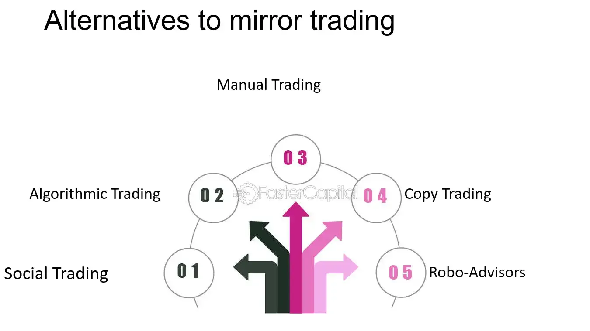

## Table of Contents

## What is mirror trading and how does it work?

Mirror trading is a way for people to copy the trades of experienced traders automatically. When you use mirror trading, you pick a trader or a group of traders whose strategies you like. Then, a special computer program watches what these traders do and copies their trades into your own trading account. This means if the trader buys a stock, the program will buy the same stock for you, and if they sell, it will sell for you too.

This method can be helpful for people who are new to trading or don't have a lot of time to watch the markets. By following successful traders, you might make money without needing to learn everything about trading yourself. However, it's important to remember that even if you're copying someone else's trades, there's still a risk of losing money. It's a good idea to choose traders carefully and understand that past success doesn't guarantee future wins.

## What are the basic requirements to start mirror trading?

To start mirror trading, you need a few basic things. First, you need to find a good trading platform that offers mirror trading services. These platforms usually have a list of traders you can follow. You'll also need to open an account with them and put some money into it. This money is what you'll use to copy the trades of the traders you choose.

Next, you need to pick the traders you want to follow. Look at their past performance, how much risk they take, and what they trade. Some platforms let you see how well a trader has done over time, which can help you decide. Once you've chosen your traders, you can set up your account to automatically copy their trades. Remember, it's important to keep an eye on how things are going and be ready to change your choices if needed.

## What are the benefits of mirror trading for beginners?

Mirror trading is great for beginners because it lets them learn from experienced traders without having to know everything about trading themselves. When you start trading, it can be hard to understand all the ups and downs of the market. By copying what successful traders do, beginners can see how trades work in real life. This can help them learn faster and feel more confident about making their own trades later on.

Another benefit is that mirror trading saves time. Instead of spending hours watching the market and trying to figure out when to buy or sell, beginners can just set up their account to copy the trades of others. This means they can focus on other things in their life while still trying to make money from trading. It's like having a helper who does the hard work for you, which can be a big relief for someone just starting out.

## How can mirror trading help in diversifying an investment portfolio?

Mirror trading can help you spread out your investments by letting you copy different traders who might have different ways of [picking](/wiki/asset-class-picking) stocks or other things to invest in. If you follow several traders, each one might choose different kinds of investments. This means your money isn't all in one place. For example, one trader might focus on tech companies, while another might look at energy stocks. By copying both, you end up with a mix of investments, which can help lower the risk if one area of the market goes down.

Another way mirror trading helps with diversification is by letting you easily try out new types of investments you might not know much about. If you're new to trading, you might stick to what you know. But with mirror trading, you can follow traders who invest in things like foreign markets, commodities, or even cryptocurrencies. This way, you can get a piece of these different investments without having to learn everything about them first. It's like having a guide who shows you around different parts of the investment world.

## What are the common platforms or services used for mirror trading?

Some of the common platforms for mirror trading are eToro, ZuluTrade, and MetaTrader. eToro is popular because it's easy to use and lets you see what other traders are doing. You can copy trades from people all over the world. ZuluTrade is another good choice, especially for people who want to follow traders who focus on certain kinds of investments. It has a lot of tools to help you pick the right traders to copy. MetaTrader, which includes MetaTrader 4 and 5, is often used by more experienced traders because it has a lot of advanced features, but it can also be used for mirror trading.

These platforms all work a bit differently, but they all let you copy what other traders do. On eToro, you can see a list of traders and their past performance, then decide who to follow. ZuluTrade has a system where you can choose traders based on how much risk they take and what they invest in. MetaTrader lets you use special programs called Expert Advisors to copy trades automatically. No matter which platform you choose, it's important to do your research and pick traders who have a good track record and match your investment goals.

## What are the risks associated with mirror trading?

Mirror trading can be risky because you're copying what other people do, and they might make mistakes. Even if a trader has done well in the past, that doesn't mean they'll keep doing well. The market can change, and what worked before might not work now. If the trader you're copying loses money, you'll lose money too. It's also hard to know if a trader is really good or just lucky. Sometimes, people might try to trick you by making their past trades look better than they really were.

Another risk is that you might not understand what you're investing in. When you copy a trader, you're putting your money into things they choose, but you might not know why they picked those investments. If the market goes down, and you don't know why you're invested in something, it can be scary and hard to decide what to do next. Plus, there are costs to using mirror trading platforms, like fees for copying trades or keeping your account open. These costs can add up and eat into any money you make from trading.

## How does mirror trading differ from copy trading?

Mirror trading and copy trading are similar because they both let you copy what other traders do. But there's a small difference between them. Mirror trading usually means you follow a set of rules or a strategy that a trader has made. This strategy might be based on certain signals or patterns in the market. When these signals happen, the strategy tells you to buy or sell, and your account does the same thing automatically. Copy trading, on the other hand, is more about copying a specific trader's every move, no matter what their strategy is. You're following the trader directly, not a set of rules.

Both methods can help you make money if the trader you're copying does well. But they also come with risks. If the trader loses money, you'll lose money too. Also, with mirror trading, you might not know exactly why the strategy is telling you to buy or sell. With copy trading, you're more directly tied to one person's choices, which can be good or bad depending on how well that person does. So, it's important to pick your traders or strategies carefully and keep an eye on how things are going.

## What are the key factors to consider when choosing a strategy or trader to mirror?

When choosing a strategy or trader to mirror, it's important to look at their past performance. You want to see if they've made money over time and how they've done during different market conditions. It's also good to check how much risk they take. Some traders might try to make big profits quickly, but this can be risky. Others might be more careful and aim for smaller, steadier gains. Think about what fits with your own comfort level with risk and how much money you can afford to lose.

Another thing to consider is what the trader or strategy focuses on. Do they invest in stocks, [forex](/wiki/forex-system), commodities, or something else? Make sure it matches what you want to invest in. Also, think about how much you'll have to pay to use the mirror trading service. There might be fees for copying trades or keeping your account open. These costs can add up, so you need to see if the potential gains are worth it. Finally, don't just set it and forget it. Keep an eye on how the trader or strategy is doing and be ready to switch if things aren't working out.

## How can one optimize their mirror trading strategy?

To optimize your mirror trading strategy, start by picking traders or strategies that have a good track record. Look at how they've done over time, not just in the last few months. See if they've made money during different market conditions, like when the market goes up or down. Also, think about how much risk they take. Some traders might try to make big profits quickly, but this can be risky. Others might be more careful and aim for smaller, steadier gains. Choose a trader or strategy that matches how much risk you're okay with and what you want to invest in, like stocks, forex, or commodities.

Once you've picked your traders or strategies, keep an eye on how they're doing. Don't just set it and forget it. Check in regularly to see if they're still making money and if they're still a good fit for your goals. If a trader starts losing money or if the market changes, be ready to switch to someone else. Also, think about the costs of mirror trading. There might be fees for copying trades or keeping your account open. Make sure the potential gains are worth these costs. By staying active and making smart choices, you can make your mirror trading strategy work better for you.

## What are the regulatory considerations for mirror trading in different countries?

Mirror trading can be different in different countries because each place has its own rules about trading. In the United States, for example, the Financial Industry Regulatory Authority (FINRA) and the Securities and Exchange Commission (SEC) watch over trading platforms to make sure they follow the rules. These rules can include things like how much information the platforms have to give to people who use them, and making sure the traders being copied are honest about what they're doing. In Europe, the Markets in Financial Instruments Directive (MiFID) sets rules that trading platforms must follow to protect people who invest money. These rules can affect what kind of mirror trading services are available and how they work.

In some countries, like Australia, the Australian Securities and Investments Commission (ASIC) looks after trading platforms. They make sure these platforms are fair and that people know about the risks of mirror trading. In places like Singapore, the Monetary Authority of Singapore (MAS) has rules to make sure trading is safe and fair. It's important for anyone thinking about mirror trading to check the rules in their country. The rules can change what you can do, how much you might have to pay, and how safe your money is. Always do your homework to make sure you're following the rules and keeping your investments safe.

## How do advanced traders use mirror trading to enhance their own strategies?

Advanced traders use mirror trading to learn new ways of trading and to test their own ideas. They might copy what other successful traders do to see if those strategies work well in different markets. By watching how these traders make money, advanced traders can pick up new tricks and improve their own trading plans. They might also use mirror trading to try out a new strategy without risking all their own money. If the strategy works well when copied, they might decide to use it themselves.

Another way advanced traders use mirror trading is to spread out their investments. They might follow several traders who focus on different kinds of investments, like stocks, forex, or commodities. This way, they can have a mix of investments that can help lower the risk if one part of the market goes down. Advanced traders also keep a close eye on the traders they copy. If a trader starts doing badly, they can quickly stop copying them and switch to someone else. This helps them stay flexible and keep their trading strategy strong.

## What future trends might impact the effectiveness and popularity of mirror trading?

In the future, technology will play a big role in how mirror trading works. As computers get better and smarter, trading platforms might use [artificial intelligence](/wiki/ai-artificial-intelligence) to pick the best traders to copy. This could make mirror trading easier and more successful for everyone. Also, more people might start using mirror trading as it becomes easier to use and more people learn about it. Social media and online communities could help spread the word about successful traders and strategies, making it easier for people to find good ones to follow.

Another thing that might change is the rules about mirror trading. Governments and financial watchdogs might make new rules to protect people who use these services. This could make mirror trading safer, but it might also mean more costs or limits on what people can do. On the other hand, if the rules help people trust mirror trading more, it could become even more popular. As more people get comfortable with investing online, mirror trading might grow a lot and become a common way for people to try to make money from the markets.

## References & Further Reading

[1]: Lopez de Prado, M. (2018). ["Advances in Financial Machine Learning."](https://www.amazon.com/Advances-Financial-Machine-Learning-Marcos/dp/1119482089) Wiley.

[2]: Aronson, D. (2011). ["Evidence-Based Technical Analysis: Applying the Scientific Method and Statistical Inference to Trading Signals."](https://www.amazon.com/Evidence-Based-Technical-Analysis-Scientific-Statistical/dp/0470008741) Wiley.

[3]: Jansen, S. (2018). ["Machine Learning for Algorithmic Trading."](https://github.com/stefan-jansen/machine-learning-for-trading) Packt Publishing.

[4]: Chan, E. P. (2008). ["Quantitative Trading: How to Build Your Own Algorithmic Trading Business."](https://github.com/ftvision/quant_trading_echan_book) Wiley.