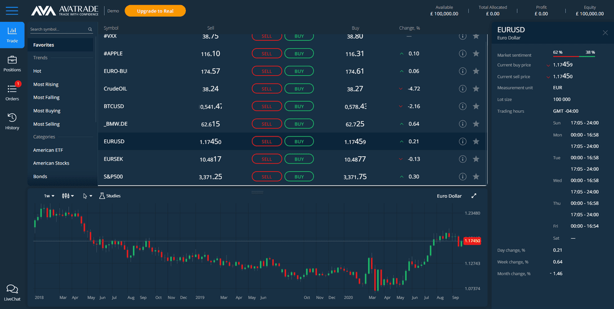

In recent years, the landscape of stock market trading strategies has transformed significantly, driven by rapid technological advancements and innovations. Traditional trading methods, which often rely on manual decision-making processes and intuition, are increasingly complemented or replaced by modern techniques such as mirror trading and algorithmic (algo) trading. These contemporary approaches leverage cutting-edge technology to enhance decision-making, improve efficiency, and potentially increase profitability in trading activities.

Adopting sophisticated trading methods is crucial in today's fast-paced financial markets. The introduction of real-time data analytics, artificial intelligence, and machine learning into the trading process enables traders to analyze large volumes of data with unprecedented speed and accuracy. This capability helps traders identify patterns and trends that are not easily discernible through traditional methods, providing a competitive edge in the market. For instance, algo trading allows for the automation of trading decisions based on pre-set criteria, reducing human error and emotional biases.



The objective of this article is to provide insights into trading techniques that utilize technological advancements for effective stock market strategies. By understanding these innovations, traders can potentially enhance their portfolio performance and adapt to the ever-evolving market dynamics. Emerging trends like mirror trading offer traders the opportunity to replicate the strategies of successful investors, while algorithmic trading enables them to execute complex strategies that are often impractical manually.

Diversification in trading strategies is essential in achieving financial success. Relying solely on a single approach or methodology can expose traders to increased risk, especially in volatile markets. By diversifying strategies, traders can mitigate risks and capitalize on various opportunities across different market conditions. This article emphasizes the importance of integrating advanced techniques such as mirror and algo trading into one's trading arsenal to promote a well-rounded and resilient approach to stock market investing.

## Table of Contents

## Understanding Trading Techniques in the Stock Market

Stock market trading techniques represent a structured methodology employed by traders to make buy or sell decisions. These techniques serve as an integral part of a trader's strategy toolkit, allowing them to analyze, anticipate, and react to the ever-changing dynamics of financial markets. The ability to apply a suitable trading method empowers traders to effectively navigate market fluctuations and pursue potential profit opportunities.

Continuous evolution in trading techniques is crucial, given the dynamic nature of financial markets. Market conditions, characterized by factors such as economic indicators, geopolitical events, and investor sentiment, are perpetually changing. This change necessitates that trading strategies adapt to remain effective. The evolution from traditional to modern trading techniques reflects this necessary adaptability, driven by innovation and technological advancement.

Traditional trading techniques include [fundamental analysis](/wiki/fundamental-analysis), which involves evaluating a company's financial health and performance metrics, and technical analysis, which focuses on price patterns and market trends. These methods, however, require significant time and knowledge, making them less accessible to novice traders.

In contrast, modern trading techniques leverage technological advancements to enhance trading activities. The use of advanced analytics and computer algorithms exemplifies this shift. Specifically, [algorithmic trading](/wiki/algorithmic-trading), or algo trading, marks a significant advancement in trading techniques. It incorporates complex mathematical models and formulas to execute trades at high speeds, mitigating human error and making informed decisions based on vast data analysis.

Algorithmic trading automates the trading process through computer programs that automatically conduct transactions based on predetermined parameters, such as timing, price, or [volume](/wiki/volume-trading-strategy). By using coding languages such as Python, traders can implement strategies that optimize execution to capitalize on short-lived market opportunities. Here is a simplified example of a moving average crossover strategy using Python:

```python
import pandas as pd
import numpy as np

# Load historical stock data
data = pd.read_csv('stock_data.csv')

# Calculate moving averages
data['Short_MA'] = data['Close'].rolling(window=50).mean()
data['Long_MA'] = data['Close'].rolling(window=200).mean()

# Generate trading signals based on moving averages
data['Signal'] = np.where(data['Short_MA'] > data['Long_MA'], 1, 0)

# Identify buy/sell points
data['Position'] = data['Signal'].diff()

print(data[['Date', 'Position']].dropna())
```

In this code, buy and sell signals are generated based on moving average crossovers — the point at which a shorter-term moving average crosses the longer-term average. Such strategies can process and react to market trends with efficiency unattainable by manual trading.

Adopting modern trading techniques such as algorithmic trading offers several benefits, including enhanced efficiency, accuracy, and the ability to process large volumes of data, providing traders with a competitive edge in fast-paced financial markets. As technology continues to evolve, so must trading strategies, ensuring that traders are well-equipped to meet the demands of the stock market.

## What is Mirror Trading?

Mirror trading is a sophisticated trading strategy that involves replicating the trades of selected successful traders. It originated in the [forex](/wiki/forex-system) market as a means for traders, particularly novices, to emulate the trading decisions of seasoned investors based on their expertise and historical performance. As the strategy gained popularity, it expanded into the stock market, offering a similar approach to equities trading.

### Mechanics of Mirror Trading

Mirror trading operates through specialized platforms where traders authorize their accounts to reflect trades executed by expert traders. These platforms provide access to a database of trader profiles, each detailing the strategic approach and performance history. Investors select a trader to "mirror," and their accounts automatically replicate every trade made by the chosen leader. This process requires no manual intervention once set up, allowing for real-time trading management based on the expert trader’s activities.

### Distinction Between Mirror Trading, Copy Trading, and Social Trading

Although often used interchangeably, mirror trading, copy trading, and social trading have distinct nuances:

1. **Mirror Trading**: Involves automatic replication of trades without permitting any alteration by the follower. The follower’s account directly mirrors the trades made by the leader.

2. **Copy Trading**: Offers more flexibility compared to mirror trading, allowing followers to adjust trade sizes and choose which trades to copy, rather than replicating all trades automatically.

3. **Social Trading**: Extends beyond replication by facilitating interaction among traders. It enables sharing of insights, strategies, and trade information, fostering a community-driven approach to trading.

### Platforms and Technologies Facilitating Mirror Trading

Several platforms have emerged to support the mirror trading process, leveraging advanced technologies to ensure seamless trade replication. These platforms are equipped with robust algorithms to manage the scale and complexity involved in mirroring trades across numerous accounts. Key technological components include trade execution engines, performance analytics, and risk management systems that collectively contribute to an efficient mirror trading environment.

Popular platforms typically provide comprehensive dashboards where users can monitor performance metrics, manage mirrored accounts, and adjust their strategies. Through these technologies, mirror trading democratizes access to high-level trading strategies, enabling traders at all levels to potentially benefit from the expertise of accomplished market participants.

## Algo Trading: Automation in Stock Market

Algorithmic trading, often referred to as algo trading, involves using computer algorithms to automate trading activities in the stock market. These algorithms execute trades based on pre-defined criteria and mathematical models, which allow traders to implement complex strategies with precision and efficiency.

Automated systems in algo trading use a set of programmed instructions to identify profitable trading opportunities, execute buy or sell orders, and manage risk. These systems can analyze multiple market indicators, such as price, volume, and time, to decide the best execution strategy for a trade. The use of algorithms can eliminate the influence of human emotions in trading decisions, thus potentially leading to more disciplined and objective trading.

One of the primary benefits of algo trading is speed. Automated systems can execute trades within milliseconds, which is critical in markets where prices can change rapidly. This speed can provide a significant advantage in capitalizing on short-lived market opportunities that may not be accessible to manual traders. Accuracy is another benefit, as algorithms can be programmed to follow specific rules, reducing the likelihood of human error and increasing execution precision. Additionally, algo trading allows for the processing of vast amounts of market data, facilitating more informed trading decisions by identifying trends and patterns that may not be immediately apparent.

Popular algorithmic trading strategies include:

1. **Trend Following**: This strategy involves algorithms that analyze market trends and execute trades based on the direction of movement. These algorithms typically rely on technical indicators such as moving averages and oscillators to make buy or sell decisions.

2. **Arbitrage**: Arbitrage algorithms exploit small price discrepancies between different exchanges or markets. When an asset is priced differently in two markets, the algorithm simultaneously buys low and sells high to capture risk-free profit.

3. **Market Making**: This strategy entails providing liquidity to the market by placing buy and sell orders simultaneously for a specific asset. Market-making algorithms aim to profit from the spread, the difference between the bid and ask prices.

4. **Mean Reversion**: Based on the assumption that prices will revert to their historical mean, this strategy uses algorithms to identify deviations from the norm and execute trades to capitalize on these anomalies.

In conclusion, algorithmic trading in the stock market offers numerous advantages, including enhanced speed, precision, and data processing capabilities. By automating the decision-making process, traders can execute sophisticated strategies and potentially achieve more consistent trading outcomes.

## Mirror Trading Strategies and Outcomes

Mirror trading involves several strategies, primarily rooted in algorithmic decision-making processes that mimic the trades of seasoned investors. The central concept is to replicate these traders' moves, ensuring that trades are executed automatically, often through sophisticated software platforms. This strategy has gained popularity due to its potential to leverage expert insights and reduce the learning curve for new investors.

### Algorithm-Based Strategies

At the core of mirror trading are algorithm-based strategies that rely heavily on historical data and real-time analysis. These algorithms typically involve technical indicators such as moving averages, [momentum](/wiki/momentum) oscillators, and trend-following systems. For instance, a trader employing a simple moving average crossover strategy might program the algorithm to execute a buy order when a short-term moving average crosses above a long-term moving average, and a sell order when the opposite occurs.

**Effectiveness in Different Market Conditions**

The effectiveness of these strategies is influenced by market [volatility](/wiki/volatility-trading-strategies), [liquidity](/wiki/liquidity-risk-premium), and the specific asset class being traded. During trending markets, trend-following strategies may perform well, as they capitalize on sustained market directions. Conversely, in sideways or highly volatile conditions, strategies that exploit mean reversion or market swings might be more effective. The adaptability of algorithm-based strategies to changing market conditions is a critical [factor](/wiki/factor-investing) in their success.

### Pros and Cons of Mirror Trading

**Advantages**

1. **Learning from Experts**: By copying successful traders, investors can gain insights into effective trading techniques and strategies.
2. **Time Efficiency**: Automated mirroring allows trades to be executed without continuous monitoring, saving time for investors.
3. **Diversification**: Access to a range of strategies across different markets fosters portfolio diversification.

**Disadvantages**

1. **Market Volatility**: Strategies might underperform in unexpectedly volatile conditions, leading to significant losses.
2. **Over-reliance**: Solely depending on mirror trading can hinder the development of an investor's own trading skills and understanding.
3. **Mechanical Failures**: Bugs or system errors in trading platforms can result in unintended trades or missed opportunities.

### Real-life Examples

Mirror trading has yielded varying outcomes in real-world scenarios. Successful cases often involve a combination of robust algorithmic strategies and stable market conditions. For instance, during periods of strong market trends, traders using mirror strategies that follow trend indicators like the MACD (Moving Average Convergence Divergence) have reported positive returns due to their alignment with prevailing market directions.

Conversely, some traders have encountered setbacks, particularly during market anomalies when mirrored strategies can't adapt swiftly to sharp, unforeseen changes. The flash crash of 2010 is a historical example where algorithmic trading, including mirroring systems, faced significant scrutiny due to its inability to cope with extreme volatility, resulting in substantial market disruptions.

In summary, while mirror trading offers numerous benefits such as enhanced learning opportunities and time efficiency, it necessitates cautious application and a nuanced understanding of market dynamics. Traders are advised to integrate comprehensive risk management practices and remain adaptive to the constantly evolving financial landscape.

## Benefits and Risks of Mirror Trading

Mirror trading offers several advantages for both novice and experienced traders by leveraging the expertise of seasoned market participants. One key benefit is the ability to learn from experts. By mirroring the trades of successful traders, individuals can gain insights into effective strategies and decision-making processes. This exposure to various trading styles and tactics can enhance the understanding of market dynamics and improve one's own trading skills over time.

Time efficiency is another significant advantage of mirror trading. Traders can allocate their time elsewhere, as they do not need to conduct extensive research or continuously monitor market movements. By automatically replicating the trades of chosen experts, mirror trading ensures that investors can participate in the market without the need for constant oversight, making it an attractive option for those with limited time to dedicate to trading activities.

However, mirror trading is not without its risks. One primary risk is the volatility of the market, which can affect even the most well-considered strategies. Relying on the trades of selected experts might also present challenges if those traders underperform due to unforeseen market conditions. Over-reliance on chosen traders can result in a lack of diversification, making the investment vulnerable to the performance of a single or a few strategies.

Effective risk management is crucial in mirror trading to mitigate these challenges. Diversification across multiple traders and strategies can reduce risk exposure; spreading investments across different asset classes and markets can further enhance this effect. Regularly reviewing and adjusting mirrored portfolios ensures alignment with market trends and personal financial goals. It is also vital to set stop-loss orders to limit potential losses in volatile conditions.

To maximize the benefits of mirror trading, individuals should conduct thorough due diligence before selecting traders or strategies to mirror. This includes assessing the historical performance, risk tolerance, and trading style of potential mimicking targets. Staying informed about broader market conditions can also aid in making informed decisions about which strategies to adopt or abandon.

In summary, while mirror trading presents opportunities to learn from expert traders and enjoy time-efficient market participation, it also entails risks that necessitate diligent risk management. By adopting a diversified approach, carefully selecting traders to mirror, and staying informed about market dynamics, investors can optimize mirror trading's benefits while minimizing associated risks.

## Choosing the Right Trading Platform

When selecting a trading platform for mirror and algo trading, several key factors should be considered to ensure optimal performance and to mitigate risks associated with these trading methodologies.

Security is paramount, as trading platforms handle sensitive financial information and transactions. Look for platforms offering robust encryption protocols, two-factor authentication, and regular security audits. Ensuring your data and assets are protected from cyber threats is crucial in maintaining trust and integrity within the platform.

Transparency is another critical factor. Platforms should be open about their operations, fee structures, and any potential conflicts of interest. Users should have clear insights into how algorithms are selected and monitored, especially in mirror trading where following other traders' strategies is involved. Transparency fosters trust and allows traders to make informed decisions based on comprehensive and honest information.

Reliability is essential, as the platform should provide consistent uptime and responsiveness. In the fast-paced environment of stock trading, delays or system outages can result in missed opportunities or financial losses. Platforms should have contingencies to handle high volumes of trades and volatile market conditions without degrading performance.

The range of strategies offered by the platform is significant for diversification and adaptation to different market conditions. Platforms should support various algorithms, from simple moving averages to complex predictive models. The ability to access a broad spectrum of strategies enables traders to tailor their approaches and leverage the expertise of others, particularly in mirror trading.

Trading fees and other costs can impact overall performance, so these should be evaluated carefully. Platforms might charge per trade, have subscription models, or take a percentage of profits. An understanding of the total cost structure is necessary for calculating potential returns. It's important to weigh these costs against the benefits provided, such as access to advanced trading tools and real-time data.

Among the leading platforms suitable for algorithmic and mirror trading, MetaTrader 4 and 5 are widely recognized for their robust algorithmic trading capabilities and community features conducive to mirror trading. [Interactive Brokers](/wiki/interactive-brokers-api) offers extensive algorithmic trading tools and a reputation for transparency and reliability. eToro is popular for social and mirror trading, providing both a diverse array of strategies and an intuitive platform for following experienced traders.

In conclusion, the choice of a trading platform should be guided by an assessment of its security measures, transparency, reliability, strategy variety, and associated costs. These criteria help ensure that traders select a platform that aligns with their objectives, supports safe trading practices, and enhances their ability to achieve financial success through mirror and algorithmic trading.

## Conclusion

The exploration of trading techniques highlights the dynamic nature of modern financial markets and underscores the importance of integrating technological advancements, such as mirror and algorithmic trading, into one's trading strategy. Mirror trading leverages the expertise of seasoned traders, offering an accessible entry point for less experienced traders to participate in the market by mimicking successful strategies. Meanwhile, algorithmic trading provides a framework for executing trades with precision and speed, utilizing complex algorithms to analyze market data and make informed decisions.

Staying informed about emerging trading strategies and technologies is crucial for traders who seek to maintain a competitive edge. The fast-paced evolution of financial markets demands a proactive approach to learning and adaptation. By incorporating advanced methods such as mirror and algo trading, traders can diversify their approaches, enhancing their potential for success.

In conclusion, traders are encouraged to embrace these modern trading techniques and continue their pursuit of knowledge. This commitment to learning and adapting is essential for achieving sustained success in the stock market. As the landscape of trading continuously evolves, the ability to integrate cutting-edge strategies can significantly impact long-term trading outcomes.

## References & Further Reading

[1]: Bergstra, J., Bardenet, R., Bengio, Y., & Kégl, B. (2011). ["Algorithms for Hyper-Parameter Optimization."](https://papers.nips.cc/paper/4443-algorithms-for-hyper-parameter-optimization) Advances in Neural Information Processing Systems 24.

[2]: ["Advances in Financial Machine Learning"](https://www.amazon.com/Advances-Financial-Machine-Learning-Marcos/dp/1119482089) by Marcos Lopez de Prado

[3]: ["Evidence-Based Technical Analysis: Applying the Scientific Method and Statistical Inference to Trading Signals"](https://www.amazon.com/Evidence-Based-Technical-Analysis-Scientific-Statistical/dp/0470008741) by David Aronson

[4]: ["Machine Learning for Algorithmic Trading"](https://github.com/stefan-jansen/machine-learning-for-trading) by Stefan Jansen

[5]: ["Quantitative Trading: How to Build Your Own Algorithmic Trading Business"](https://www.amazon.com/Quantitative-Trading-Build-Algorithmic-Business/dp/1119800064) by Ernest P. Chan