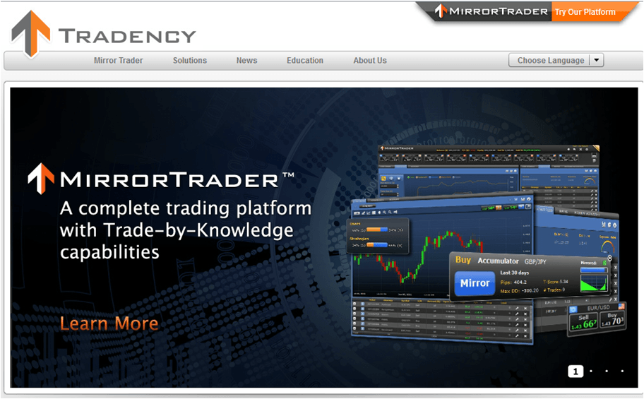

Mirror trading, also referred to as algo trading, is an innovative approach to investing that automates the process of replicating the trades executed by experienced traders. This groundbreaking method of trading serves as a bridge for investors, enabling both novices and those with trading experience to capitalize on the insights and strategies of professional traders without requiring deep market expertise.

The process of mirror trading thus simplifies the investment landscape by allowing users to automatically follow and execute trades initiated by seasoned traders, essentially mirroring their actions in real-time. This automation negates the necessity for manual trade execution, which can often be daunting and time-consuming for beginner investors.

As this article unfolds, we will examine the inner workings of mirror trading, assessing how it operates and highlighting its potential advantages and drawbacks. Armed with this information, you'll be better equipped to embark on your mirror trading journey. Moreover, with the continuous progression of algorithmic trading technologies, mirror trading has become more accessible and simple than ever before, making it an appealing choice for a wide range of investors.

Finally, we will survey several leading platforms offering mirror trading services, ensuring you have the necessary information to make a well-informed decision. Whether you are looking to enter the world of forex, stocks, or cryptocurrency trading, this article will provide a comprehensive overview to help guide your investment strategies.

## Table of Contents

## What is Mirror Trading?

Mirror trading is a trading strategy where an investor's account automatically replicates the trades of experienced traders. This strategy is gaining popularity across various markets, including forex, stocks, and cryptocurrencies. It enables investors, particularly those who might find certain markets challenging, to engage with those markets effectively. The process involves the investor selecting a trader to follow, a decision typically based on the chosen trader's performance metrics and trading style. Once a trader is selected, their trades are mirrored in real-time in the investor's account.

Unlike traditional trading methods, which require substantial market knowledge and manual trade execution, mirror trading simplifies these complexities. This is achieved by automatically replicating the trades of seasoned professionals, thus eliminating the need for deep market insights or continuous manual intervention. As a result, mirror trading opens doors for investors of all experience levels to participate actively in financial markets.

## How Does Mirror Trading Work?

Mirror trading functions as an effective investment strategy by leveraging technology to connect investors with successful professional traders. This process is facilitated through online platforms that host a network of expert traders, providing users the opportunity to mirror their trading strategies.

The procedure for mirror trading initiates with the investor selecting an experienced trader to follow. This choice is typically informed by the trader’s historical performance data, risk profile, and strategy alignment with the investor's financial objectives. Investors can evaluate these metrics, which are often readily available on the platform, through performance graphs, risk scores, and trading history analyses.

Once a trader is selected, the investor's trading account is linked to that of the expert trader. This linkage allows for the automatic replication of trades made by the professional. The mirroring process is governed by advanced algorithms implemented by the platform. These algorithms are designed to ensure that all trades executed by the lead trader are accurately and promptly mirrored in the investor's account. This synchronization preserves the original trade's integrity, emulating the same entry and [exit](/wiki/exit-strategy) points, position sizes, and management strategies.

The efficiency of this process is reliant on the technological infrastructure of the platform. The algorithms minimize latency issues and discrepancies between the trades of the lead trader and the investor. By adhering to this systematic approach, mirror trading platforms provide an accessible entry point for investors to adopt sophisticated trading strategies without necessitating deep knowledge of market intricacies or day-to-[day trading](/wiki/day-trading-spy) involvement.

## Benefits of Mirror Trading

Mirror trading offers a range of benefits that make it particularly appealing to both novice and time-constrained investors. This approach provides a hands-free mechanism for engaging in trading activities, allowing individuals to participate in the financial markets without having to execute trades manually. 

One of the primary advantages of mirror trading is its inherent time efficiency. By automating the process of copying trades from expert traders, investors can save significant amounts of time that would otherwise be spent analyzing market data, developing trading strategies, and manually executing trades. This allows investors to focus their time on other important aspects of their lives or investments without sacrificing engagement in the markets.

Another key benefit of mirror trading is the exposure it provides to proven trading strategies. Investors, especially those who lack the skills or knowledge of seasoned traders, can benefit from the expertise and strategic approaches employed by experienced traders without having to develop their own comprehensive trading strategies. This exposure not only enhances the potential for profitable outcomes but also provides a valuable learning opportunity for those looking to understand successful trading techniques.

In addition to these advantages, mirror trading has the potential to create a passive income stream. By aligning their accounts to mirror the trades of successful traders, investors can potentially reap the benefits of these traders' successes without the need for active management. When mirrored trades perform well, investors can enjoy the financial gains with minimal intervention, allowing for a more relaxed and effortless approach to trading.

Overall, mirror trading simplifies the trading process, reduces the effort required for active management, and offers an accessible pathway to participating in the financial markets, making it an attractive option for many investors.

## Risks and Challenges of Mirror Trading

While mirror trading offers many benefits, it also carries inherent risks that investors must consider carefully. One primary risk is market [volatility](/wiki/volatility-trading-strategies), which can result in significant losses. Market conditions can change rapidly, and even the most seasoned traders can face downturns unexpectedly. When an investor mirrors the trades of such a trader, any downturns in the trader's strategy directly impact the mirrored account. This dependency on the trader's performance underscores a critical risk inherent to mirror trading: the lack of control over individual trades.

Another challenge is the lack of trade personalization. Investors who engage in mirror trading cannot adjust trades based on personal judgment or market insights. This can be problematic if an investor disagrees with a trade decision made by the trader they are mirroring or if market conditions warrant a different approach. Flexibility is notably absent in mirror trading, requiring investors to place significant trust in the traders they follow.

Additionally, selecting a reliable platform is crucial to avoid technical glitches and potential security vulnerabilities. Platforms must be robust enough to handle real-time data processing and trade execution without technical failures. Any lag or error in the mirroring process can lead to financial discrepancies, affecting the success of the mirrored trades. Security is another critical concern, as investors must ensure their funds and personal information are protected from cyber threats. Failure to choose a secure and technologically sound platform can expose investors to substantial risks that could negate the potential benefits of mirror trading.

## Top 5 Mirror Trading Platforms

eToro is widely recognized as a pioneer in social trading, offering a user-friendly platform that supports a wide variety of assets, including stocks and cryptocurrencies. This versatility makes it an appealing choice for both beginner and seasoned investors looking to diversify their portfolios through mirror trading. eToro's platform is intuitive, which simplifies the process of copying trades from experienced investors, ensuring both accessibility and efficiency.

NAGA Trader distinguishes itself with a strong focus on cryptocurrencies, providing a competitive fee structure and a diverse selection of assets. This platform caters specifically to investors looking to capitalize on the dynamic [cryptocurrency](/wiki/cryptocurrency) market by offering a streamlined experience and a robust selection of digital assets.

Tradeo specializes in the [forex](/wiki/forex-system) market, connecting users to major brokers and allowing for flexible capital allocations in copy trades. This specialization in forex provides users with targeted tools and strategies tailored to this specific market, thus enhancing the efficiency and effectiveness of mirror trading activities.

Darwinex emphasizes advanced analytics and competitive trading environments, making it particularly suitable for forex and Contract for Difference (CFD) trades. The platform's analytical tools enable investors to scrutinize trader performance comprehensively, offering insights that are crucial for making well-informed mirror trading decisions.

CopyOp, focusing on binary options, offers a transparent view of trader performance and operates with low minimum investment requirements. This transparency is beneficial for investors who wish to make informed decisions based on clear performance metrics without a significant initial investment.

Each of these platforms provides unique features and benefits, catering to different market segments and investment strategies, making them well-suited for various investor needs in the mirror trading space.

## Getting Started with Mirror Trading

To begin with mirror trading, selecting a reputable platform that aligns with your investment goals is crucial. As mirror trading involves automatically replicating the trades of skilled traders, the choice of platform directly influences the ease and efficiency of the trading process. Reputable platforms often provide diverse asset classes, robust performance analytics, and strong security measures, which are essential to ensuring a seamless experience.

When considering which lead traders to follow, focus on analyzing their profiles comprehensively. Key factors include the trader's historical performance, consistency in returns, and approach to risk management. This information is typically available on the mirror trading platforms and can guide your decision-making process. A successful lead trader should demonstrate a solid track record of profitability over extended periods, combined with effective risk mitigation strategies to handle market volatility.

Once a platform and traders are selected, the next step is to open an account. This often involves providing identification documents and completing the platform's registration process. After establishing an account, allocate your funds in accordance with your comfort level and the assessed risk profile of the chosen traders. This allocation should reflect both your financial capabilities and your tolerance for potential fluctuations in account value due to derived trading activities.

Leveraging the platform's automatic trade copying features is integral to effective mirror trading. These features ensure that trades executed by the lead traders are mirrored in your account without manual intervention, providing both convenience and consistency. However, active monitoring of your mirrored account performance is advisable. Regularly reviewing your investments allows you to assess the effectiveness of the strategies used by lead traders and make necessary adjustments to optimize outcomes. This ongoing oversight is pivotal in navigating the dynamic nature of financial markets and maintaining alignment with your investment objectives.

## 10 Keys to Effective Mirror Trading

Focus on following consistent, long-term successful traders rather than short-term results. The foundation of successful mirror trading lies in choosing traders with proven track records over extended periods. Short-term gains may be appealing, but they often involve higher risk and volatility. By analyzing traders' performance histories, investors can identify those who exhibit stable and consistent growth rather than sporadic success. This approach reduces the likelihood of substantial losses and builds confidence in the mirrored strategies.

Diversify your mirrored portfolio across different assets and strategies to mitigate risk. Just as in traditional investing, diversification in mirror trading is key to managing risk effectively. By following a variety of traders who operate in different markets—such as forex, stocks, and cryptocurrencies—and employ varied strategies, you can buffer your portfolio against market-specific downturns. Diversification can be mathematically represented by the formula:

$$
\text{Portfolio Variance} = \sum_{i=1}^{n} (w_i^2 \cdot \sigma_i^2) + \sum_{i=1}^{n}\sum_{j=1, j \neq i}^{n} (w_i \cdot w_j \cdot \text{cov}(r_i, r_j))
$$

where $w_i$ represents the weight of each asset, $\sigma_i^2$ represents the variance of each asset, and $\text{cov}(r_i, r_j)$ is the covariance between assets $i$ and $j$.

Avoid overcomplicating your portfolio; choose a few effective traders instead of many. It is tempting to overextend by following numerous traders, but this can lead to diluted gains and increased exposure to various risks. It is more effective to select a small number of traders whose strategies you trust and understand. This focus allows you to better monitor performance and make informed adjustments without being overwhelmed by complexity.

Inspect risk metrics thoroughly and avoid strategies with high drawdowns. Careful examination of risk metrics is crucial. Drawdown, the measure of the decline from the peak to the trough of a trader's portfolio, is a critical risk indicator. High drawdowns can signal unstable or overly aggressive trading strategies. Opt for traders with historically low drawdowns to minimize potential losses. Evaluating these metrics requires scrutinizing data available on the trading platform or provided by the traders themselves.

Start with small capital allocations and increase them as you gauge performance. Beginning with a modest investment allows you to assess the effectiveness of the mirrored strategies without significant financial exposure. This cautious approach helps in understanding the dynamics of mirror trading before committing more substantial funds. As familiarity with the process and trader performance increases, a gradual increase in capital allocation can enhance returns while controlling risk. Adopting this incremental strategy aligns with prudent financial management principles.

## Bottom Line

Mirror trading provides an accessible entry into market trading, particularly for beginners seeking to leverage expert strategies. It allows investors to replicate the trading decisions of experienced professionals, thus eliminating the need for in-depth market knowledge. However, the success of mirror trading is contingent on careful platform selection and the continuous monitoring of performance. The choice of platform is crucial, as it impacts the reliability, speed, and accuracy of trade replications.

To maximize the advantages of mirror trading, investors should wisely diversify their investments and manage risks effectively. Diversification can buffer against potential downturns by spreading exposure across various assets and trading strategies, reducing the impact of poor performance from any single trader.

Informed decision-making is key to a successful mirror trading experience. This involves thoroughly analyzing both the traders and platforms before committing funds. Evaluating the historical performance, risk management strategies, and consistency of potential lead traders is essential to align with personal investment goals. 

In conclusion, by fostering a strategic approach through diversified investments, risk management, and meticulous selection of platforms and traders, investors can harness the full potential of mirror trading. This method not only offers a gateway to financial markets for novices but also serves as a powerful tool for experienced traders seeking to optimize their investment portfolios.

## References & Further Reading

[1]: ["Advances in Financial Machine Learning"](https://www.amazon.com/Advances-Financial-Machine-Learning-Marcos/dp/1119482089) by Marcos Lopez de Prado

[2]: ["Algorithms for Automated Trading"](https://medium.com/@learntocodetoday/unlock-the-secrets-9-python-algorithms-for-automated-stock-trading-8765e7c553d9) by Ernest P. Chan

[3]: Bianchi, D. (2020). ["Social Trading: The Business Case"](https://papers.ssrn.com/sol3/papers.cfm?abstract_id=3731855) Henley Business School, University of Reading.

[4]: Jackson, M. O., & Wilkie, S. J. (2005). ["Algorithmic and High-Frequency Trading."](https://www.cambridge.org/gb/universitypress/subjects/mathematics/mathematical-finance/algorithmic-and-high-frequency-trading) Handbook of Financial Decision Making.

[5]: Mizuta, K. (2019). ["The Effect of Algorithmic Trading in the Foreign Exchange Market."](https://www.semanticscholar.org/paper/An-Overview-of-Algorithmic-Trading-in-Foreign-and/ae76655f6f954cd9b60809586d138c2f219b2d08) BIS Working Papers No 763.