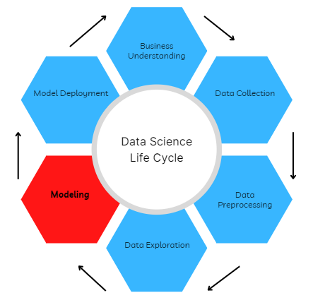

## Table of Contents

## What are miscellaneous components in machine learning?

Miscellaneous components in machine learning are various elements that don't fit neatly into the main categories like algorithms, data preprocessing, or model evaluation. These components can include things like feature selection methods, which help choose the most important data points for your model. Another example is hyperparameter tuning, where you adjust settings to improve how well your model works. There are also tools for handling missing data, which is common in real-world datasets. These miscellaneous components are important because they help make your machine learning models more accurate and efficient.

Another type of miscellaneous component is model interpretability tools. These help you understand why your model makes certain predictions, which is useful for explaining the model's decisions to others. For example, if you're using a model to predict whether a loan should be approved, interpretability tools can show which factors were most important in making that decision. Additionally, there are components for managing and deploying models, like version control systems for tracking changes to your model over time, and platforms for deploying models so they can be used in real applications. All these miscellaneous components play a crucial role in the overall success of machine learning projects.

## How does an Auxiliary Classifier work and what is its purpose?

An Auxiliary Classifier is a part of a neural network that helps the main task by adding an extra job for the network to do. Imagine you're learning to ride a bike, but to make it easier, you also practice balancing on a stationary bike. The main task is riding the bike, and the extra job is balancing. In a neural network, the main task could be recognizing pictures, and the extra job could be guessing what category the picture belongs to. This extra job helps the network learn better because it gives more feedback on how well it's doing.

The purpose of an Auxiliary Classifier is to improve the training of the [neural network](/wiki/neural-network). It does this by making the network focus on different aspects of the data at the same time. When the network tries to do the extra job, it learns features that can also help with the main task. For example, if the main task is to identify different types of animals in pictures, the auxiliary task might be to guess if the animal is a mammal or a bird. By doing both tasks, the network can learn more about the pictures and get better at the main task of identifying animals.

## What is a Highway Layer and how does it help in training deep neural networks?

A Highway Layer is a special kind of layer in a neural network that makes it easier to train very deep networks. Deep networks can be hard to train because as you add more layers, it becomes harder for the information to flow through the network. The Highway Layer helps by giving the network a way to decide how much of the original input should be passed directly to the next layer and how much should be transformed. This is done using something called a "gate," which is like a switch that controls the flow of information. By using these gates, the Highway Layer can help the network learn more easily and avoid problems like vanishing gradients, where the information gets too small to be useful as it goes through many layers.

The Highway Layer uses two special functions to control the gates: the transform gate and the [carry](/wiki/carry-trading) gate. The transform gate decides how much of the input should be changed, while the carry gate decides how much should be passed along without change. You can think of it like a highway where some cars take the [exit](/wiki/exit-strategy) to go through a city (transform gate), while others stay on the highway and keep going (carry gate). This way, the network can choose the best path for the information to travel, making it easier to train and allowing the network to be much deeper without losing performance. By using Highway Layers, deep neural networks can learn complex patterns and relationships in the data more effectively.

## Can you explain the function of Channel Shuffle in neural networks?

Channel Shuffle is a technique used in neural networks to mix up the data that flows through the network. Imagine you have a bunch of different colored wires, and each wire carries some information. Channel Shuffle takes these wires and rearranges them, so the information gets mixed up. This mixing helps the network learn better because it makes sure that all parts of the network get to see different kinds of information.

In a neural network, data is often organized into channels, which are like different layers of information. When you use Channel Shuffle, you take these channels and mix them up. This is especially useful in networks that use groups of channels, like in some types of convolutional neural networks. By shuffling the channels, the network can share information across different groups, making it more efficient and helping it learn faster.

## What is PixelShuffle and how is it used in super-resolution tasks?

PixelShuffle is a technique used in neural networks to increase the size of images. Imagine you have a small image and you want to make it bigger without losing quality. PixelShuffle does this by rearranging the pixels in a special way. It takes the information from a smaller image and spreads it out to create a larger one. This is really helpful in super-resolution tasks, where the goal is to turn low-resolution images into high-resolution ones.

In super-resolution tasks, PixelShuffle is used to upscale images. When a neural network processes a low-resolution image, it can use PixelShuffle to rearrange the output pixels into a larger grid. This makes the image bigger and clearer. For example, if you have a 2x2 pixel image, PixelShuffle can turn it into a 4x4 pixel image by spreading out the information. This technique helps the neural network create detailed, high-quality images from smaller, less detailed ones.

## How do Scatter Connections contribute to the architecture of neural networks?

Scatter Connections are a way to make neural networks work better by spreading information around in a special way. Imagine you're at a party and you want everyone to know something important. Instead of telling each person one by one, you could tell a few people and ask them to spread the word. Scatter Connections do something similar in a neural network. They take the information from one part of the network and spread it out to many other parts. This helps the network learn faster and more efficiently because it makes sure that all parts of the network get the information they need.

In the architecture of neural networks, Scatter Connections can be used to connect different layers or even different parts of the same layer. This can help the network handle complex tasks better. For example, if you're trying to recognize objects in a picture, Scatter Connections can help the network see the whole picture at once, not just small parts of it. By spreading the information around, the network can understand the relationships between different parts of the data, making it better at tasks like image recognition or language understanding.

## What is the role of a Positional Encoding Generator in models like Transformers?

A Positional Encoding Generator is a special part of models like Transformers that helps the model understand where each piece of information is in a sequence. Imagine you're reading a sentence. The words "dog" and "bites" mean different things depending on their order. The Positional Encoding Generator adds extra numbers to each word's data, so the model knows if "dog" comes before "bites" or after. These numbers are called positional encodings, and they help the model keep track of the order of the words.

In Transformers, the Positional Encoding Generator usually adds these numbers to the input data right at the start. The formula for creating these positional encodings often uses sine and cosine functions. For example, the positional encoding for a position $$pos$$ and a dimension $$i$$ might look like this: $$PE(pos, 2i) = \sin(pos / 10000^{2i/d_{model}})$$ and $$PE(pos, 2i+1) = \cos(pos / 10000^{2i/d_{model}})$$. By using these formulas, the model can understand the position of each piece of data and make better predictions about the whole sequence.

## What is Compressed Memory and how is it applied in memory-augmented neural networks?

Compressed Memory is a way to store information in memory-augmented neural networks without taking up too much space. Imagine you have a big list of things you need to remember, but you only have a small notebook. Compressed Memory is like writing down the most important points in a special way so you can fit more information into the notebook. In neural networks, this means using techniques to shrink the data so it takes up less memory but still keeps the important details.

In memory-augmented neural networks, Compressed Memory is used to help the network remember and use information from the past. For example, if the network is reading a long story, it needs to remember what happened at the beginning to understand the end. Compressed Memory helps by storing the key parts of the story in a smaller space. This makes the network more efficient and able to handle bigger tasks. One way to do this is by using a technique called autoencoders, which can compress data into a smaller form and then expand it back when needed. This way, the network can keep track of important information without using too much memory.

## Can you describe Holographic Reduced Representation and its advantages in neural network design?

Holographic Reduced Representation (HRR) is a way to store and work with information in neural networks that's a bit like how a hologram works. In a hologram, every little piece holds information about the whole picture. HRR does something similar with data. It takes a bunch of information and turns it into a single, smaller piece of data that still holds all the important details. This is done using math formulas that mix the data together in a special way. For example, if you have two pieces of information, A and B, HRR can combine them into a single piece, C, using a formula like $$C = A \otimes B$$, where $$\otimes$$ is a special operation that mixes them together.

The advantages of using HRR in neural network design are pretty cool. First, it helps the network use less memory because it can store a lot of information in a smaller space. This is great for tasks where the network needs to remember a lot of things, like language understanding or playing complex games. Second, HRR makes it easier for the network to find and use the information it needs. Because every piece of the data holds information about the whole, the network can quickly pull out what it needs without searching through a lot of data. This makes the network faster and more efficient, which is really helpful for big, complicated tasks.

## What is Deflation in the context of machine learning, and how does it affect model performance?

Deflation in [machine learning](/wiki/machine-learning) is a technique used to make models simpler and faster. Imagine you have a big, complicated model that takes a long time to run. Deflation helps by removing parts of the model that don't help much with the task. It's like cleaning out your closet and getting rid of clothes you don't wear anymore. By doing this, the model can work faster and use less memory, which is really helpful when you're working with big data or need quick results.

When you use deflation, it can affect the model's performance in different ways. If you remove the right parts, the model can still do its job well but much faster. For example, if you're trying to recognize pictures, deflation might remove some layers that don't help much with recognizing the images. But if you remove too much, the model might not work as well because it loses important information. So, deflation is a balancing act where you want to make the model simpler without losing too much of its ability to do the job right.

## How can these miscellaneous components be combined to enhance a machine learning model's performance?

Combining miscellaneous components like Auxiliary Classifiers, Highway Layers, Channel Shuffle, PixelShuffle, Scatter Connections, Positional Encoding Generators, Compressed Memory, Holographic Reduced Representation, and Deflation can significantly boost a machine learning model's performance. For example, using an Auxiliary Classifier can help the model learn better by adding an extra task, while Highway Layers can make it easier to train deep networks by controlling how much information flows through the layers. Channel Shuffle can mix up the data to help the model learn faster, and PixelShuffle can be used to upscale images in super-resolution tasks. Scatter Connections can spread information around the network, making it more efficient, and a Positional Encoding Generator can help the model understand the order of data in sequences, like in Transformers.

Additionally, using Compressed Memory can help the model store more information in a smaller space, which is useful for memory-augmented neural networks. Holographic Reduced Representation can further enhance this by storing data in a way that every piece holds information about the whole, making it easier for the model to access and use the data it needs. Finally, Deflation can simplify the model by removing parts that don't contribute much, making it faster and more efficient. By carefully combining these components, you can create a more powerful and efficient machine learning model that performs better on complex tasks.

## What are some advanced applications or research areas where these miscellaneous components are being explored?

These miscellaneous components are being explored in many advanced applications and research areas. One area is natural language processing, where Positional Encoding Generators in Transformer models help the network understand the order of words in sentences. This is important for tasks like machine translation, where understanding the sequence of words is key. Compressed Memory and Holographic Reduced Representation are also used here to help the model remember long pieces of text without using too much memory. Researchers are looking at how these techniques can make language models better at understanding and generating human-like text.

Another area is in computer vision, where PixelShuffle is used for super-resolution tasks to turn low-quality images into high-quality ones. Channel Shuffle and Scatter Connections are being explored to make convolutional neural networks more efficient and better at recognizing objects in pictures. Highway Layers are also being used to help train very deep networks for image recognition, allowing them to learn complex patterns without running into problems like vanishing gradients. Researchers are working on combining these techniques to create models that can handle bigger and more detailed images faster and more accurately.

In the field of [reinforcement learning](/wiki/reinforcement-learning), which is about teaching machines to make decisions, Auxiliary Classifiers and Deflation are being used to improve how [agents](/wiki/agents) learn from their environment. Auxiliary Classifiers can help the agent learn faster by adding extra tasks, like predicting future states, while Deflation can simplify the model to make it run more quickly. These components are helping researchers develop smarter agents that can learn to play complex games or control robots more effectively.