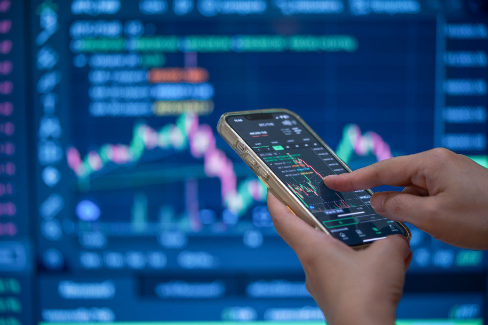

Trading binary options through algorithmic trading has grown in popularity, yet it is often surrounded by misconceptions. These misunderstandings can lead to misguided strategies and financial losses if not properly addressed. This article aims to clarify the most common misconceptions associated with binary options algo trading. By doing so, traders can approach this trading style with greater understanding and effectiveness.

Understanding binary options involves recognizing their fundamental differences from other trading forms. Unlike traditional stock trading, where investors buy shares in companies and can hold these investments indefinitely, binary options are based on a more simplistic yes/no proposition. Traders must predict the value direction of an underlying asset within a fixed time frame. This structure is unique, presenting specific opportunities and risks.



Algorithmic trading, another layer of complexity, involves using automated systems to execute trades based on predefined criteria. It can enhance trading efficiency by quickly analyzing vast datasets and executing trades at optimal times. However, many traders enter this domain with unrealistic expectations, believing that the use of algorithms guarantees success and eliminates risk.

A clear understanding of both binary options and algorithms is necessary to leverage their combination effectively. Many traders are unaware that the nature of binary options requires specific algorithmic strategies that differ from those used in traditional trading markets like forex or stocks. Without recognizing these nuances, traders risk using inappropriate trading algorithms, leading to suboptimal outcomes.

By addressing these misconceptions, this article will provide traders with a factual basis to better engage with binary options algo trading. A well-informed approach enables traders to develop robust strategies, thereby enhancing their chances of navigating the binary options market successfully.

## Table of Contents

## Misconception 1: Binary Options Algo Trading Guarantees Profit

One of the most pervasive myths in binary options algorithmic trading is the belief that utilizing algorithms guarantees profit. In reality, while these algorithms can increase efficiency and enhance decision-making processes, they do not mitigate the inherent risks associated with trading. 

Financial markets are fundamentally unpredictable, characterized by numerous variables and potential [volatility](/wiki/volatility-trading-strategies). An algorithm, regardless of its complexity or historical performance, cannot predict every market movement with certainty. While algorithms can process large datasets at high speeds, allowing for the identification of patterns and trends that may be less apparent to the human eye, they are not infallible. For instance, an algorithm designed to exploit an [arbitrage](/wiki/arbitrage) opportunity may still encounter execution risks due to latency or slippage, which can affect profitability.

It is crucial for traders utilizing algorithmic strategies to manage their expectations. Risk management remains an indispensable aspect of trading, even when using sophisticated algorithms. This involves setting appropriate stop-loss levels, diversifying trading strategies, and constantly reviewing the algorithm's performance against market conditions. Moreover, [backtesting](/wiki/backtesting) algorithms on historical data, while insightful, does not guarantee future success due to the dynamic nature of markets.

For example, a basic risk management strategy may involve setting a maximum percentage of one's trading capital to risk on any single trade. Traders can implement this in a Python-based trading algorithm as follows:

```python
def should_execute_trade(account_balance, trade_risk_percent, trade_amount):
    max_risk_amount = account_balance * trade_risk_percent / 100
    if trade_amount > max_risk_amount:
        return False
    return True

# Example usage
account_balance = 10000  # in USD
trade_risk_percent = 2  # Maximum risk per trade in percent
trade_amount = 300  # Proposed trade amount in USD

if should_execute_trade(account_balance, trade_risk_percent, trade_amount):
    print("Execute trade")
else:
    print("Risk too high, adjust trade size")
```

This code snippet allows traders to execute trades only when the amount risked per trade is within a predefined threshold, thus helping to mitigate potential losses.

By comprehending the limitations of [algorithmic trading](/wiki/algorithmic-trading) and maintaining prudent risk management practices, traders can approach binary options trading with a realistic and informed mindset. This understanding is essential for strategic planning, allowing traders to leverage the advantages of algorithmic trading without falling victim to unwarranted assumptions of guaranteed profitability.

## Misconception 2: Algorithmic Trading Is Only for Experts

Many believe that only seasoned traders or those with coding skills can use algorithmic trading in the binary options market. This misconception arises from the early days of algorithmic trading, where sophisticated coding skills were indeed necessary to develop and implement trading strategies. However, technological advancements have democratized access to algorithmic trading, significantly lowering the barrier to entry for novices.

Various platforms now exist that offer user-friendly tools and interfaces, making it easier for individuals with limited technical backgrounds to engage in algorithmic trading. These platforms provide graphical user interfaces (GUIs) where traders can set parameters and conditions without writing a single line of code. For instance, one can use drag-and-drop functionalities to build strategies visually, selecting from pre-defined indicators and conditions to set up their trading algorithms.

Understanding the basic concepts and strategies is essential, but becoming an expert coder is not a necessity. Educational resources, tutorials, and webinars are often provided by trading platforms, aiming to equip users with the necessary knowledge to make informed trading decisions. These resources cover key areas such as risk management, trend analysis, and strategy development, which are foundational for anyone looking to succeed in algorithmic trading.

Furthermore, algorithmic trading in binary options can be approached through manageable steps, allowing beginners to start small and gradually increase complexity as they become more comfortable and knowledgeable. For instance, starting with simple moving averages or trend-following algorithms and then progressing to more complex strategies involving combinational indicators can be a practical approach.

Overall, the advancements in trading technologies and educational tools mean that algorithmic trading is more accessible than ever. As the barrier to entry continues to decrease, a wider range of traders can engage in this method, leveraging both the efficiency of algorithms and the strategic insights they provide to navigate the binary options market more effectively.

## Misconception 3: All Algo Trading Strategies Are the Same

There is a misconception that all trading algorithms work in the same way and produce the same results. In reality, trading algorithms are as diverse as the markets they operate in. Each algorithm is developed with specific objectives and risk thresholds in mind. This diversity can be seen in the range of strategies employed across different trading environments.

High-frequency trading ([HFT](/wiki/high-frequency-trading-strategies)) is one such strategy, characterized by the rapid execution of a large number of trades within very short timeframes. HFT algorithms aim to capitalize on minute price discrepancies that may not be visible or exploitable in slower trading models. These algorithms rely heavily on advanced computational power and low-latency data feeds to execute trades within milliseconds.

In contrast, other algorithms might be designed to identify longer-term market trends and aim to hold positions over days or even weeks. These trend-following algorithms often utilize technical indicators like moving averages or [momentum](/wiki/momentum) indicators to assess market direction. The key to these strategies is patience and the ability to withstand short-term market fluctuations for potentially larger gains over a more extended period.

The choice of strategy should align with a trader's individual goals and risk tolerance. For example, a trader with a high-risk appetite might prefer the rapid pace and potential high returns of HFT. Conversely, a trader interested in more stable and predictable outcomes may lean towards strategies focusing on long-term trend analysis.

To further illustrate, consider a simple moving average crossover strategy often used in trend-following scenarios:

```python
def moving_average(data, window_size):
    return data.rolling(window=window_size).mean()

def generate_signals(data):
    short_window = 40
    long_window = 100

    data['short_mavg'] = moving_average(data['close'], short_window)
    data['long_mavg'] = moving_average(data['close'], long_window)

    data['signal'] = 0
    data['signal'][short_window:] = np.where(data['short_mavg'][short_window:] 
                                             > data['long_mavg'][short_window:], 1, 0)   
    data['position'] = data['signal'].diff()

    return data
```

This Python code snippet depicts a basic moving average crossover strategy. In this scenario, buy signals are generated when the short-term moving average crosses above the long-term moving average, suggesting an upward trend. Conversely, a sell signal is triggered when the short-term average falls below the long-term average, indicating a potential downturn.

Ultimately, the effectiveness of an algorithm depends on its alignment with the trader's objectives and the particular intricacies of the market they engage with. Understanding the variations among trading strategies enables traders to make informed decisions about which algorithmic approach best fits their trading style and risk profile.

## Misconception 4: Algo Trading Removes Human Interaction

A common fear associated with algorithmic trading is that it entirely eradicates human interaction, reducing the process to mere computational execution devoid of human judgment and intervention. However, this perception overlooks the essential role of human oversight in various stages of algorithmic trading. The development and implementation of algorithms are inherently human-centric activities where traders design and code algorithms based on market insights, trading strategies, and risk assessments.

During the creation phase, human expertise is paramount in determining the parameters and strategies that algorithms will execute. Selecting suitable indicators, defining conditions for trade entries and exits, and setting risk management protocols are tasks that require human insight and understanding of market dynamics. Expertise in these areas ensures that algorithms are equipped to handle diverse market conditions.

Once algorithms are operational, human oversight remains crucial. Traders must consistently monitor the performance of their algorithms to ensure they function as intended and adapt to evolving market conditions. Situations such as sudden market volatility, unexpected economic announcements, or technical glitches necessitate human intervention to recalibrate or halt algorithmic trades temporarily.

Additionally, human intuition and experience are invaluable in interpreting nuanced market signals that might elude purely computational analysis. For instance, while an algorithm might identify technical patterns based solely on data, a trader's intuition and historical market knowledge can provide additional context, enhancing decision-making processes.

Furthermore, algorithms can be enhanced with adaptive [machine learning](/wiki/machine-learning) techniques that adjust rules based on historical data patterns and predictive analytics. However, human interpretation of these adaptations is crucial to discern whether they align with the overarching trading strategy and risk tolerance of the trader.

In conclusion, while algorithmic trading leverages computational power for efficiency and speed, it does not eliminate the necessity for human interaction. The synergy of algorithmic precision and human oversight results in a robust trading approach, effectively balancing the strengths of both elements for optimized trading performance.

## Misconception 5: Binary Options Algo Trading Is the Same as Forex or Stock Algo Trading

Binary options trading is frequently misunderstood and sometimes incorrectly equated with [forex](/wiki/forex-system) or stock algorithmic trading. However, binary options distinguish themselves through predetermined payouts and fixed expiration times, unlike the varying outcomes and timelines associated with forex and stocks.

In forex or stock trading, traders profit from the fluctuations in the market price of currency pairs or stocks. The outcome is highly variable and influenced by price changes until the trader chooses to close the trade. Conversely, binary options involve predicting whether the price of an asset will rise or fall over a set time frame. Here, the potential profit or loss is known in advance, simplifying the decision-making process.

This fundamental difference necessitates tailored algorithmic strategies for binary options trading. Algorithms in forex or stock trading often account for price movements, leveraging tools like moving averages or Bollinger Bands to exploit market trends. Strategies may also employ complex hedging or arbitrage techniques. In binary options, algorithms focus on optimizing the win-to-loss ratio within the defined time constraints and payout limits.

For instance, a binary options algorithm might utilize a stochastic oscillator to anticipate short-term market reversals, triggering trades that align with the binary options' all-or-nothing payout framework. The pre-set expiration time could be incorporated as a critical parameter:

```python
def stochastic_oscillator(df, window=14):
    """Calculate the stochastic oscillator for each point in the DataFrame."""
    lowest_low = df['Low'].rolling(window=window).min()
    highest_high = df['High'].rolling(window=window).max()
    K_percent = 100 * ((df['Close'] - lowest_low) / (highest_high - lowest_low))
    return K_percent

# Example timeframe setup for binary options expiration
expiration_time = 5  # in minutes
```

Understanding these operational differences is crucial for optimizing algorithms specifically for binary options. The fixed nature of binary options not only affects strategy planning but also influences risk management and backtesting considerations. Traders must adapt their approach, mindful of the distinctive mechanics that separate binary options from other forms of algorithmic trading.

## Conclusion

Dispelling misconceptions related to binary options algorithmic trading is essential for traders looking to effectively navigate this specialized market. Accurate knowledge allows traders to assess risks with greater precision and develop strategies that align with their financial goals. Understanding the inherent risks and limitations of algorithms is vital, as algorithms themselves do not guarantee profit and still necessitate astute risk management.

Algorithmic trading presents various opportunities by streamlining decision-making processes and optimizing trade execution. However, it demands diligent oversight and a comprehensive understanding of the underlying market mechanics. Traders must continuously monitor and adjust their algorithms, ensuring they remain aligned with current market conditions and personal trading objectives.

By acknowledging these realities, traders can position themselves more effectively for success in the binary options market. Developing a clear, informed mindset helps mitigate potential pitfalls and enhances the potential for achieving desired financial outcomes. Engaging proactively with these insights enables traders to leverage the advantages of algorithmic trading while remaining cognizant of its challenges.

## References & Further Reading

[1]: Bergstra, J., Bardenet, R., Bengio, Y., & Kégl, B. (2011). ["Algorithms for Hyper-Parameter Optimization."](https://papers.nips.cc/paper/4443-algorithms-for-hyper-parameter-optimization) Advances in Neural Information Processing Systems 24.

[2]: ["Advances in Financial Machine Learning"](https://www.amazon.com/Advances-Financial-Machine-Learning-Marcos/dp/1119482089) by Marcos Lopez de Prado

[3]: ["Evidence-Based Technical Analysis: Applying the Scientific Method and Statistical Inference to Trading Signals"](https://www.amazon.com/Evidence-Based-Technical-Analysis-Scientific-Statistical/dp/0470008741) by David Aronson

[4]: ["Machine Learning for Algorithmic Trading"](https://github.com/stefan-jansen/machine-learning-for-trading) by Stefan Jansen

[5]: ["Quantitative Trading: How to Build Your Own Algorithmic Trading Business"](https://www.amazon.com/Quantitative-Trading-Build-Algorithmic-Business/dp/1119800064) by Ernest P. Chan