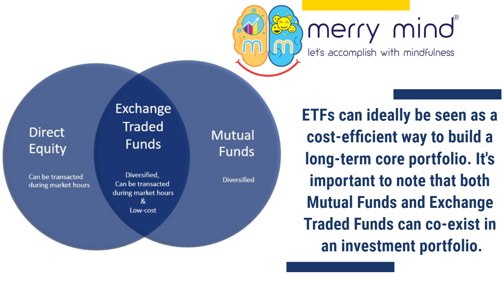

Investing offers a broad range of opportunities, yet it's often clouded by misunderstandings and myths. Two prominent investment options, Exchange-Traded Funds (ETFs) and algorithmic trading, frequently become subjects of such misconceptions. ETFs are often regarded as transparent investment vehicles with lower fees, yet many investors misunderstand their nature and fee structure. This confusion can lead to misconceived views about their passive or active management and the diversity of their offerings beyond simple index tracking.

Algorithmic trading, synonymous with technical complexity and perceived risk, stands as another area rife with myths. It's commonly viewed as a playground only for sophisticated traders or day traders. Moreover, it is sometimes blamed for market volatility, often magnified through the lens of high-frequency trading (HFT). These perspectives can obscure the real benefits and potential of algorithmic strategies for investors of varying expertise.

This article seeks to clarify these misconceptions, providing investors with a more accurate understanding of both ETFs and algorithmic trading. Equipped with clearer insight, investors will be better positioned to explore these tools and include them in their investment strategies effectively. Understanding these financial instruments beyond face value is crucial to leveraging their full potential.

## Table of Contents

## Common Misconceptions About ETFs

Exchange-Traded Funds (ETFs) have become a popular choice for many investors due to their flexibility and diversified exposure. However, several misconceptions continue to influence investor decisions.

One common belief is that ETFs invariably have lower fees than mutual funds. While it's true that ETFs typically have lower expense ratios due to their passive nature, this is not universally applicable. Actively managed ETFs, which are designed to outperform certain benchmarks, can have expense ratios comparable to or even exceeding those of mutual funds. Investors must also consider the total cost of ownership, which includes trading commissions and potential bid-ask spreads—elements that affect the overall cost efficiency of ETFs. According to a study by the Investment Company Institute, while average expense ratios for index ETFs are indeed lower (0.17% in 2020) compared to index mutual funds (0.50%), this gap narrows with actively managed ETFs [1].

Another misconception is that ETFs are only passively managed. While many ETFs do track indices like the S&P 500, there is a growing segment of actively managed ETFs. These funds employ portfolio managers who make discretionary decisions in order to achieve specific investment goals, similar to actively managed mutual funds. For example, as of 2021, companies like ARK Invest offer actively managed ETFs aiming for innovative growth [2].

Moreover, many investors mistakenly believe that ETFs solely track broad market indexes. In reality, the scope of ETFs is extensive, covering sector-specific, commodities, and currency ETFs. These specialized funds allow investors to gain exposure to targeted areas of the market or specific asset classes. As of 2022, thematic ETFs—focusing on megatrends like technology and sustainability—were particularly popular, showing the adaptability of ETFs in catering to varied investment interests [3].

Overall, understanding the diverse nature and available strategies within the [ETF](/wiki/etf-trading-strategies) landscape is essential for combating prevalent myths. Investors who recognize the intricacies involved are better positioned to leverage these investment vehicles effectively.

References:
1. Investment Company Institute, 2021 Investment Company Fact Book.
2. ARK Invest: Disruptive Innovation ETFs. (https://ark-invest.com/)
3. BlackRock: 2022 Global ETP Landscape. (https://www.blackrock.com/etf)

## Algorithmic Trading Myths

Algorithmic trading, often seen as a complex arena reserved for experts, is rife with misconceptions that can deter potential investors. One prevailing myth is that [algorithmic trading](/wiki/algorithmic-trading) is exclusively for sophisticated traders or day traders. This view oversimplifies the capabilities and accessibility of algorithmic trading. In reality, modern platforms and software have democratized access to algorithmic trading strategies, making them available to retail investors. These platforms often provide user-friendly interfaces that even novice traders can utilize, coupled with educational resources that demystify the process.

Another common myth is the association between high-frequency trading ([HFT](/wiki/high-frequency-trading-strategies)) and increased market [volatility](/wiki/volatility-trading-strategies). While it is true that HFT involves executing a large number of orders at extremely high speeds, studies have shown that HFT can, in some circumstances, actually enhance market [liquidity](/wiki/liquidity-risk-premium) and efficiency. The perception that HFT is a primary source of volatility overlooks its role in fostering tighter bid-ask spreads and faster price discovery. Nevertheless, it is important to distinguish HFT from other forms of algorithmic trading, which may not operate at such speeds.

Concerns about systemic risk and errant algorithms further contribute to the cloud of myths surrounding algorithmic trading. While there have been instances of algorithmic trades leading to flash crashes, such events are rare and often result from inadequate risk management rather than the inherent nature of the algorithms themselves. Effective risk management practices, including thorough testing and constant monitoring, are essential to mitigate these risks. Regulatory frameworks and technological advancements have also improved the oversight of algorithmic trading systems, reducing the likelihood of such disruptions.

Understanding these realities is crucial for investors. Algorithmic trading is not an exclusive domain for the initiated, nor is it a singular cause of market volatility. With proper knowledge and tools, investors can navigate algorithmic trading confidently, harnessing its potential benefits while minimizing associated risks.

## ETFs: Understanding the Realities

Exchange-Traded Funds (ETFs) stand out for their diversity, encapsulating a wide range of management styles and investment strategies. Unlike the common perception that ETFs are purely passive investment tools, actively managed ETFs have gained prominence. These vehicles allow fund managers to actively select securities, facilitating strategies aimed at exceeding market returns, often referred to as "seeking alpha." This dispels the notion that all ETFs merely replicate the performance of an index. 

Furthermore, the cost efficiency of ETFs is a frequently highlighted benefit. Generally, ETFs tend to have lower expense ratios compared to mutual funds, making them an attractive option for cost-conscious investors. However, it's imperative to consider the complete cost structure of ETFs, which includes commissions and potential trading fees. These additional costs can impact the overall expense and should be factored into the investment decision-making process.

ETFs offer substantial liquidity, enabling investors to buy and sell shares throughout the trading day at market prices. This intraday trading capability is advantageous compared to mutual funds, which are typically only priced once at the end of the trading day. Additionally, ETFs provide tax efficiency due to their unique structure, which generally allows for lower capital gains distributions compared to mutual funds. This is particularly beneficial to taxable investors aiming to maximize after-tax returns.

Despite their merits, ETFs are not devoid of limitations. Not all ETFs provide substantial diversification; sector-specific or niche ETFs may expose investors to concentrated risks. Moreover, the choice between different types of ETFs—such as international, sector-specific, or commodity ETFs—requires a strategic approach aligned with an investor's overall portfolio objectives.

In summary, a thorough understanding and evaluation of ETFs can dismantle prevalent myths, uncovering the genuine benefits and challenges these financial instruments present. Investors who meticulously analyze the structural and cost aspects of ETFs are better positioned to capitalize on the advantages they offer while mitigating inherent limitations.

## The Truth Behind Algorithmic Trading

Algorithmic trading has transformed the landscape of financial markets by automating trading processes, leading to enhanced efficiency and precision. This methodology utilizes computer algorithms to execute trades at optimal times and prices, thereby minimizing human errors and emotional biases. The automation involves pre-programmed instructions accounting for variables like timing, price, and [volume](/wiki/volume-trading-strategy), allowing traders to execute orders at a speed and frequency that would be impractical for a human trader.

Contrary to popular belief, algorithmic trading does not inherently contribute to increased market volatility compared to traditional trading methods. While high-frequency trading (HFT), a subset of algorithmic trading, has been scrutinized for potential risks to market stability, studies indicate that HFT can contribute to market liquidity and reduce spreads. The real contributor to the perception of increased volatility is often not the algorithms themselves, but rather external market factors and the sheer volume of trades executed in a short period.

One of the primary risks associated with algorithmic trading is systemic risk, which can be amplified if not managed effectively. An errant algorithm or a flaw in the trading model can lead to substantial financial losses, not just for the individual deploying it but potentially for the entire market. This necessitates robust risk management practices, including frequent testing and refining of algorithms, implementing circuit breakers, and maintaining oversight to prevent unintended consequences.

A fundamental understanding of algorithmic trading can alleviate many fears based on misconceptions. For instance, the common belief that algo trading is exclusively for large institutions ignores the increasing accessibility of algorithmic tools to individual investors. With the democratization of technology and the availability of platforms offering algorithmic trading solutions, even individual investors can harness the power of algorithms, provided they are equipped with the necessary knowledge and tools.

For investors, recognizing the realities of algorithmic trading is crucial for leveraging its benefits effectively. This involves comprehending not just the technical aspects but also staying informed about regulatory and ethical considerations in the trading environment. By dispelling myths and embracing a factual approach, algo trading can be a powerful ally in an investor's toolkit, offering precision, speed, and the potential for enhanced returns.

## Conclusion

Exchange-Traded Funds (ETFs) and algorithmic trading are integral to modern investing, providing diverse and efficient avenues for both institutional and individual investors. However, they are often misinterpreted, leading to misconceptions that can hinder informed investment decisions. By dispelling common myths, investors can better harness these tools' potential with enhanced confidence and understanding.

Investing effectively requires a rigorous analysis of all available options. ETFs, often misunderstood for their management styles and cost structures, offer a range of investment possibilities that extend beyond passive index tracking. Similarly, algorithmic trading, misunderstood as solely risky and reserved for advanced investors, actually enhances market efficiency and can be accessible to a broader spectrum of traders.

Critical to successful investing is making informed choices grounded in a clear understanding of financial instruments' capabilities and limitations. Investors who educate themselves about the factual intricacies of ETFs and algorithmic trading can capitalize on their benefits while minimizing potential drawbacks. Therefore, the perceived complexities and risks should not deter those seeking new investment opportunities. Instead, through knowledge and clear judgment, investors can integrate these tools into their strategies effectively, laying the groundwork for potentially enhanced financial outcomes.

## FAQs

1. **What is the biggest risk associated with ETFs?**

   The biggest risk associated with Exchange-Traded Funds (ETFs) often lies in their market liquidity. While ETFs are designed to be as liquid as individual stocks, not all ETFs have the same level of trading volume. Illiquid ETFs can lead to wider bid-ask spreads, making them costlier to trade. Additionally, in times of significant market volatility, the net asset value (NAV) of the ETF may deviate from its market price, posing tracking risk to investors. Therefore, assessing the average daily volume and market liquidity of an ETF is crucial before investing.

2. **How does algorithmic trading enhance market efficiency?**

   Algorithmic trading contributes to market efficiency by automating the trading process, which increases the speed and accuracy of trade executions. Algorithms can process vast amounts of data to identify [arbitrage](/wiki/arbitrage) opportunities and discrepancies in pricing, leading to more consistent pricing across different markets and assets. The use of algorithms reduces human error, minimizes the latency of trades, and provides continuous market monitoring, all of which enhance liquidity and narrow bid-ask spreads. The efficient execution of trades through algorithmic trading helps in reflecting accurate asset values almost instantaneously.

3. **Are ETFs preferable to mutual funds for every investor?**

   ETFs are not universally preferable to mutual funds for every investor. While they offer certain advantages like lower expense ratios, tax efficiency, and intraday trading flexibility, mutual funds may still be suitable for investors who prefer active management and have no need for frequent trading. Mutual funds typically do not incur trading commissions, which can be beneficial for investors making small, regular contributions. Thus, the choice between ETFs and mutual funds should be driven by the investor's financial goals, investment strategy, and preferences regarding management style and costs.

4. **Can algorithmic trading be utilized by individual investors?**

   Individual investors can utilize algorithmic trading, especially with the advent of trading platforms and software that offer algorithmic solutions tailored to retail investors. Python, for example, has libraries like `pandas` and `NumPy` that are commonly used to develop simple trading algorithms. However, individual investors must familiarize themselves with technical analysis and programming skills to effectively use algorithms. Many platforms also provide pre-built algorithmic strategies that individual investors can implement without deep programming knowledge.

5. **What steps can investors take to mitigate the risks of algorithmic trading?**

   To mitigate risks associated with algorithmic trading, investors should begin by ensuring a thorough [backtesting](/wiki/backtesting) of their algorithms under different market conditions to evaluate performance stability. Implementing strict risk management protocols such as stop-loss limits and diversification can help in containing excessive losses. Regularly monitoring the algorithm’s performance and updating it based on market changes is crucial. Investors should also assess the robustness of their trading infrastructure to handle high-frequency data. Furthermore, staying informed about regulatory changes affecting algorithmic trading can prevent potential compliance issues.

## References & Further Reading

[1]: ["2021 Investment Company Fact Book"](https://www.ici.org/fact-book) by Investment Company Institute

[2]: ["ARK Invest: Disruptive Innovation ETFs"](https://www.ark-invest.com/strategy/ark-disruptive-innovation)

[3]: ["2022 Global ETP Landscape"](https://www.morningstar.com/funds/strategic-beta-etf-market-has-matured-that-doesnt-mean-partys-over) by BlackRock

[4]: Bergstra, J., Bardenet, R., Bengio, Y., & Kégl, B. (2011). ["Algorithms for Hyper-Parameter Optimization."](https://dl.acm.org/doi/10.5555/2986459.2986743) Advances in Neural Information Processing Systems 24.

[5]: ["Advances in Financial Machine Learning"](https://www.amazon.com/Advances-Financial-Machine-Learning-Marcos/dp/1119482089) by Marcos Lopez de Prado