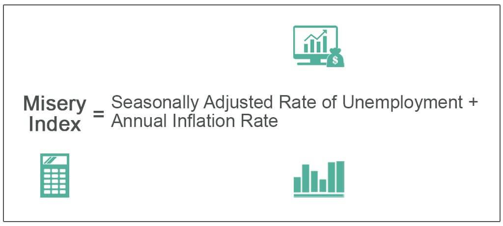

Understanding economic indicators such as inflation and unemployment is a cornerstone for evaluating a nation’s economic health. These indicators not only reveal internal economic dynamics but also influence public perception of economic wellbeing. A prominent concept that encapsulates public economic distress is the Misery Index. Developed by economist Arthur Okun in the 1970s, this index is a straightforward calculation derived by summing the inflation rate and the unemployment rate. The Misery Index serves as a quick gauge of economic discomfort experienced by the general populace, where higher values suggest heightened economic distress.

As we navigate the complexities of the modern financial landscape, the interplay between inflation, unemployment, and the Misery Index broadens to incorporate the realm of technology-driven finance, particularly algorithmic trading. Algorithmic trading uses sophisticated computer programs to execute trades at speeds and volumes impossible for human traders alone. With economic indicators being integral to these trading algorithms, the interaction between the Misery Index and algorithmic trading strategies offers a unique perspective on economic dynamics.



Exploring the relationship between these elements provides insight into how fluctuations in inflation and unemployment impact financial markets. By understanding these connections, financial analysts and traders can enhance their predictive models and trading strategies, potentially leading to more informed decision-making and improved market responsiveness. Such strategic integration highlights the need for a blend of economic comprehension and technological innovation in navigating today’s financial ecosystems.

## Table of Contents

## What is the Misery Index?

The Misery Index is an economic indicator developed by economist Arthur Okun during the 1970s. It is designed to provide a quick and straightforward measure of economic distress experienced by a nation's citizens. The index is calculated by summing two critical economic data points: the unemployment rate and the inflation rate. The formula can be expressed as:

$$
\text{Misery Index} = \text{Unemployment Rate} + \text{Inflation Rate}
$$

This simple calculation offers insight into the level of economic discomfort within a society. High values of the Misery Index are indicative of increased economic distress. For instance, when both the unemployment and inflation rates are high, individuals may struggle with joblessness and increased living costs, thereby exacerbating overall economic hardship.

The Misery Index gained prominence as a tool for illustrating the economic challenges of the 1970s, particularly during the period of stagflation, which was characterized by high inflation coupled with high unemployment. This period underscored the importance of tracking and understanding economic indicators to address public economic welfare effectively. Despite its simplicity, the Misery Index remains a relevant tool for highlighting the impact of key economic variables on a nation's socio-economic landscape.

## Components and Historical Context

The Misery Index is an economic indicator that combines two critical metrics: the inflation rate and the unemployment rate. These two components together provide a concise measure of economic distress faced by the general population. Inflation, representing the rate at which the general level of prices for goods and services is rising, erodes purchasing power and can lead to uncertainty about future costs. In contrast, the unemployment rate measures the percentage of the labor force that is jobless but actively seeking employment. High unemployment indicates underutilization of labor resources, often resulting in reduced consumer spending and social instability.

The Misery Index gained prominence during periods such as the 1970s, characterized by stagflation—a scenario featuring high inflation coupled with high unemployment. The 1970s saw several economic challenges, including oil price shocks, which highlighted the limitations of traditional economic theories that struggled to simultaneously address rising inflation and unemployment. As the Misery Index succinctly captured the essence of public economic discomfort during this period, it became an influential tool for economists and policymakers.

Despite its utility, the Misery Index has faced criticism and revision over the years. Critics argue that the index oversimplifies complex economic conditions by focusing solely on inflation and unemployment, ignoring other vital factors such as GDP growth, consumer confidence, and income inequality. As such, alternative models have emerged to provide a more comprehensive view of economic well-being, incorporating additional indicators like interest rates, economic growth rates, and broader social factors.

Revised models seek to address these shortcomings by integrating a wider range of economic variables, aiming to offer a multidimensional perspective on economic health. Nevertheless, the original Misery Index remains a widely recognized and utilized tool, serving as a starting point for broader analyses and discussions regarding economic conditions.

## Algorithmic Trading: An Overview

Algorithmic trading utilizes computer algorithms to automatically execute trades based on a set of predefined rules. These algorithms can process vast amounts of data at high speed to identify trading opportunities more efficiently than human traders. The core components of [algorithmic trading](/wiki/algorithmic-trading) include decision-making based on quantitative models, execution of trades with minimal human intervention, and risk management.

Economic indicators, such as inflation and unemployment rates, significantly influence algorithmic trading models. These indicators provide crucial data that algorithms use to assess market conditions and make informed trading decisions. For instance, a rise in inflation may lead to increased interest rates, affecting bond prices. An algorithm might be programmed to sell bonds when inflation reaches a certain threshold. Similarly, unemployment data can impact currency and stock market movements, prompting algorithms to adjust their trades accordingly.

Algorithmic trading systems can react to shifts in economic data with speed and precision. They often incorporate real-time data feeds to modify trading strategies instantaneously as new economic information becomes available. This capability allows traders to quickly capitalize on short-term market movements that result from economic announcements.

To illustrate how algorithmic trading functions, consider the following simplified Python example of a moving average crossover strategy that uses historical price data and can be adapted to incorporate economic indicators:

```python
import numpy as np
import pandas as pd
import matplotlib.pyplot as plt

# Sample data
prices = pd.Series([100, 102, 101, 104, 105, 108, 107, 110])

# Calculate moving averages
short_window = 3
long_window = 5

short_mavg = prices.rolling(window=short_window, min_periods=1, center=False).mean()
long_mavg = prices.rolling(window=long_window, min_periods=1, center=False).mean()

# Plotting the prices and moving averages
plt.figure(figsize=(10, 5))
plt.plot(prices, label='Price')
plt.plot(short_mavg, label=f'{short_window}-Day Moving Average')
plt.plot(long_mavg, label=f'{long_window}-Day Moving Average')
plt.legend()
plt.show()

# Trading signals
signals = pd.DataFrame(index=prices.index)
signals['price'] = prices
signals['short_mavg'] = short_mavg
signals['long_mavg'] = long_mavg
signals['signal'] = 0.0

# Generate buy/sell signals
signals['signal'][short_window:] = np.where(signals['short_mavg'][short_window:] > signals['long_mavg'][short_window:], 1.0, 0.0)

# Spread the signals to action (buy/sell)
signals['positions'] = signals['signal'].diff()
```

In this example, trading signals are generated based on moving averages of stock prices. The strategy can be extended to include economic indicators such as inflation data, where a specific indicator value might trigger buying or selling actions.

As such, algorithmic trading represents an integration of computational techniques with financial analysis, allowing for more systematic and disciplined trading approaches that benefit from rapid data processing and removal of emotional bias in decision-making. This level of automation provides a significant advantage in markets characterized by [volatility](/wiki/volatility-trading-strategies) and rapid information dissemination.

## Economic Indicators in Algorithmic Trading Strategies

Incorporating economic indicators into algorithmic trading strategies significantly enhances the predictive capabilities of financial models. Economic indicators such as inflation rates and unemployment figures are crucial for understanding macroeconomic trends that can affect market movements. When these indicators are integrated effectively, they provide crucial insights that can guide decision-making processes in trading strategies.

Macroeconomic indicators are vital inputs for algorithmic models due to their ability to reflect broader economic conditions. For example, a rise in the inflation rate can signal an overheating economy, which might lead policymakers to increase interest rates. This causal relationship can influence bond yields and equity prices, making inflation a critical component for forecasting market dynamics. Similarly, changes in unemployment rates can affect consumer spending and business investment, thereby impacting growth prospects across various sectors.

To leverage these indicators effectively, algorithmic trading strategies must employ robust data analysis techniques. This involves extracting, processing, and analyzing vast amounts of economic data to identify patterns and correlations. Machine learning algorithms can be particularly useful in this context, as they can adapt to new data and refine predictions over time. For instance, a Python-based model might employ libraries such as `pandas` and `scikit-learn` to handle data preprocessing and implement [machine learning](/wiki/machine-learning) techniques:

```python
import pandas as pd
from sklearn.model_selection import train_test_split
from sklearn.ensemble import RandomForestRegressor

# Assume 'economic_data.csv' contains columns 'inflation', 'unemployment', and 'market_returns'
data = pd.read_csv('economic_data.csv')
X = data[['inflation', 'unemployment']]
y = data['market_returns']

X_train, X_test, y_train, y_test = train_test_split(X, y, test_size=0.2, random_state=42)
model = RandomForestRegressor(n_estimators=100, random_state=42)
model.fit(X_train, y_train)

predictions = model.predict(X_test)
```

In this example, inflation and unemployment rates serve as features for predicting market returns. The `RandomForestRegressor` is a machine learning model that accommodates non-linear relationships between inputs and outputs, thus enhancing prediction accuracy.

Effective risk management is also essential in deploying economic indicators within algorithms. Strategies must account for potential inaccuracies in economic data and unexpected changes in market conditions, possibly through scenario analysis or stress testing. Robust risk management frameworks ensure that strategies are resilient to economic shocks, thereby safeguarding against substantial financial losses.

In conclusion, the incorporation of economic indicators into algorithmic trading strategies is a sophisticated process that bolsters predictive precision and improves decision-making. Through advanced data analysis and prudent risk management, these indicators serve as indispensable elements in creating adaptive and responsive trading models.

## Challenges and Limitations

Relying on economic indicators such as inflation and unemployment in algorithmic trading presents several challenges and limitations. A primary concern is the accuracy and timeliness of the data. Economic indicators are often subject to revisions, and initial reports may contain inaccuracies that can mislead trading algorithms. This uncertainty can lead to suboptimal trading decisions if models are too reliant on preliminary data releases without accounting for potential future adjustments.

Additionally, unforeseen market events, such as geopolitical crises or natural disasters, can drastically alter market conditions, rendering algorithmic strategies based on historical economic data ineffective. These events introduce volatility that algorithms might not be equipped to handle, particularly if they are designed based on stable or predictable market conditions.

Algorithmic models need continuous adaptation to align with evolving economic conditions and regulatory changes. Economic environments are dynamic, influenced by factors such as fiscal policy adjustments, monetary policy shifts, and technological advancements. As these factors evolve, trading models must be recalibrated to maintain their effectiveness. Moreover, modifications in financial regulations may necessitate changes in the algorithms to ensure compliance, which could involve substantial reprogramming efforts.

Balancing automation with human oversight is critical to address these challenges. While automation accelerates decision-making and execution speed, human traders can provide strategic interventions during atypical market conditions. This balance helps to minimize financial risk by enabling the identification of anomalies that automated systems might miss. Humans can also implement judgment-based adjustments that are not easily quantifiable or programmable, such as assessing the impact of a major political event on market sentiment.

Incorporating a hybrid approach that combines the strengths of automated systems and human intuition can enhance trading robustness. For instance, a layered strategy could involve using automated systems for routine data analysis and trade execution, while human oversight is reserved for strategic decisions during periods of unexpected market turbulence. This synergy helps ensure that trading strategies remain adaptable and resilient amidst changing economic landscapes.

## Future Trends in Algorithmic Trading

Technological advancements, particularly in [artificial intelligence](/wiki/ai-artificial-intelligence) (AI) and machine learning, are paramount in transforming the future landscape of algorithmic trading. These technologies enable the development of sophisticated models that can analyze massive datasets to discern patterns and predict market trends. The shift towards real-time data processing is a crucial trend, significantly improving the ability of trading algorithms to respond to shifts in economic indicators, such as unemployment rates and inflation. This capacity for rapid adaptation enhances strategy outcomes by allowing trades to be executed with optimal timing, thereby maximizing returns and minimizing risk.

AI and machine learning facilitate the creation of predictive models that continuously learn and improve from new data inputs. These models can leverage a variety of economic indicators to forecast market movements, update strategies in real-time, and execute trades automatically. This level of automation not only increases efficiency but also reduces the human biases that often influence trading decisions.

Moreover, ongoing research is focused on refining how economic indicators are integrated into trading algorithms. This includes developing enhanced models that utilize [deep learning](/wiki/deep-learning) techniques to process complex and nuanced datasets. For instance, natural language processing (NLP) can be employed to analyze news articles and social media feeds for market sentiment analysis, which can then be correlated with economic indicators to predict market behavior.

The continuous innovation in algorithmic trading is also supported by advancements in hardware and infrastructure, such as cloud computing and improved network connectivity. These technologies provide the computational power required to manage and process data on a grand scale, ensuring that algorithmic trading systems operate with enhanced speed and reliability.

In conclusion, the integration of AI and machine learning into algorithmic trading is poised to revolutionize the way trades are conducted, emphasizing data-driven decision-making and enhancing market responsiveness. As technology progresses, the precision and effectiveness of these trading systems will continue to improve, promising greater insight and efficiency in handling economic indicator-driven market strategies.

## Conclusion

The interplay between economic indicators, the Misery Index, and algorithmic trading offers a comprehensive perspective on market dynamics. By understanding and strategically integrating these elements, traders and financial institutions can enhance decision-making processes and improve responsiveness to market changes. The Misery Index, which combines the inflation rate and unemployment rate, serves not only as a barometer of economic discomfort but also as a useful tool for crafting informed trading strategies. When these indicators signal a shift in economic conditions, algorithmic trading systems can adjust positions more effectively, ensuring that portfolios are managed with a keen awareness of the underlying economic landscape.

The coupling of economic indicators with algorithmic trading models enables practitioners to predict market behavior with increased accuracy. Historical data and real-time analytics can be leveraged to inform these models, allowing traders to anticipate and mitigate risks associated with economic fluctuations. For instance, sudden increases in the Misery Index might prompt algorithmic adjustments to account for expected market volatility, thereby stabilizing portfolio performance amidst economic turmoil.

Despite the inherent challenges, such as data inaccuracies and unforeseen market events, the continuous evolution of trading technologies promises greater efficiency and insight. Innovations in artificial intelligence and machine learning have the potential to refine and enhance algorithmic strategies, allowing for more nuanced interpretations of economic indicators. As real-time data processing capabilities expand, trading systems can achieve quicker adaptations to changes in inflation and unemployment rates, resulting in more robust strategic outcomes.

Looking forward, ongoing advancements in technology will likely continue to elevate the role of economic indicators in algorithmic trading. By embracing these innovations, financial entities can better navigate the complexities of the market, securing a competitive edge in a rapidly evolving financial landscape.

## References & Further Reading

[1]: Okun, A. M. (1970s). "The Misery Index and Its Historical Context." [Available in various economic literature archives].

[2]: Piketty, T. (2014). ["Capital in the Twenty-First Century."](https://www.jstor.org/stable/j.ctt6wpqbc) Harvard University Press.

[3]: Lopez de Prado, M. (2018). ["Advances in Financial Machine Learning."](https://www.amazon.com/Advances-Financial-Machine-Learning-Marcos/dp/1119482089) Wiley.

[4]: Jansen, S. (2020). ["Machine Learning for Algorithmic Trading."](https://github.com/stefan-jansen/machine-learning-for-trading) Packt Publishing.

[5]: Chan, E. P. (2009). ["Quantitative Trading: How to Build Your Own Algorithmic Trading Business."](https://github.com/ftvision/quant_trading_echan_book) Wiley.

[6]: Aronson, D. R. (2006). ["Evidence-Based Technical Analysis: Applying the Scientific Method and Statistical Inference to Trading Signals."](https://www.amazon.com/Evidence-Based-Technical-Analysis-Scientific-Statistical/dp/0470008741) Wiley.