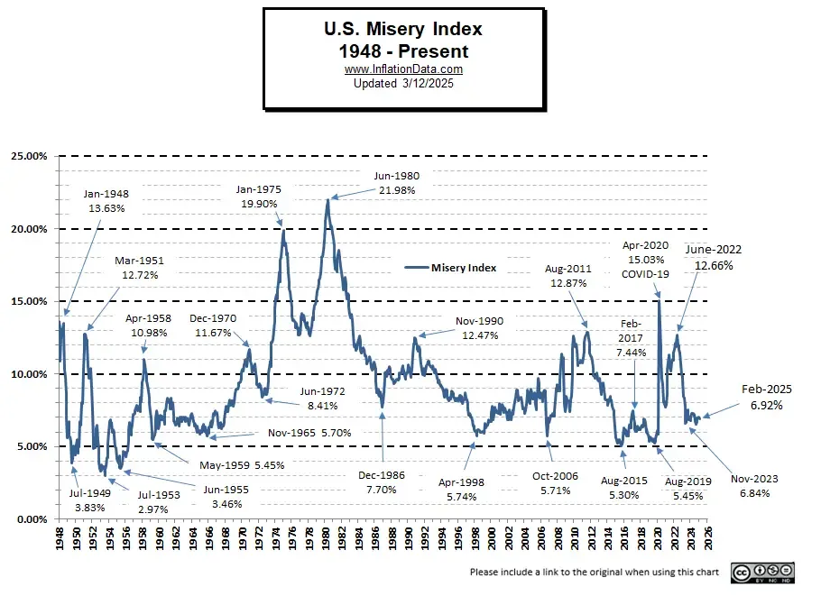

## Table of Contents

## What is the Misery Index?

The Misery Index is a simple way to measure how unhappy people might be in a country. It adds up the unemployment rate and the inflation rate. If these numbers are high, it means people might be struggling more with finding jobs and paying for things, which can make them feel more miserable.

This index was first used in the United States during the 1970s. It was created by an economist named Arthur Okun. People use it to get a quick idea of how the economy is affecting everyday life. Even though it's a simple tool, it helps show when times are tough for a lot of people.

## Who created the Misery Index and when?

The Misery Index was created by an economist named Arthur Okun. He came up with this idea in the 1970s. Arthur Okun wanted a simple way to show how the economy was affecting people's lives.

The index adds together the unemployment rate and the inflation rate. If these numbers are high, it means people might be struggling more with finding jobs and paying for things. This can make them feel more miserable. Even though it's a simple tool, it helps show when times are tough for a lot of people.

## What are the main components of the Misery Index?

The Misery Index has two main parts: the unemployment rate and the inflation rate. The unemployment rate is the percentage of people who want to work but can't find a job. The inflation rate is how much prices are going up over time. When you add these two numbers together, you get the Misery Index.

If the Misery Index is high, it means people might be feeling more unhappy. This is because high unemployment makes it hard for people to find jobs, and high inflation makes everything more expensive. A high Misery Index can show that times are tough for a lot of people in a country.

## How is the Misery Index calculated?

The Misery Index is calculated by adding the unemployment rate and the inflation rate together. The unemployment rate is the percentage of people who want to work but can't find a job. The inflation rate is how much prices are going up over time. So, if the unemployment rate is 5% and the inflation rate is 3%, the Misery Index would be 8%.

This simple calculation helps show how the economy is affecting people's lives. If the Misery Index is high, it means people might be struggling more with finding jobs and paying for things. This can make them feel more miserable. A high Misery Index can be a sign that times are tough for a lot of people in a country.

## Can you provide a historical overview of the Misery Index?

The Misery Index was created by an economist named Arthur Okun in the 1970s. He wanted a simple way to show how the economy was making people feel. The index adds up the unemployment rate and the inflation rate. If these numbers are high, it means people might be struggling more with finding jobs and paying for things, which can make them feel more miserable. The Misery Index became popular in the United States during the 1970s, a time when both unemployment and inflation were high.

Over the years, the Misery Index has been used to compare how tough times are in different countries and at different times. For example, during the 1980s, the Misery Index was used to show how President Jimmy Carter's time in office compared to Ronald Reagan's. In the 2000s, it was used to look at how the economy was doing during the Great Recession. Even though it's a simple tool, the Misery Index helps people understand how economic conditions are affecting everyday life.

## How has the Misery Index been used in economic policy?

The Misery Index has been used by policymakers to understand how the economy is affecting people's lives. When the index is high, it means people might be struggling more with finding jobs and paying for things. This can help policymakers see when they need to take action to help people. For example, if the Misery Index is high because of high unemployment, the government might create job programs or lower interest rates to help people find work.

Politicians also use the Misery Index to talk about how well they are doing compared to others. During elections, they might say that the Misery Index was lower when they were in charge, showing that people were happier. For instance, in the 1980s, Ronald Reagan used the Misery Index to show that it was lower during his time in office compared to when Jimmy Carter was president. This helped him argue that his policies were better for the country.

## What are some examples of countries with high Misery Index scores?

Some countries have had high Misery Index scores in recent years. For example, Venezuela has faced very high inflation and unemployment, making life hard for many people. In 2020, Venezuela's Misery Index was over 1,000, which is much higher than most other countries. This means that people in Venezuela were struggling a lot to find jobs and pay for things.

Another country with a high Misery Index is Zimbabwe. Like Venezuela, Zimbabwe has also had problems with very high inflation and unemployment. In 2020, Zimbabwe's Misery Index was around 500. This high number shows that many people in Zimbabwe were having a tough time because of the economy. Both of these examples show how the Misery Index can help us see when people in a country are really struggling.

## How does the Misery Index correlate with public sentiment?

The Misery Index is a good way to see how happy or unhappy people are feeling about the economy. It adds up the unemployment rate and the inflation rate. When these numbers are high, it means people might be having a hard time finding jobs and paying for things. This can make them feel more miserable. So, a high Misery Index often means that public sentiment is not good, and people are feeling down about their situation.

For example, if a country has a high Misery Index, people might be worried about their jobs and the rising costs of things they need to buy. This can make them feel stressed and unhappy. On the other hand, when the Misery Index is low, it usually means that people are feeling better about the economy. They might have jobs and not have to worry so much about prices going up. So, the Misery Index can be a quick way to understand how people are feeling about their economic situation.

## What are the limitations of using the Misery Index as an economic indicator?

The Misery Index is a simple way to understand how the economy is making people feel, but it has some problems. One big problem is that it only looks at unemployment and inflation. It doesn't think about other things that can make people unhappy, like how much they earn, how safe they feel, or how good their healthcare is. So, even if the Misery Index is low, people might still be unhappy because of these other issues.

Another problem is that the Misery Index treats unemployment and inflation the same, but they can affect people differently. For example, losing a job can be much worse for someone than prices going up a little bit. Also, the Misery Index doesn't change to fit different countries or times. What might be a big problem in one country might not be as bad in another. So, while the Misery Index can give a quick idea of how people are feeling, it doesn't tell the whole story about what's really going on.

## Are there any alternative indices to the Misery Index?

Yes, there are other ways to measure how happy or unhappy people are about the economy. One of these is called the Economic Discomfort Index. It is a lot like the Misery Index because it also adds up the unemployment rate and the inflation rate. But, the Economic Discomfort Index can sometimes include other things like how much interest people have to pay on loans. This can give a fuller picture of what's making people feel bad about the economy.

Another index is the Human Development Index (HDI). This one looks at more than just the economy. It thinks about how long people live, how much they learn in school, and how much money they make. The HDI tries to see if people's lives are getting better in lots of different ways, not just if they have jobs and can pay for things. So, while the Misery Index focuses on unemployment and inflation, the HDI gives a broader view of how well people are doing.

## How have modifications to the Misery Index been proposed or implemented?

Some people have thought about changing the Misery Index to make it better. One idea is to add the [interest rate](/wiki/interest-rate-trading-strategies) to the index. This is because high interest rates can make it hard for people to borrow money, which can make them feel unhappy too. Another idea is to include the GDP growth rate. If the economy is growing, people might feel better even if unemployment and inflation are high. These changes could make the Misery Index show a fuller picture of how people are feeling about the economy.

Some countries have tried these new ideas. For example, in Canada, they made a version of the Misery Index that includes the interest rate. This helps them see how hard it is for people to get loans. In the United States, some people have used a version that includes the GDP growth rate. This helps show if the economy is getting better or worse. By adding these things, the Misery Index can be a better tool for understanding how happy or unhappy people are about their economic situation.

## What future developments could enhance the accuracy or utility of the Misery Index?

One way to make the Misery Index better in the future could be to add more things that affect how people feel about the economy. Right now, it only looks at unemployment and inflation. But other things like how much people earn, how much they have to pay for loans, and how fast the economy is growing can also make a big difference. If we include these, the Misery Index could give a fuller picture of what's making people happy or unhappy.

Another way to improve the Misery Index is to make it fit better for different countries and times. What might be a big problem in one country might not be as bad in another. So, we could change the Misery Index to think about things like how good the healthcare is, how safe people feel, and even how happy they are with their government. By doing this, the Misery Index could be a more useful tool for understanding how people are feeling around the world.

## What is the Misery Index?

The Misery Index is an economic indicator developed by economist Arthur Okun during the 1970s. It is designed to provide a quick and straightforward measure of economic distress experienced by a nation's citizens. The index is calculated by summing two critical economic data points: the unemployment rate and the inflation rate. The formula can be expressed as:

$$
\text{Misery Index} = \text{Unemployment Rate} + \text{Inflation Rate}
$$

This simple calculation offers insight into the level of economic discomfort within a society. High values of the Misery Index are indicative of increased economic distress. For instance, when both the unemployment and inflation rates are high, individuals may struggle with joblessness and increased living costs, thereby exacerbating overall economic hardship.

The Misery Index gained prominence as a tool for illustrating the economic challenges of the 1970s, particularly during the period of stagflation, which was characterized by high inflation coupled with high unemployment. This period underscored the importance of tracking and understanding economic indicators to address public economic welfare effectively. Despite its simplicity, the Misery Index remains a relevant tool for highlighting the impact of key economic variables on a nation's socio-economic landscape.

## References & Further Reading

[1]: Okun, A. M. (1970s). "The Misery Index and Its Historical Context." [Available in various economic literature archives].

[2]: Piketty, T. (2014). ["Capital in the Twenty-First Century."](https://www.jstor.org/stable/j.ctt6wpqbc) Harvard University Press.

[3]: Lopez de Prado, M. (2018). ["Advances in Financial Machine Learning."](https://www.amazon.com/Advances-Financial-Machine-Learning-Marcos/dp/1119482089) Wiley.

[4]: Jansen, S. (2020). ["Machine Learning for Algorithmic Trading."](https://github.com/stefan-jansen/machine-learning-for-trading) Packt Publishing.

[5]: Chan, E. P. (2009). ["Quantitative Trading: How to Build Your Own Algorithmic Trading Business."](https://github.com/ftvision/quant_trading_echan_book) Wiley.

[6]: Aronson, D. R. (2006). ["Evidence-Based Technical Analysis: Applying the Scientific Method and Statistical Inference to Trading Signals."](https://www.amazon.com/Evidence-Based-Technical-Analysis-Scientific-Statistical/dp/0470008741) Wiley.