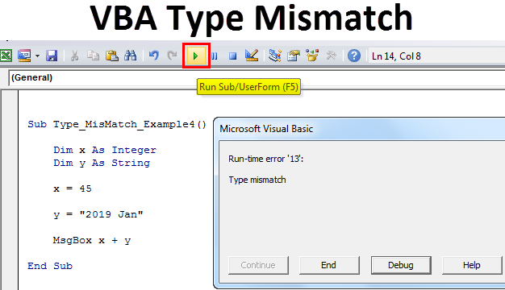

Algorithmic trading, commonly referred to as algo trading, employs advanced automated systems to facilitate trading decisions executed at remarkable speed and frequency. At its core, the process involves the utilization of complex algorithms to analyze vast datasets, identify trading opportunities, and execute trades without human intervention. The primary advantage of this technology lies in its ability to significantly reduce reaction times, thereby capturing market opportunities that human traders might miss due to inherent decision-making delays. Furthermore, algorithmic trading can enhance consistency and liquidity within the financial markets, often leading to more efficient price discovery.

However, despite these substantial benefits, algorithmic trading presents a set of intricate challenges, most notably the occurrence of mismatches in algorithmic execution. These mismatches arise when there is a divergence between expected outcomes and actual execution, potentially stemming from various sources such as latency, technical failures, and market volatility. Such mismatches can adversely impact trading strategies, resulting in unintended costs and financial risks. 



This article examines the different types of mismatches encountered in algorithmic trading, analyzing the underlying mechanisms that contribute to these discrepancies. By understanding these mismatches, traders can devise strategies and employ algorithms specifically designed to manage and rectify these issues, thereby optimizing trading performance and minimizing associated risks.

Gaining a thorough understanding of these nuances is essential for traders aiming to enhance their strategies and safeguard their investments. As technological advancements and market dynamics continue to evolve, adapting algo trading strategies is crucial for maintaining a competitive edge and ensuring resilient trading operations.

## Table of Contents

## Understanding Algorithmic Trading

Algorithmic trading, commonly referred to as algo trading, employs automated systems to execute trades based on pre-defined criteria. These systems utilize vast quantities of data and advanced mathematical models to rapidly make informed trading decisions. The core advantage of algorithmic trading lies in its ability to process and analyze data with far greater speed and precision than human traders. Consequently, this enables high-frequency trading, which significantly reduces the time traditionally associated with manual decision-making.

High-frequency trading ([HFT](/wiki/high-frequency-trading-strategies)) is a form of algorithmic trading that involves executing a large number of orders at extremely high speeds. This type of trading takes advantage of minuscule price differences by executing transactions in fractions of a second. The mathematical models employed often include strategies such as statistical [arbitrage](/wiki/arbitrage), [trend following](/wiki/trend-following), and market-making. For example, a simple form of mathematical model might be a linear regression model that predicts future asset prices based on historical data.

```python
import numpy as np
from sklearn.linear_model import LinearRegression

# Sample historical data (e.g., past asset prices)
X = np.array([[1], [2], [3], [4], [5]])  # time points
y = np.array([10, 11, 12, 13, 15])       # asset prices

# Create and fit the model
model = LinearRegression().fit(X, y)

# Predict future prices
future_time_points = np.array([[6], [7], [8]])
predicted_prices = model.predict(future_time_points)

predicted_prices
```

However, despite these advantages, [algorithmic trading](/wiki/algorithmic-trading) systems are not without their challenges. Mismatches can occur, leading to disruptions in trading strategies and potentially impacting profitability. These mismatches may arise from various factors, including latency issues, incorrect data, or technical glitches, which can cause discrepancies between the intended and actual trade executions. Managing these mismatches effectively is crucial for minimizing risks and ensuring optimal trading performance. The ability to quickly adapt to market dynamics and correct for any deviations is key to maintaining the integrity and profitability of algorithmic trading strategies.

## Types of Mismatches in Algorithmic Trading

Algorithmic trading is a sophisticated and automated process requiring precise execution to maximize efficiency and profitability. However, various types of mismatches can occur, impacting the expected outcomes of trading strategies. Understanding these mismatches is critical for traders aiming to optimize performance.

**Mismatch in Financial Markets**

A mismatch in financial markets arises when there is a difference between the expected and actual trade execution prices. This discrepancy is often caused by factors such as latency and market [volatility](/wiki/volatility-trading-strategies). In high-frequency trading environments, even minor delays in data transmission (latency) can lead to changes in pricing information, resulting in trades being executed at prices different from those anticipated. Additionally, market volatility can cause rapid price movements, exacerbating this issue by making it difficult for algorithms to capture optimal execution prices accurately.

**Mismatch in Order Execution**

Order execution mismatches occur when trades do not execute at the intended levels. These mismatches can be due to discrepancies in market data or technical issues within the algorithmic trading systems. Inaccurate or delayed market data can misinform the system about current market conditions, leading to incorrect execution decisions. Technical glitches, such as software bugs or hardware failures, can also result in trades being executed improperly, deviating from the intended strategy.

**Mismatch in Asset-Liability Management**

This type of mismatch involves a failure to align investment strategies with financial objectives, creating unforeseen risks. Asset-liability management aims to balance investments with liabilities according to risk preferences and return expectations. When there is a significant deviation from this alignment caused by market shifts or execution delays, it can result in a mismatch. This situation can lead to higher exposure to risk, as the assets do not adequately cover the liabilities as intended. Effective asset-liability matching requires regular assessment and adjustment of portfolios to stay aligned with evolving market conditions and financial goals.

## Mechanisms Creating Mismatches in Algo Trading

Latency and execution delays in algorithmic trading present a significant challenge. High-frequency trading relies on rapid order placement and execution, and even millisecond delays can lead to substantial mismatches in fast-moving markets. The latency generally arises from the time it takes for an order to travel from the trader's system to the exchange and back. In highly competitive environments, minimizing latency is critical. Traders often use co-location services, placing their systems as close to exchanges as possible to decrease transmission times. Additionally, the speed of internal systems, including the efficiency of coding algorithms and the processing power of hardware, significantly influences latency.

Technical failures such as system glitches, hardware malfunctions, or software bugs can severely disrupt the accurate execution of trades. Systems handling algorithmic trading are complex and can be prone to errors if not vigilantly maintained and updated. Software bugs may arise from defective code, leading to unintended order placements or failures in order executions. Hardware issues, such as failures in network components or servers, can also hinder performance. Employing rigorous system testing and regular maintenance schedules can help mitigate these risks and ensure that trading platforms remain robust.

Market volatility adds another layer of complexity, as it can cause rapid price fluctuations, leading to disparities between the expected and actual execution prices. During periods of high volatility, the price at which a trade is executed can differ greatly from the price at which it was initially intended. This is particularly critical for stop-loss orders, which are designed to limit losses by selling a security when it reaches a certain price. In volatile markets, these orders can execute at unfavorable prices if there is a sharp market movement, a phenomenon often referred to as slippage.

Overall, to effectively manage the mechanisms that create mismatches, traders must invest in high-speed, reliable infrastructure, maintain their trading systems, and develop strategies that can adapt to the fast pace and uncertainty of financial markets.

## Algorithms to Manage Mismatches

Algorithmic trading has transformed the financial markets by automating trade decisions and executions. However, mismatches between expected and actual outcomes can arise due to various factors such as market volatility and technical issues. To address these mismatches, sophisticated algorithms have been developed to manage and mitigate risks effectively.

**Risk Management Algorithms**

Risk management algorithms play a crucial role in minimizing financial risks associated with execution mismatches. These algorithms often incorporate techniques like stop-loss orders and hedging strategies. A stop-loss order automatically sells a security when its price drops to a predetermined level, thereby limiting potential losses. Hedging involves taking an offsetting position in a related security to reduce the risk of adverse price movements. For instance, an investor holding a portfolio of stocks might use options or futures contracts to hedge against potential market declines.

A basic implementation of a stop-loss mechanism in Python might look like this:

```python
def execute_stop_loss(market_price, stop_loss_price, current_position):
    if market_price <= stop_loss_price:
        return "Sell", current_position  # Trigger a sell order
    else:
        return "Hold", current_position  # Hold the existing position
```

**Portfolio Rebalancing Algorithms**

Portfolio rebalancing algorithms are designed to adjust holdings continuously to ensure alignment with investment objectives, regardless of fluctuating market conditions. These algorithms automatically alter the asset distribution to maintain the desired risk-return balance. This is crucial as market dynamics can quickly shift, causing an asset's portfolio weight to deviate from the target.

Rebalancing can be executed periodically (e.g., monthly or quarterly) or when asset weights exceed predetermined thresholds. The mathematical goal is often to minimize the tracking error between the actual portfolio and a target index.

**Execution Algorithms**

Execution algorithms are specialized to minimize market impact, optimize order execution, and ensure cost-effectivity, especially for large orders. They achieve this by breaking down large trades into smaller, more manageable orders. This strategy prevents significant price movements that could occur if a large order is executed all at once.

A common execution algorithm is the Time-Weighted Average Price (TWAP) algorithm, which distributes an order evenly over a specified period. The formula typically used is:

$$
\text{TWAP} = \frac{\sum\limits_{i=1}^{n} P_i \times V_i}{\sum\limits_{i=1}^{n} V_i}
$$

where $P_i$ is the price and $V_i$ is the volume of each trade segment.

In Python, a simplified version of TWAP might look like this:

```python
def calculate_twap(prices, volumes):
    total_value = sum(p * v for p, v in zip(prices, volumes))
    total_volume = sum(volumes)
    return total_value / total_volume if total_volume != 0 else 0

# Example usage
prices = [100, 102, 101]
volumes = [10, 15, 5]
twap = calculate_twap(prices, volumes)
```

These algorithms collectively enhance the robustness and efficiency of trading systems by addressing mismatches effectively, ensuring that traders can achieve optimized trading results in dynamic market environments. By leveraging these algorithmic strategies, traders can better navigate the complexities of modern financial markets and improve their overall trading performance.

## Solutions to Minimize Mismatch Impact

Implementing robust risk management techniques is essential to cushion the effects of mismatches in algorithmic trading. A fundamental approach involves diversification, where investments are spread across a variety of assets to mitigate the risk associated with any single asset's poor performance. Another critical technique is the use of stop-loss orders. These automatically trigger a sale once the asset's price falls below a predetermined level, thereby limiting potential losses. These strategies act as a financial buffer, safeguarding against the adverse impacts of unexpected trade execution discrepancies.

Enhancing system testing and maintenance procedures is imperative to detect and address technical issues before they lead to mismatches. Regular testing can uncover potential hardware or software failures that may disrupt trade executions. Implementing rigorous software testing methodologies, such as unit testing, integration testing, and regression testing, helps ensure that trading algorithms function as expected under various market conditions. Additionally, regular maintenance procedures are vital to updating systems with the latest security patches and trading software enhancements, which are crucial to maintaining the integrity and reliability of trading operations.

Employing high-speed, low-latency trading platforms is another critical solution to reduce the time gap between order placement and execution. By minimizing latency, these platforms enable traders to capitalize on price movements more effectively, ensuring that trades are executed at prices closer to those intended. This can be achieved by locating data centers nearer to exchanges, thus shortening the distance data needs to travel. Moreover, adopting advanced telecommunications technology and optimizing the algorithmic processes can further decrease latency, making the trading system more responsive and reducing the likelihood of mismatches caused by delays.

In conclusion, implementing these solutions effectively minimizes the mismatch impact in algorithmic trading, enhancing the potential for successful and profitable trading strategies. These measures collectively contribute to a robust trading ecosystem that is resilient to the inherent risks and challenges posed by high-speed markets.

## Conclusion

Mismatches in algorithmic trading represent a critical area where fluctuations can detrimentally influence trading outcomes and overall profitability. These mismatches arise when there are discrepancies between intended trading actions and their actual outcomes, often due to technical failures, market volatility, or execution delays. Recognizing and addressing these issues is imperative for developing robust trading strategies that can withstand the dynamic nature of financial markets.

Utilizing advanced algorithms in conjunction with robust risk management strategies offers a pathway to mitigate the adverse effects of mismatches. For example, the deployment of execution algorithms designed to minimize market impact by breaking large orders into smaller trades can help avoid significant price fluctuations. Algorithms aimed at risk management, such as those implementing stop-loss orders, provide mechanisms to predetermine [exit](/wiki/exit-strategy) points, thereby offering a safety net against market volatility.

Moreover, the development and refinement of algorithmic trading strategies must be an ongoing process. As technological advancements continue and markets evolve, the ability to adapt algorithmic systems accordingly is paramount. This could involve enhancing computational capabilities through high-speed, low-latency platforms, which significantly reduce the time gap between order origination and execution.

In Python, for instance, simulation tools that test trading strategies against historical data help identify potential mismatches before deploying strategies in live markets. By leveraging such technologies, traders can anticipate and resolve execution discrepancies, refining strategies in response to real-world scenarios.

As the financial landscape becomes increasingly complex, continuous evaluation and adaptation of algorithmic trading approaches remain crucial. Only through such diligent practices can traders ensure that their strategies not only address current challenges posed by mismatches but also remain competitive in the ever-evolving marketplace.

## References & Further Reading

[1]: Aldridge, I. (2013). ["High-Frequency Trading: A Practical Guide to Algorithmic Strategies and Trading Systems"](https://www.amazon.com/High-Frequency-Trading-Practical-Algorithmic-Strategies/dp/1118343506). Wiley.

[2]: Narang, R. (2013). ["Inside the Black Box: A Simple Guide to Quantitative and High-Frequency Trading"](https://onlinelibrary.wiley.com/doi/book/10.1002/9781118662717). Wiley.

[3]: Cartea, Á., Jaimungal, S., & Penalva, J. (2015). ["Algorithmic and High-Frequency Trading"](https://assets.cambridge.org/97811070/91146/frontmatter/9781107091146_frontmatter.pdf). Cambridge University Press.

[4]: Jovanovic, F., Lehalle, C. A., & O'Hara, M. (2019). ["Market Microstructure: Dealing with Today's Challenges and Opportunities"](https://arxiv.org/abs/1105.3115). Springer.

[5]: Gomber, P., Arndt, B., Lutat, M., & Uhle, T. (2011). ["High-Frequency Trading"](https://www.researchgate.net/publication/271631628_High-Frequency-Trading). SSRN Electronic Journal.